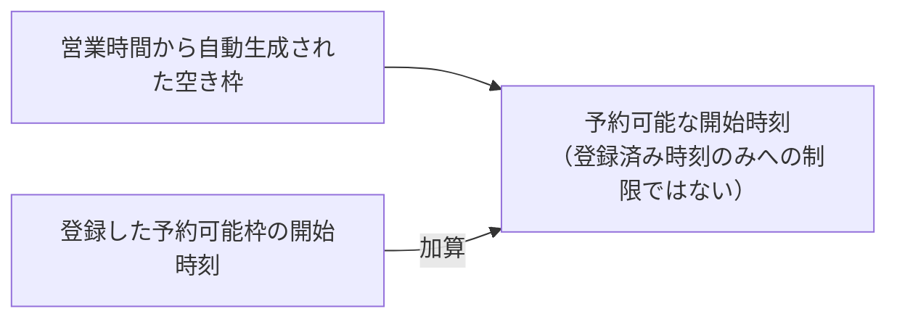

# 予約区分マスタ 仕様書 (Reservation Types)

## 概要
- **画面の目的**: 診察、ワクチン、手術、トリミング等の予約枠（スロット）の定義と、LINE 予約への公開設定。
- **URLパターン**: `/settings/reservation-type`
- **アクセス権限**: 予約管理権限が必要（`ResourceMasterReservationType`）

---

## 1. 画面構成

### 1.1 予約区分一覧
- **区分グループ（`ReservationTypeGroup`）**: 院ごとに自由入力できるグループ（名称・色を独自に登録。固定の3分類ではない。並び順の編集 UI は本画面にない）。予約区分自体は `category` フィールドで `general`（一般）/`trimming`（トリミング）の2値のみを持つ。
- **表示項目**: 名称、備考、ステータス（有効/無効）。グループ見出し行にグループ色のドットを表示。行はドラッグ&ドロップで並び替え可能。

### 1.2 詳細編集サイドパネル (`SidePeekPanel`)
- **基本属性**: 名称、ステータス（有効/無効）、グループ、備考。略称・標準所要時間は下記「LINE予約設定」セクション内にある（所要時間は `<input type="number">` min=5 / max=480 分。15 分刻みへの制約はない）。
- **カレンダー色**: 予約区分自体には色編集 UI がない。一覧のカラーバッジは所属する区分グループの色（グループ側サイドパネルで編集、下記参照）を表示し、未分類の区分は固定のグレーになる（`ReservationTypeGroupedTableRows.tsx`）。
- **LINE 予約連携**:
    - **予約ページに表示**: 有効かつオンの区分を飼い主向け LIFF アプリの選択肢に出す。「内部サービス」がオン、または無効の区分は公開しない。無効化済み区分の新規予約もサーバ側で拒否する（#238）。
    - **所要時間**: 院内用・LINE 予約用で共通の単一フィールド（`duration_minutes`）。LINE 専用の別枠所要時間フィールドは存在しない。
- **予約可能枠**: 予約可能な開始時刻（毎週／特定日）をリスト形式で追加・削除。「カレンダーで編集」リンクから [LINE予約枠カレンダーページ](../28-line-reservation.md)（`/line-reservation/slots?typeId=:id`）へ遷移し、週カレンダーで日別に編集できる。子予約区分を持つ親区分では非表示（「子予約区分ごとに予約枠を設定してください」の案内のみ表示）。
- **予約不可時間**: 予約を受け付けない時間帯（毎週／特定日）を時間範囲で登録。予約可能枠と同様、子予約区分を持つ親区分では非表示。
- **対応職種**: この予約区分を担当できる職種を紐付け（1 件以上紐付けると、担当可能スタッフが勤務する日のみ予約可能になる）。

> ⚠️ **予約可能枠の加算挙動**: 予約可能枠は営業時間から自動生成された空き枠に、登録した開始時刻を**追加**する加算モードで動作する（`mergeAvailableTimeSlots`）。登録済み時刻のみに予約を制限するホワイトリストではなく、枠を登録しても営業時間由来の空き枠は予約可能なまま残る。詳細は [LINE予約設定 §4](../28-line-reservation.md) を参照。

### 1.3 標準予約区分（seed 投入）

全医院に共通で用意する標準区分。八王子テスト報告（EMR-193）で「新規予約作成でトリミングしか選べない」ことが判明したため追加された。

| 名称 | category | 標準所要時間 | sort_order | 既定のLINE公開 | 色 |
|---|---|---|---|---|---|
| 診察 | `general` | 15 分 | 1 | 非公開 | `#3B82F6` |
| お手入れ | `general` | 15 分 | 2 | 非公開 | `#10B981` |
| ワクチン | `general` | 15 分 | 3 | 非公開 | `#8B5CF6` |
| 健診 | `general` | 15 分 | 4 | 非公開 | `#F97316` |

- 既存のトリミング区分（`sort_order=9`、`category=trimming`）より前に並ぶ。
- **投入経路**: `backend/migrations/seeds/live_insert_standard_reservation_types.sql` を承認済み runbook から `psql` で手動適用する。`cmd/migrate` の自動適用対象ではなく、CSV bundle（`002_master`）の immutable 制約により CSV 直接編集も行わない。
- **冪等性**: `(clinic_id, name)` の有効行が既にある医院では INSERT をスキップし、手動作成済みの同名区分を上書きしない。
- **`reservation_visible=false`（非公開）が既定**: 院内予約フォームは `is_active` のみで絞るため院内では即選択可能だが、LIFF の飼い主向け選択肢には出ない。LINE 予約へ公開する場合は本画面で区分ごとに有効化する。

---

## 主要な機能

### 1. カレンダー・スケジューリング
ここで設定された「標準所要時間」は、予約作成時のデフォルト枠サイズとして適用され、スムーズな予約入力を支援します。

### 2. カラーコーディング
区分グループ単位の色分け（例：診察系グループは赤、トリミング系グループは緑）により、カレンダーを俯瞰した際の院内の忙しさやリソース配置を一目で把握可能にします（色は区分グループに設定するもので、予約区分単体には設定できません）。

---

## 技術仕様

### 3.1 構成コンポーネント
- **`ReservationTypeSettings`**: メインコンテナ。
- **色編集**: 色選択専用のコンポーネントは存在しない。区分グループのサイドパネル（`ReservationTypeGroupSidePanel`）がネイティブ `<input type="color">` で色を編集する。予約区分本体（`ReservationTypeSidePanel` の `CategorySidePanel`）には色編集 UI がない。
- **所要時間入力**: `PropertyRow`「所要時間（分）」内の標準 number input（5〜480 分。step 属性による刻み制御はなし）。

### API連携
| メソッド | エンドポイント | 用途 | 必須権限 | 必須アクション |
|:---|:---|:---|:---|:---|
| GET | `/api/v1/masters/reservation-types` | 有効な予約区分一覧の取得 | `master-reservation-type` | `view` |
| GET | `/api/v1/masters/reservation-types/:id` | 特定の予約区分詳細の取得 | `master-reservation-type` | `view` |
| POST | `/api/v1/masters/reservation-types` | 新規予約区分の登録 | `master-reservation-type` | `create` |
| PATCH | `/api/v1/masters/reservation-types/:id` | 名称、時間、公開設定等の更新（画面の色編集は区分グループ側） | `master-reservation-type` | `edit` |
| DELETE | `/api/v1/masters/reservation-types/:id` | 予約区分の削除 | `master-reservation-type` | `delete` |
| PATCH | `/api/v1/masters/reservation-types/reorder` | 表示順序の一括保存 | `master-reservation-type` | `edit` |
| GET | `/api/v1/masters/reservation-types/:id/available-slots` | 予約可能枠の取得 | `master-reservation-type` | `view` |
| POST | `/api/v1/masters/reservation-types/:id/available-slots` | 予約可能枠の追加 | `master-reservation-type` | `edit` |
| DELETE | `/api/v1/masters/reservation-types/:id/available-slots/:available_slot_id` | 予約可能枠の削除 | `master-reservation-type` | `delete` |
| GET | `/api/v1/masters/reservation-types/:id/unavailable-times` | 予約不可時間の取得 | `master-reservation-type` | `view` |
| POST | `/api/v1/masters/reservation-types/:id/unavailable-times` | 予約不可時間の追加 | `master-reservation-type` | `edit` |
| DELETE | `/api/v1/masters/reservation-types/:id/unavailable-times/:unavailable_time_id` | 予約不可時間の削除 | `master-reservation-type` | `delete` |
| GET | `/api/v1/masters/reservation-types/:id/occupations` | 対応職種の取得 | `master-reservation-type` | `view` |
| POST | `/api/v1/masters/reservation-types/:id/occupations` | 対応職種の紐付け | `master-reservation-type` | `edit` |
| DELETE | `/api/v1/masters/reservation-types/:id/occupations/:occupation_id` | 対応職種の解除 | `master-reservation-type` | `delete` |
| GET | `/api/v1/masters/reservation-type-groups` | 区分グループ一覧の取得 | `master-reservation-type` | `view` |
| POST | `/api/v1/masters/reservation-type-groups` | 区分グループの作成 | `master-reservation-type` | `create` |
| GET | `/api/v1/masters/reservation-type-groups/:id` | 区分グループ詳細の取得 | `master-reservation-type` | `view` |
| PATCH | `/api/v1/masters/reservation-type-groups/:id` | 区分グループの更新 | `master-reservation-type` | `edit` |
| DELETE | `/api/v1/masters/reservation-type-groups/:id` | 区分グループの削除 | `master-reservation-type` | `delete` |
| PATCH | `/api/v1/masters/reservation-type-groups/reorder` | 区分グループ表示順の一括保存（BE実装済みだが本画面からは未呼出） | `master-reservation-type` | `edit` |

---
