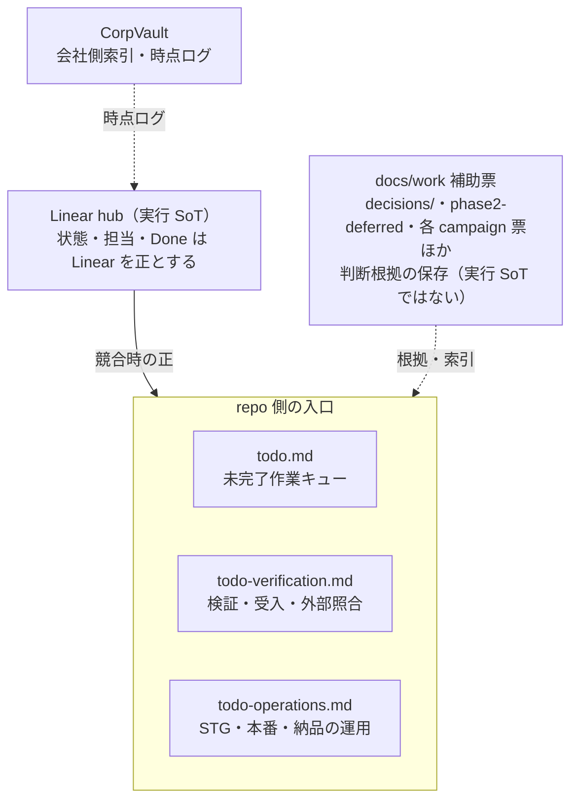

# 作業台帳（docs/work）

## 入口

| 文書 | 役割 |
|------|------|
| **Linear** hub [BRT-4](https://linear.app/baritechllc/issue/BRT-4) | **実行 SoT**（状態・担当・ゲート） |
| [todo.md](../../todo.md) | 着手可能な開発タスク・確認済み製品 FAIL・維持制約 |
| [todo-verification.md](../../todo-verification.md) | 開発検証・測定・受入・外部照合 |
| [todo-operations.md](../../todo-operations.md) | STG・本番・納品などの運用・外部実行 |
| CorpVault `50_Projects/ノア動物病院電子カルテ/` | 会社側索引・時点ログ |

**競合・終了ルール:** 状態・担当・Done は Linear を正とする。`todo.md` の実行キューには未完了作業だけを保持し、完了行を除く。統合元の完了履歴・維持制約は別節に分離し、現在の受入や release 判定には使わない。STG Lane 4 の終了条件・記録方法は [運用計画](../../todo-operations.md#lane-4) と [受入計画](../../todo-verification.md#todo-v-stg-data) を参照する。[製品 FAIL 節](../../todo.md#product-bugs) は Linear と対応付け、受入未実施や環境 BLOCKED を製品 FAIL に混ぜない。

| 補助 | 役割 |
|------|------|
| [decisions/](./decisions/README.md) | 採択済み方針の短いポインタ |
| [phase2-deferred.md](./phase2-deferred.md) | 今期外の短い索引 |
| [linear-f1-f6-mapping.md](./linear-f1-f6-mapping.md) | repo の実装履歴と Linear の対応案（Linear 現在状態は UNKNOWN） |
| [skill-reeval-2026-09-06.md](./skill-reeval-2026-09-06.md) | 代表タスクごとの資料選択・停止判断 |
| [development-task-decisions.md](./development-task-decisions.md) | 旧10開発候補の採否と具体的な着手範囲の根拠。実行キューはtodo.md |
| [stg-uat-clinic-feedback-q1-q4.md](./stg-uat-clinic-feedback-q1-q4.md) | STG UAT 医院Q1–Q4の送付用回答と修正タスク。Q1/Q4保険/Q2履歴は STG デプロイ済み（PR #411）。実行 SoT ではない |
| [linmig-campaign-20260919/](./linmig-campaign-20260919/) | P1–P5/P8・検査機器・実LINE・migrate・件数・フォント・締め時間・bundle のローカル準備票。実行完了ではない |
| [remaining-campaign-20260920/](./remaining-campaign-20260920/) | P6/P7 と Slack PO/evidence 16件の判断材料・ケース票。PO裁定と実機/STGは未了 |
| [todo-campaign-20260918/](./todo-campaign-20260918/) | UAT-R2 / Q2・Q4 集計 / 処置移行 / 死亡日 / Linear 照合の準備票 |
| [todo-campaign-20260919-ready17/](./todo-campaign-20260919-ready17/) | Slack READY 13件の設計票 |
| [docs-perfection/README.md](./docs-perfection/README.md) | **Astra 調査パッケージ入口**（棚卸し・RQ・子 goal・証拠）。製品の実行 SoT は上記 Linear |
| [docs-perfection/REPAIR-QUEUE.md](./docs-perfection/REPAIR-QUEUE.md) | 調査時点の優先修復キュー（RQ-001〜） |
| [docs-perfection/ROLE-MAP.md](./docs-perfection/ROLE-MAP.md) | docs 保守の Living Docs 役割割当 |

## 削除済み docs（復活防止）

同じ文書を作り直さない。復元は git 履歴。

| 削除したもの | 理由 | 後継 |
|---|---|---|
| root `todo-check-auth.md` / `todo-fix-auth.md`（2026-09-15） | 認証の参照用メモと残件の重複管理を解消 | 契約は [認証設計](../architecture/auth.md)、D1・メール・Linear の残件は [統合検証 TODO](../../todo-verification.md#認証認可の外部境界) |
| root `fe-refactor.md`（2026-09-15） | 完了した監査の独立メモ | 維持判断は [裁定記録](./development-task-decisions.md#frontend-監査から引き継ぐ維持判断2026-09-15)、完了履歴は Git |
| root `readiness-report.md`（2026-09-15） | 9月4日時点の環境評価。現在の品質・実行状態の証拠として使わない | 現行規約は [.claude/CLAUDE.md](../../.claude/CLAUDE.md)、検証条件は [agent harness](../ops/agent-harness.md)。当時の評価は Git |
| root `bug.md`・`todo-now.md`・`todo-po.md`・`todo-refactor.md`（2026-09-08） | ユーザー依頼による5台帳の統合。別台帳として再作成しない | [todo.md](../../todo.md) の製品 FAIL・PO・Astra 履歴・FE 履歴。削除前の原文は Git |
| `STATUS.md`・`PO-todo.md`・2026-08-20 時点の旧フル `todo.md` / `todo-po.md` | 実行台帳の統合・縮小 | Linear。現在の root 台帳の役割は上記入口を参照 |
| root `phase2.html` / `research-cloudflare.html` / `codex-security-output/` | 作業・調査資料の整理 | 当時の内容は git 履歴。今期外項目は `phase2-deferred.md` |
| root `reports/`（UAT/fable/kanban/walk） | 時点レポート | CorpVault `evidence/2026-08-20-docs-cleanup/` · 新規 UAT は gitignore の `reports/uat-YYYY-MM-DD/`（コミットしない） |
| `docs/work/residual-closeout-ledger.md` | U0–U6 完了ログ | 同 vault `decisions/` · 残ゲートは Linear |
| `docs/work/archives/STATUS-before-2026-08-13-slim.md` | 旧フル台帳 | git 履歴 |
| `docs/ops/infra/_archive/migration-cloudflare.md` | STG 移行の凍結実施記録 | 現行は `docs/ops/infra/architecture.md` · 経緯は git 履歴 |
| `docs/spec/line/01_曽我さん向け_*.md` | クライアント受領原本の二重管理 | 製品正本 `lstep-integration.md` · 原本は vault `client/` |
| `frontend/docs/design-audit-pages.md` | 監査表の複製 | `docs/spec/ui-design-compliance.md` |

**正本:** Linear · 製品 docs · 会社側索引は CorpVault

## 置かないもの

- シナリオ md への実行結果書き込み
- 秘密 · 臨床数値の発明
- root への作業台帳フル再構築
- UAT ランナー・スクショ・agent loop の git 追跡
