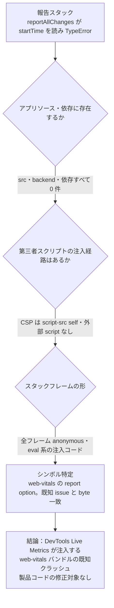

# EMR-180 / NOTE-STAFF-STARTTIME-RDT — 調査結果

- 日付: 2026-09-23
- 対象: スタッフマスタ (`/settings/staff`) で報告された `Uncaught TypeError: Cannot read properties of undefined (reading 'startTime')`
- 結論: **製品コード起因ではない。Chrome DevTools (Live Metrics / soft-navigation heuristics) が注入する web-vitals バンドルの既知クラッシュ。** 製品側の修正対象はなし。

## 報告スタック (2026-09-13, bug.md 転記)

```
Uncaught TypeError: Cannot read properties of undefined (reading 'startTime')
    at et.reportAllChanges (<anonymous>:2:19429)
```

## 帰属の証拠チェーン

| # | 確認内容 | 結果 |
|---|----------|------|
| 1 | `reportAllChanges` がアプリソースに存在するか | `frontend/src`, `backend` とも **0 件** |
| 2 | `reportAllChanges` / `web-vitals` が依存に同梱されるか | `frontend/package.json`, root `package.json`, `pnpm-lock.yaml`, `node_modules` 全域で **0 件**。Speed Insights / Sentry / GA / RUM 系依存なし |
| 3 | 第三者スクリプトの注入経路 | `index.html` の CSP は `script-src 'self'`。アプリは外部スクリプトを一切読まない。`PerformanceObserver` / `performance.mark` 等の利用も src 内 **0 件** |
| 4 | スタックの形 | 全フレーム `<anonymous>` / `VM*` = eval/注入コード。`chrome-extension://` URL を持たないため**インストール型拡張の content script ではない** |
| 5 | シンボルの特定 | `reportAllChanges` は **web-vitals ライブラリの report option 名**。`startTime` は `PerformanceEntry.startTime`。`et.reportAllChanges` は「INP エントリを startTime でソートする」web-vitals 内部処理の minified 形 |
| 6 | 既知バグとの一致 | バイトコードオフセット `:2:19429` (`reportAllChanges`)・`:2:5652` (`n.timeout`) が **GoogleChrome/web-vitals#792 および angular/angular#70464 と完全一致** (同一の注入バンドル) |
| 7 | 上流の根本原因 | Chrome DevTools が Performance パネルの **Live Metrics / soft-navigation heuristics** のためにページへ埋め込む web-vitals コピーが、soft navigation 後に clear/reset 済みの INP エントリへ `setTimeout`/idle 経由で `.startTime` を読み、null check 欠落で throw。SPA で route 遷移するだけで発火。アプリ・フレームワーク非依存 |
| 8 | 修正状況 | Chromium issue `543499029`。devtools-frontend CL `8300032` **"Live Metrics: Handle empty INP entries" は 2026-08-31 MERGED**。web-vitals maintainer コメントにより **Chrome 153 で修正配布** |



## 発生条件と既往調査との整合

- 発生には「**Chrome ≤152 (修正前) + DevTools オープン (Live Metrics 有効) + SPA の soft navigation**」が必要。`/settings/staff` は react-router の lazy route で、画面遷移が soft navigation に該当するため「スタッフマスタを開いたとき」の発生と一致する。
- 2026-09-13 の Chrome for Testing (CDP 9222) で未再現だったのは、**DevTools UI / Performance パネルの Live Metrics を開いていなかった**ため注入自体が走らなかったことで説明できる。`__REACT_DEVTOOLS_GLOBAL_HOOK__` の存在は無関係な残留観測 (RDT = React DevTools 説はここで否定。`reportAllChanges` は React DevTools のシンボルではなく web-vitals)。
- `/settings/staff` の描画ツリー (`StaffSettings` / `StaffSidePanel*` / `staff-settings-model` / `use-staff-settings-lookups`) に `startTime` / `start_time` の参照は存在しない。アプリ側の `startTime` 読み取りが関与する経路はゼロ。

## 判定

- **修正対象: なし (製品コード変更不要)。** 投げているコードは DevTools の注入スクリプト内部であり、アプリからは防げない。
- **回避・是正はブラウザ側**:
  - Chrome を **153 以降へ更新** (上流修正済み)
  - 暫定回避: `chrome://flags/#soft-navigation-heuristics` を Disabled、または DevTools を閉じる / Performance パネルの Live metrics を止める
  - 本エラーは注入スクリプト内部で投げられるだけで、アプリの機能・データへの影響はない (benign)
- チケット名の "RDT" (React DevTools 疑い) は **否定的に解消**。正体は Chrome DevTools 同梱 web-vitals。

## 残 UNKNOWN / 再判定条件

- 報告者環境の Chrome バージョン・DevTools 開閉状態は未確認 (個人環境のため取得不可)。帰属判定には不要だったが、記録として残す。
- **再判定条件**: Chrome ≥153 + DevTools オープンで同スタックが再現する場合、または `chrome-extension://` URL を持つフレームが現れた場合は、帰属を取り消して再調査する (拡張起因の可能性が残るため)。
- 未実施: 実機再現。docker compose stack 停止中 (`make up` は agent 実行禁止) で、再現には修正前 Chrome ≤152 + DevTools が必要なため今回のスコープ外。2026-09-13 の clean-profile 比較 (同 route で例外 0 件) と byte-identical stack + 上流 merge 済み修正で帰属は成立済み。

## 参照

- GoogleChrome/web-vitals issue #792: "reportAllChanges throws TypeError: Cannot read properties of undefined (reading 'startTime')" (2026-08-29)
- angular/angular issue #70464: 同スタック (closed as not planned — フレームワーク非起因)
- Chromium issue 543499029 / devtools-frontend CL 8300032 "Live Metrics: Handle empty INP entries" (MERGED 2026-08-31)
- `chrome://flags/#soft-navigation-heuristics` 無効化が暫定回避
