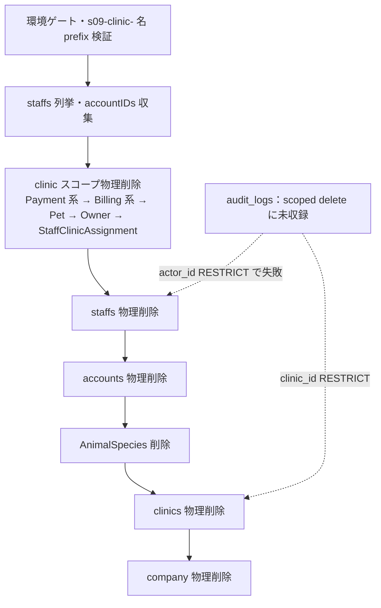

# EMR-211 — 合成クリニック teardown での `audit_logs` の扱い（判断材料）

> **この文書は判断材料であり、決裁記録ではない。** 最終決裁は人間（PO）が行う。worker は選択肢の分析と推奨案を示すのみで、本書の推奨は承認済みの実装方針を意味しない。

- **対象チケット**: Plane EMR-211
- **関連**: EMR-210（teardown 500 の scoped-delete 不備 BUG）、EMR-72 / BUG-S09-FIXTURE-TEARDOWN（append-only 締め台帳と teardown の相性）、EMR-126（UAT 500 再現レポート `reports/uat-2026-09-23/s09-fixture-teardown.md`）、LINMIG-279（clinicale2e fixture teardown）
- **調査日**: 2026-09-23
- **スコープ**: `DELETE /api/v1/uat/synthetic-closings/:clinic_id` が生成した使い捨て合成クリニックの `audit_logs` 行を teardown でどう扱うか。コード変更は行わない。

---

## 1. 前提となる現行実装の正確な記述

### 1.1 `DeleteSyntheticClosingFixture` の構造

`backend/internal/billing/synthetic_closing_fixture.go` の `DeleteSyntheticClosingFixture` は以下の順序で動作する（全て単一トランザクション内）:

1. 環境ゲート: `AllowUATSyntheticClosing`（APP_ENV ∈ {test, development, local, dev}、DB_HOST ∈ {db, localhost, 127.0.0.1}）、`RejectReservedClinicID`（1, 2 拒否）、`MatchSyntheticClosingCleanupToken`（HMAC トークン `X-UAT-Cleanup-Token`）、db 非 nil チェック
2. クリニック読み込み・`s09-clinic-` 名前 prefix 検証
3. 当該 clinic の全 staffs を `Unscoped()` で列挙し、`accountIDs` を収集（**staffIDs は収集しない** — clinicale2e との差異、後述）
4. `clinic_id` スコープの `Unscoped()` 物理削除（順序どおり）: `PaymentSplit` → `Payment` → `BillingItem` → `Billing` → `PaymentMethodMaster` → `ClinicSettings` → `Pet` → `Owner` → `StaffClinicAssignment`
5. `staff.UnscopedDeleteSyntheticClosingStaffs` — `clinic_id` スコープで staffs を物理削除（`backend/internal/staff/synthetic_closing_staff.go`）
6. 収集済み `accountIDs` で accounts を物理削除
7. `AnimalSpecies` を `name LIKE 's09-species-<clinicID>'` で削除
8. `tx.Delete(&clinic)` — **`clinics` テーブルに `deleted_at` カラムはなく `model.Clinic` にも `DeletedAt` フィールドがないため、これは物理削除**。`audit_logs.clinic_id` の RESTRICT はここでも発火し得る
9. `company_id` + `s09-synthetic-` prefix 一致で company を物理削除

**`audit_logs` は scoped delete リストに含まれていない**。これが EMR-210 の一部を構成する。



### 1.2 `audit_logs` のスキーマと制約

`backend/migrations/001_init.sql`:

```sql
clinic_id  bigint NOT NULL REFERENCES clinics(id) ON DELETE RESTRICT,
actor_id   bigint NULL     REFERENCES staffs(id)  ON DELETE RESTRICT,
actor_type varchar(30) NOT NULL CHECK (actor_type IN ('staff','system')),
CHECK ( (actor_type='system' AND actor_id IS NULL)
     OR (actor_type='staff'  AND actor_id IS NOT NULL) )
```

- COMMENT: `権限変更・認証操作の監査ログ（削除禁止）`
- `deleted_at` なし（物理削除のみ可能）。**append-only を強制する trigger は存在しない**（対照的に `cash_register_closes` / `cash_register_close_adjustments` には `prevent_*_mutation` trigger があり DB 層で UPDATE/DELETE を拒否する）
- インデックス: `(clinic_id, created_at DESC)`、`(actor_id, created_at DESC)`、`(resource, resource_id, created_at DESC)`
- `internal/model/audit_log.go`: `AuditLog は権限変更・認証操作の記録。削除禁止テーブル`
- `internal/audit/repository.go`: `Create` / `CreateTx` のみで delete/update メソッドなし（**コード慣習による append-only**。DB 層の強制ではない）
- `audit.ValidateLog` が actor 整合性（staff ⇒ actor_id 必須、system ⇒ NULL 必須）を Go 側でも強制

### 1.3 audit 書き込み経路（path-dependent）

`docs/spec/specification.md` と `docs/architecture/data-flow.md` が規定: audit は全 CUD 自動ではなく**経路依存**。重要経路（臨床・会計整合性・資格情報）は同一トランザクション fail-closed、それ以外は best-effort。監査閲覧 UI は存在せず、確認は USER の DB 参照のみ。

合成スタッフが audit 行を生成する主な経路:

| action | 発火箇所 | 属性 | 性質 |
|---|---|---|---|
| `auth.login.success` | `internal/auth/http_session_login.go` | clinic_id=合成主clinic, actor_id=合成staff | best-effort |
| `auth.login.failure`（既知アカウント） | `internal/auth/login_failure_audit.go` / `http_session_me.go` | 同上 | 非同期 best-effort |
| `auth.logout` | logout handler | 同上 | best-effort |
| `switch_clinic` | `internal/middleware/auth.go` `logClinicSwitchBestEffort` | **clinic_id=切替先 clinic**（合成アカウントは IsSystemAdmin のため実 clinic も選択可能）, actor_id=合成staff | best-effort |
| `billing.cancel` / `billing.post_close_edit` / `billing_refund.create` / `billing.credit_correction` / `billing.vaccination_claim_release` | billing service 層 | clinic_id=合成clinic, actor_id=合成staff | 一部 fail-closed |
| `clinic closing settings save` | `internal/clinic/closing_settings_service.go` | 同上 | 経路依存 |
| 権限グループ操作 | permission-group service | 同上 | 経路依存 |

fixture の `Create`/`Delete` 自体は audit 行を一切書かない（生 `tx.Create`/`Delete`）。蓄積は**合成スタッフが本物の API 経路を通じて操作した結果**のみ。つまりログイン1回でも `auth.login.success` が残り、teardown は `actor_id` RESTRICT で失敗する（EMR-126 が観測した 500）。

### 1.4 保持期間・運用ポリシーの調査結果

- `audit_logs` に**文書化された保持期間・アーカイブ規定・法的保存期間は見つからなかった**
- 「削除禁止」は schema COMMENT・model コメント・repository 設計による**設計ポリシー**であり、DB trigger による強制ではない
- `docs/ops/deploy/STG-DEMO-DATA-LIFECYCLE.md`: 「手動 SQL 後にアプリケーション風の audit 行を INSERT してはいけない」（監査行の**捏造**禁止の規範は存在）
- endpoint の環境ゲートにより、この teardown が動くのは local/test/development DB のみ。**STG/本番では到達不能**（`AllowUATSyntheticClosing` が fail-closed）

### 1.5 先行事例（clinicale2e）

`internal/clinicale2e/fixture.go` の `Delete`（commit `6fda4bebb`、LINMIG-279）は既に (a) を限定形で実装済み:

```go
// fixture.go L311-315: staffIDs を削除前に収集し、
// audit_logs を clinic_id=? AND actor_type='staff' AND actor_id IN (staffIDs) で物理削除
```

注意点: この述語は (i) 合成 actor が**他 clinic** に対して残した行（`switch_clinic` の切替先行など）、(ii) 合成 clinic 上の **system actor** 行 を取りこぼす。S09 では予約を作らないので system 行は通常発生しないが、system-admin アカウントの切替え経路は実在するため (i) は起こり得る。

### 1.6 関連する残存ブロッカー（本件の範囲外だが相互に影響）

- `cash_register_close_adjustments.clinic_id` → RESTRICT: scoped delete に未収録（EMR-210）
- `cash_register_closes` / `cash_register_close_adjustments` は trigger 強制 append-only（EMR-72）。**合成 clinic が実 close を一度でも実行すると、trigger bypass か行残留なしには完全 teardown 不能**。S09 の設計スコープ（締めプレビューのみ、close 実行なし）では通常発生しないが、EMR-126 で発見された残留 926065 は adjustments FK で失敗しており、UAT で実際に exercised された形跡がある
- `payments.paid_by` / `payment_splits.paid_by` → staffs は NO ACTION（現在の削除順で解消済み）。`cash_register_closes.closed_by` → staffs も staff 削除をブロックし得る（EMR-72 領域）

---

## 2. 選択肢の比較

| | (a) scoped delete に追加 | (b) sentinel 匿名化 | (c) fixture 由来の audit 出力抑制 | (d) 追加選択肢 |
|---|---|---|---|---|
| **内容** | teardown tx 内で `audit_logs` を clinic/actor スコープで物理削除 | `actor_id`（と `clinic_id`）を sentinel 行に付替えて行を残す | 合成 fixture 由来の操作では audit 行を書かない | (d1) clinic 無効化+残留、(d2) FK 変更、(d3) DB snapshot 復元 |
| **実装コスト** | **低**（~15行+test。clinicale2e に先例） | **中高**（sentinel staff+clinic の seed/migration、append-only 表への UPDATE、匿名化自体を記録する新 audit action、clinic 一覧から sentinel を隠す仕組み） | **中高・侵襲的**（audit 呼出し全経路 or audit service に合成判定のバイパスを埋込み） | (d1) 低、(d2) 中（migration+CHECK 整合）、(d3) 高 |
| **監査証跡への影響** | 合成データ由来の行のみ消失。実運用証跡は不変（環境ゲートで本番到達不能） | 行は残るが帰属が失われ、実質「残存する誤情報」。sentinel clinic/staff が永続残留 | 該当 actor の操作が**無監査**になる穴。UAT の audit 経路が本番と乖離しテスト信頼性を毀損 | (d1) 証跡完全保持、(d2) 監査整合性をグローバルに弱める、(d3) 証跡ごと環境を巻戻し |
| **teardown 完遂** | 完遂（完全削除を維持） | clinic RESTRICT を残すため clinic 行の残留 or clinic_id 付替えが別途必要 — **actor 匿名化だけでは clinic 削除を通せない** | 行が無ければ FK は発火しないので完遂（ただし EMR-72 の append-only 締め台帳は別問題として残る） | (d1) teardown 自体を redefinする、(d2) FK 弱体化で通るが影響大、(d3) teardown を環境操作に置換 |
| **ポリシー整合** | 「削除禁止」ポリシーとの明示的な例外合意が必要 | append-only 表への UPDATE は「行の改竄」に相当し、削除禁止より性質が悪い可能性 | 「自動化は audit sink に記録」原則（product-philosophy）に反するバイパスを恒常化 | (d1) は既存 delete-soft-delete パターンと整合、(d2) は設計意図に反する |

### 各選択肢の詳細

**(a) clinic スコープの audit 行を teardown 削除に含める**

- 実装: staff 削除前に staffIDs を収集し（clinicale2e と同型）、tx 内で `DELETE FROM audit_logs WHERE clinic_id = ? OR actor_id IN (staffIDs)`。OR 形にする理由: ① 合成 clinic 上の system actor 行、② 実スタッフが合成 clinic に対して残した行、③ 合成 actor が**他 clinic**に残した行（`switch_clinic` 切替先）を全て捕捉するため。clinicale2e の AND 形より網羅的
- ③についての正直な注記: `actor_id IN (staffIDs)` は他 clinic 属性の行も消す。ただしその行の actor は合成スタッフであり、行自体が合成由来のため「実スタッフの証跡を消す」には当たらない。逆に `clinic_id = 合成clinic` 側は実スタッフ actor の行を含み得るが、対象が合成 clinic への操作である以上、それも合成由来イベントの記録である
- 削除禁止ポリシーとの関係: 「削除禁止」が保護するのは**実運用の証跡**であり、使い捨て合成データの行は元より存在すべきでないものが UAT fidelity の副産物として残ったもの。clinicale2e が既に同じ橋を渡っている
- 残余リスク: EMR-72（trigger append-only 台帳）は本選択肢では解決しない

**(b) actor を匿名化 sentinel に付替え**

- `actor_id` だけ付替えても `clinic_id` RESTRICT で clinic 削除が通らない。行を残すなら clinic 行も残す（teardown 不完全）か、`clinic_id` も sentinel clinic に付替える必要がある
- sentinel は実 staff 行（CHECK 制約上 `staff` actor は actor_id 必須）。clinic 横断の共有 sentinel は `actor_id` の clinic 意味論を壊しテナント隔離上の意味論的汚染になる。clinic 毎 sentinel は clinic 残留を要求し同じ結論に戻る
- `actor_type='system'` に変換して `actor_id=NULL` にする代替は、staff が行った操作を system 操作へ**改竄**することであり匿名化ではない
- 残る行は「存在しない clinic/人物への帰属」を持つ誤情報。合成 staff は実在人物でなく行に PII も含まれないため、匿名化の通常の動機（個人情報保護）がそもそも成立しない

**(c) 合成 fixture の audit 出力を抑制**

- 行を作らなければ FK 衝突は消えるが、audit 呼出しは汎用経路（login/logout/switch/billing）に散在。抑制には audit service 層に「合成 clinic 判定」を埋め込む等の恒常バイパスが必要で、「この clinic を合成とマークできれば無監査操作が可能」という一般的な弱体化を導入する
- UAT が本番と異なる振る舞い（audit が出ない）になり、audit 経路自体の回帰を検出不能にする — fixture が「本物の経路を通る」ことの価値を損なう

**(d) 追加選択肢**

- **(d1) clinic を削除せず `is_active=false` + staff/account 無効化で残留**（soft teardown）: audit 行・FK・append-only 問題を全て素通りできる最低リスク案。EMR-72 の (b)「無効化+残留」と整合。ただし「使い捨て clinic の完全削除」という EMR-126 の衛生要件を redefin し、残留ログイン可能アカウントの無効化設計と、残留物の累積・一覧からの除外コストが残る
- **(d2) FK を `ON DELETE SET NULL`/CASCADE に変更**: テスト fixture の都合で監査整合性をグローバルに弱める。CHECK 制約（staff ⇒ actor_id 必須）とも衝突し追加の整合設計が必要。推奨しない
- **(d3) DB snapshot 復元を teardown とする**（EMR-72 の (c)）: 監査を含め環境全体を巻戻すので概念的には最も完全だが、共有 local DB と両立せず運用が重い

---

## 3. 推奨

**推奨: (a) — scoped delete に `audit_logs` を含める。** 述語は `actor_id IN (合成staffIDs) OR clinic_id = 合成clinicID` の OR 形（clinicale2e の AND 形を拡張）とし、既存 teardown tx 内・staff 削除前に実行する。

理由:

1. **先例が repo 内に存在する**（clinicale2e `Delete`、LINMIG-279）。同じ判断を揃える
2. 「削除禁止」ポリシーの保護対象は実運用証跡であり、使い捨て合成データ由来の行はその範囲外。環境ゲートにより本番・STG へは到達不能
3. 実装コスト最小かつ teardown の「完全削除」契約を維持
4. (c) は監査バイパスを恒常化し UAT の代表性を損ない、(b) は行を残すための clinic 残留 or 二重付替えが必要でコストに見合う証跡価値が無い（残るのは誤情報）

ただし **(a) 単体では EMR-210 は完結しない**（`cash_register_close_adjustments` 等の scoped-delete 不備と、EMR-72 の trigger append-only 問題は別途残る）。EMR-72 で「無効化+残留」や「snapshot 復元」が採択された場合、実 close を実行した合成 clinic に対しては本問題自体が発生しないため、**決裁は EMR-210/EMR-72 の結論と一緒に出すのが望ましい**。

---

## 4. 未解決・人間判断が必要な事項

1. **「削除禁止」ポリシーに対する合成データ例外の正式承認** — COMMENT `削除禁止` と model 記述の意図が「合成 fixture を含む全ての行」まで及ぶかは PO の解釈事項。clinicale2e の先例は暗黙の先例であって明示的なポリシー合意ではない
2. **保持期間・法的要件の不在** — `audit_logs` に文書化された保持期間・法的保存規定は見つからなかった。監査対応（医療法・税務等）を将来要求する場合、合成例外の書き方に影響する
3. **実スタッフ行の扱い** — 実スタッフが合成 clinic を操作した場合の audit 行（clinic_id=合成, actor_id=実staff）を消すことについての合意（本稿は「対象が合成由来イベントなので削除対象」と整理したが PO 確認が必要）
4. **EMR-210/EMR-72 との統合** — `cash_register_close_adjustments` の scoped-delete 追加と trigger append-only 台帳の扱いは別決裁。teardown の最終形はこれらと一体で設計すべき
5. **clinicale2e 側への述語展開** — (a) 採択時、OR 形述語を clinicale2e にも揃えるか（switch edge の網羅性のため推奨だが別作業）
6. **teardown 自体の監査** — teardown が audit 行を残さない現状を維持するか。残す場合「最終行は削除スイープで自壊する」「別 sink に書く」等の設計が必要

## 5. 非目標（本書が決めないこと）

- `audit_logs` の全体的な保持・アーカイブ設計
- EMR-210 の scoped-delete 完全性（`cash_register_close_adjustments` 等）の実装
- EMR-72 の append-only 台帳と teardown の最終解（trigger bypass / 残留 / snapshot）
- 実装・migration・コード変更（本チケットは判断材料のみ）

## 6. 検証

- コード変更なし（ドキュメントのみ）。検証は文書内のファイルパス・記述の drift チェックに限定
- 実 DB / STG / 本番での検証は未実施（本チケットの性質上不要かつ環境ゲートで本番到達不能）
