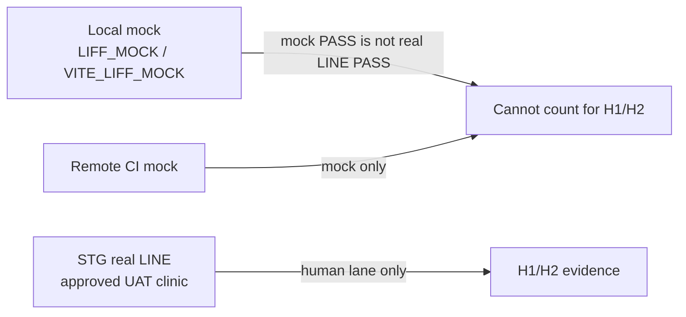

# LINMIG-208 — local real LINE / LIFF UAT H1·H2 prep sheet

> Current task status is tracked in Plane `EMR-22`. This local document remains supporting execution/evidence material; see the [migration receipt](../plane-md-migration-20260923-receipt.md) for the crosswalk.

Campaign `linmig-ops-prep-20260919` revision 1. Unit `LINMIG-208`. Linear issue `LINMIG-208` was not found at sheet authoring; current Linear state is UNKNOWN.

This file is a **prep sheet only**. It does not execute real-device UAT, send LINE messages, collect `idToken` values, or store secrets.

| Field | Value at authoring |
| --- | --- |
| Devices / OS / LINE app version | UNKNOWN |
| Send scope (LINE push, LSTEP write, hospital notify) | UNKNOWN — human lane must name the approved target before any send |
| Dedicated UAT clinic / synthetic accounts | UNKNOWN |
| Effective STG mock flags | UNKNOWN — confirm on the deployed settings, not from local compose |
| Run date / operator / acceptance owner | UNKNOWN |

## Binding sources

| Source | Role |
| --- | --- |
| [liff-verification.md](../../ops/testing/liff-verification.md) | Mock vs real LINE guarantee boundary, secret storage, STG human lane, prohibited evidence |
| [todo-verification.md](../../../todo-verification.md) E1 / E2 | `QA-UAT-LSTEP-REAL`, `QA-UAT-LINE-IDTOKEN` conditions and stop rules |
| [V05-auth-line-forms.md](../../ops/testing/scenarios/V05-auth-line-forms.md) V05-5 / V05-17 | Real link + 409/400, LSTEP bulk-tag remove observation |
| [S04-liff-reservation-journey.md](../../ops/testing/scenarios/S04-liff-reservation-journey.md) | LIFF reservation journey (line-reserve app) |
| [S12-liff-pet-health.md](../../ops/testing/scenarios/S12-liff-pet-health.md) | LIFF account link + pet health (health-card app) |
| [UAT-254-CLOSE-CHECKLIST.md](../../ops/testing/scenarios/UAT-254-CLOSE-CHECKLIST.md) | Close gate: mock cannot close #254; flow 4 + S12 complement |

Scenario Markdown remains procedure-only. Do not write dated PASS/FAIL/sign-off into those files.

## Mock versus real LINE (do not conflate)

From [liff-verification.md](../../ops/testing/liff-verification.md) §1–§2.

| Lane | Guarantees | Does not guarantee | Allowed on this sheet as H1/H2 PASS? |
| --- | --- | --- | --- |
| Local mock (`LIFF_MOCK=true`, `VITE_LIFF_MOCK=true`) | Shared LIFF hooks and mock-token API/UI paths | Real SDK, `idToken` signature, LINE app, channel settings, backend link from mock success UI | **No.** Mock PASS is not real LINE PASS |
| Remote CI intent | Mock-only token scope | Manual E2E auth smoke success, real LINE, clinical/full suite | **No** |
| STG / dedicated UAT real LINE | Approved dedicated UAT clinic, real SDK / `idToken` / in-client behavior | Substitute for local mock gates | **Yes — H1/H2 target.** Human lane only |

Additional mock traps (must stay FAIL/BLOCKED for H1/H2):

- Frontend mock link screen can show success without calling the API. Link proof requires backend mock API **or** STG real LINE, never mock UI alone ([liff-verification.md](../../ops/testing/liff-verification.md) §2; [V05-5](../../ops/testing/scenarios/V05-auth-line-forms.md); [S12](../../ops/testing/scenarios/S12-liff-pet-health.md) step 2).
- Release mode must refuse `LIFF_MOCK=true`. H1/H2 must run with mock **disabled** on the effective deployment.
- Mode flag names and non-secret `true`/`false` may appear in diagnostics. Token, channel secret, cookie, and `idToken` values must not.
- S04 mock lane does **not** include real LINE notification receipt. S04 steps 6 and 10: mock = send-attempt confirmation only; receipt is STG/human.
- E1: mock / stopped LSTEP / HTTP 204 / toast-only is not PASS.
- E2: mock is not real LINE evidence. Distinguish `idToken` (LINE identity) from `linkToken` (one-time hospital-issued link).

## H1 — real LINE `idToken` / account link (E2)

**Hypothesis:** H1 is `E2 / QA-UAT-LINE-IDTOKEN`: real LINE identity mapping via a genuine `idToken`, not a mock token.

### Conditions (must all hold before execute)

- Human lane authorized. This prep sheet does **not** authorize send or token capture.
- Approved dedicated UAT clinic. Not production. Not an unapproved shared clinic.
- Effective settings: mock disabled; correct per-clinic LIFF ID and credentials. Local compose defaults are not evidence.
- Designated synthetic owner/pet/LINE fixture and a documented cleanup path.
- Hospital staff account with owners-edit for post-link confirmation. Do **not** use name+phone auto-link (SEC-CS2-F02).
- Reservation LIFF ID and/or L-step LIFF ID configured for URL-copy steps. Both-unset is a separate negative case (S12 step 0).
- Devices / OS / LINE version: UNKNOWN until the operator records them. Do not invent.
- Send scope: UNKNOWN. H1 does not require outbound LINE push; if any message is needed, stop until a human names the approved recipients.

### Checks (real LINE / real API only)

Map to [todo-verification.md](../../../todo-verification.md) E2, [V05-5](../../ops/testing/scenarios/V05-auth-line-forms.md), [S12](../../ops/testing/scenarios/S12-liff-pet-health.md) steps 1–4.

| ID | Check | Expect | Mock lane result if run | Real LINE required |
| --- | --- | --- | --- | --- |
| H1-1 | Open issued link URL with `clinic_id` + `token` on `/liff/{clinicId}/` (trailing slash) | `LiffLinkPage`; Vite rewrite present (else BUG-017 503 blank) | UI only | Yes for SDK/`idToken` |
| H1-2 | Valid link with real LINE `idToken` | Backend link established. Hospital `/owners/:id` LINE/L-step section shows linked | FE mock may show success while hospital stays unlinked — **not H1 PASS** | Yes |
| H1-3 | Repeat link on already-linked LINE | HTTP 409 specialized copy; no double mapping | Insufficient | Yes |
| H1-4 | Invalid or expired `linkToken` | HTTP 400-class invalid/expired copy; no link | Insufficient | Yes |
| H1-5 | Missing `clinic_id` vs missing `token` | Token without clinic = invalid URL. Token absent = health-card branch, no link execute | Local URL checks only | Real SDK still required for H1 PASS |
| H1-6 | Receipt | Case-by-case result **without** token/URL values; `idToken` vs `linkToken` named as types only | Mock receipt cannot satisfy E2 | Yes |

Do not paste `idToken`, `linkToken`, URL query strings that contain tokens, LINE user IDs, or channel secrets into this sheet, run reports, chat, or git.

### Evidence retention (H1)

- Store under `reports/uat-YYYY-MM-DD/` (UAT-254 rule 4; liff-verification §4).
- Record: date, environment/revision contract, clinic **code not secrets**, device/OS, LINE version, operator vs acceptance owner, result per H1-n, mock-disabled confirmation.
- Do **not** record: tokens, secrets, cookies, `idToken` values, personal names/phones of real owners, raw URLs with tokens.
- DB/audit of link success is USER-executed (`audit_logs` / `line_link_service.go` per S12). This sheet does not run SQL.

### Post-process (H1)

- Unlink or retire the synthetic LINE mapping on the dedicated UAT clinic.
- Expire unused `linkToken`s; do not leave live tokens in screenshots or notes.
- Confirm no second owner shares the same LINE mapping (E2: no double link).
- Do not close UAT-254 on H1 mock leftovers.
- Fixture cleanup complete; shared/STG existing clinical data unchanged (UAT-254 close gate).

## H2 — LIFF reservation / health on a real device (E1 / S04 / S12)

**Hypothesis:** H2 is real-device proof of (a) line-reserve journey S04, (b) health-card + isolation S12, and (c) cited E1 LSTEP-real observation. S04 and S12 are **different LIFF apps**. E1 is LSTEP write, not LINE push; do not treat a LINE message send as E1.

### Conditions (must all hold before execute)

- Same dedicated UAT clinic and synthetic fixtures as H1, or an equally approved set. Production / unapproved shared clinic: stop.
- Mock disabled on effective FE/BE. `VITE_LIFF_MOCK` / `LIFF_MOCK` must not be the H2 evidence source.
- Real device inside LINE in-client LIFF. Desktop browser mock is not H2 PASS.
- Devices / OS / LINE version: UNKNOWN until recorded on the run report.
- Send scope: UNKNOWN. S04 steps 6 and 10 mention owner + hospital notifications. **Do not send** until a human names approved recipients and a rollback. If send is not approved, mark notify-receipt rows BLOCKED; do not skip the rest and call H2 PASS.
- E1 write-enabled LSTEP target, testers, and restore range must be named and approved. Settings change / send is a **separate** approval ([todo-verification.md](../../../todo-verification.md) E1). Until named: E1 rows BLOCKED, not skipped-as-PASS.
- LINE reservation settings: accepting, published exam + trimming courses/options, staff, work/break/existing-booking boundaries.
- Health: unlinked owner A with living pet (vaccine records), isolation owner B/pet. Deceased pets must not appear.

### Checks — S04 line-reserve (real device)

Follow [S04](../../ops/testing/scenarios/S04-liff-reservation-journey.md) steps 1–12 on real LINE. Mock-lane notes in S04 do not apply as H2 PASS.

| ID | Check | Expect | Real vs mock |
| --- | --- | --- | --- |
| H2-S04-1 | Open `/line-reserve/{clinicId}/` | Top: new booking / my bookings. Trailing slash / Vite rewrite (BUG-402) | Real in-client |
| H2-S04-2 | Exam course | Published reservation types only | Real API |
| H2-S04-3 | Staff | Named staff or no-staff option per settings | Real API |
| H2-S04-4 | Date/time slots | Interval (default 15m) inside working hours | Real API |
| H2-S04-5 | Break / conflict boundaries | No slot overlapping break or existing booking | Real API |
| H2-S04-6 | Confirm booking | Completes; hospital sees `source=line` | Notify **receipt** is STG/human; send scope UNKNOWN until approved |
| H2-S04-7 | Hospital reservation filter「LINE予約」 | Booking listed | Hospital UI |
| H2-S04-8 | Reception kanban | Same-day `source=line` in 受付予約 | Hospital UI |
| H2-S04-9 | My bookings | Step 6 booking visible | Real API |
| H2-S04-10 | Cancel confirmed only | Cancel while confirmed; not after reception. Notify receipt same as H2-S04-6 | Real API + UNKNOWN send |
| H2-S04-11 | Slot freed | Same slot reappears | Real API |
| H2-S04-12 | Trimming path | Trimming course/options then staff | Real authenticated API |
| H2-S04-M | `stopped` / settings error | `MaintenancePage` sticky; no overwrite to Top after LIFF init | Real settings |
| H2-S04-C | Clinic isolation | Path `clinicId` matches hospital clinic of the booking | Real |

UAT-254 flow 4: do not stop at LIFF booking display. Continue hospital visit intake and chart creation on the **same** fixture. LINE cancel-only does not prove re-booking. Pair with S06 / reservation-to-record spec as cited by the close checklist — those extra flows are out of this unit's execute scope but H2 evidence must not claim flow 4 closed from S04 display alone.

### Checks — S12 health-card (real device)

| ID | Check | Expect | Real vs mock |
| --- | --- | --- | --- |
| H2-S12-0 | Both LIFF IDs unset | URL empty; 「LIFF IDが未設定」; do not claim a copyable URL | Settings, not mock |
| H2-S12-1 | Token URL `/liff/{clinicId}/` | `LiffLinkPage`; missing clinic/token → invalid URL copy | Real rewrite |
| H2-S12-2 | After link, hospital owner edit | LINE/L-step section **linked** | FE mock leaves hospital unlinked — not H2 PASS |
| H2-S12-3 | Linked UI / re-link | No issue-token on linked UI; 409 already-linked | Real API |
| H2-S12-4 | Used/expired token | 400-class; no link | Real API |
| H2-S12-5 | `clinic_id` only (no token) | Health page; header owner_name or LINE display name | Real `idToken` |
| H2-S12-6 | Pet cards | Name, species/breed, last visit or 記録なし, vaccine table via `GET /api/liff/:clinicId/health-card` (not profile) | Real API |
| H2-S12-7 | Owner B | Only B pets; A pets absent | Real isolation |
| H2-S12-8 | No `clinic_id` | Clinic-id missing error; no cross-tenant data | Real |
| H2-S12-U | Unlinked LINE opens health | LINE display name + 「ペット情報はありません」; not an error | Real |
| H2-S12-D | Deceased pet | Not listed | Real |

S12 local-only backend-down (step 9) is **not** an H2 real-LINE PASS item. Record it on mock if needed; do not substitute for H2-S12-5..7.

### Checks — E1 LSTEP-real (cited under H2)

| ID | Check | Expect | Stop rules |
| --- | --- | --- | --- |
| H2-E1-1 | S01 tag sync + V05-17 bulk tag remove on **approved** write-enabled LSTEP target | Primary save vs best-effort sync recorded separately; external tag count vs re-fetch count compared separately | Mock / stopped / 204 / toast-only ≠ PASS |
| H2-E1-2 | V05-17 observation | Confirm dialog required; no cancel mid-run; UI toast may succeed while `tag-summary` / owner count unchanged when Write API is off | Do not treat toast as external proof |
| H2-E1-3 | Restore | Restore range named before write | Settings change / send = separate approval. Send scope UNKNOWN → BLOCKED |

### Evidence retention (H2)

- Same directory `reports/uat-YYYY-MM-DD/`. Same revision/environment contract as H1 if both are used for UAT-254.
- Record: date, real device model, OS, LINE version, LIFF app (line-reserve vs health-card), clinic code, mock-disabled proof, per-check result, whether notify/LSTEP write was **approved and actually sent** (yes / no / UNKNOWN).
- Screenshots: crop secrets and personal data. No QR that embeds live tokens.
- Owner isolation proof: describe “owner A pets absent on B” without dumping pet names of real clients.

### Post-process (H2)

- Cancel leftover H2 bookings on the synthetic fixture; restore LSTEP tags if E1 ran.
- Re-enable or leave reservation settings in the agreed UAT state (`stopped` experiments must not leak to real owners).
- Cleanup fixtures; do not mutate shared/STG production-like data.
- Do not embed results into S04/S12/UAT-254 source files.
- Product FAIL (clinical safety, money, clinic/owner/pet/staff isolation, auth, data loss) → `todo.md#product-bugs`. Environment/permission/fixture BLOCKED is not a product bug (UAT-254 rule 4).

## UAT-254 close mapping (prep only)

This unit does **not** close GitHub #254 / BRT-45. Close is USER-managed.

| UAT-254 item | This sheet |
| --- | --- |
| Rule 1 / close gate: do not close on local/mock | H1/H2 PASS requires real LINE / real device rows above |
| Flow 4 LINE booking → chart | H2-S04 plus hospital intake/chart; display-only is not flow 4 |
| Complement: S12 health/link | H1 + H2-S12. Does not replace any of the five flows |
| Real LINE + token health evidence | H1-6 receipts, types only, no token values |
| Separate acceptance owner sign-off | UNKNOWN / not this unit |
| External Linear/GitHub status | Re-check at execute time. Do not infer from ignored reports. BRT-45 / BRT-68 historical Needs Human is not current status |

## Prohibited (this unit and later execute)

- LINE send, `idToken` capture, migrate, push, or production mutation from this prep session.
- Enable mock on release/STG.
- Treat mock UI success as account link PASS.
- Call non-gating E2E a working CI gate.
- Store secrets in this sheet or in `reports/`.
- Claim H1/H2 PASS while Devices or Send scope remain UNKNOWN **and** the check requires a device or a send. UNKNOWN device blocks real-device rows; UNKNOWN send blocks notify/LSTEP-write rows only.

## Execute later — operator fill-in (leave UNKNOWN until true)

| Item | Value |
| --- | --- |
| Device A (H1/H2) | UNKNOWN |
| Device B (S12 isolation) | UNKNOWN |
| OS / LINE version | UNKNOWN |
| Dedicated UAT clinic code | UNKNOWN |
| Send scope (none / named recipients / LSTEP write range) | UNKNOWN |
| Mock-disabled confirmation (who, where, when) | UNKNOWN |
| H1 result | not run |
| H2 S04 result | not run |
| H2 S12 result | not run |
| H2 E1 result | not run |
| Cleanup done | not run |
