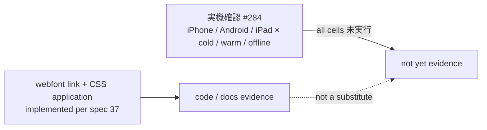

# LINMIG-224 — LINE reserve owner-flow font QA matrix

> Current task status is tracked in Plane `EMR-36`. This local document remains supporting execution/evidence material; see the [migration receipt](../plane-md-migration-20260923-receipt.md) for the crosswalk.

Campaign `linmig-ops-prep-20260919` revision 1. Attempt `att-linmig-224-20260919-001`. Claim `claim/LINMIG-224`. Local sheet only.

This unit maps three devices against remaining Noto Sans JP display conditions. It does not run device QA, capture screenshots, or change CSS.

## Binding (cited only)

| Source | What it establishes |
|--------|---------------------|
| `docs/spec/screens/37-line-reserve-owner-flow.md` L77 | Webfont declaration + CSS application are implemented. Remaining work is iPhone / Android / iPad **cold・warm・offline 実機確認**, tracked as GitHub [#284](https://github.com/MinoruSoga/AnimalEkarte/issues/284). Code presence is not device-QA complete. |
| `frontend/line-reserve/index.html` L7–15 | Google Fonts `Noto Sans JP` weights `400;500;600;700`, `display=swap`. No Inter stylesheet on this surface. Comment states this link makes the base `font-family` effective (CSS `@import` would be ignored after Tailwind). |
| `docs/spec/design-system.md` L157 | Staff SPA stack is `'Inter', 'Noto Sans JP'`. That is not the line-reserve webfont contract. |

Phrase `3端末` does not appear in spec 37. The three terminals for this sheet are **iPhone, Android, iPad** (prompt + L77). Display conditions remain **cold / warm / offline**.

GitHub issue 284 is cited only as that local markdown link. This sheet did not fetch GitHub or Linear. Context: Linear `LINMIG-224` not found.

## Target URL / build

| Item | Value |
|------|-------|
| Target URL | UNKNOWN |
| Build / commit under QA | UNKNOWN (this worktree HEAD is `aac697645`; that is not a QA run identity) |
| Device models / OS / LINE versions | UNKNOWN |
| Tester / run date | 未実行 |

## Existing tests vs missing evidence

| Kind | Status | Evidence |
|------|--------|----------|
| Spec remainder | present | spec 37 L77 states webfont/CSS implemented and 実機確認 remaining on #284 |
| Webfont HTML | present | `frontend/line-reserve/index.html` L7–15 |
| CSS application | present per spec 37 L77 | spec states CSS 適用は実装済み; this unit does not patch CSS |
| Automated test that line-reserve loads Noto Sans JP or applies computed `font-family` | missing | `rg` of `frontend/line-reserve` tests for `Noto` / `font-family` / `fonts.googleapis`: no hits |
| Device QA cells (3 × 3) | missing | all cells 未実行 |
| Screenshot / patient-data capture | out of scope | not taken |

Code and docs above are **not** substituted for 実機確認.

## Matrix (device × display condition)

Pass/fail is not claimed. Every actual-QA cell is **未実行**. Device identity is **UNKNOWN**.

| Device | Condition | Spec remainder | Implementation evidence | Automated test | Actual QA | Notes |
|--------|-----------|----------------|-------------------------|----------------|-----------|-------|
| iPhone | cold | remaining (#284) | HTML webfont + spec-stated CSS application | missing | 未実行 | first load; webfont fetch unknown without a target URL |
| iPhone | warm | remaining (#284) | HTML webfont + spec-stated CSS application | missing | 未実行 | cache/warm path unobserved |
| iPhone | offline | remaining (#284) | HTML webfont + spec-stated CSS application | missing | 未実行 | system fallback stack unobserved |
| Android | cold | remaining (#284) | HTML webfont + spec-stated CSS application | missing | 未実行 | first load; webfont fetch unknown without a target URL |
| Android | warm | remaining (#284) | HTML webfont + spec-stated CSS application | missing | 未実行 | cache/warm path unobserved |
| Android | offline | remaining (#284) | HTML webfont + spec-stated CSS application | missing | 未実行 | fallback stack unobserved |
| iPad | cold | remaining (#284) | HTML webfont + spec-stated CSS application | missing | 未実行 | first load; webfont fetch unknown without a target URL |
| iPad | warm | remaining (#284) | HTML webfont + spec-stated CSS application | missing | 未実行 | cache/warm path unobserved |
| iPad | offline | remaining (#284) | HTML webfont + spec-stated CSS application | missing | 未実行 | fallback stack unobserved |

## Out of scope (this unit)

- Real-device QA and screenshots of patient data
- CSS / HTML / test patches
- Campaign ledger edits
- Closing GitHub #284

Follow-up (not this unit): a human device run against a known URL/build, filling the nine 未実行 cells without treating webfont source as acceptance.
