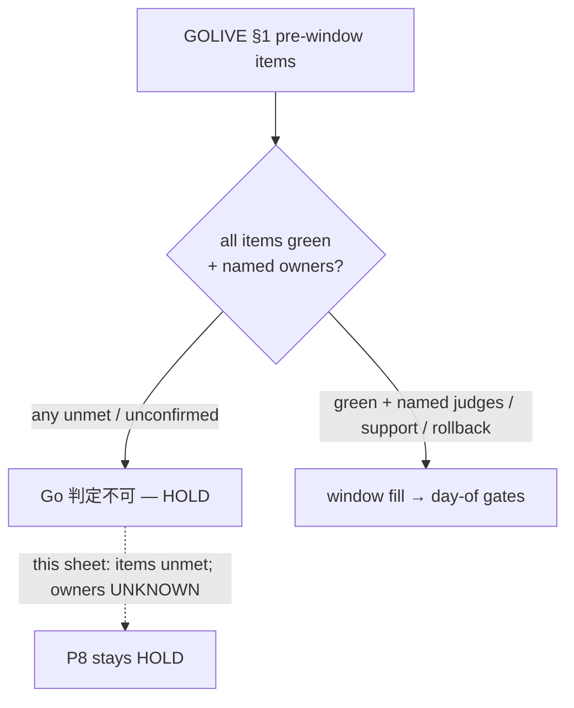

# LINMIG-228 — Go-live pre-window evidence map (docs-only)

> Current task status is tracked in Plane `EMR-40`. This local document remains supporting execution/evidence material; see the [migration receipt](../plane-md-migration-20260923-receipt.md) for the crosswalk.

Campaign `linmig-ops-prep-20260919` revision 1. Unit `LINMIG-228`. Attempt `att-linmig-228-20260919-001`. Claim `claim/LINMIG-228`. Linear issue `LINMIG-228` was not found; keep as claim only.

Maps to [todo-verification.md](../../../todo-verification.md) **TODO-V-RELEASE / P8** and GitHub [#257](https://github.com/MinoruSoga/AnimalEkarte/issues/257). Binding sources for this unit:

- [docs/delivery/GOLIVE_RUNBOOK.md](../../delivery/GOLIVE_RUNBOOK.md) **§1** pre-window items 1–10
- [todo-verification.md](../../../todo-verification.md) **TODO-V-RELEASE** (P4 / E1 / E2 / P8)

Worktree `/Users/minoru/Dev/Case/AnimalHospital/AnimalEkarte-linmig-228` on `feat/linmig-228-ops-prep` at HEAD `aac697645df92fd24611c7c13bf0f7dda12a6e08`. Sheet date: 2026-09-19. Local files only. This unit does **not** fill the Go/No-Go window, invent named owners, declare go-live, query Linear/GitHub live state, or run production/STG operations.

## Binding rules (cited)

| Rule | Source | This unit |
|------|--------|-----------|
| Execution HOLD until every pre-window prerequisite is green **and** USER fills the new window | GOLIVE_RUNBOOK L4 | HOLD remains. Window not filled here. |
| Next cutover date is 確定待ち; runbook does not invent a date | GOLIVE_RUNBOOK L5, L11–L18 | Window cells left unfilled. |
| Historical window **2026-08-03** is historical No-Go, **not** a current executable window | GOLIVE_RUNBOOK L6 | Not reused. |
| Any unmet/unconfirmed pre-window item ⇒ **Go 判定不可（HOLD）** | GOLIVE_RUNBOOK L30 | Overall gate HOLD. |
| Window fill is fail-closed: §1 all green with non-secret evidence **and** named Go/No-Go / support / rollback owners | GOLIVE_RUNBOOK L20 | Owners stay **UNKNOWN**. |
| Final production import and 突合 are **day-of gates**, not pre-window close | GOLIVE_RUNBOOK L20, L37 | Not judged here. |
| TODO-V-RELEASE is BLOCKED until P1–P8 / E1–E2 receipts exist; clinical-safety / accounting / isolation FAIL ⇒ No-Go | todo-verification.md L36, L97, L153–L162 | P8 not closed. |
| P4 requires E1/E2; P8 is not complete at pre-window mapping | todo-verification.md L155, L159–L162 | E1/E2 rows kept. |
| Training-order conflict (#256 post-delivery vs todo.md P7-before-P8) is unresolved; U13 not marked complete | GOLIVE_RUNBOOK L26 | Noted; not resolved here. |

Named owners (Go/No-Go authority, Support primary, Rollback owner) remain **UNKNOWN**. This sheet is not a Go or No-Go decision.

## TODO-V-RELEASE correspondence

Source: [todo-verification.md](../../../todo-verification.md) L36, L97, L153–L162.

| ID | Related ticket | Procedure (cited) | Stop / deliverable (cited) | Status this unit |
|----|----------------|-------------------|----------------------------|------------------|
| TODO-V-RELEASE (umbrella) | P1–P8 / E1–E2 → GOLIVE_RUNBOOK | Map individual receipts to close-checklist items; do not treat P8 as done at pre-window | BLOCKED（受入条件未充足） | **HOLD** |
| P4 / AUTHENTICATED-UAT | GitHub #254 | Close checklist 5 flows, real LINE/token, DB/audit, remainder handling vs current evidence | Same-revision run list + non-operator sign-off. Unresolved clinical-safety / accounting / isolation / auth / data-loss FAIL ⇒ No-Go | **HOLD** (maps to pre-window **#5**) |
| E1 / QA-UAT-LSTEP-REAL | S01 tag sync + V05-17; required for P4 | Approved LSTEP write target only; primary save vs best-effort sync counted separately | Mock/stopped 204 or toast is not PASS | **HOLD** / **UNKNOWN** (no receipt in bound sources) |
| E2 / QA-UAT-LINE-IDTOKEN | V05 real LINE; required for P4 | Real idToken link → re-link 409 → invalid/expired linkToken 400s | Mock is not real LINE evidence | **HOLD** / **UNKNOWN** (no receipt in bound sources) |
| P8 / GOLIVE | GitHub #257 | Fill new window + named judges/support/rollback; then pre-window all items → day-of import 突合 → smoke → Go/No-Go → support | Judge signature, time, day-of receipt, restore judgement. Unfilled window / unmet pre-window / unmet 突合 ⇒ HOLD/No-Go. Do not reuse past dates | **HOLD** (this unit maps pre-window only) |

P1 / P2 / P3 / P5 / P6 / P7 receipts are pointed at [todo-operations.md](../../../todo-operations.md) by TODO-V-RELEASE L155. Those operations pages were **not** independently re-verified in this bounded unit → **UNKNOWN** as live receipts. Pre-window rows below still cite the runbook's own related-ticket IDs.

## Pre-window items 1–10

Source table: GOLIVE_RUNBOOK.md L32–L43. Column **Named owner** is **UNKNOWN** on every row (not invented). **Evidence this unit** is only what the two bound documents state; runtime/GitHub/Linear were not queried.

| # | Prerequisite (runbook) | Related ticket / 正本 | Runbook 状態 (verbatim) | Evidence this unit | Gate | Named owner |
|---|------------------------|----------------------|-------------------------|--------------------|------|-------------|
| 1 | STG Cloudflare 移行 Phase 7（NS 切替・並行稼働）完遂 | [architecture.md](../../ops/infra/architecture.md); GOLIVE_RUNBOOK L34 | ✅ 2026-07-17 完了 | Cited complete in runbook L34 (staging 2× green → image migrate → data → NS → full smoke). This session did not re-observe STG/NS/smoke. | CITED-COMPLETE (not re-verified) | UNKNOWN |
| 2 | credential / provider residual（secret manager 状態・実値は repo 外） | #89 / #97 / #98 / #99 | （確定待ち） | No non-secret residual-clear evidence in bound sources. Secrets must not be written here. | **HOLD** | UNKNOWN |
| 3 | 本番 Cloudflare 環境・配信契約・CI/backup/restore/rollback | #253; production setup/runbook; CI-CD-PIPELINE §1 | （確定待ち: 実行時 receipt 未記入。過去の CI / billing 状態を流用しない） | Execution-time receipt absent per runbook. Past CI/billing must not be reused. | **HOLD** | UNKNOWN |
| 4 | Access データ移行の事前準備 | #250 | （確定待ち: 当日実行前の準備 evidence） | Rehearsal PASS + approved final-import procedure/owner/input-stop/backup/rollback/突合 method not present in bound sources. Final import itself is day-of, not this sheet. | **HOLD** | UNKNOWN |
| 5 | 開発側デモ環境で全業務シナリオ通し確認済み（認証付き。現場 UAT は納品後） | #254; [UAT-254-CLOSE-CHECKLIST.md](../../ops/testing/scenarios/UAT-254-CLOSE-CHECKLIST.md) | （確定待ち） | TODO-V-RELEASE **P4** + **E1** + **E2** unmet. Close-checklist real LINE/token/audit/non-operator sign-off not in bound sources. | **HOLD** | UNKNOWN |
| 6 | スタッフアカウント発行・権限設定済み | #255; STAFF_ACCOUNT_PROVISIONING I-ROSTER | （確定待ち: 現在版名簿・email/院/役割方針と認可 apply 証跡。過去の受領履歴と区別し、発行手順 I-ROSTER を確認） | Current roster / apply evidence not in bound sources. Past receipt must not be reused. | **HOLD** | UNKNOWN |
| 7 | フロントエンド CSP の最終確認 | architecture.md; `frontend/index.html` `connect-src` | （確定待ち） | Runbook does not record a current PASS. This unit did not inspect `frontend/index.html`. | **HOLD** | UNKNOWN |
| 8 | 監視・通知の有効化 | #253; production/runbook §5; `infra/cloudflare/notifications.tf` | （確定待ち: 通知先供給・アドレス事前検証） | Zone 5xx notify enabled + destination mail verified: not evidenced in bound sources. | **HOLD** | UNKNOWN |
| 9 | 切り戻し体制・authority / support / rollback owner の合意 | GOLIVE_RUNBOOK §4 + 新 window 記入欄; production/runbook §3; #99 (no ECS rollback) | （確定待ち） | Window owner cells are 確定待ち (L16–L18). Named judges not invented. ECS rollback remains excluded. | **HOLD** | UNKNOWN |
| 10 | 全院の締め時間設定 | #252; closing-time-settings spec | （確定待ち: 投入完了証跡なし） | AM 09:00 / boundary 12:00 / end 18:30 clinic-wide apply receipt absent per runbook. | **HOLD** | UNKNOWN |

Item 1 is the only row the runbook itself marks complete. Items 2–10 are unmet in the runbook ⇒ **HOLD**. One HOLD row is enough for overall **Go 判定不可**.

## Window fields (not filled)

Source: GOLIVE_RUNBOOK.md L11–L18. Copied as 確定待ち; values are **not** invented.

| 項目 | 値 this unit |
|------|----------------|
| 切替日 T 日（カレンダー日付） | （確定待ち） — not filled |
| Go/No-Go authority（named owner） | UNKNOWN |
| Support primary（named owner） | UNKNOWN |
| Rollback owner（named owner） | UNKNOWN |

Historical **2026-08-03** is not recorded as the current T date.

## Out of scope (this unit)

- Filling or signing the Go/No-Go window
- Inventing named owners or a cutover calendar date
- Day-of import, 突合, smoke, DNS change, deploy, migrate
- Campaign ledger edits
- Linear/GitHub live mutation
- Declaring go-live or No-Go as an operational decision (mapping only: overall gate remains **HOLD**)

Follow-up (not this unit): USER supplies non-secret receipts for items 2–10, E1/E2/P4 sign-off, then fills the window with named owners. Until then P8 stays HOLD.
