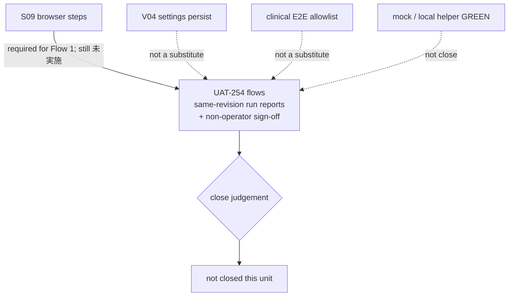

# LINMIG-231 — UAT-254 close-condition map vs S09 / V04 / clinical E2E (docs-only)

> Current task status is tracked in Plane `EMR-43`. This local document remains supporting execution/evidence material; see the [migration receipt](../plane-md-migration-20260923-receipt.md) for the crosswalk.

Campaign `linmig-ops-prep-20260919` revision 1. Unit `LINMIG-231`. Attempt `att-linmig-231-20260919-001`. Claim `claim/LINMIG-231`. Linear issue `LINMIG-231` was not found; keep as claim only.

Maps delivery close of GitHub [#254](https://github.com/MinoruSoga/AnimalEkarte/issues/254) against bound evidence cells for S09, V04, and clinical E2E. Binding sources for this unit:

- [docs/ops/testing/scenarios/UAT-254-CLOSE-CHECKLIST.md](../../ops/testing/scenarios/UAT-254-CLOSE-CHECKLIST.md)
- [docs/ops/testing/scenarios/S09-closing-time-boundaries.md](../../ops/testing/scenarios/S09-closing-time-boundaries.md)
- [docs/ops/testing/S09-FIXTURE-DESIGN.md](../../ops/testing/S09-FIXTURE-DESIGN.md)
- [docs/ops/testing/scenarios/V04-settings-master-forms.md](../../ops/testing/scenarios/V04-settings-master-forms.md)
- [docs/ops/testing/CLINICAL-E2E-DESIGN.md](../../ops/testing/CLINICAL-E2E-DESIGN.md)
- [todo-verification.md](../../../todo.md#verification-ledger) **TODO-V-S09 / TODO-V-V04 / TODO-V-CLINICAL-E2E** (and P4 row under TODO-V-RELEASE as the close umbrella)
- Supporting (not re-run): [docs/ops/testing/UAT-DOMAIN-STATUS.md](../../ops/testing/UAT-DOMAIN-STATUS.md)

Worktree `/Users/minoru/Dev/Case/AnimalHospital/AnimalEkarte-linmig-231` on `feat/linmig-231-ops-prep` at HEAD `aac697645df92fd24611c7c13bf0f7dda12a6e08`. Sheet date: 2026-09-20. Local files only.

This unit does **not** run UAT, Playwright, Docker app tests, or sign-off. **Actual run cells stay 未実行.** Fixture identity, cleanup completion, acceptance owner, and live Linear/GitHub status are **UNKNOWN** (not observed this session). Local/mock/helper GREEN is **not** a close.

## Binding rules (cited)

| Rule | Source | This unit |
|------|--------|-----------|
| local/mock の結果だけで #254 を close しない | UAT-254-CLOSE-CHECKLIST L7, L44 | Mock, local helper, unit GREEN, auth smoke, `--clinical` stub interceptor are **not** close. |
| 実 LINE、token、別担当 sign-off は USER 管理 lane | UAT-254 L8, L35–L36 | Sign-off **UNKNOWN**. E1/E2 not executed here. |
| 実行時に Linear/GitHub 外部 status と acceptance owner を確認。ignored report から推定しない | UAT-254 L9, L38, L42 | External status **UNKNOWN**. `reports/` is gitignore; absence is not 未実施/完了. |
| 証跡は `reports/uat-YYYY-MM-DD/`。環境・権限・fixture BLOCKED は bug にしない | UAT-254 L10 | No new report written. S09 BLOCKED is not a product FAIL. |
| scenario Markdown に PASS/FAIL/sign-off を書かない | UAT-254 L11, L45 | This sheet maps cells; it does not embed dated results into scenario sources. |
| 5 フローの個別 PASS に加え、同じ対象データを引き継ぐ通し結果が必要。入院/health-card で 5 フローを置き換えない | UAT-254 L15, L25 | S05/S12 are 補完確認 only. Clinical E2E allowlist is not a substitute for the 5 flows. |
| 同時刻 fixture 不足の S09 を他の PASS で代替しない | UAT-254 L19 | S09 #2–#6 remains required for Flow 1. V04 §6 persist and clinical E2E do not replace it. |
| mock lane と実 LINE lane を区別 | UAT-254 L22, L35 | Flow 4 mock is not close. |
| S10 年間 LTV/CSV は月次帳票の代替にならない | UAT-254 L23 | Flow 5 not evidenced here. |
| 過去 comment の結果を現在の結果として転載しない | UAT-254 L43 | 2026-09-05 snapshots in UAT-DOMAIN-STATUS are citations, not current close. |
| source/unit/CI とブラウザ UAT を分ける。新しい証拠未照合は UNKNOWN。前提不足は BLOCKED | todo-verification L11–L14 | This session did not run tests or UAT. |
| 準備時の実際値は「未実行」 | todo-verification L20 | All actual cells = **未実行**. |

## TODO-V correspondence (this unit)

Source: [todo-verification.md](../../../todo.md#verification-ledger) L32–L36, L93–L95, L109–L141, L157–L159.

| ID | Bound procedure (cited) | Stop / deliverable (cited) | Status in bound docs | Actual this unit |
|----|-------------------------|----------------------------|----------------------|------------------|
| P4 / #254 AUTHENTICATED-UAT | Close checklist 5 flows, real LINE/token, DB/audit, remainder vs current evidence | Same-revision run list + non-operator sign-off. Unresolved clinical-safety / accounting / isolation / auth / data-loss FAIL ⇒ No-Go | BLOCKED under TODO-V-RELEASE (L97, L157–L159) | **未実行**. This sheet maps; it does not close P4. |
| TODO-V-S09 / QA-UAT-S09-FIXTURE | Helper setup → S09 #2–#6 preview → cleanup. 5 JST times on disposable clinic. No clock/DB rewrite | Secret-stripped fixture ref, expected vs actual buckets, browser report, cleanup. STG/PROD forbidden | **BLOCKED**（fixture・対象環境待ち） L93; S09-FIXTURE-DESIGN L3/L13 browser #2–#6 未 | **未実行** |
| TODO-V-V04 / QA-UAT-V04-RETEST | Map V04 forms to 9月13日 evidence; disposable clinic; C1/C2/C3; unused delete vs in-use refuse | Form×op coverage; do not expand 4 auto tests or prior DELETE regression to all forms | **UNKNOWN** L94 | **未実行**. 9月13日 cells **UNKNOWN** (not re-read) |
| TODO-V-CLINICAL-E2E / QA-FULL-CLINICAL-E2E | `--clinical` allowlist vs DB persist / stub / 未実行. APP_ENV=test, teardown | Revision, allowlist counts, redacted report, cleanup. Stub create ≠ DB persist. Auth smoke ≠ clinical PASS | **BLOCKED**（実行条件待ち） L95; design L3 `--clinical` 未実行 | **未実行** |
| E1 / E2 | Real LSTEP write; real LINE idToken | Mock 204/toast is not PASS; mock is not real LINE | Required for P4 (L155, L160–L161) | **UNKNOWN** / **未実行** (out of S09/V04/clinical bound) |

## UAT-254 five flows vs S09 / V04 / clinical E2E

Source table: UAT-254-CLOSE-CHECKLIST L17–L25.

| Flow | Scenario / 正本 (checklist) | S09 cell | V04 cell | Clinical E2E cell | Actual this unit | Close? |
|------|----------------------------|----------|----------|-------------------|------------------|--------|
| 1. 受付 → 診察 → 検査 → 会計 → 締め（AM/PM/EMG） | V02 §8–9, S06, S02, S08, **S09**. Boundary: finalize/lock/addendum/audit, 会計完了と各締め区分。同時刻 fixture 不足の S09 を他 PASS で代替しない (L19) | **Required.** #2–#6 attribution + #7–#10 close/history still needed for 締め. Helper implemented is not PASS (S09-FIXTURE-DESIGN L5, L13, L51) | **Not a substitute.** V04 §6 is `/settings/closing-time` **form persist only**; S09 is 業務的検証正本 (V04 L138) | **Not a substitute.** Design L18: not L4 (S01–S13 / V01–V05). L37: `completed_at` ops belong to S09-FIXTURE-DESIGN, not this suite | **未実行** | **No.** S09 BLOCKED in UAT-DOMAIN-STATUS L15, L23, L90 |
| 2. 予約 → 来院 → 再予約 | V02 §7–9, reservation-to-record-flow. LINE cancel alone is not 再予約 (L20) | Not S09-owned | Reservation-type / slots forms (V04 §4–§5) are settings persist, not the visit/rebook journey | Allowlist has clinical record/search specs, **not** reservation rebook. Accounting/reservation specs are 第2 allowlist / 初回実装には入れない (design L15) | **未実行** | **No** (out of this unit's executed evidence; mapped UNKNOWN) |
| 3. トリミング受付 → 実施 → 精算 | S11 (L21) | Not S09-owned | Trimming course/option/type masters (V04 §1) are settings, not S11 精算 | Not in clinical first allowlist (design L14–L15) | **未実行** | **No** |
| 4. LINE 予約 → カルテ反映 | S04, S06, reservation-to-record-flow. Stopped after LIFF display is insufficient. Distinguish mock vs real LINE (L22) | Not S09-owned | V04 L14 / L177–L179: LINE/LSTEP settings owned by **V05**; V04 must not double-count | LIFF / real LINE **対象外** (design L16, L29, L58–L59). Compose mock LINE is forbidden as real evidence | **未実行** | **No.** Mock cannot close (UAT-254 L7, L35) |
| 5. 月次集計 → 帳票出力 | 32-accounting-reports, SECTION_14 §2.2. S10 LTV/CSV is not a substitute (L23) | Not S09-owned (S09 is AM/PM/EMG close, not monthly reports) | Company invoice §10 is not monthly reports | Not in first allowlist | **未実行** | **No** |

補完確認 (checklist L25): S05 hospitalization / S12 LIFF health **do not replace** the five flows. Clinical allowlist includes `hospitalization-flow.spec.ts` as E2E design, not as Flow 1–5 close.

## Close gate vs evidence cells

Source: UAT-254-CLOSE-CHECKLIST L29–L38. USER confirms these at close time. This session did not.

| Close-gate item | S09 evidence in bound docs | V04 evidence in bound docs | Clinical E2E evidence in bound docs | Fixture / sign-off | Actual this unit |
|-----------------|----------------------------|----------------------------|-------------------------------------|--------------------|------------------|
| 5 flow の最新 run report が同じ revision/environment contract を参照 | No same-revision S09 browser report. UAT-DOMAIN-STATUS L94–L99 cites gitignore `reports/uat-2026-09-05-r5/S09-BLOCKED.md` (not re-read) | No full V04 run on current HEAD. Domain status L175 UNKNOWN; 2026-09-05 FAIL / 2026-09-06 DELETE regression only | Design L93–L97: local `--clinical` 未実施; Linear Done not from design GREEN | **UNKNOWN** | **未実行** |
| 臨床安全・会計金額・clinic/owner/pet/staff 分離・認証権限・データ消失の製品 FAIL は Go-live 前に解消 | S09 BLOCKED is **not** product FAIL (UAT-DOMAIN-STATUS L23, L98; checklist L10) | Open product-bugs related to V04: domain status L179 「現行 open なし」 is a 2026-09-10 citation, **not** re-verified | Fail-closed clinic 1/2 reject, APP_ENV=test (design L24–L27, L68–L71) is design, not a run | **UNKNOWN** | **未実行**. This sheet does not assert 0 FAIL |
| 実 LINE lane と token health の必要証跡。mock のみでは代替しない | N/A to S09 | N/A to V04 (V05-owned) | Real LINE / idToken **禁止** (design L29, L58–L59) | Sign-off **UNKNOWN** | **未実行**. Mock ≠ close |
| DB/audit 照合、残件 disposition、実施者とは別の acceptance owner sign-off | S09 #8/#9 cite audit + `cash_register_close_adjustments` (S09 L35–L36) as **expected product behavior**, not a run receipt | C3 is form/DB persist on disposable clinic, not #254 audit pack | Stub interceptor on `medical-records-create` does **not** prove DB create (design L38) | Acceptance owner **UNKNOWN** | **未実行** |
| fixture と cleanup 完了。共有/STG 既存データを変更していない | Required: disposable clinic, clinic 1/2 excluded, cleanup token (S09-FIXTURE-DESIGN L21–L30, L103–L108; todo L111–L113) | Required: `V04` prefix disposable clinic; delete/disable after (V04 L12–L13; todo L130) | Required: synthetic clinic, teardown via runner; trap-less interrupt is not guaranteed (design L75–L80) | Fixture/cleanup **UNKNOWN** (not observed) | **未実行** |
| Linear/GitHub 外部状態を実行時に再確認 | Not queried | Not queried | Not queried | **UNKNOWN** (todo L168: 9月18日 Linear 未接続は当時記録) | **未実行** |

**Close judgement this unit: not closed.** Checklist L7/L44 plus missing same-revision 5-flow report, S09 BLOCKED, V04 UNKNOWN, `--clinical` 未実行, mock≠real LINE, sign-off UNKNOWN.

## S09 evidence cells

Sources: S09-closing-time-boundaries.md L7–L53; S09-FIXTURE-DESIGN.md L1–L13, L49–L53; todo-verification L109–L125; UAT-DOMAIN-STATUS L23, L90–L99.

Environment contract (design, not a run): local disposable clinic only; STG forbidden; AM start 09:00, AM/PM boundary 13:30, weekday end 19:00; cash-register-close attached account; no direct DB/`completed_at` UPDATE; no clock change.

### S09 steps

| # | Operation (scenario) | Expected (scenario) | Design / helper evidence | Actual this unit |
|---|----------------------|---------------------|--------------------------|------------------|
| 1 | Open `/settings/closing-time` | Range preview matches premises; AM start 09:00 immutable; holiday re-add INSERT-only 409 | Overlaps V04 §6 form persist, not S09 attribution | **未実行** |
| 2 | Close preview 午前 | Only 10:00 completion in AM | Helper 5 billings exist in code; browser #2–#6 未 (FIXTURE L13, L51) | **未実行** |
| 3 | 午後 | 14:00 in; 10:00 and 20:00 out | Same | **未実行** |
| 4 | 緊急 | 20:00 and next-day 02:00 in **same target-date EMG** (#215) | Same | **未実行** |
| 5 | 13:30:00 exactly | **PM** (half-open; boundary is PM) | Expected table todo L119–L120 | **未実行** |
| 6 | Next-day 緊急 | Next-day 02:00 **not** in next-day EMG | todo L123 | **未実行** |
| 7 | Confirm 午前 close with actual cash | Saved; over/short displayed | Append-only; cleanup = destroy clinic (FIXTURE L107) | **未実行** |
| 8 | Edit billing on closed date | Closed-period warning + required reason (#115/#189) | FE uses scheduled_date day granularity (S09 L34) | **未実行** |
| 9 | History `/accounting/close/history` | Default JST current month | — | **未実行** |
| 10 | History AM filter | AM rows including #7 | Client-side current page only (S09 L37) | **未実行** |

### Attribution expectation (TODO-V-S09 L117–L125)

Target day D, JST. Counts: AM 1 / PM 2 / EMG 2. Amounts computed independently from fixture amounts (todo L125). Do not apply these times to a real clinic's closing settings.

| Synthetic `completed_at` | Expected bucket | Actual bucket this unit |
|--------------------------|-----------------|-------------------------|
| D 10:00 | D 午前 only | **未実行** |
| D 13:30:00 | D 午後; not also 午前 | **未実行** |
| D 14:00 | D 午後 | **未実行** |
| D 20:00 | D 緊急 | **未実行** |
| D+1 02:00 | D 緊急; not D+1 緊急 | **未実行** |

S09-FIXTURE-DESIGN L3: HTTP/CLI/atomicity/staff/payment/line-item/cleanup **implemented**; browser re-run and S09 PASS **未**. L5: design and package/HTTP tests **do not** make S09 PASS. L92: declaring S09 PASS without helper is forbidden; helper without browser #2–#6 is still not PASS.

UAT-DOMAIN-STATUS L90 **BLOCKED**; L96 compose stopped at last cited browser attempt. That snapshot is **not** a current runtime observation.

## V04 evidence cells

Sources: V04-settings-master-forms.md L1–L14, L136–L150, L194–L199; todo-verification L127–L133; UAT-DOMAIN-STATUS L22, L171–L180.

V04 proves **settings/master form** input, persist, and DB uniqueness **on a disposable clinic via a real browser**. It is **not** one of the five #254 flows. Local V04 PASS would still be local/mock for close (checklist L7).

Coverage denominator (todo L133): 標準マスタ 16, 診療項目 5 tabs, 薬剤+用量, 予約区分, 予約枠, 締め時間 3 forms, シフト, lab-device, 法人 invoice. LINE/LSTEP stays V05. Current `frontend/e2e/v04-settings-master-forms.spec.ts` has **4 tests** (動物種類, 主訴, 薬剤価格保存, system 支払方法削除拒否) — auto success must not be expanded to the denominator.

| V04 surface | Bound expected | 9月13日 evidence (todo L127, L133) | Auto spec (4 tests) | Actual this unit |
|-------------|----------------|-------------------------------------|---------------------|------------------|
| §1 標準マスタ 16 SidePanels + C1/C2/C3 | Per-row C1-1, create `V04…`, C2-1–C2-3, C3-2 if unique | **UNKNOWN** (not re-read this session; 未収録 if unmapped) | 動物種類 + 主訴 only | **未実行** |
| §2 診療項目 5 tabs | Representative C1 on 診察; C2 処置; unique per tab; checkup API distinct | **UNKNOWN** | Not in the 4 tests | **未実行** |
| §3 薬剤 + dose params | PATCH must not drop other fields; dose bounds | **UNKNOWN** | 薬剤価格保存 only | **未実行** |
| §4–§5 予約区分 / 枠 | Persist + unique slots; leaf-only selector | **UNKNOWN** | Not in the 4 tests | **未実行** |
| §6 締め時間 3 forms | Form persist / 409 holiday re-add / special-period overlap 409. **Attribution = S09** (L138) | **UNKNOWN**. closing-settings GET/PATCH cited PASS r6 in UAT-DOMAIN-STATUS L176 is **not** S09 #2–#6 and not this HEAD | Not in the 4 tests | **未実行** |
| §7 シフト | Name unique; off/leave hide times | **UNKNOWN** | Not in the 4 tests | **未実行** |
| §8 lab-device item master | V04 unique owner | **UNKNOWN** | Not in the 4 tests | **未実行** |
| §9 LSTEP/LINE settings | **V05 only** — do not run or count (L14, L177–L179) | N/A here | N/A | **未実行** (out of V04) |
| §10 法人インボイス | Persist arbitrary text; no format validation | **UNKNOWN** | Not in the 4 tests | **未実行** |
| Prior 主訴 DELETE FAIL | Domain status L13, L175, L208: re-run on disposable clinic before dropping UNKNOWN. Code fix ≠ PASS | **UNKNOWN** | 4-test DELETE regression on **system payment method** is not 主訴 DELETE and not full V04 | **未実行** |

Form count: inventory 再構築中のため算定保留 (V04 L3). This sheet does not claim all forms complete.

## Clinical E2E evidence cells

Sources: CLINICAL-E2E-DESIGN.md L1–L117; todo-verification L135–L141.

Design L3: helper + allowlist 置換済み / `--clinical` **未実行** / full suite is separate approval. Design L5: local GREEN is not E2E PASS. Auth smoke success is not full-suite coverage.

Allowlist (todo L141; design L14): 10 specs under `frontend/e2e/`:

`clinical-flows`, `clinical-smoke`, `medical-records-create`, `medical-records-patient-search`, `medical-records-pagination-sort`, `examinations-flow`, `vaccinations-flow`, `checkups-flow`, `hospitalization-flow`, `estimates-flow`.

`.github/workflows/e2e.yml` remains **auth-flows.spec.ts only** (design L13, L45, L91; todo L141). Clinical/full job unwired.

| Cell | Bound fact | Actual this unit | Counts toward #254 close? |
|------|------------|------------------|---------------------------|
| Helper `internal/clinicale2e` + CLI setup/teardown | Implemented; APP_ENV=test + local DB host; clinic 1/2 rejected (design L86–L87) | **未実行** (not invoked) | No. Helper ≠ run |
| `--clinical` once | Separate approval (design L114); 未実施 (L95) | **未実行** | No until same-revision report |
| `medical-records-create` synthetic interceptor | Local fulfill; **does not prove DB create/persist** (design L38). Do not count stub as persist | **未実行** | No (stub ≠ DB/audit) |
| Auth smoke `auth-flows.spec.ts` / `e2e.yml` | Out of clinical allowlist (L13). Forbidden to treat as clinical PASS (L60) | **未実行** this unit | No |
| Full suite job on `e2e.yml` | USER; non-gating if added (L115–L116) | **未実行** | No |
| Real LINE / LSTEP | Forbidden (L58–L59) | **未実行** | No; required by close gate via E1/E2 instead |
| `completed_at` / S09 times | Explicitly **not** this suite (L37) | **未実行** | No; S09 owns it |
| Linear Done / UAT PASS 転記 | USER; design GREEN does not do it (L117) | **未実行** | No |
| Fixture/teardown | Runner teardown on spec end; no EXIT/INT/TERM trap; interrupt recovery **UNKNOWN** (L77–L80) | **UNKNOWN** / **未実行** | Close gate requires completed fixture+cleanup |

## What must not be treated as close

| Candidate | Why it is not #254 close |
|-----------|--------------------------|
| This mapping sheet | Docs-only. Actuals 未実行 |
| S09 HTTP/CLI fixture GREEN | S09-FIXTURE-DESIGN L5, L51–L53 |
| V04 4-test spec or 主訴 DELETE code fix | todo L133; UAT-DOMAIN-STATUS L208 |
| Clinical helper / allowlist 置換 / interceptor stub | design L5, L38, L113 |
| Auth smoke or `e2e.yml` success | design L5, L60; todo L141 |
| Local/mock LIFF or mock LSTEP 204/toast | UAT-254 L7, L22, L35, L44; todo L160–L161 |
| Past 2026-09-05 domain PASS rows | UAT-254 L43; UAT-DOMAIN-STATUS L29 |
| Ignored `reports/` missing in checkout | UAT-254 L9, L42 |
| S05 / S12 / clinical hospitalization spec | Checklist L25 補完; not a 5-flow replacement |
| V04 §6 closing-time persist / r6 GET/PATCH | V04 L138; not S09 #2–#6 |
| Linear `LINMIG-231` | Not found; claim only |

## Out of scope (this unit)

- Running UAT, Playwright, `--clinical`, S09 helper HTTP, V04 browser, Docker app tests
- Sign-off, Linear/GitHub status mutation, Done/close of #254
- Filling `reports/uat-YYYY-MM-DD/`
- Editing scenario sources with dated PASS/FAIL
- Campaign ledger edits
- E1 real LSTEP write, E2 real LINE idToken (mapped as UNKNOWN only)
- Declaring go-live / P8

Follow-up (not this unit): USER supplies same-revision 5-flow reports, S09 #2–#6 browser + cleanup, V04 form×C1/C2/C3 mapping of 9月13日 plus gaps, `--clinical` with persist vs stub split, real LINE/token, DB/audit, non-operator sign-off. Until then P4 / #254 stay **not closed**.

## 2026-09-28 更新（EMR-131）

> 上の節（2026-09-20 時点）以降に行われた 9/22〜9/25 の run を反映した、close 判断用の記録の**所在の索引**。実行結果・sign-off の記録ではなく、上の節の「未実行」セルは当時の記録としてそのまま残す。scenario source（[UAT-254-CLOSE-CHECKLIST](../../ops/testing/scenarios/UAT-254-CLOSE-CHECKLIST.md)）には置かない（同 checklist の Rules 5 と禁止）。現在の追跡先は Plane EMR-131（EMR-43 はその Duplicate）。repo base は `c6c3cc0a4`。
>
> - `reports/uat-*` は main checkout 上の git 管理外 report で、**repo から確認できない**（下表では「repo 外」と書く）。repo 外 report の有無を未実施 / 完了の根拠にしない（checklist の禁止 1）。
> - 各 report の日付・環境・対象は report 本文の記載を転記しただけで、本節では再実行していない。report に revision の記載がないものは「revision 記載なし」と書く。
> - close 時は USER が最新 report と Linear / Plane / GitHub の外部状態を改めて確認する（checklist の Rules 3）。
> - 実 LINE lane の準備表は [LINMIG-208](LINMIG-208.md)。

区分: **あり** = Required boundary を満たす記録の所在を確認した / **一部** = 記録はあるが boundary・対象版・lane のいずれかが欠ける / **なし** = 記録の所在を確認できない。

### 5 業務フロー

| Flow | 区分 | 確認した記録（環境・日付・参照先） | 不足 |
|:--|:--|:--|:--|
| 1. 受付 → 診察 → 検査 → 会計 → 締め | 一部 | local disposable clinic 1・2026-09-22・revision 記載なし: 同一の合成ペットで S02（検査）→ S06（確定 / lock / addendum）→ S08（会計・緊急区分の締め）まで記録がある（repo 外 `reports/uat-2026-09-22/S02-*.md` / `S06-*.md` / `S08-*.md`）。S02 手順7b/8 は権限アカウントがなく未到達、S06 手順9（audit）は USER 確認待ち、S08 はレジ締め権限を UI で補った。S09 #1–#10 は別の合成 clinic で実施（2026-09-22、repo 外 `reports/uat-2026-09-22/S09-*.md`）、#2–#6 は revision `923bb99ba` で再確認（2026-09-23、repo 外 `reports/uat-2026-09-23/s09-fixture-teardown.md`）。V02 は clinic 2・2026-09-06 の記録のみで、締めはプレビューまで（repo 外 `reports/uat-2026-09-06/v02/SUMMARY.md`）。STG 2026-09-25 は S06 手順1（draft 自動作成）で止まった（repo 外 `reports/uat-2026-09-25/zerobase-run.md`） | 受付から AM/PM/EMG 締めまで同じ対象データ・同じ revision で通した run。S02 7b/8。S06 の audit 照合。STG/UAT lane での S06 |
| 2. 予約 → 来院 → 再予約 | 一部 | V02 予約フォーム・受付 walk-in は clinic 2・2026-09-06 で入力検証までで、保存は行っていない（repo 外 `reports/uat-2026-09-06/v02/SUMMARY.md`）。予約作成から病院側カレンダーへの表示は S04 mock lane・2026-09-22 の記録のみ（repo 外 `reports/uat-2026-09-22/S04-*.md`） | 予約 → 来院受付 → カルテ連携 → 次回予約の作成と再表示を通した run（所在なし） |
| 3. トリミング受付 → 実施 → 精算 | 一部 | S11: local clinic 1・2026-09-22〜23・revision 記載なし（repo 外 `reports/uat-2026-09-23/S11-*.md`）。未請求明細の統合、単独 / 併用精算、appointment の解決までの記録がある。トリミングを「診療中」へ進める経路、明細削除後に未請求へ戻らない件、時間帯の部分重複で製品欠陥を記録（`BUG-TRIM-KANBAN-IN-CONSULTATION` / `BUG-BILLING-UNBILLED-MR-EXCLUSION` / `BUG-RES-OVERLAP-500`。Plane への対応は [移行記録](../plane-md-migration-20260923-receipt.md)）。会計待ちへは直接 PATCH で回避して進めた。STG 2026-09-25 は未実施 | 欠陥修正後に正規経路で会計待ちへ進める再実行。fixture の teardown |
| 4. LINE 予約 → カルテ反映 | 一部 | S04: mock lane・local・2026-09-22（repo 外 `reports/uat-2026-09-22/S04-*.md`）。LIFF 予約から病院側の予約一覧・カレンダー表示、キャンセルと枠の解放までの記録がある。来院受付・カルテ作成への引き継ぎの記録はない。STG 2026-09-25 は実 LINE セッションが前提のため未到達（repo 外 `reports/uat-2026-09-25/zerobase-run.md`） | 実 LINE lane で S04 → 来院受付 → カルテ作成（S06）まで通した記録。stopped/error maintenance の確認 |
| 5. 月次集計 → 帳票出力 | 一部 | `/accounting/reports` の印刷面が白紙だった記録（2026-09-23、repo 外 `reports/uat-2026-09-23/S37-*.md`）と、修正後に印刷面が白紙でないことの確認（local clinic 2・2026-09-24、repo 外 `reports/uat-2026-09-24/README.md` の EMR-205 行） | 対象月の会計集計と月次帳票・出力の突合（所在なし） |

### Close gate 対応

C-* の ID は本節で定義する呼び名で、[UAT-254-CLOSE-CHECKLIST の Close gate](../../ops/testing/scenarios/UAT-254-CLOSE-CHECKLIST.md#close-gate) の各項目に 1 対 1 で対応する（checklist 本文には ID を持たせない）。

| ID | Close gate 項目 | 区分 | 確認した記録 | 不足 |
|:--|:--|:--|:--|:--|
| C-MATRIX | 5 flow の最新 run report が同じ revision / environment contract を参照する | なし | 上表の記録は 2026-09-06〜09-25 の別 run で、clinic（1 / 2 / 合成）も lane（local / mock / STG）も異なる。revision の記載は clinical E2E と S09 の再確認（`923bb99ba`）だけ | 同一 revision・同一環境契約での 5 flow run 一覧 |
| C-LINE | 実 LINE lane の証跡（mock で代替しない） | なし | S04 / S12 / V05 は mock lane の記録のみ（repo 外 `reports/uat-2026-09-22/S04-*.md`、`reports/uat-2026-09-23/S12-*.md`、`reports/uat-2026-09-06/v05/SUMMARY.md`）。STG 2026-09-25 では人間レーンとして未実施。LINMIG-208 の実行欄は未記入 | E2 の実施。実 LINE での S04 / S12（実機 2 台による隔離を含む） |
| C-TOKEN | token health の証跡 | なし | S12 手順3後半・手順4 と V05 `liff-account-link` は、mock では idToken の検証より先へ進めない（repo 外の同上 report） | 正規 idToken で link → 再連携 409 → 無効 / 期限切れ linkToken の 400 系をケースごとに残す receipt（token 値・URL は残さない） |
| C-AUDIT | DB / audit の照合 | 一部 | S08 の `audit_logs` 行 ID と S09 の `cash_register_close_adjustments` 行 ID の記録（local・2026-09-22、repo 外）。S06 手順9、S12 の連携 audit、STG の audit は USER 確認待ち | USER による `audit_logs` の read-only 照合（S01 手順6、S03、S06 手順9、S12） |
| C-RESIDUAL | 残件の disposition（製品 FAIL の Go-live 前解消 / 受容つき延期、fixture cleanup） | 一部 | 9/22〜23 の UAT で確認した製品欠陥は [移行記録](../plane-md-migration-20260923-receipt.md) で Plane の work item に対応づけ済み。延期する場合の受容条件と USER の明示受容は repo 内に記録がない。cleanup 未完の記録: S09 の合成 clinic 2 件、S11・S12 の fixture、STG 2026-09-25 の run sheet（いずれも repo 外 report に記載） | 残件ごとの disposition（Go-live 前に解消 / 受容条件 + USER 受容）。fixture cleanup の完了記録 |
| C-SIGNOFF | 実施者以外の acceptance owner の sign-off | なし | 所在なし | acceptance owner の決定と sign-off |

### 関連シナリオ・関連 ticket

| 対象 | 関連 | 区分 | 確認した記録 | 位置づけ |
|:--|:--|:--|:--|:--|
| [S01](../../ops/testing/scenarios/S01-deceased-pet-guard.md) の LSTEP タグ同期 / [V05-13〜17](../../ops/testing/scenarios/V05-auth-line-forms.md) | E1 = EMR-132 | なし | S01 手順6（LSTEP）は local 2026-09-22 でも STG 2026-09-25 でも対象外 / USER とされている（repo 外） | 承認済みの実 LSTEP write 対象が必要 |
| [V05](../../ops/testing/scenarios/V05-auth-line-forms.md) の実 LINE 連携 | E2 = EMR-133 | なし | V05 は clinic 2・2026-09-06 の mock の記録のみ（repo 外 `reports/uat-2026-09-06/v05/SUMMARY.md`） | C-LINE / C-TOKEN の本体 |
| [S09](../../ops/testing/scenarios/S09-closing-time-boundaries.md) | EMR-126 | 一部 | Flow 1 の行のとおり。teardown が失敗する件は `BUG-S09-FIXTURE-TEARDOWN` として記録 | Flow 1 の締め境界。他の PASS で代替しない |
| [V04](../../ops/testing/scenarios/V04-settings-master-forms.md) | EMR-127 | 一部 | local clinic 2・2026-09-23 の再テスト。予約区分パネルで製品欠陥 2 件を記録（repo 外 `reports/uat-2026-09-23/v04-retest/README.md`） | 前提マスタの確認で、5 flow の代替ではない |
| clinical E2E（[CLINICAL-E2E-DESIGN](../../ops/testing/CLINICAL-E2E-DESIGN.md)） | EMR-60 / EMR-128 | 一部 | revision `923bb99ba`・2026-09-23 の `--clinical` 実行で、40 件中 7 件が spec 側の不一致で green にならなかった（repo 外 `reports/uat-2026-09-23/clinical-e2e-emr128/README.md`）。その後の spec 修正を含めた再実行の記録は所在なし | L4 と 5 flow の代替ではない |

### 不足操作（担当別）

| 担当 | 操作 |
|:--|:--|
| agent（local disposable・合成 fixture。共有 / STG の既存データは変更しない） | 同一 revision で Flow 1・3・5 の通し run を取得し、S02 / S06 / S08 / S09 / S11 と月次帳票の突合を同じ対象データでつなぐ。V02 §7–9 を現行 scenario で実施する。S09 teardown の修正後に合成 clinic を cleanup する |
| QA（人手のブラウザ操作・権限別アカウント） | S02 手順7b/8（view-only と確定解除権限のアカウント）。STG lane での S06 再実行（draft 自動作成が止まった件の切り分け後）。スタッフ職種を設定したあとの STG 予約系（Flow 2）。帳票の実機印刷（S33 / S37） |
| 医院 | 医院 UAT（EMR-109 / EMR-110）で実業務の通し確認 |
| 実 LINE | E1（EMR-132）の実 LSTEP write。E2（EMR-133）の idToken / linkToken ケース。実 LINE で S04 → 来院受付 → カルテ作成。S12 の実機 2 台での隔離 |
| sign-off / USER | `audit_logs` の read-only 照合。残件の disposition と受容記録。fixture cleanup 完了の確認。clinical E2E を CI で手動実行する承認。外部状態の再確認。実施者以外の acceptance owner による sign-off |
