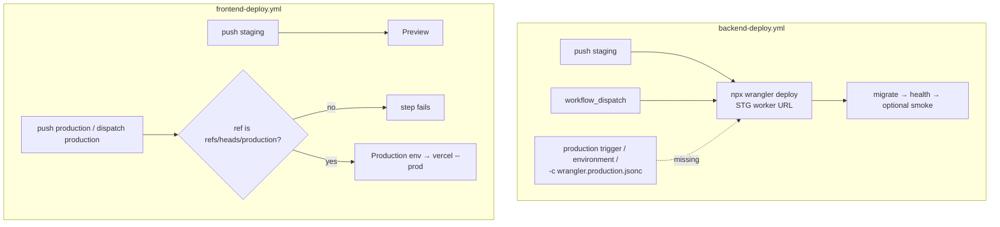

# LINMIG-232 — Production CI/CD gap sheet (docs-only)

> Current task status is tracked in Plane `EMR-44`. This local document remains supporting execution/evidence material; see the [migration receipt](../plane-md-migration-20260923-receipt.md) for the crosswalk.

Campaign `linmig-ops-prep-20260919` revision 1. Claim ID `LINMIG-232` (Linear issue not found; keep as claim only). Maps to [todo-operations.md](../../../todo-operations.md) P2 / GitHub [#253](https://github.com/MinoruSoga/AnimalEkarte/issues/253).

Worktree: `/Users/minoru/Dev/Case/AnimalHospital/AnimalEkarte-linmig-232` on `feat/linmig-232-ops-prep` at HEAD `aac697645df92fd24611c7c13bf0f7dda12a6e08`. Sheet date: 2026-09-19. Repo evidence only. No workflow, wrangler, Terraform, secret, deploy, migrate, or Linear Done change was applied.

Truth source order used: checked-in workflow YAML and wrangler configs over docs. Where docs and YAML agree, both are cited. External GitHub Environment protection, billing, DNS, DB, R2, Vercel reviewers, backup, and restore success are **UNKNOWN** (not observed this session).

## 1. Current `backend-deploy.yml` trigger and job

Source: [.github/workflows/backend-deploy.yml](../../../.github/workflows/backend-deploy.yml).

| Surface | Current HEAD | Citation |
|---|---|---|
| Workflow name | `Backend Deploy` | L4 |
| Push trigger branches | `staging` only. No `production` branch | L6–L10 |
| Push paths | `backend/**`, this workflow, root `package.json`, `pnpm-lock.yaml` | L11–L14 |
| Manual trigger | `workflow_dispatch:` with **no** environment / config / Worker inputs | L15 |
| Job | single job `deploy` / `Deploy Backend to Cloudflare` | L25–L29 |
| GitHub Environment | **absent**. `rg environment:` on this file is empty | no `environment:` key |
| Worker URL | hardcoded STG `https://animalekarte-stg-api.baritech-soga.workers.dev` | L20–L22 |
| Deploy command | `npx wrangler deploy` from `backend/` (default `wrangler.jsonc`) | L60–L67 |
| Production config flag | **absent**. No `-c wrangler.production.jsonc` | L67 vs [setup.md](../../ops/infra/production/setup.md) §6 item 4 |
| Post-deploy order | deploy → migrate (`cf-run-migrate.sh`) → `/health` poll → optional CRUD smoke | L62–L138 |
| Smoke credentials | `STG_DEMO_EMAIL` / `STG_DEMO_PASSWORD`; `continue-on-error: true` | L126–L138 |

`workflow_dispatch` on this file does not select production. Dispatching the current workflow on any ref still deploys the STG Worker URL and default wrangler config ([CI-CD-PIPELINE.md](../../ops/deploy/CI-CD-PIPELINE.md) §1–§2).

## 2. Current `frontend-deploy.yml` Production Environment

Source: [.github/workflows/frontend-deploy.yml](../../../.github/workflows/frontend-deploy.yml).

| Surface | Current HEAD | Citation |
|---|---|---|
| Push branches | `staging` and `production` | L4–L7 |
| Manual trigger | `workflow_dispatch.inputs.environment` choice `preview` / `production` (default `preview`) | L11–L20 |
| Job Environment expression | `Production` when dispatch input is `production` **or** push to `refs/heads/production`; otherwise `Preview` | L33–L35 |
| Non-production ref guard | step fails if input is `production` and `github.ref != refs/heads/production` | L41–L45, L76–L80 |
| Build env | `VERCEL_ENV` / `VITE_VERCEL_ENV` set to `production` or `preview`; `--prod` only for production | L73–L124 |

[setup.md](../../ops/infra/production/setup.md) §1 already cites this frontend binding: `frontend-deploy.yml` binds `Production` and rejects production dispatch from non-production refs. That is a **checked-in workflow fact**. Whether GitHub Environment `Production` currently has Required reviewers, which refs it allows, and whether Vercel production settings match, is **UNKNOWN** (not queried this session).



## 3. `wrangler.production.jsonc` vs default STG config

| Item | STG `backend/wrangler.jsonc` | Production draft `backend/wrangler.production.jsonc` | Selected by `backend-deploy.yml`? |
|---|---|---|---|
| File role | STG source of truth | Draft; placeholders remain | Default deploy uses STG file only (L67 `npx wrangler deploy`) |
| Worker `name` | `animalekarte-stg-api` (L24) | `animalekarte-prod-api` (L44) | STG name |
| `workers_dev` | `true` (L32) | `false` (L58) | STG |
| Route | `api.stg.noah-karte.com/*` | `api.noah-karte.com/*` | STG |
| `APP_ENV` | `"staging"` (L49) | omitted (`rg APP_ENV` hits only STG file) | STG |
| `SCHEDULER_ENVIRONMENT` | `staging` | `production` | STG |
| R2 bucket | `animalekarte-stg-images` | `animalekarte-prod-images` | STG |
| `S3_PUBLIC_BASE_URL` | STG-valued in STG file | empty string placeholder (L100–L102) | STG |
| `TRUSTED_PROXY_CIDR` | STG-measured `10.1.0.0/32` | same literal, marked unverified for production (L80–L84) | STG |
| Deploy invocation required by comments | `npx wrangler deploy` | `wrangler deploy -c wrangler.production.jsonc` (L40–L41) | STG command only |

Checked-in production wrangler is a **draft**, not evidence that the Worker, route, R2 bucket, secrets, or DNS exist ([setup.md](../../ops/infra/production/setup.md) opening paragraph).

Related: [.github/workflows/worker-secret-sync.yml](../../../.github/workflows/worker-secret-sync.yml) is STG-only (`animalekarte-stg-api`, `STG_DB_*`). It is not a production secret-scope path.

## 4. setup.md §1 and §6 acceptance mapping

Sources: [setup.md](../../ops/infra/production/setup.md) §1 (L8–L18) and §6 (L56–L68). Review SHA named in setup §6: `7c6592f9f` (2026-09-06). This worktree HEAD is `aac697645`; backend-deploy production gaps below still match that review.

### §1 Fail-closed preconditions

| §1 requirement | Repo evidence this session | Status |
|---|---|---|
| Target account/zone/project and billing approved | Not queried | UNKNOWN |
| Production DB, role, backup/restore owner, R2, DNS, certificate verified | Not queried | UNKNOWN |
| GitHub Environment with required reviewers; exact case-sensitive name matches workflow | Backend workflow has no `environment:` key. Frontend expression uses `'Production'` / `'Preview'`. Live protection/reviewers not queried | Backend missing in YAML. Frontend name present in YAML. Live Environment/reviewers UNKNOWN |
| Production secrets environment-scoped; staging values not reused unless approved | Workflow uses repo `secrets.CLOUDFLARE_API_TOKEN` and `MIGRATE_RUN_SECRET` with no Environment binding. Values not read | Secret **scope in YAML**: missing Environment gate. Live values UNKNOWN (not read) |
| Frontend production settings; `VERCEL_ENV=production` API selection | Workflow implements Production Environment + ref guard. Live Vercel project / reviewers / deployed target not queried | Workflow present. Deployed target UNKNOWN |
| Workflow/config tests and `actionlint` green on the reviewed change | No workflow file changed this unit. `actionlint.yml` exists for PRs that touch `.github/workflows/**`. This session did not run GitHub Actions | UNKNOWN for current main/CI green |
| Current Linear delivery state and go-live date confirmed externally | Linear `LINMIG-232` not found. Go-live window in GOLIVE runbook is unfilled | UNKNOWN |

Stop rule in setup §1: do not infer runtime state from the draft. This sheet follows that rule.

### §6 Deployment workflow acceptance

| # | Acceptance criterion | Current `backend-deploy.yml` | Current `frontend-deploy.yml` | Gap |
|---|---|---|---|---|
| 1 | Production trigger enabled **after** Environment protection exists | Push = `staging` only. `workflow_dispatch` has no production selector | Push includes `production`. Dispatch input `production` exists | Backend production trigger **missing**. Frontend trigger present. Whether backend protection exists **before** a future trigger is UNKNOWN |
| 2 | Production job binds the exact protected GitHub Environment | No `environment:` | Binds `Production` or `Preview` via expression L35 | Backend Environment gate **missing**. Frontend binds `Production`. Live protection UNKNOWN |
| 3 | Staging uses `npx wrangler deploy` | Present L67 | N/A (Vercel) | Present for backend STG |
| 4 | Production uses `npx wrangler deploy -c wrangler.production.jsonc` | Not present | N/A | **missing** |
| 5 | Environment-specific Worker URL and secret scope selected explicitly | `WORKER_URL` is STG workers.dev. Secrets are unscoped repo secrets | Vercel env `preview` vs `production`; GitHub Environment name switches | Backend URL/secret scope **missing**. Frontend env selection present; live Vercel/GitHub secret scope UNKNOWN |
| 6 | Workflow tests and `actionlint` pass | Not executed this session | Not executed this session | UNKNOWN |
| 7 | Order **deploy → migrate → `/health` → optional smoke** | Present for the STG job | Vercel pull/build/prebuilt deploy; no CF migrate | Backend STG order present. Production job that would reuse this order **does not exist** |

setup.md L68: at `7c6592f9f`, `backend-deploy.yml` lacks the production trigger/Environment gate; a production workflow invocation is **not runnable** until implementation is merged and verified. That statement still holds on this HEAD.

## 5. GOLIVE_RUNBOOK item 3 and runbook restore/rollback

[GOLIVE_RUNBOOK.md](../../delivery/GOLIVE_RUNBOOK.md) §1 item 3 (L36) requires:

| Item 3 sub-clause | Repo / this session | Status |
|---|---|---|
| (a) Production CF foundation built | Draft wrangler + `infra/cloudflare/production/` exist as drafts only | UNKNOWN (not applied/verified) |
| (b) Workflow `environment:` plus same-named GitHub Environment + Required reviewers (2026-08-20 observed name `Production`; re-check on the day) | Backend has no `environment:`. Frontend uses `Production`. Live reviewers not queried | Backend missing. Frontend YAML name present. Reviewers UNKNOWN |
| (c) Production workflow applied | Backend production path unimplemented | missing |
| (d) STG is main→staging automatic; production cannot start without approval | Backend: staging push auto-deploys with **no** Environment approval job. Production backend path absent | STG auto-deploy present; production approval gate **missing** on backend |
| (e) CF-only rollback procedure | [runbook.md](../../ops/infra/production/runbook.md) §3 documents `gh workflow run backend-deploy.yml --ref "$ROLLBACK_REF"` **after** setup is implemented | Procedure drafted. Runnable production rollback **missing**. Execution evidence UNKNOWN |
| (f) backup/restore rehearsal record | runbook §4: acquisition is HOLD until a human-approved method is recorded | UNKNOWN (no dated owner/method/target/checksum/restore link observed) |
| (g) latest main CI green with run URL/ID, commit, time | Not queried | UNKNOWN |

### Restore / rollback evidence cells

| Contract | Where specified | Observed evidence this session |
|---|---|---|
| Rollback `GOOD_SHA` / `headSha` equality | runbook §3 L24–L40 | UNKNOWN — no production Actions run inspected |
| Environment approval on rollback dispatch | runbook §3 L40 | UNKNOWN — backend job has no Environment binding |
| Rollback uses `wrangler.production.jsonc` | runbook §3 L40 | UNKNOWN / currently impossible: workflow never passes `-c wrangler.production.jsonc` |
| Migration compatibility reviewed before rollback | runbook §3 L40–L42 | UNKNOWN |
| Backup owner, method, target identity, destination, timestamp, size, SHA-256, retention, receipt, restore-rehearsal link | runbook §4 L43–L46 | UNKNOWN — all fields unobserved; missing any field is No-Go per runbook |
| Isolated restore host/db assertion | runbook §4 L50–L57 | UNKNOWN — example commands were not executed |

Do not treat the runbook text as a completed rehearsal.

## 6. Provider and billing facts (do not invent)

The following were **not** queried via GitHub API, Cloudflare, PlanetScale, Vercel, or billing consoles:

- GitHub Environment existence, Required reviewers, wait timer, deployment branches
- Whether `Production` / `Preview` names currently match live Environments
- Cloudflare account/zone/Worker/route/R2 live objects
- PlanetScale production database/role/backup
- Vercel production project env and API target of a live deployment
- Billing / contract approval
- Notification policy delivery

Historical notes in [CI-CD-PIPELINE.md](../../ops/deploy/CI-CD-PIPELINE.md) §5 (2026-07 billing failure, 2026-08-20 empty reviewers) are **history**, not current failure claims.

## 7. Change proposal (documentation only — not applied)

Do not copy this as an auto-applied patch. Do not enable a production trigger until a human records that a GitHub Environment with required reviewers exists and its exact name will match the workflow ([setup.md](../../ops/infra/production/setup.md) §6 item 1). Implement and review against current HEAD in a later unit. Keep STG behavior unless that unit explicitly changes it.

### 7.1 Intended backend contract

1. Keep current STG path: `on.push.branches: [staging]` + `npx wrangler deploy` (no `-c`), `WORKER_URL` = STG, order deploy → migrate → `/health` → optional STG smoke.
2. Add a **separate** production invocation path only after Environment protection evidence exists:
   - trigger: `push` to `production` (path-filtered like STG) and/or `workflow_dispatch` input that cannot default to production;
   - reject production from any ref other than `refs/heads/production` (mirror frontend L41–L45);
   - job `environment:` set to the **exact** protected Environment name confirmed by the operator (frontend currently writes `Production`; do not assume live reviewers from that string);
   - `npx wrangler deploy -c wrangler.production.jsonc` from `backend/`;
   - production `WORKER_URL` (example target from draft route: `https://api.noah-karte.com`) selected explicitly, not the STG workers.dev URL;
   - secrets must resolve from the protected Environment, not reused STG values unless explicitly approved;
   - production smoke must not use `STG_DEMO_*`; optional synthetic account with owner/expiry/cleanup only;
   - same step order: deploy → migrate → `/health` → optional smoke;
   - fail closed if production config, Environment name, or Worker URL is unset.
3. Verification for that later unit: scoped workflow tests if the repo already has them, plus `actionlint` on `.github/workflows/**` via [.github/workflows/actionlint.yml](../../../.github/workflows/actionlint.yml). This unit did not modify workflows, so those checks were not required here.
4. Placeholders in `wrangler.production.jsonc` (`TRUSTED_PROXY_CIDR` post-deploy measure, `S3_PUBLIC_BASE_URL`, omitted `APP_ENV`) remain operator work. Do not treat the draft file as go-live ready.
5. Rollback: only after the production path exists, runbook §3 dispatch must land on a run whose `headSha` equals `GOOD_SHA` and whose config is `wrangler.production.jsonc`. Current YAML cannot satisfy that.
6. Backup/restore rehearsal remains a human external record (runbook §4). This proposal does not invent dump destinations or credentials.

### 7.2 Illustrative YAML shape (NOT CHECKED IN)

Sketch only. Names in comments must be replaced with the operator-confirmed Environment string. Do not merge from this sheet.

```yaml
# PROPOSAL ONLY — not present in .github/workflows/backend-deploy.yml
on:
  push:
    branches: [staging]  # production push added only after Environment protection exists
    paths: [backend/**, .github/workflows/backend-deploy.yml, package.json, pnpm-lock.yaml]
  workflow_dispatch:
    inputs:
      target:
        type: choice
        default: staging
        options: [staging, production]

jobs:
  deploy:
    # STG: no Environment binding today. Production: environment: <exact protected name>
    # Production deploy: npx wrangler deploy -c wrangler.production.jsonc
    # Production WORKER_URL: environment-specific; never STG workers.dev
```

### 7.3 Explicit non-goals of this unit

- Did not edit `.github/workflows/*`, wrangler configs, or Terraform.
- Did not enable production, run deploy/migrate/`secret put`, push, or Linear Done.
- Did not claim GitHub Environment or billing state.

## 8. Gap summary

| Gap | Present / missing / UNKNOWN |
|---|---|
| Backend production trigger | missing |
| Backend GitHub Environment gate | missing |
| `npx wrangler deploy -c wrangler.production.jsonc` | missing |
| Backend environment-specific Worker URL / secret scope | missing |
| Staging `npx wrangler deploy` + deploy→migrate→health→optional smoke | present |
| Frontend `Production` Environment expression + non-production ref reject | present (YAML). Live reviewers UNKNOWN |
| `backend/wrangler.production.jsonc` draft file | present (draft, not applied) |
| actionlint / workflow tests green on a production-enablement change | UNKNOWN (no such change in this unit) |
| Restore/rollback dated evidence | UNKNOWN |
| Billing, DNS, DB, R2, Vercel production target | UNKNOWN |

Production backend deploy through the current workflow is **not runnable**. This sheet is the P2 / #253 local gap record only.
