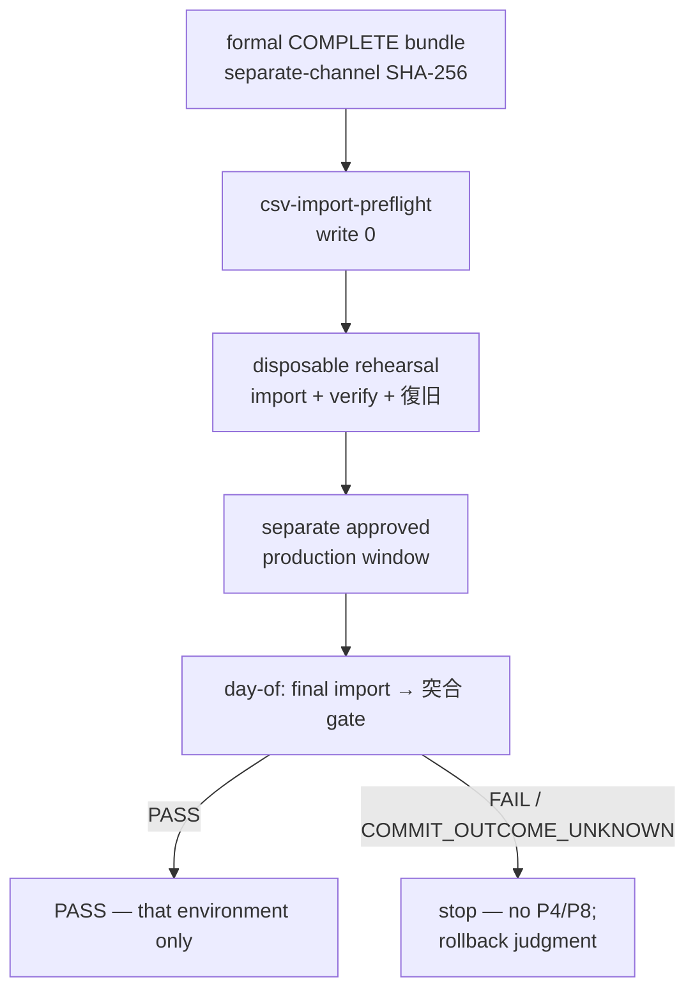

# LINMIG-234 — Formal migration-bundle, 突合, rehearsal, and restore-prep (docs-only)

> Current task status is tracked in Plane `EMR-46`. This local document remains supporting execution/evidence material; see the [migration receipt](../plane-md-migration-20260923-receipt.md) for the crosswalk.

Campaign `linmig-ops-prep-20260919` revision 1. Unit `LINMIG-234`. Attempt `att-linmig-234-20260919-001`. Claim `claim/LINMIG-234`. Linear issue `LINMIG-234` was not found; keep as claim only. Prompt SHA `bdada2092c3a10d8cff133231a392e1c33b688349e96a49c053f1af7f04dffda`.

Maps to [todo-operations.md](../../../todo-operations.md) **P3 / PROD-DATA-MIGRATION** and GitHub [#250](https://github.com/MinoruSoga/AnimalEkarte/issues/250). Binding sources:

- [todo-operations.md](../../../todo-operations.md) P3 (L30, L72, L171–L175)
- [docs/ops/deploy/CLINIC_CSV_IMPORT.md](../../ops/deploy/CLINIC_CSV_IMPORT.md)
- [docs/ops/deploy/OLD_DB_HANDOFF_LOCAL.md](../../ops/deploy/OLD_DB_HANDOFF_LOCAL.md)
- [docs/delivery/GOLIVE_RUNBOOK.md](../../delivery/GOLIVE_RUNBOOK.md) **§1 item 4** Access データ移行の事前準備 (L37)
- [docs/ops/infra/production/runbook.md](../../ops/infra/production/runbook.md) **§4 Backup/restore rehearsal** (title L44; procedure is that runbook, not this sheet)

Worktree `/Users/minoru/Dev/Case/AnimalHospital/AnimalEkarte-linmig-234` on `feat/linmig-234-ops-prep` at HEAD `aac697645df92fd24611c7c13bf0f7dda12a6e08`. Sheet date: 2026-09-20. Local files only.

This unit does **not** import CSV, apply DB, run `make csv-import*`, run `make reset`, run F8 G4, start Docker, or edit the campaign ledger. **Rehearsal PASS is not production done.**

## Current bundle receipt

**UNKNOWN.** This session did not receive or inspect a current formal COMPLETE producer bundle, `clinic-migration-run-report.json`, live `manifest.json`, or current `_old_db_handoff/<clinic>/` tree.

| Item | This session |
|------|----------------|
| Formal COMPLETE producer bundle receipt | **UNKNOWN** / CLINIC_CSV_IMPORT.md L189 **未記入**（受領記録なし） |
| Manifest SHA-256 (separate-channel) | **UNKNOWN** — do not invent; do not take a self-declared value from a source directory (CLINIC_CSV_IMPORT.md L81) |
| Run ID / producer status / `handoffEligibility` | **UNKNOWN** — OLD_DB_HANDOFF_LOCAL.md L108 does not pin them |
| `payments.csv` / `payment_splits.csv` positive counts | Current KNJO documented as header-only (CLINIC_CSV_IMPORT.md L7, L190). Live current files not inspected → **UNKNOWN**; formal apply remains **BLOCKED** until a verified KNJO formal bundle has positive counts |
| Files under `_old_db_handoff/<clinic>/` | Not inspected. Presence alone does **not** prove formal eligibility (OLD_DB_HANDOFF_LOCAL.md L110) |
| P2 production-setup receipt | **UNKNOWN** (P3 step 1 requires collating P2; this unit does not invent it) |
| Named operators / 本番 window / 入力停止承認 | **UNKNOWN** |
| Linear `LINMIG-234` | Not found |

Do not treat older “未構築 / 未受領” wording as a current fact (todo-operations.md L5). Confirm before any later re-run.

## Formal-bundle necessities (prep; no import)

Sources: CLINIC_CSV_IMPORT.md L5–L7, L20–L46, L53–L56, L81–L88, L90–L102; OLD_DB_HANDOFF_LOCAL.md L36–L38, L96–L102, L110.

A formal F6 cutover candidate is hospital/run-fixed `manifest.json` + 21 AnimalEkarte-shaped CSVs. The consumer does not connect to `old_db` and does not write `backend/migrations/seeds/`.

Accept for **formal** `make csv-import` preflight only when **all** of the following hold (unknown fields rejected). This sheet records the contract; it does not assert a live match.

1. Manifest SHA-256 from `clinic-migration-run-report.json` via a **separate channel** (CLINIC_CSV_IMPORT.md L81).
2. Manifest `PASS`, stage `animalekarte_stage`, clinic code/ordinal, run ID, 10M ID band, **21-table fixed order**, per-CSV SHA-256 (L82).
3. Manifest schema version; approved stage mapping bundle (`020_canonical.sql` + `030_stage.sql`) / CSV contract SHA-256 (L82).
4. `handoffEligibility=TRUSTED_CANDIDATE` and completeness `PASS` (L82; OLD_DB_HANDOFF_LOCAL.md L38).
5. Verified source identity; explicit empty incomplete-table list; stage build UUID; DB1/DB2/DB3 summary digests + generation order; base-load/KNJO evidence digests (L82).
6. **Positive row counts** for `payments` and `payment_splits` (L7, L82, L190). Header-only KNJO fails preflight.
7. Source directory `0700`; manifest/CSV `0600`; **no symlinks** (L83). Size limits fail-closed (L84).
8. Six target seed IDs explicit (active clinic, species fallback, 検査, trimming, cash, credit_card) — no implicit name/first-row resolution (L85, L96–L101).
9. Target ID band empty on all 21 tables before apply; no delete/replace of existing rows (L86).
10. PHI may be in CSV/manifest: no cell values in git, logs, reports, Issues, or this sheet (L88; todo-operations.md L13).

`REHEARSAL_ONLY` / `PARTIAL` may sit under `backend/migrations/seeds/_old_db_handoff/<clinic>/` as **local isolation only**; formal `make csv-import` preflight **rejects** them (CLINIC_CSV_IMPORT.md L53–L56; OLD_DB_HANDOFF_LOCAL.md L37). `UNVERIFIED` is also local-only (`--allow-local-rehearsal`) and is not passed to formal F6 preflight (OLD_DB_HANDOFF_LOCAL.md L86, L110). Do not copy the 21 CSVs into `003_demo` as migrate seed (OLD_DB_HANDOFF_LOCAL.md L43).

Local placement (USER later; not this session): `make old-db-handoff-stage` then `make old-db-handoff-check` after `CLINIC_CODE` / `MIGRATION_RUN_ID` / `CSV_IMPORT_SOURCE_DIR`, with `_old_db_handoff/` in checkout-local `.git/info/exclude` (OLD_DB_HANDOFF_LOCAL.md L49–L74). Printed SHA is transferred as `CSV_MANIFEST_SHA256` on a **separate** path for formal import (L76–L77). This session runs neither command.

### 21-table formal cutover v1 (operator summary)

Canonical: `csvimport.CutoverTableSpecs()`. Operator table: CLINIC_CSV_IMPORT.md L20–L46.

| # | target | isolation |
|---:|--------|-----------|
| 1–6 | staffs, procedures, merchandise_items, owners, pets, medical_records | clinic_id_column |
| 7–8 | inquiries, clinical_plans | id_band_and_parent_fk |
| 9–12 | vital_records, appointments, appointment_trimming_details, billings | clinic_id_column |
| 13 | billing_items | id_band_and_parent_fk |
| 14–15 | payments, payment_splits | clinic_id_column |
| 16–21 | estimates, estimate_items, exams, exam_results, vaccines, vaccinations | clinic_id_column or id_band_and_parent_fk as in L25–L46 |

## 突合 (reconciliation) — method locked; not executed

P3 step 1 locks 対象・操作者・入力停止・backup/rollback・**突合方法** before a run (todo-operations.md L173). Deliverable is 件数・clinic・参照・金額 突合 for the **same manifest/revision**, plus 復旧判断 (L175). Remaining-work row: 件数・医院・金額突合 (L72).

### Consumer verify (read-only)

```sh
make csv-import-verify
```

REPEATABLE READ snapshot: manifest counts, clinic assignment, 6 seeds, BIGINT/sequence contract, payment↔split parentage, method seeds, amounts, completed billing/payment pairing, split totals/received/change. Does not mutate target data. Non-empty band is not an error on verify. Citations: CLINIC_CSV_IMPORT.md L50, L150–L156.

Preflight (write 0) is `make csv-import-preflight` (L48, L120–L126). Apply is `make csv-import TARGET_DB_NAME=<exact-db-name>` (L128–L146). **This session runs none of these.**

### Day-of 突合 (GOLIVE; not this session)

GOLIVE item 4: リハーサル PASS and 最終 import 手順・担当・入力停止・backup/rollback・突合方法 approved; **最終 production import と突合 PASS は day-of gate** (GOLIVE_RUNBOOK.md L37). Item 4 status: **（確定待ち: 当日実行前の準備 evidence）**.

T+0:00 = Access 入力停止宣言 (L51). Day-of sequence (prep citation only):

| Offset | Work | Done check | Citation |
|--------|------|------------|----------|
| T+0:15 | Access 最終データ抽出（#250） | 抽出ファイル受領 | GOLIVE L57 |
| T+0:30 | 本番 DB 事前バックアップ | repo 外 artifact, size, checksum, retention, restore rehearsal PASS recorded | GOLIVE L58 |
| T+0:45 | 最終データ移行（#250） | ジョブログ・エラー行 0 | GOLIVE L59 |
| T+1:15 | **Day-of gate** 突合: テーブル別件数・`clinic_id` 別件数・金額合計・サンプル目視 | 最終 import と検証レポート PASS; else T+3:00 No-Go | GOLIVE L60 |

P3 production order (separate approved window): 入力停止 → 最終抽出/差分 → backup → 最終 import → verify (todo-operations.md L174).

Representative-data manual 突合: CLINIC_CSV_IMPORT.md L192 **未記入** (USER). This session does not invent samples or counts.

## Rehearsal (prep; not executed; not production)

External-start conditions for P3 (todo-operations.md L30): `rehearsal/復旧成功`, `本番window`, `入力停止・最終import承認`. Until those exist, the row stays BLOCKED/UNKNOWN (L35). P3 status remains **前提・実施証拠待ち** (L72).

Disposable first (todo-operations.md L174): approved disposable **preflight / import / verify** and **復旧 rehearsal** before any production window.

CLINIC_CSV_IMPORT.md L183–L202 (#250 / BRT-42): **cutover 実行と架空 COMPLETE bundle は禁止.** Formal COMPLETE bundle 受領 is **未記入**. Production cutover **しない** in that lane (L18, L193).

USER rehearsal order **after** a real COMPLETE receipt (not this session):

1. Keep bundle outside repo; no PHI in git/Issues.
2. `make csv-import-preflight` (write 0).
3. Isolated-DB F8 G4; **no production CSV** ([F8_G4_FAILURE_REHEARSAL.md](../../ops/deploy/F8_G4_FAILURE_REHEARSAL.md); CLINIC_CSV_IMPORT.md L180–L181, L191, L199).
4. Isolated rehearsal apply (shared STG/PROD only after approval). `make stg-uat-handoff` is 城東・敷島・箱 only; 八王子 out of scope (OLD_DB_HANDOFF_LOCAL.md L39–L40).
5. `make csv-import-verify` (read-only).
6. Production cutover is a **separate** gated USER job after #253/#254/#255.



Local `make reset` auto-import of `_old_db_handoff` (including `REHEARSAL_ONLY` / `UNVERIFIED` with `--allow-local-rehearsal`) is **local APP_ENV only** and does **not** change formal F6 gates or authorize shared STG/PROD (OLD_DB_HANDOFF_LOCAL.md L83–L88). This session does not run `make reset`.

**Do not treat rehearsal PASS as production completed** (todo-operations.md L175). GOLIVE item 4 rehearsal PASS is pre-window prep evidence, not day-of import/突合 PASS (GOLIVE L20, L37). Restore rehearsal PASS at T+0:30 is backup-gate evidence, not a production restore (GOLIVE L58, L76–L84).

## Restore / rollback prep (no restore run)

| Case | Required behavior | Citation |
|------|-------------------|----------|
| Formal in-tx apply failure | Data auto-rollback; report `FAILED_DATA_ROLLED_BACK` | CLINIC_CSV_IMPORT.md L161 |
| Lost commit ack / crash / `STARTED` report | `COMMIT_OUTCOME_UNKNOWN`. Stop re-run, backup restore, and go-live. Same manifest/seed → read-only verify + DBA reconcile first | L162–L163 |
| Post-commit rollback | Importer has **no delete**. Stay in maintenance; restore **pre-validated full backup** | L165 |
| Occupied band | Fail-closed; no handwritten DELETE | L166 |
| 突合 FAIL (件数・金額) | Rollback trigger; #250 検証レポート | GOLIVE L129 |
| Data corruption / clinic mix | Restore the T+0:30 backup that meets §3.1 size・checksum・restore rehearsal; follow #250 approval boundary | GOLIVE L128, L141 |
| AWS ECS/RDS | **Not** a rollback target | GOLIVE L9, L135 |

Backup gate (GOLIVE §3.1 L76–L84; production runbook **§4 Backup/restore rehearsal** L44): existence is not success. Approved isolated restore rehearsal must record 件数・`clinic_id` 別件数・金額合計 and duration. Missing procedure, named owner, retention, or restore-rehearsal receipt → HOLD. This session records **no** backup artifact, checksum, or restore duration.

Unknown commit outcome or 突合 FAIL: **do not advance to P4/P8** (todo-operations.md L175).

## Execution ticket (local prep fields; values UNKNOWN)

Shared ops fields (todo-operations.md L13). Filled only with non-secret placeholders this session:

| Field | This session |
|-------|----------------|
| ID | LINMIG-234 / P3 / #250 |
| 対象環境・医院 | **UNKNOWN** |
| revision・manifest 識別 | **UNKNOWN** (no current bundle) |
| 読取・変更する範囲 | This unit: this markdown only. Later USER: disposable rehearsal then separate prod window |
| 前段証拠 | P2 receipt **UNKNOWN**; formal bundle **UNKNOWN** |
| 操作者・承認者 | **UNKNOWN** (業務上の個人責任者名は USER ops; CLINIC_CSV_IMPORT.md L13) |
| 実行枠 | 本番 window **UNKNOWN**; rehearsal window **UNKNOWN** |
| 中止条件 | Missing TRUSTED_CANDIDATE/PASS; header-only payments; COMMIT_OUTCOME_UNKNOWN; 突合 FAIL; no backup/restore-rehearsal receipt |
| 復旧 | Pre-validated full backup restore; no importer delete; CF-only app rollback is P2/runbook, not this sheet |
| 証拠保存先 | Non-secret refs only; PHI/roster/secrets stay repo-external |

## What this sheet is not

| Candidate | Why it is not done |
|-----------|--------------------|
| CSV import / `make csv-import*` / DB apply | Out of scope. Local files only. |
| Treating rehearsal PASS as production | todo-operations.md L175; GOLIVE L20, L37. |
| Inventing a current bundle SHA / run ID / eligibility | OLD_DB_HANDOFF_LOCAL.md L108; CLINIC_CSV_IMPORT.md L189 未記入. |
| Fabricating a COMPLETE bundle to unblock apply | CLINIC_CSV_IMPORT.md L185. |
| GOLIVE item 4 green / day-of import | 確定待ち. Day-of gate stays on the day. |
| Linear `LINMIG-234` Done | Issue not found; claim only. |
| Campaign ledger mutation | Controller-owned. |

## Out of scope (this unit)

- CSV import, DB apply, `make migrate`, Docker app tests, F8 G4 execution, `make reset`, `make stg-uat-handoff`
- Production cutover, Access 入力停止, live 突合 counts
- Campaign ledger edits; Linear/GitHub live mutation
- Inventing named owners, clinic actuals, or bundle digests

Follow-up (not this unit): USER obtains a current formal COMPLETE bundle with separate-channel SHA, `TRUSTED_CANDIDATE`/`PASS`, and positive payment/split counts; completes disposable preflight/import/verify + 復旧 rehearsal; then a **separate** approved production window. Until then P3 stays 前提・実施証拠待ち and GOLIVE item 4 stays 確定待ち.
