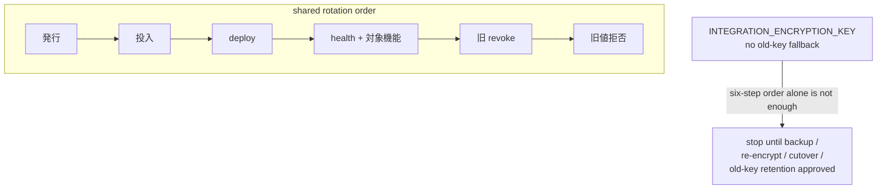

# LINMIG-239 — Four-system credential-rotation order, restore conditions, missing receipts (docs-only)

> Current task status is tracked in Plane `EMR-51`. This local document remains supporting execution/evidence material; see the [migration receipt](../plane-md-migration-20260923-receipt.md) for the crosswalk.

Campaign `linmig-ops-prep-20260919` revision 1. Unit `LINMIG-239`. Attempt `att-linmig-239-20260919-001`. Claim `claim/LINMIG-239`. Linear issue `LINMIG-239` was not found; keep as claim only. Prompt SHA `d39400d404ed43865bd10664d1dee26116d742bba15b293b2f1a3f6961fc87bb`.

Maps to [todo-operations.md](../../../todo-operations.md) **P1 / SEC-SECRETS-5** and GitHub [#89](https://github.com/MinoruSoga/AnimalEkarte/issues/89) / [#97](https://github.com/MinoruSoga/AnimalEkarte/issues/97). Binding sources:

- [BUG_MD_EXTERNAL_OPS_PENDING_APPROVAL.md](../../ops/deploy/runbooks/BUG_MD_EXTERNAL_OPS_PENDING_APPROVAL.md) **§1** (L24–L71)
- [todo-operations.md](../../../todo-operations.md) P1 (L28, L70, L153–L159)
- Cipher contract: [aes_gcm.go](../../../backend/internal/infra/crypto/aes_gcm.go) (`INTEGRATION_ENCRYPTION_KEY` is a single 64-hex-char key; this package has no old-key fallback)

Worktree `/Users/minoru/Dev/Case/AnimalHospital/AnimalEkarte-linmig-239` on `feat/linmig-239-ops-prep` at HEAD `aac697645df92fd24611c7c13bf0f7dda12a6e08`. Sheet date: 2026-09-20. Local files only.

This unit does **not** rotate credentials, run `npx wrangler secret put`, revoke tokens, edit GitHub/LINE/PlanetScale/Cloudflare live state, print secret values, or mutate the campaign ledger. Names only.

## Administrators and approval (this session)

todo-operations.md L13 requires named 操作者・承認者 on an execution ticket. L28 requires 各系統の担当・変更対象・復旧・明示承認 before external start. This session did not observe live admins or an explicit rotation approval.

| Role | This session |
|------|----------------|
| 操作者 / 系統別担当 | **UNKNOWN** |
| 承認者 / 明示承認 | **UNKNOWN** |
| Target environment / exact Wrangler config / Worker name / change ID | **UNKNOWN** (runbook L26 target-binding gate unfilled) |
| Linear `LINMIG-239` | Not found |

Do not treat this sheet as authorization to rotate. Missing named administrator or explicit approval keeps P1 **BLOCKED**.

## Four systems (names only)

Sources: BUG_MD §1 L31–L38; todo-operations.md L155.

| # | System | Named secrets / handles only | Put / store path (cited; not executed) |
|---|--------|------------------------------|----------------------------------------|
| 1 | PlanetScale DB | `DB_HOST`, `DB_USER`, `DB_PASSWORD` (`DB_PORT` / `DB_NAME` / TLS are non-secret Wrangler vars) | target-config `npx wrangler secret put <NAME> -c <exact-config>` once per secret name (L35) |
| 2 | Cloudflare API / Worker secrets | GitHub `CLOUDFLARE_API_TOKEN`; Worker secrets named in target `secrets.required` | token reissue + same target-config put; GitHub Secret name only (L36, L66–L67) |
| 3 | LINE channel secret / access token | LINE Developers Console channel secret and access token (names only) | App UI `/settings/integrations/lstep` (DB encryption). LINE reservation settings do not handle secret/token. Do not write real values back to seed (L37) |
| 4 | JWT / `INTEGRATION_ENCRYPTION_KEY` | `JWT_SECRET`, `INTEGRATION_ENCRYPTION_KEY` (Wrangler `secrets.required`: `backend/wrangler.jsonc` L169–L170; `backend/wrangler.production.jsonc` L174–L175) | target-config put after per-key restore conditions are fixed (L38–L42) |

`LINE_CHANNEL_ACCESS_TOKEN` / `LINE_CHANNEL_SECRET` are **not** currently in Wrangler `secrets.required` (wrangler.jsonc L177–L179). LINE live values go through the UI path above, not a global Worker secret in this HEAD.

## Shared rotation order (systems 1–3 and JWT signing key)

Cited from BUG_MD L64 and todo-operations.md L156–L158. **Not executed this session.**

1. **発行** — reissue the named credential in the provider console (PlanetScale role per current provider spec; Cloudflare token; LINE channel secret/access token; JWT signing material).
2. **投入** — put the new value into the bound target only (`-c wrangler.jsonc` for STG, `-c wrangler.production.jsonc` for PROD; config omit is forbidden — L26). LINE uses the app UI, not Worker secret put.
3. **deploy** — redeploy the bound Worker/app so the new names resolve.
4. **health + 対象機能** — `GET /health` is not sufficient (L42, L46–L50). Confirm the system’s function (DB connect, Worker/API, LINE integration decrypt/use, authentication).
5. **旧 revoke** — revoke the previous credential after the new path works.
6. **旧値拒否** — confirm the old value is rejected in the provider / Wrangler confirmation UI.

Do not close P1, #89, or #97 while any system lacks non-secret receipts for all six steps (L32, L64; todo-operations.md L159). Partial success on one system does not close the others (todo-operations.md L155).

**PlanetScale extra stop:** do not run `pscale role reset-default` on the shared app default role without approval (BUG_MD L35; STG seed runbook also forbids rotating the app `postgres` role this way). Confirm the current provider reissue procedure before any role change.

**Target-binding stop:** if names-only target check disagrees on environment, exact config path, Worker name, or change ID, stop (L26).

## System 4 restore conditions — `INTEGRATION_ENCRYPTION_KEY` has no old-key fallback

Treat `INTEGRATION_ENCRYPTION_KEY` as **not** interchangeable with `JWT_SECRET` (BUG_MD L40).

| Fact | Evidence | Restore implication |
|------|----------|---------------------|
| Single current key | `NewAESGCMCipher` accepts one 64-char hex string (32 bytes) — aes_gcm.go L20–L31 | There is no second-key slot in this cipher |
| No old-key fallback | `Decrypt` opens with the constructed key only — aes_gcm.go L52–L76; runbook L40 | Putting a new key alone makes existing ciphertext unreadable |
| Existing integration rows | LINE / LSTEP settings encrypt with this cipher (`lstep_settings_service.go`, `line_credentials.go`) | Restore = decrypt with the **still-held old key**, re-encrypt or re-register, then cut over; or restore from a protected backup taken before the put |
| `/health` | runbook L42 | Health 200 does **not** prove decrypt of existing integrations |

**Stop rule (BUG_MD L40, todo-operations.md L158):** do not change `INTEGRATION_ENCRYPTION_KEY` until a named operator has approved, for the exact target:

- inventory of encrypted data in that environment
- protected backup
- re-encrypt **or** re-register procedure
- cutover and restore conditions
- old-key retention window (value never written here)
- isolated-environment verification

If any of those cells is UNKNOWN, **stop**. Do not use the six-step token order alone for this key (L64). Do not log old key, plaintext, or ciphertext.

JWT signing-key change is a separate restore path: existing sessions break; operators must plan re-login. `/health` is not the verification (L42).

## Restore / rollback gaps (prep; no restore run)

AWS ECS/RDS is **not** a rollback target (BUG_MD L7–L9, L69–L71).

| System | Restore if cutover fails | Gap this session |
|--------|--------------------------|------------------|
| 1 PlanetScale DB | Keep the previous DB secret names working until the new role is proven; restore connectivity by putting the still-valid previous `DB_USER` / `DB_PASSWORD` / `DB_HOST` names into the **same** bound config. Do not `reset-default`. Schema rebuild is a different approved runbook | Named restore operator **UNKNOWN**. Live role/backup **UNKNOWN** |
| 2 Cloudflare API / Worker | Keep previous `CLOUDFLARE_API_TOKEN` until the new token deploys and `/health` plus target function pass; then revoke. Rollback = previous token name in GitHub Environment/repo secret (value not recorded here) | Token owner **UNKNOWN**. Live GitHub Environment scope **UNKNOWN** |
| 3 LINE channel | Previous channel secret/access token remain valid until Console revoke. Restore = re-save previous token via `/settings/integrations/lstep` using the **current** encryption key. Seed must not receive real values | Console admin **UNKNOWN**. Whether ciphertext exists in the target DB **UNKNOWN** |
| 4 `JWT_SECRET` | New key invalidates sessions. Restore = put previous `JWT_SECRET` into the bound config and redeploy; users re-login either way | Session-impact owner **UNKNOWN** |
| 4 `INTEGRATION_ENCRYPTION_KEY` | **No old-key fallback.** Restore requires the retained previous key (not written here) plus backup or re-register. New-key-only put is data-loss for existing ciphertext | Re-encrypt/restore procedure **未確定 → 変更停止** (L40). Administrator **UNKNOWN**. Approval **UNKNOWN** |

## Missing-receipt matrix (non-secret cells)

Copied from BUG_MD §1.1 L56–L62 and expanded to the P1 six-step receipt set (todo-operations.md L28, L70, L155–L159). Values are never stored. This session did not observe live receipts.

| System | 発行 | 投入 | deploy | health + 対象機能 | 旧 revoke | 旧値拒否 | 担当 | 承認 | 非機密 receipt |
|--------|------|------|--------|-------------------|-----------|----------|------|------|----------------|
| 1 PlanetScale DB | **未記入** / **UNKNOWN** | **未記入** / **UNKNOWN** | **未記入** / **UNKNOWN** | **未記入** / **UNKNOWN** | **未記入** / **UNKNOWN** | **未記入** / **UNKNOWN** | **UNKNOWN** | **UNKNOWN** | BUG_MD L58 **未記入** |
| 2 Cloudflare API / Worker | **未記入** / **UNKNOWN** | **未記入** / **UNKNOWN** | **未記入** / **UNKNOWN** | **未記入** / **UNKNOWN** | **未記入** / **UNKNOWN** | **未記入** / **UNKNOWN** | **UNKNOWN** | **UNKNOWN** | BUG_MD L59 **未記入** |
| 3 LINE channel | **未記入** / **UNKNOWN** | **未記入** / **UNKNOWN** | n/a (UI save, not Worker put) | **未記入** / **UNKNOWN** | **未記入** / **UNKNOWN** | **未記入** / **UNKNOWN** | **UNKNOWN** | **UNKNOWN** | BUG_MD L60 **未記入** |
| 4 JWT / `INTEGRATION_ENCRYPTION_KEY` | **未記入** / **UNKNOWN** | **未記入** / **UNKNOWN** | **未記入** / **UNKNOWN** | **未記入** / **UNKNOWN** | **未記入** / **UNKNOWN** | **未記入** / **UNKNOWN** | **UNKNOWN** | **UNKNOWN** | BUG_MD L61 **未記入** |
| #97 本文マスク | after rotation only (`gh issue edit`) | — | — | — | — | — | **UNKNOWN** | **UNKNOWN** | BUG_MD L62 **未記入** |

Related GitHub Secret **names** (not values; not rotated here): `CLOUDFLARE_API_TOKEN`, `MIGRATE_RUN_SECRET`, `STG_DEMO_EMAIL`, `STG_DEMO_PASSWORD` (L66–L67). `MIGRATE_RUN_SECRET` / demo logins are **out of the four P1 systems**; listed only so they are not mistaken for receipts of systems 1–4.

## Execution ticket (local prep fields)

Shared ops fields from todo-operations.md L13. Non-secret placeholders only.

| Field | This session |
|-------|----------------|
| ID | LINMIG-239 / P1 / SEC-SECRETS-5 / #89 / #97 |
| 対象環境・医院 | **UNKNOWN** |
| revision・入力識別 | this sheet; HEAD `aac697645`; prompt SHA `d39400d404ed43865bd10664d1dee26116d742bba15b293b2f1a3f6961fc87bb` |
| 読取・変更する範囲 | This unit: this markdown only. Later USER: four systems after explicit approval |
| 前段証拠 | Runbook §1.1 receipts **未記入**. Cipher no-fallback confirmed in aes_gcm.go |
| 操作者・承認者 | **UNKNOWN** |
| 実行枠 | **UNKNOWN** |
| 中止条件 | Target mismatch; unnamed admin; no explicit approval; `INTEGRATION_ENCRYPTION_KEY` restore procedure unset; `/health`-only verification; AWS rollback attempted |
| 復旧 | Per-system table above. Encryption key: old-key retention + backup or re-register; no fallback |
| 証拠保存先 | Non-secret refs only; secret values stay repo-external |

## What this sheet is not

| Candidate | Why it is not done |
|-----------|--------------------|
| Actual rotation / `wrangler secret put` / revoke | Out of scope. Local files only. Names only. |
| Printing or recording secret values | Forbidden. |
| Closing P1 / #89 / #97 | Receipts 未記入; administrators UNKNOWN; approval UNKNOWN. |
| Declaring `INTEGRATION_ENCRYPTION_KEY` rotatable | No old-key fallback; restore procedure 未確定. |
| Linear `LINMIG-239` Done | Issue not found; claim only. |
| Campaign ledger mutation | Controller-owned. |

## Out of scope (this unit)

- Rotation, secret put, token revoke, GitHub issue edit, wrangler/Cloudflare/LINE/PlanetScale live calls
- Docker app tests, `make migrate`, production deploy
- Campaign ledger edits; Linear/GitHub live mutation
- Inventing named owners or filling receipts with guessed dates

Follow-up (not this unit): USER names administrators and an approver, binds environment/config/Worker/change ID, fills the six-step non-secret receipts per system, and — for `INTEGRATION_ENCRYPTION_KEY` only — approves backup, re-encrypt/re-register, cutover, restore, and old-key retention **before** any put. Until then P1 stays receipt 未照合.
