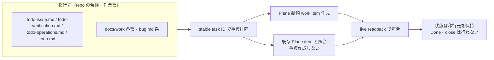

# Markdown task migration receipt — 2026-09-23

Plane readback: 80 newly created work items and 16 exact existing Plane items verified against a fresh live project list.
All source statuses were retained; no task was marked Done or closed during migration.

## Crosswalk

| Task ID | Plane | Status | Source references | Source SHA-256 |
|---|---|---|---|---|
| `UAT-R2-MASTER-PATH` | `EMR-84` | `Ready` | todo-issue.md:61 | `98c74406a878a92f896e37c132badb62149ae5288be2a2c9da9c4c4178dc9207` |
| `UAT-R2-EXCLUSIVE-LOCK` | `EMR-85` | `Ready` | todo-issue.md:71 | `2cb78eade1950235fe65808c0b61b20e9c5915ef0fa7529978b4ec6cf8e141d1` |
| `UAT-Q2-TREATMENTS-IMPORT` | `MIG-15` | `Ready` | todo-issue.md:82 | `4182d5a32df1c98aa15dc662491684d7bafef78f1683af70e18475a544f39b1e` |
| `SLACK-MANUAL-URINE` | `EMR-86` | `Needs Human` | todo-issue.md:100 | `73cbf2ff3ff558ae77826ad339e7f1b64290f769e83addf265c86c99c44719d4` |
| `SLACK-COMPLAINT` | `EMR-87` | `Ready` | todo-issue.md:108 | `17f001adec9d890d148fec78144daf132e18a2d55b8556104332df1577685745` |
| `SLACK-CROSS-CLINIC` | `EMR-88` | `Needs Human` | todo-issue.md:121 | `1d6a56336ef234813476562972e1d4dc0c6cf3c47de75bc40098ff6f05f7a01a` |
| `SLACK-BACKGROUND` | `EMR-90` | `Needs Human` | todo-issue.md:128 | `8f2cc552ba82254608e628b4aaf9d4ed475ac028fcbf9ea8c788767293d3acc5` |
| `SLACK-DANGER` | `EMR-92` | `Needs Human` | todo-issue.md:135 | `6a3948a7d2f1a5759fbab3e3029b88d97967a4a13cc8dff86e0d280153a5bf46` |
| `SLACK-STORY` | `EMR-94` | `Needs Human` | todo-issue.md:142 | `b69fb982520f3d701df5adabe5b1c3ab7231ce432bf12cb958e29869cc68703c` |
| `SLACK-VACCINE-PRINT` | `EMR-97` | `Needs Human` | todo-issue.md:149 | `96b92e9c6e852f5d2ea47adc98eeead5169b394e5ef10254474fc380d5ad76a6` |
| `SLACK-DECEASED` | `EMR-99` | `Needs Human` | todo-issue.md:156 | `3cb33ca9ababa2af281bd82d698eb494eaaf47f419844813360c48f507a0344b` |
| `SLACK-DETAILS` | `EMR-101` | `Needs Human` | todo-issue.md:163 | `3c20a78abcf2f08a3b8d5ce4c2af91bfbb5a0e58a16851b2ba5c8fdd0b077aa2` |
| `SLACK-COPY` | `EMR-102` | `Needs Human` | todo-issue.md:170 | `8f56dae2a9bdf170ab8133c407fb7d612ea154d065774d26fa2927f761a6d47c` |
| `SLACK-PLAN-MANUAL` | `EMR-103` | `Needs Human` | todo-issue.md:177 | `24ccf39bb3ec5942e9ca1cbb63849b2dcfea8a0393e36cd69bd4b3b3f9189a1b` |
| `SLACK-LATENCY` | `EMR-104` | `Needs Human` | todo-issue.md:200 | `1c482afcf36568f22ee017ed1c7fafc0705f4252bab76b78172abe03b7e7fddd` |
| `SLACK-VACCINE-MULTI` | `EMR-105` | `Needs Human` | todo-issue.md:207 | `97065305c1925516728f54b9dc923f3394ebb09482c20b44d567a48116306651` |
| `UAT-Q3-GENDER-MAP` | `MIG-16` | `Needs Human` | todo-issue.md:214 | `7baf1e87af7971e2eb3c189211f3b319b87dd32b53b49a8aabc774352c560414` |
| `UAT-Q2-VACCINE-SPECIES` | `EMR-106` | `Needs Human` | todo-issue.md:225 | `3f0a768330d0fa5ca1073eb2face6842bb0091762ffee737825984ac10d2ea58` |
| `UAT-Q4-UNPAID-TRIAGE` | `EMR-107` | `Needs Human` | todo-issue.md:231 | `97d60b6e52a354db3c1c0bd309c79bd9e429ce0522c56fee269eca2ba4de7be5` |
| `PO-PET-DECEASED-DATA-BACKFILL` | `EMR-108` | `Blocked` | todo-issue.md:237 | `0eac5729b2a9b61d18736c9bb68629c55ef639701d690a6555b1d48d023dbad3` |
| `SLACK-BILLING-UAT` | `EMR-109` | `Needs Human` | todo-issue.md:242 | `5bbee1d25c9a2dde686a5a14cfedaaf17557da97a1797f51c1c87731891db261` |
| `SLACK-CLINICAL-UAT` | `EMR-110` | `Needs Human` | todo-issue.md:249 | `4f9a65844771e2b8f0999f61880ca36f1992722ab649d164868606d6ad810d9e` |
| `SLACK-ACCESS` | `EMR-111` | `Needs Human` | todo-issue.md:256 | `ac148687a0837dcecd402937bf9e97fd4ce6fd0506dc77677afdc3882dd237b4` |
| `SLACK-UAT-SCHEDULE` | `EMR-112` | `Needs Human` | todo-issue.md:263 | `e5759cb78c9d4d5b7eeb6e97ff9f3115ff0b5f0a4e0b0dc76204c915a76e46e1` |
| `SLACK-HAC-IMPORT` | `MIG-17` | `Needs Human` | todo-issue.md:270 | `f63a56e4ea556ed74790873d59ad9c65807c2886a1c8a7f0b90c9c6867471990` |
| `SLACK-LAB` | `EMR-113` | `Needs Human` | todo-issue.md:277 | `4d8d71a10e6644516e7f146acc4da8e5d4d2bef982ec9f4bc03936691c678e42` |
| `SLACK-EXAM-HISTORY` | `MIG-18` | `Needs Human` | todo-issue.md:284 | `4a8776f13a9447f312a056570ec20585b93bf20ca21ca2932e0e6085be44599e` |
| `SLACK-RESERVATION-REFERENCE` | `EMR-114` | `Needs Human` | todo-issue.md:291 | `cfb8a89d81a35f6750dbb58429dc9a58aae2dd5d77b5f0d7ebc98c66f17f9c3c` |
| `SLACK-BACKLOG61` | `EMR-115` | `Blocked` | todo-issue.md:298 | `99c6c63bf5dcbc444648f2510098eede0ca8eeb458d60d6a6e0aabcbc9586428` |
| `SLACK-STAFF-SELECT` | `EMR-116` | `Needs Human` | todo-issue.md:305 | `ae09bdb287d3a8fc7f99d1c752388c4e25a9c774a11d654ac54a1cbe92e7dced` |
| `SLACK-INTAKE` | `EMR-117` | `Needs Human` | todo-issue.md:312 | `d25dd9b1151a04faed548264d571b1ede9c12d302275afcb26267d6466ab1c52` |
| `SLACK-OCR` | `EMR-118` | `Backlog` | todo-issue.md:331 | `9f6106ac9ddea01a20608863495550683bd53c5f459dc07a8cd6bea6d9df93d4` |
| `SLACK-SMAREGI` | `EMR-119` | `Backlog` | todo-issue.md:338 | `63b51904cb9a6915321b3979f42c99a8118f71b2b0f100a62c6007fe74c31daa` |
| `TASK-444-ADDENDUM-CODEGEN` | `EMR-198` | `Backlog` | todo-issue.md:345 | `existing Plane item independently read back` |
| `UAT-R2-TREATMENT-COMMIT` | `EMR-120` | `UAT` | todo-verification.md:101 | `86f725b92117bf9c7810eaef9d59dfed61b127bc8681edf2aa9d028bebc55c0b` |
| `UAT-R2-MASTER-LIST-HEIGHT` | `EMR-121` | `UAT` | todo-verification.md:105 | `b81110d7721d2fd25c9021ac9b0fdd44671e035ec8f7922c46ac88e637e50171` |
| `UAT-Q1-SEARCH-AND` | `EMR-122` | `UAT` | todo-verification.md:109 | `a3f514a707b1e7501120ced5dee63b35cccc4435a90f053d685decf8ddaf9325` |
| `UAT-Q4-INSURANCE-RATES` | `EMR-123` | `UAT` | todo-verification.md:113 | `c091e9493c40669d77370f6890fb75a5f7889641028b08429e3677e363ecc529` |
| `UAT-Q2-HISTORY-NAV` | `EMR-124` | `UAT` | todo-verification.md:117 | `10456f1fb879bdaaa48e847d1fd4302c70574c58c2a9b657ef6eb9576471b7a9` |
| `DEV-V-OWNER-DB` | `EMR-125` | `Ready` | todo-verification.md:138 | `11f39f4c12fe1022069ec189b51be1ce9e95e1063135a5b0f4cf7071d9fd161e` |
| `TODO-V-S09 / QA-UAT-S09-FIXTURE` | `EMR-126` | `Ready` | todo-verification.md:144 | `c15858155463e7f3139c35485d2f342e58dfada55654ddab2deb3a7a1c0a1ab3` |
| `TODO-V-V04 / QA-UAT-V04-RETEST` | `EMR-127` | `Ready` | todo-verification.md:162 | `3481144deafa4db7eca00b976f6c27bfcd95035abe9f46056f62ae8fe5b3da8e` |
| `TODO-V-CLINICAL-E2E / QA-FULL-CLINICAL-E2E` | `EMR-128` | `Ready` | todo-verification.md:170 | `25ab1d3e62661a836e69413734e846a0975d7fdbad8ae77c0feb1b397fc4f57f` |
| `TODO-V-STG-DATA` | `EMR-129` | `Needs Human` | todo-verification.md:184 | `b9c0528314a4cf5e9bf07e9be5be7f4a39a466acc0a13e0e86af6dc6668979d5` |
| `TODO-V-RELEASE` | `EMR-130` | `Needs Human` | todo-verification.md:188 | `ef88b01d0e505a1d821bc972f160e57e3f9d14e9dc664ea223fb809da5f40567` |
| `P4 / #254 AUTHENTICATED-UAT` | `EMR-131` | `Needs Human` | todo-verification.md:194 | `1a4308d424a440339ed591f32cc920036154cec879ee63cd6a813c2f59660690` |
| `E1 / QA-UAT-LSTEP-REAL` | `EMR-132` | `Blocked` | todo-verification.md:195 | `7e9ce5cb00a3233bc4efed1fa897d999115122b9c89e2b05154e0cd4344d64ad` |
| `E2 / QA-UAT-LINE-IDTOKEN` | `EMR-133` | `Blocked` | todo-verification.md:196 | `095cd5d2864bf975f829e57d28e72feb3918ec37a35cdb0060d4c74edb7ccaaa` |
| `P8 / #257 GOLIVE` | `EMR-134` | `Blocked` | todo-verification.md:197 | `95a556c6848d0e90c5389b3c5e253db600cb77474fb5532bc2e50c7a4e92b726` |
| `TODO-V-LINEAR / META-LINEAR-APPLY` | `EMR-135` | `Needs Human` | todo-verification.md:214 | `f714148f668bfea74fe13c4cd42f8d7683f7bc1d499e457b195ef497cd4452a7` |
| `PERF-V-LINEAR` | `EMR-136` | `Needs Human` | todo-verification.md:218 | `22b8d5731d9525c65067dce878501f32f820c10505280e96abca2c426f896e44` |
| `AUTH-V-LINEAR-READ` | `EMR-137` | `Needs Human` | todo-verification.md:222 | `d6a87889a7853b24fdba7ec4a8fe0a7cbad64871511bb86ca9577c26803fd8c8` |
| `AUTH-V-LINEAR-WRITE` | `EMR-138` | `Blocked` | todo-verification.md:226 | `f282226e259d6ed89456b6c3878a66f25e7f12f5dd1ca68e022d04b3fd8ab0e5` |
| `AUTH-V-D1-PREFLIGHT` | `EMR-139` | `Blocked` | todo-verification.md:281 | `e407cbe7505921c0be850fc2fbda69133c7842ec52e550b6f8e4db17a56744d7` |
| `AUTH-V-D1-APPLY` | `EMR-140` | `Blocked` | todo-verification.md:285 | `6d1dee5e427385cfbaa3c54d271a6d3c8109d1e4fb3cd82b5e6458b1cf6357f9` |
| `AUTH-V-D1-MAIL` | `EMR-141` | `Blocked` | todo-verification.md:289 | `bf9ea56ed2fb2071c8e0b9ebd84b385e2295a59d0ef77806e4969ef8d022c388` |
| `PERF-E5-STG-DEPLOY-VERIFY` | `EMR-199` | `Review` | todo.md:57; todo-performance.md:168 | `existing Plane item independently read back` |
| `PERF-V-MITIGATION` | `EMR-142` | `Backlog` | todo-verification.md:241; todo-performance.md:188 | `468e334069e1b51d88505d25d3c51432bf35f84d94803ff33cb2125ee7cf200f` |
| `PERF-V-BUNDLE` | `EMR-143` | `Backlog` | todo-verification.md:242; todo-performance.md:188 | `d865949ad7a756fab96c3ffea7d67d1efc11eba9945eaf75909479cc029efdc9` |
| `BUG-LOCAL-HANDOFF-CSV-CONTRACT` | `MIG-19` | `Ready` | todo-operations.md:115 | `0604118457bff0e2e0022ac8aac3b6dbcd62b25d7e8e5c459058e3483c9f6a33` |
| `H0-2 / HAC-CSV-1` | `MIG-20` | `Needs Human` | todo-operations.md:123 | `991ebb144f0d1bba9c8f063a6203de8b29eb77080e22e5865855dddb38118511` |
| `H0-3b / H1-2` | `MIG-21` | `Needs Human` | todo-operations.md:129 | `b30f2d794b0583fd33f4eed91537febfc117adae3c0fa753bb72aeddeb1b9450` |
| `AE-STG-UAT-LANE3-HAC` | `MIG-22` | `Blocked` | todo-operations.md:137 | `10a4c034906e50044e46055e9d5a4e3b3cb5f5a35234ab25d799b99861dc4749` |
| `H3-9` | `EMR-144` | `Blocked` | todo-operations.md:143 | `2fc78e4c27d64cd6401fcac5bd8bce4f57f0c0144a31246b7c001bb5c58bfcc4` |
| `H3-11` | `EMR-145` | `Blocked` | todo-operations.md:149 | `52854452f619afe6324ea5b7da600491cbc684d4af5dd282e64e460388dc0ddb` |
| `Lane 4` | `EMR-146` | `Blocked` | todo-operations.md:155 | `222be5f72488a905f3d7cd6f8829b1d90d88b7ac620485154fb46d2b29df12d3` |
| `P1 / SEC-SECRETS-5 / #89 / #97` | `EMR-147` | `Blocked` | todo-operations.md:163 | `395e36fb3261bd9f1f5c6f58584c36055eb5b6bda543da1141ea96e48072ee2b` |
| `P2 / #253 / PROD-SETUP` | `EMR-148` | `Blocked` | todo-operations.md:171 | `a60904dda28f76db3a0c18902304a920ad0037fa3973c6ecab9027b126d9ed54` |
| `P3 / #250 PROD-DATA-MIGRATION` | `MIG-23` | `Blocked` | todo-operations.md:183 | `c14eb0a4463c6ecd7c0a8e7d28d1f145d02afd2a7d952dd18b0579ae0f22d935` |
| `P5 / #255 STAFF-PROVISION` | `EMR-149` | `Blocked` | todo-operations.md:191 | `5d809553fb79089e1a14e2db381008a2cfcd74b409895432d203d79425f3cdbf` |
| `P6 / #258 / U1-U12 DELIVERY` | `EMR-150` | `Needs Human` | todo-operations.md:199 | `31c05b874896f9fdb4bee30cedaad501dbbee0ae7aa371bdd52c7f702a74ca57` |
| `P7 / #256 / TRAINING` | `EMR-151` | `Needs Human` | todo-operations.md:207 | `fae7ec476925c87e929d08e32825e42cd1f9715b9e7059c5b7aa0d5c27d1aa26` |
| `BUG-ACCT-CLOSE-PERM-DEFAULT` | `EMR-71` | `Backlog` | todo.md:105 | `existing Plane item independently read back` |
| `BUG-S09-FIXTURE-TEARDOWN` | `EMR-72` | `Backlog` | todo.md:106 | `existing Plane item independently read back` |
| `BUG-AGG-NO-VISIT-REVENUE` | `EMR-73` | `Backlog` | todo.md:107 | `existing Plane item independently read back` |
| `BUG-TRIM-KANBAN-IN-CONSULTATION` | `EMR-74` | `Backlog` | todo.md:108 | `existing Plane item independently read back` |
| `BUG-BILLING-UNBILLED-MR-EXCLUSION` | `EMR-75` | `Backlog` | todo.md:109 | `existing Plane item independently read back` |
| `BUG-RES-OVERLAP-500` | `EMR-76` | `Backlog` | todo.md:110 | `existing Plane item independently read back` |
| `BUG-LIFF-HEALTHCARD-OWNER-SYNC` | `EMR-61` | `Backlog` | todo.md:111 | `existing Plane item independently read back` |
| `BUG-ACCT-INS-SIGN-MISMATCH` | `EMR-62` | `Backlog` | todo.md:112 | `existing Plane item independently read back` |
| `BUG-ACCT-INS-EDIT-REWRITE` | `EMR-63` | `Backlog` | todo.md:113 | `existing Plane item independently read back` |
| `BUG-DIALOG-FOCUS-RESTORE` | `EMR-64` | `Backlog` | todo.md:114 | `existing Plane item independently read back` |
| `BUG-BILLING-TAX-TYPE-DROPPED` | `EMR-65` | `Backlog` | todo.md:115 | `existing Plane item independently read back` |
| `BUG-ACCT-DUP-COMPLETE-500` | `EMR-66` | `Backlog` | todo.md:116 | `existing Plane item independently read back` |
| `BUG-MR-DOCTOR-HEADER-STALE` | `EMR-67` | `Backlog` | todo.md:122 | `existing Plane item independently read back` |
| `BUG-VITAL-NOTE-KEY-MISMATCH` | `EMR-68` | `Backlog` | todo.md:123 | `existing Plane item independently read back` |
| `BUG-MR-VACCINE-FORM-NESTED` | `EMR-69` | `Backlog` | todo.md:124 | `existing Plane item independently read back` |
| `BUG-TRIM-EXCL-TIMERANGE-500` | `EMR-76` | `Backlog` | todo.md:125 | `existing Plane item independently read back` |
| `NOTE-STAFF-STARTTIME-RDT` | `EMR-180` | `Ready` | bug.md:25; bug.md#plan-note-staff-starttime-rdt | `28f5b5e05f30e36db7c2c0ec9edb3766275149e570d09c5447795c1568a1dfb0` |
| `UAT-R2-CHART-FIT` | `EMR-181` | `Ready` | docs/work/todo-campaign-20260918/UAT-R2-CHART-FIT.md:1 | `9466bdc71ff70dd19d34a7cd315e65056e6da48793b0b0073737d410fa32355d` |
| `SLACK-CAMERA` | `EMR-183` | `Ready` | docs/work/todo-campaign-20260919-ready17/SLACK-CAMERA.md:1 | `11c6ddd9b58f438b36e3fcf7ed0360a2443f5370fd4ccf1ce65bfce683a207a4` |
| `SLACK-MICROCHIP` | `EMR-185` | `Ready` | docs/work/todo-campaign-20260919-ready17/SLACK-MICROCHIP.md:1 | `e2d5092e8538b4fd7f3af54fefcb94f8d23535cb2cfc626aff5369bbea65322f` |
| `SLACK-OWNER-HEIGHT` | `EMR-187` | `Ready` | docs/work/todo-campaign-20260919-ready17/SLACK-OWNER-HEIGHT.md:1 | `4ee4b2413b99bfe069ee6a0798f44c760b2b11eade784cd0215270505e5d0d63` |
| `SLACK-VITALS` | `EMR-190` | `Ready` | docs/work/todo-campaign-20260919-ready17/SLACK-VITALS.md:1 | `511210609d4d438669d781219577a6ec6fea05075e5d63261d8b391699df31b2` |
| `DOCS-REFRESH-ISSUE-RECONCILIATION` | `EMR-192` | `Needs Human` | docs/work/docs-perfection/LEDGER.md:367 | `a54f3eb90ef5eb9d981ee9ab44598e5dbd24d4c1acc008090137d4b900a16cf8` |

| `NOTE2-SWEEP-COVERAGE` | `EMR-200` | `Ready` | todo-verification.md:31; bug-2.md#plan-note2-coverage | `1464f3f1eaf270529269dcdda16f44708a4f0fdb5008b3626cd8a5c0301cd309` |

- `NOTE-STAFF-STARTTIME-RDT` supporting investigation plan was appended to Plane EMR-180 and read back (SHA-256 `76195f3365920b2d8e673656292cfbf7abf526351cfbbdac0169fe4fa16c044e`).

- Supporting local operational details for `UAT-R2-EXCLUSIVE-LOCK` (`todo-operations.md:55`) and `SLACK-LATENCY` (`todo-performance.md:65`) were appended to Plane EMR-85 and EMR-104 and read back; SHA-256 values are recorded in the migration receipt evidence bundle.

## Deduplicated supporting packet references
| Local source / alias | Existing Plane task(s) | Treatment |
|---|---|---|
| `docs/delivery/DELIVERY_PACKAGE.md` / `DELIVERY-U1-U12` / `P6` | `EMR-39` | Same delivery-input task; no extra task created. |
| `docs/delivery/OPERATION_MANUAL.md` / `DELIVERY-U13` / `P7` | `EMR-41` | Same training/disposition task; no extra task created. |
| `docs/delivery/GOLIVE_RUNBOOK.md` / `GOLIVE-HOLD` / `LINMIG-228` | `EMR-40` | Same go-live hold task; no extra task created. |
| `docs/ops/deploy/runbooks/SEC_SECRETS_5_GITLEAKS_HISTORY_INVENTORY.md` / `SEC-SECRETS-5-USER-ROTATION` / `LINMIG-239` | `EMR-51` | Same user-gated rotation task; no extra task created. |
| `docs/work/linmig-campaign-20260919/LINMIG-182.md` | `EMR-14` | Existing BRT-94 task. |
| `docs/work/linmig-campaign-20260919/LINMIG-208.md` | `EMR-22` | Existing BRT-68 task. |
| `docs/work/linmig-campaign-20260919/LINMIG-209.md` | `EMR-23` | Existing BRT-67 task. |
| `docs/work/linmig-campaign-20260919/LINMIG-219.md` | `EMR-33` | Existing BRT-57 task. |
| `docs/work/linmig-campaign-20260919/LINMIG-224.md` | `EMR-36` | Existing BRT-52 task. |
| `docs/work/linmig-campaign-20260919/LINMIG-228.md` | `EMR-40` | Existing BRT-48 task. |
| `docs/work/linmig-campaign-20260919/LINMIG-230.md` | `EMR-42` | Existing BRT-46 task. |
| `docs/work/linmig-campaign-20260919/LINMIG-231.md` | `EMR-43` | Existing BRT-45 task. |
| `docs/work/linmig-campaign-20260919/LINMIG-232.md` | `EMR-44` | Existing BRT-44 task. |
| `docs/work/linmig-campaign-20260919/LINMIG-233.md` | `EMR-45` and `EMR-126` | Clinic input and S09 fixture tasks already tracked; no extra task created. |
| `docs/work/linmig-campaign-20260919/LINMIG-234.md` | `EMR-46` | Existing BRT-42 task. |
| `docs/work/linmig-campaign-20260919/LINMIG-239.md` | `EMR-51` | Existing BRT-37 task. |
| `docs/work/docs-perfection/LEDGER.md` / `DOCS-PERFECTION-LEDGER` | `EMR-192` | Active reconciliation task; six child goals are already COMPLETE and were not migrated. |

## Scope notes

- The five canonical ledgers contained 88 distinct unfinished task units; 8 additional independent unfinished tasks were found in the full Markdown scan.
- 80 new work items were created in Plane and verified by live readback; 16 items already present in Plane were matched by stable task ID and read back without duplication.
- Two ticket bodies contained credential-like patterns; those patterns were redacted before sending the descriptions to Plane.
- Eight additional independent unfinished tasks from `bug.md`, `bug-2.md`, `docs/work`, and the docs reconciliation ledger were registered after deduplication.
- The 58 docs/work task packets were deduplicated by stable task ID against these tasks or current Plane work; they remain as supporting acceptance/evidence records, not independent task entries. Six DOCS-PERFECT child goals were COMPLETE and were not migrated.
- Foreign WIP in `docs/ops/testing/scenarios/README.md` and S34–S39 was not changed.
- Runtime verification was not required for the documentation edits. Plane item state/content was read back; no tests, data operations, deployment, or external closures were performed.
