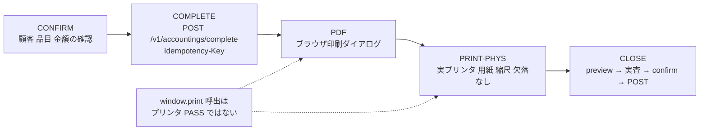

# SLACK-BILLING-UAT: 会計確認→確定→PDF/印刷→締め 通し票

状態: **通し票 READY／実機・実請求・実締め 未実行**。出典は [todo-issue.md](../../../todo-issue.md) 見出し `### SLACK-BILLING-UAT`（L252–256、索引 L432）。9月16日最優先は、新カルテ単独の **会計確認 → 確定/支払 → 精算書/領収書PDF → 物理プリンタ → 締め**。八王子は **新規カルテ** で実施する方針。

本票は製品コードから import されない。キャンペーン remaining-ops-20260920 revision 1 unit `SLACK-BILLING-UAT` の owned path。ledger `owned_paths` が本パス単体のため、他シートや dirty `todo-issue.md` への追記では unit 完了にならない。

**本票は机上のケース分割だけを完了とする。** 実会計の確定、ブラウザ印刷ダイアログ、PDF 保存、物理プリンタ、レジ締め preview/実査/保存はすべて **未実行**。Vitest が `window.print()` を spy できたことは **プリンタ PASS ではない**（下記 PRINT-PHYS）。

## 呼び出し行

**無い。** 製品コードは本ファイルを参照しない。人間が読む受入票であり、sibling の ready-17 Slack 票と同じ役割。既存 `docs/work/todo-campaign-20260918/` と `docs/work/todo-campaign-20260919-ready17/` に本 unit の通し票は無い。

## 医院事実（コード外・UNKNOWN）

数値・用紙・権限者・build をコードから捏造しない。未採取なら該当セルは **再現 BLOCKED**。

| 項目 | コードで分かること | 医院事実 |
| --- | --- | --- |
| 実施医院 | todo-issue は八王子を新規カルテ方針と書く | **UNKNOWN**。現受入担当・日程は過去 Slack 窓口の再確認が必要 |
| 対象 build / revision | 本票作成時 worktree HEAD `873685b0b` | 再現セッションの SHA は **UNKNOWN** |
| 権限ロール | FE `accounting` create/edit、`cash-register-close` view/create、締め後は `accounting-post-close-edit:edit` | 誰が確定・印刷・締めしてよいかは **UNKNOWN**（PO） |
| 合成 fixture（飼主/ペット/品目） | 新規カルテ経路は死亡ペット直打ちを FE で拒否（AccountingDetail / BUG-001） | 承認済み合成データは **UNKNOWN**。実患者・実請求は使わない |
| 帳票用紙・縮尺 | `@page { size: auto; margin: 0 }`（AccountingPrintArea）。専用 PDF エンジンは無い | 実プリンタの用紙・欠落は **UNKNOWN** |
| 締め対象日・AM/PM/EMG | `PERIOD_OPTIONS` と preview の date/period | 実施日の区分・既締め有無は **UNKNOWN** |
| 後処理（キャンセル/締め取消） | 会計キャンセルは `cancelled` へ。締めダイアログは「取り消せません」 | 試験後の戻し手順は **UNKNOWN**。運用承認なしに実締めしない |

## 実践ゲート（product-philosophy 5 ステップ）

実装しない。通し受入の判断順だけ固定する。[docs/product-philosophy.md](../../product-philosophy.md) の逆行禁止。

1. **要件を疑う:** 「印刷ボタンが欲しい」は要件ではない。業務目的は **確認した品目・金額が、同じ会計の支払・帳票・締め集計と一致する** こと。責任者の個人名は todo-issue に無い → **UNKNOWN**。
2. **削除:** 専用 PDF マイクロサービス、二重の帳票ストア、確認ダイアログだけの安全、Smaregi 待ちによる本通しの延期は削除対象。既存 complete + `window.print` + 締め POST と別系統を足さない。
3. **簡素化:** 新規確定は 1 個の `POST /v1/accountings/complete`（BUG-018）。帳票は `AccountingDocument` を preview と print area で共有。締めは preview 読取 → 実査入力 → confirm → POST。
4. **サイクル短縮:** 確認ダイアログを確定や締めの成立根拠にしない。Idempotency-Key、締め済み日付のサーバー再評価、権限 fail-closed が本体。
5. **自動化:** 実請求・実締めの自動実行はしない。手動で同じ use case が安全に完結し、停止手段（権限なし/既締め/未承認）が見えてから。

追加だけで削除（工程・画面・入力・二重管理）がゼロなら再検討。`window.print()` を「印刷できた」と数えるのは ① 違反。

## 混ぜてはいけないケース

| ID | 何か | いまのコード | 混ぜてはいけない読み替え |
| --- | --- | --- | --- |
| CONFIRM | 顧客・品目・税・支払内訳の画面確認 | [AccountingDetail.tsx](../../../frontend/src/features/accounting/routes/AccountingDetail.tsx) L97–147, L200–286。支払合計が請求額と不一致なら確定 disabled（`isPaymentSubmitDisabled`） | 画面を開いたことを確定済みとしない |
| COMPLETE-NEW | 新規カルテ会計の原子的確定 | [use-accounting-completion-action.ts](../../../frontend/src/features/accounting/hooks/use-accounting-completion-action.ts) L262–311 → [complete-accounting.ts](../../../frontend/src/features/accounting/api/complete-accounting.ts) L10–19 `POST /v1/accountings/complete` + Idempotency-Key。[accounting_handler.go](../../../backend/internal/billing/accounting_handler.go) L132–206 | waiting の途中保存や legacy create+items を本経路と同一視しない |
| COMPLETE-EXISTING | 既存 waiting の完了 / 確定済み修正 | 既存 ID は `updateAccounting`（同 hook L312–327）。確定済みは先に ConfirmDialog「精算済みの会計を修正します」（L228–231, AccountingDetail L344–352） | 新規 complete と update を同じケースに畳まない |
| PDF | ブラウザ印刷ダイアログから PDF 保存 | 専用 PDF 生成 API は無い。`window.print()` が OS ダイアログを出すだけ | ダイアログ表示 = PDF ファイル保存成功、としない |
| PRINT-PHYS | 物理プリンタの用紙・縮尺・欠落なし | [AccountingDetailPanels.tsx](../../../frontend/src/features/accounting/components/AccountingDetailPanels.tsx) L343 `window.print()`。テスト L169–179 は spy のみ | **`window.print()` 呼び出しはプリンタ PASS ではない** |
| CLOSE-PREVIEW | 締め対象の読取 | [CashRegisterClosePage.tsx](../../../frontend/src/features/cash-register/routes/CashRegisterClosePage.tsx) L47–60, L141–166。[cash_register_handler.go](../../../backend/internal/billing/cash_register_handler.go) L30–45 GET preview | preview 表示を締め完了としない |
| CLOSE-SAVE | 実査現金の保存 | ClosePage L73–112 confirm → `POST /v1/cash-register/closes`（create-cash-register-close.ts L17–24, handler L47–77）。ダイアログ「この操作は取り消せません」（ClosePage L172–174） | 確認ダイアログ表示を締め成功としない。本票では **実行しない** |
| SMAREGI | 外部レジ | 本通しの依存ではない（todo-issue L256） | Smaregi 未接続を本票 BLOCKED の理由にしない |
| LIVE | 実患者・実請求 | 禁止。合成 fixture + 運用承認後のみ | 机上票の READY を医院受入完了としない |

## 現行経路（新規カルテ会計→帳票→締め）

1. **会計画面:** AccountingDetail タイトル「会計精算」（L203）。`PageLayout` は `print:hidden`（L202）。帳票本体は画面外の `AccountingPrintArea`（L369）。
2. **確認（CONFIRM）:** 飼主/ペットはヘッダ description（L205）。明細・保険・支払は `AccountingDetailColumns`（L262–285）。新規は未請求 blocking / ungrouped 警告で確定を止め得る（L131, L237–260）。死亡ペット直打ちは確定ボタンなし。
3. **確定ボタン:** `status !== "completed"` のときだけヘッダに submit。「会計を確定する」（L215–220, [AccountingHeaderActions](../../../frontend/src/features/accounting/components/AccountingDetailPanels.tsx) L45–52）。`completed` 後のヘッダは「明細兼領収書」とキャンセルのみ（同 L55–74）。支払 split 合計 ≠ 請求額、現金お預かり不足、締め後理由空は disabled（`isPaymentSubmitDisabled` / `isPostCloseSubmitBlocked`）。
4. **新規 COMPLETE:** complete command が header/items/payments を 1 トランザクションで書く（handler コメント L132–133、service `Complete`）。Idempotency-Key UUID 必須。初回 201、同一 digest replay 200、異 digest 409。締め済み日付は handler が候補 read し、`accounting-post-close-edit:edit` が無ければ 403（handler L178–189）。サービスが write 時に再評価。
5. **帳票コンポーネント:** [AccountingDocument.tsx](../../../frontend/src/features/accounting/components/AccountingDocument.tsx) 見出し「明細兼領収書」（L152）。セクション clinic_header / owner_pet_info / items_table / payment_summary / footer_note。合計・請求金額・お預かり・お釣り（L244–293）。`payment` が無いと preview も print area も描画しない（Panels L330–336, L359–360）。
6. **PDF/印刷 UI:** 確定済みで「明細兼領収書」→ `setPreviewOpen(true)`（use-accounting-settlement-actions L69–71）。ダイアログ「印刷イメージを確認できます。」「印刷する」が `window.print()`（Panels L315–346）。印刷 CSS は AccountingPrintArea L365–369。
7. **締め:** 日付・区分入力 → preview 有効化 → 部門別集計 / 税内訳 / 個別明細 / 理論現金。実査 `actual_cash` ≥ 0。Submit「締める」は confirm 後に POST。権限 `canCreate` を action 側で再検証（ClosePage L85–88）。締め帳票も `window.print()`（CashRegisterClosePanels L237、「印刷 / PDF出力」）。こちらもプリンタ PASS ではない。
8. **コード上の自動テスト:** AccountingDetail.test は印刷ボタン表示と `window.print` spy。ClosePage.test は mutation mock。どちらも実プリンタ・実締めではない。

通しの流れの概形:

## 通しケース（実績はすべて 未実行）

対象: 八王子 **新規カルテ**（方針）。合成 fixture。実請求・実締めは運用承認後。止まった route/action は個別不具合にし、Smaregi 待ちにしない。

実績列の値は本票作成時点で **未実行**。医院採取後も、プリンタは用紙確認まで PASS にしない。

### CONFIRM — 顧客・品目・金額の確認

| ID | 手順（コード上の期待） | 期待 | 実績 | 停止 |
| --- | --- | --- | --- | --- |
| B-CONFIRM-ID | 新規カルテから会計精算を開く。受付No・飼主名・ペット名がヘッダに出る | 対象個体が画面と一致 | 未実行 | 実患者で試さない。合成未承認なら BLOCKED |
| B-CONFIRM-ITEMS | 明細行の名称・数量・単価・税・割引をカルテ由来と照合 | 品目がカルテと一致。未請求 blocking があれば確定しない | 未実行 | unbilled details 失敗中は新規確定無効（BUG-013） |
| B-CONFIRM-PAY | 支払 split 合計 = 請求額。現金ならお預かり ≥ その額 | 不一致なら「会計を確定する」disabled | 未実行 | 端数を手で合わせて通したことにしない |
| B-CONFIRM-INS | 保険オン時は比率・保険額が計算と一致 | 請求金額が保険控除後 | 未実行 | 保険マスタ不足は本票で推測補完しない |

### COMPLETE — 確定/支払

| ID | 手順（コード上の期待） | 期待 | 実績 | 停止 |
| --- | --- | --- | --- | --- |
| B-COMPLETE-NEW | 「会計を確定する」→ `POST /v1/accountings/complete` + UUID Idempotency-Key | toast「会計を登録・完了しました」。詳細へ遷移。status=completed と payment が残る | 未実行 | 共有/STG 実データへ書かない。承認済み合成のみ |
| B-COMPLETE-IDEM | 同一 payload 再送は 200 replay。異 digest は 409 | 二重請求が立たない | 未実行 | 失敗後にキーを捨てて別会計を量産しない |
| B-COMPLETE-PERM | accounting create なし / 締め状態 view なし | 確定ボタンなしまたは閲覧専用バナー | 未実行 | 権限を試験のために緩めない |
| B-COMPLETE-DEAD | 死亡ペット新規 | FE が API を叩かず拒否 | 未実行 | UI 回避だけをサーバー省略の根拠にしない |
| B-COMPLETE-CLOSED | 対象日が既締め | 権限なし 403。権限ありでも理由必須 | 未実行 | 本通しで締め後訂正を同時に試験しない（別権限） |

### PDF — ブラウザ印刷ダイアログからの保存

| ID | 手順（コード上の期待） | 期待 | 実績 | 停止 |
| --- | --- | --- | --- | --- |
| B-PDF-OPEN | completed で「明細兼領収書」 | プレビューに AccountingDocument（No. / 発行日 / 医院 / 飼主 / 品目 / 税 / 請求 / お預かり / お釣り） | 未実行 | payment 無しでは document が出ない |
| B-PDF-DIALOG | 「印刷する」 | OS の印刷ダイアログ。宛先を PDF にできるかは UA **UNKNOWN** | 未実行 | ダイアログが出たことを PDF 保存成功としない |
| B-PDF-MATCH | 保存した PDF の品目・税込合計・請求額が画面・complete 応答と一致 | 一致を目視記録 | 未実行 | 専用 PDF API は無い。レイアウト差は採取する |

### PRINT — 物理プリンタ

| ID | 手順（コード上の期待） | 期待 | 実績 | 停止 |
| --- | --- | --- | --- | --- |
| B-PRINT-CALL | プレビュー「印刷する」 | `window.print()` が呼ばれる（単体テストはこの段まで） | 未実行（コード spy は本票のプリンタ証拠にしない） | **この段をプリンタ PASS にしない** |
| B-PRINT-PHYS | 実プリンタで出力 | 用紙・縮尺・欠落なし。todo-issue 完了条件 | **UNKNOWN** / 未実行 | プリンタ機種・用紙が未確定なら BLOCKED。live close と同時に走らせない |

### CLOSE — 締め preview / 実査 / 保存

| ID | 手順（コード上の期待） | 期待 | 実績 | 停止 |
| --- | --- | --- | --- | --- |
| B-CLOSE-PREV | 日付・区分を入れて preview | 部門別集計・支払方法・理論現金・個別明細に **今確定した会計** が載る | 未実行 | 休診日バナー・既締めバナーを成功としない |
| B-CLOSE-CASH | 実査現金を入力 | 0 以上。空欄は締める disabled | 未実行 | 理論現金を実査に自動コピーする機能は画面に無い |
| B-CLOSE-CONF | 「締める」→「締めを実行しますか？」 | 未確定なら POST しない | 未実行 | ダイアログを安全性の成立根拠にしない |
| B-CLOSE-SAVE | 承認後 POST `/v1/cash-register/closes` | 201。以降その日の会計は締め後権限が要る | **未実行（本票では走らせない）** | 運用承認・後処理が無い実締めは停止 |
| B-CLOSE-PRINT | 締め画面「印刷 / PDF出力」 | これも `window.print()`。プリンタ PASS ではない | 未実行 | 会計帳票と締め集計表を同一成果に混ぜない |

## 既存テスト / ギャップ

あるもの（机上・単体）:

- FE: AccountingDetail.test「明細兼領収書」表示、preview、`window.print` spy。
- FE: use-accounting-completion-action.test（新規 complete、確定済みは update、post_close_reason 400）。
- FE: accounting-detail-model.test（支払 disabled）。
- FE: CashRegisterClosePage.test（preview / confirm / mutation mock）。
- BE: accounting_complete_test（原子的 complete、idempotency、digest 不一致）。
- BE: accounting_handler CompleteAccounting（Idempotency-Key、締め後権限）。

無いもの（本通しの医院受入）:

- 八王子新規カルテの合成 fixture と権限者。
- 実プリンタの用紙/縮尺/欠落記録。
- PDF ファイルと complete 応答の目視突合。
- 承認済み環境での締め preview に当該 billing が載ること。
- 実締めとその取消/翌日影響。本票は実行しない。

## 停止条件

- 対象医院・build・権限・合成 fixture・後処理が未確定。
- 共有環境への会計 write または実締めが要求された（本 unit の safety boundary。tier を上げない）。
- 実患者・実請求・実カード決済を fixture に使う提案。
- `window.print` や単体テスト緑を医院受入完了として閉じる提案。
- Smaregi 未接続を理由に本通しを無限 defer する提案（todo-issue: Smaregi 待ちにしない）。
- 専用 PDF 生成や第二帳票ストアを「最小」として足す提案（② 削除に戻る）。

## 未解決の入力

| 入力 | 現在値 | 必要な次の証拠 |
| --- | --- | --- |
| 現受入担当 / 日程 | UNKNOWN | 過去 Slack 窓口を権限者が再確認（本票は実送信しない） |
| 合成カルテ・品目・金額 | UNKNOWN | 承認 fixture。実請求は使わない |
| プリンタ・用紙 | UNKNOWN | 実機 1 枚。`window.print` ログは不可 |
| 締め実施の運用承認と戻し | UNKNOWN | 承認が無ければ B-CLOSE-SAVE は実施しない |
| 配信 SHA | UNKNOWN | 再現セッションの frontend/backend revision |

この文書の完了は **ケース分割の机上完了** に限る。医院 UAT 合格、PDF 受領、プリンタ合格、締め完了を示さない。
