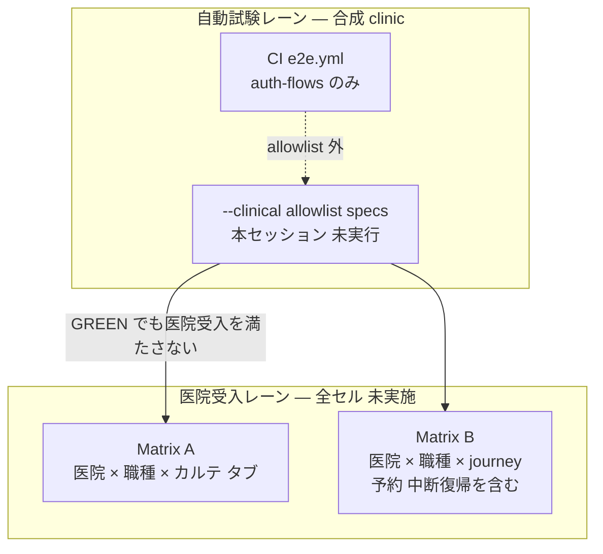

# SLACK-CLINICAL-UAT — clinic × role × clinical-flow map (docs-only)

Campaign `remaining-ops-20260920` revision 1. Unit `SLACK-CLINICAL-UAT`. Attempt `att-slack-clinical-uat-20260920-001`. Claim `claim/SLACK-CLINICAL-UAT`. Prompt SHA-256 `7f6037513abf8b030c81c746994213088bc6ff42364f9a4d5307a92b56c58113`.

Maps 9 chart tabs and the clinical E2E allowlist onto clinic × 受付/獣医師/看護. Binding sources:

- [todo-issue.md](../../../todo-issue.md) `### SLACK-CLINICAL-UAT` (L258–L262) and `### SLACK-UAT-SCHEDULE` (L270–L274)
- [medical-record-form-model.ts](../../../frontend/src/features/medical-records/routes/medical-record-form-model.ts) `MEDICAL_RECORD_TABS` L4–L14
- [frontend/scripts/run-e2e.sh](../../../frontend/scripts/run-e2e.sh) `CLINICAL_SPECS` L34; `--clinical` fail-closed L60–L88
- [todo-verification.md](../../../todo-verification.md) `TODO-V-CLINICAL-E2E / QA-FULL-CLINICAL-E2E` L34, L95, L135–L141
- [CLINICAL-E2E-DESIGN.md](../../ops/testing/CLINICAL-E2E-DESIGN.md)
- [LINMIG-231.md](../linmig-campaign-20260919/LINMIG-231.md) clinical E2E cells (docs map only; `--clinical` 未実行)
- Clinic catalog names: [002_master/clinics.csv](../../../backend/migrations/seeds/002_master/clinics.csv) L2–L5; asserted in [seed_env_gate_test.go](../../../backend/cmd/migrate/seed_env_gate_test.go) L113–L116

Worktree `/Users/minoru/Dev/Case/AnimalHospital/AnimalEkarte-rem-slack-clinical-uat` on `feat/rem-slack-clinical-uat-20260920` at HEAD `873685b0bea3692c2f8100b19ded660c8357f2b0`. Sheet date: 2026-09-20. Local files only.

This unit does **not** run hospital UAT, Playwright, `--clinical`, Docker app tests, or sign-off. **Every hospital-acceptance cell stays 未実施.** Auto-test GREEN, helper GREEN, auth smoke, and this mapping sheet are **not** hospital acceptance.

## Binding rules (cited)

| Rule | Source | This unit |
|------|--------|-----------|
| 自動テストの対象と実際の現場手順を区別する。自動テスト成功を全院受入にしない | todo-issue L261–L262 | Auto-test column ≠ hospital UAT column |
| 準備時の実際値は「未実行」。source/unit/CI とブラウザ UAT を分ける | todo-verification L11–L14, L20 | All hospital actuals = **未実施**. `--clinical` this session = **未実行** |
| helper + allowlist 置換済み / `--clinical` 未実行 / full suite は別承認。設計・局所 GREEN だけでは E2E を PASS にしない | CLINICAL-E2E-DESIGN L3, L5 | Design/helper is not a run |
| `medical-records-create` synthetic interceptor は DB 作成/永続化を証明しない | CLINICAL-E2E-DESIGN L38 | Stub ≠ persist ≠ hospital save |
| clinic 1/2 を `--clinical` fixture に使わない | run-e2e.sh L80–L82; design L27 | Catalog names 八王子病院 / 城東センター病院 are **not** the synthetic `--clinical` clinic |
| 会計・予約 specs は第 2 allowlist。初回 `--clinical` には入れない | design L15 | 予約 hospital flow is **not** covered by the 10-spec allowlist |
| auth smoke / `e2e.yml` 成功を clinical PASS にしない | design L13, L60; todo-verification L141 | CI remains `auth-flows.spec.ts` only |
| role → permission 推論はしない。`permission_group_ids` は manifest 明示値のみ | STAFF_ACCOUNT_PROVISIONING I-ROLE **未記入** | Roles here are the three operational windows named in todo-issue, not inferred groups |
| 実送信は別承認。臨床手順・受入者が不明ならそのケースを止める | todo-issue L262 | Assignees / 実施枠 = **UNKNOWN**. No invented roster |
| LINMIG-231: `--clinical` 未実行 is not #254 close | LINMIG-231 clinical cells | This sheet does not close P4 / #254 |

## Clinics (catalog names, not a run)

Source: `002_master/clinics.csv` L2–L5. These names identify the four seeded clinics. They are **not** proof of UAT accounts, dedicated STG tenants, or `--clinical` fixture IDs.

| Catalog `id` | Name | Use in this sheet | `--clinical` fixture? |
|--------------|------|-------------------|------------------------|
| 1 | 八王子病院 | Hospital UAT dimension | **Forbidden** as `--clinical` clinic (reserved) |
| 2 | 城東センター病院 | Hospital UAT dimension | **Forbidden** as `--clinical` clinic (reserved) |
| 3 | ノア動物病院　敷島病院 | Hospital UAT dimension | Not the synthetic `--clinical` clinic unless a new fixture id is issued at run time |
| 4 | ノア動物病院　Hako bu neco | Hospital UAT dimension | Same |

`--clinical` creates **one synthetic clinic** with id ≠ 1 and ≠ 2 (`run-e2e.sh` L78–L82). That synthetic clinic is **not** any of the four hospital UAT rows. Hospital UAT for the named hospitals requires an approved UAT tenant / identity (UAT-ENV-SETUP); those receipts are **UNKNOWN** here.

Hospital UAT assignee / 実施枠 / 配信 revision: **UNKNOWN** (SLACK-UAT-SCHEDULE owns schedule collection; this sheet does not invent dates or names).

## Roles (operational windows)

Source: todo-issue L261 (`医院×職種`), L273 (`医院×受付/獣医師/看護`). Occupation master examples in tests include `獣医師` / `看護師`; this sheet does **not** treat those test strings as a live roster.

| Role (window) | Why listed | Permission group | Hospital assignee |
|---------------|------------|------------------|-------------------|
| 受付 | UAT-SCHEDULE L273; clinical-smoke has `/` 「当日の受付」 (clinical-smoke.spec.ts L16) | **未記入** (I-ROLE). Do not infer | **UNKNOWN** |
| 獣医師 | UAT-SCHEDULE L273; chart 9 tabs are physician chart surfaces | **未記入** | **UNKNOWN** |
| 看護 | UAT-SCHEDULE L273; CLINICAL-UAT 「診療/看護一連」 L260 | **未記入** | **UNKNOWN** |

トリマー / 執行 / 一般 / 林 文明 catalog login seed are **out of this matrix**. Login seed is not hospital UAT (UAT-ENV-SETUP L51–L53).

## 9 chart tabs (code)

Source: `MEDICAL_RECORD_TABS` in medical-record-form-model.ts L4–L14. Aliases L21–L45 are navigation aliases, not extra tabs.

| # | Tab label (exact) | Alias keys (not extra tabs) |
|---|-------------------|-----------------------------|
| 1 | 問診 | `interview` |
| 2 | 診察/治療プラン | `plan` |
| 3 | 治療 | `treatment` |
| 4 | 予防接種 | `vaccination`, `vaccinations` |
| 5 | 定期健診 | `checkup`, `checkups` |
| 6 | 検査 | `examinations`, `exam` |
| 7 | 画像 | `image`, `images` |
| 8 | 見積書 | `estimate`, `estimates` |
| 9 | 会計(医師確認) | `accounting` |

入院・ホテル, トリミング, 予約, 受付一覧, 顧客集計 are **not** among the 9 tabs. Some appear on the `--clinical` allowlist as separate specs/smoke routes.

## Matrix A — clinic × role × 9 tabs (hospital UAT)

Expected hospital behavior (todo-issue L262): same-patient input on the tab, save, reload. This session did not open a hospital browser. **Every cell = 未実施.**

Legend: `未実施` = hospital UAT not run for that clinic × role × tab. Auto-test coverage, if any, is Matrix C and does **not** fill these cells.

| Clinic | Role | 問診 | 診察/治療プラン | 治療 | 予防接種 | 定期健診 | 検査 | 画像 | 見積書 | 会計(医師確認) |
|--------|------|------|-----------------|------|----------|----------|------|------|--------|----------------|
| 八王子病院 | 受付 | 未実施 | 未実施 | 未実施 | 未実施 | 未実施 | 未実施 | 未実施 | 未実施 | 未実施 |
| 八王子病院 | 獣医師 | 未実施 | 未実施 | 未実施 | 未実施 | 未実施 | 未実施 | 未実施 | 未実施 | 未実施 |
| 八王子病院 | 看護 | 未実施 | 未実施 | 未実施 | 未実施 | 未実施 | 未実施 | 未実施 | 未実施 | 未実施 |
| 城東センター病院 | 受付 | 未実施 | 未実施 | 未実施 | 未実施 | 未実施 | 未実施 | 未実施 | 未実施 | 未実施 |
| 城東センター病院 | 獣医師 | 未実施 | 未実施 | 未実施 | 未実施 | 未実施 | 未実施 | 未実施 | 未実施 | 未実施 |
| 城東センター病院 | 看護 | 未実施 | 未実施 | 未実施 | 未実施 | 未実施 | 未実施 | 未実施 | 未実施 | 未実施 |
| ノア動物病院　敷島病院 | 受付 | 未実施 | 未実施 | 未実施 | 未実施 | 未実施 | 未実施 | 未実施 | 未実施 | 未実施 |
| ノア動物病院　敷島病院 | 獣医師 | 未実施 | 未実施 | 未実施 | 未実施 | 未実施 | 未実施 | 未実施 | 未実施 | 未実施 |
| ノア動物病院　敷島病院 | 看護 | 未実施 | 未実施 | 未実施 | 未実施 | 未実施 | 未実施 | 未実施 | 未実施 | 未実施 |
| ノア動物病院　Hako bu neco | 受付 | 未実施 | 未実施 | 未実施 | 未実施 | 未実施 | 未実施 | 未実施 | 未実施 | 未実施 |
| ノア動物病院　Hako bu neco | 獣医師 | 未実施 | 未実施 | 未実施 | 未実施 | 未実施 | 未実施 | 未実施 | 未実施 | 未実施 |
| ノア動物病院　Hako bu neco | 看護 | 未実施 | 未実施 | 未実施 | 未実施 | 未実施 | 未実施 | 未実施 | 未実施 | 未実施 |

12 rows × 9 tabs = **108 未実施 cells**.

## Matrix B — clinic × role × hospital journey (todo-issue L262)

Hospital completion contract (not auto-test): 同一患者の **入力 → 保存 → 処置/検査 → 予約 → 再読込**, plus **医院/権限分離** and **中断時の復帰**, on an approved fixture.

| Clinic | Role | 入力 | 保存 | 処置/検査 | 予約 | 再読込 | 医院/権限分離 | 中断復帰 |
|--------|------|------|------|-----------|------|--------|----------------|----------|
| 八王子病院 | 受付 | 未実施 | 未実施 | 未実施 | 未実施 | 未実施 | 未実施 | 未実施 |
| 八王子病院 | 獣医師 | 未実施 | 未実施 | 未実施 | 未実施 | 未実施 | 未実施 | 未実施 |
| 八王子病院 | 看護 | 未実施 | 未実施 | 未実施 | 未実施 | 未実施 | 未実施 | 未実施 |
| 城東センター病院 | 受付 | 未実施 | 未実施 | 未実施 | 未実施 | 未実施 | 未実施 | 未実施 |
| 城東センター病院 | 獣医師 | 未実施 | 未実施 | 未実施 | 未実施 | 未実施 | 未実施 | 未実施 |
| 城東センター病院 | 看護 | 未実施 | 未実施 | 未実施 | 未実施 | 未実施 | 未実施 | 未実施 |
| ノア動物病院　敷島病院 | 受付 | 未実施 | 未実施 | 未実施 | 未実施 | 未実施 | 未実施 | 未実施 |
| ノア動物病院　敷島病院 | 獣医師 | 未実施 | 未実施 | 未実施 | 未実施 | 未実施 | 未実施 | 未実施 |
| ノア動物病院　敷島病院 | 看護 | 未実施 | 未実施 | 未実施 | 未実施 | 未実施 | 未実施 | 未実施 |
| ノア動物病院　Hako bu neco | 受付 | 未実施 | 未実施 | 未実施 | 未実施 | 未実施 | 未実施 | 未実施 |
| ノア動物病院　Hako bu neco | 獣医師 | 未実施 | 未実施 | 未実施 | 未実施 | 未実施 | 未実施 | 未実施 |
| ノア動物病院　Hako bu neco | 看護 | 未実施 | 未実施 | 未実施 | 未実施 | 未実施 | 未実施 | 未実施 |

12 rows × 7 journey steps = **84 未実施 cells**.

予約 is required for hospital completion and is **absent** from the first `--clinical` allowlist (design L15). Filling a green `--clinical` run would still leave Matrix B 予約 = 未実施 unless a hospital 予約→再読込 receipt exists.

## Matrix C — `--clinical` allowlist vs tabs vs hospital UAT

Allowlist source: `run-e2e.sh` L34; restated todo-verification L141. Ten specs. This session did **not** invoke `--clinical`. Bound docs say `--clinical` **未実行** (CLINICAL-E2E-DESIGN L3, L93–L97; LINMIG-231 clinical cells).

CI [`.github/workflows/e2e.yml`](../../../.github/workflows/e2e.yml) runs `auth-flows.spec.ts` only (design L13, L45, L91; todo-verification L141). Auth smoke is **out** of this allowlist.

自動試験レーンと医院受入レーンの分離:

| Spec (`frontend/e2e/…spec.ts`) | Nearest 9-tab / journey surface | Persist vs stub (bound) | Auto-test this session | Hospital UAT (any clinic × role) |
|--------------------------------|----------------------------------|-------------------------|------------------------|----------------------------------|
| `clinical-flows` | カルテ一覧・検索・行遷移・ペット選択 (clinical-flows.spec.ts L19–L75). Not a named tab save | Fixture read of synthetic records; not hospital save | **未実行** | **未実施** |
| `clinical-smoke` | 受付 `/`, 顧客集計, カルテ, 入院, トリミング, 検査管理, 予防接種管理, 定期健診 headings (clinical-smoke.spec.ts L16–L110). Heading visible ≠ tab save | Smoke visibility on synthetic clinic | **未実行** | **未実施** |
| `medical-records-create` | New chart path | **Stub.** Synthetic interceptor locally fulfills POST; **does not prove DB create/persist** (design L38) | **未実行** | **未実施**. Stub GREEN would still be 未実施 for hospital 保存 |
| `medical-records-patient-search` | Chart list search (not a tab) | Search on synthetic fixture | **未実行** | **未実施** |
| `medical-records-pagination-sort` | Chart list (not a tab) | List on synthetic fixture | **未実行** | **未実施** |
| `examinations-flow` | Tab 検査 + `/examinations` | Allowlist data-dependent; still not hospital 検査 | **未実行** | **未実施** |
| `vaccinations-flow` | Tab 予防接種 + `/vaccinations` | Same | **未実行** | **未実施** |
| `checkups-flow` | Tab 定期健診 + `/checkups` | Same | **未実行** | **未実施** |
| `hospitalization-flow` | **Not a 9-tab.** S05 補完; does not replace UAT-254 5 flows (close checklist L25; LINMIG-231) | Allowlist; not hospital 入院受入 | **未実行** | **未実施** |
| `estimates-flow` | Tab 見積書 | Allowlist; not hospital 見積 | **未実行** | **未実施** |

Tabs with **no** dedicated allowlist spec: **問診**, **診察/治療プラン**, **治療**, **画像**, **会計(医師確認)**. `clinical-flows` / `clinical-smoke` do not fill those hospital tab cells.

Allowlist gaps vs hospital journey:

| Hospital step | In first `--clinical` allowlist? |
|---------------|-----------------------------------|
| 入力 (chart tabs) | Partial (create is stub; several tabs have no spec) |
| 保存 / 再読込 persist | **No** for `medical-records-create` (stub). Other specs are not hospital persist receipts |
| 処置/検査 | `examinations-flow` only as auto-test; 治療 tab has no spec |
| 予約 | **No** (design L15 第2 allowlist) |
| 医院/権限分離 | Synthetic single clinic; clinic 1/2 rejected. Not four-hospital isolation UAT |
| 中断復帰 | **No** dedicated spec |

## What must not be treated as hospital acceptance

| Candidate | Why it is not hospital UAT |
|-----------|----------------------------|
| This mapping sheet | Docs-only. Actuals 未実施 / 未実行 |
| `--clinical` GREEN (if later run) | Synthetic clinic ≠ 4 hospitals; stub create ≠ 保存; 予約 missing; todo-issue L262 forbids treating auto-test success as 全院受入 |
| Auth smoke / `e2e.yml` | Out of allowlist (design L60; todo-verification L141) |
| Helper `internal/clinicale2e` / fixture CLI | Helper ≠ run (design L86–L87, L113; LINMIG-231) |
| Login seed 4-clinic catalog / 林 文明 | UAT-ENV-SETUP L51–L53: not dedicated UAT identity |
| LINMIG-231 / this unit COMPLETE | Maps cells; does not run UAT or close #254 |
| Local/mock LIFF or mock LSTEP | Real send is separate approval (todo-issue L262; UAT-254 L7) |
| SLACK-INTAKE classification | Window Q&A is not clinical journey (SLACK-INTAKE: keep CLINICAL-UAT separate) |
| SLACK-BILLING-UAT | Accounting printer/close is a different unit; 会計(医師確認) tab here is still 未実施 |

## Out of scope (this unit)

- Running `--clinical`, Playwright, Docker app tests, hospital browser UAT
- Inventing staff names, emails, permission_group_ids, or 実施枠
- Mutating the campaign ledger, `todo-issue.md`, scenario sources, or application code
- Closing P4 / GitHub #254 / Linear Done
- Real LINE / LSTEP / 実送信
- Filling `reports/uat-YYYY-MM-DD/` (no run this session)

Follow-up (not this unit): SLACK-UAT-SCHEDULE collects 実施/未実施者; hospital operators run Matrix A/B on approved fixtures and write receipts under `reports/uat-YYYY-MM-DD/`. `--clinical` remains a separate local/CI lane and still cannot flip Matrix A/B off 未実施.
