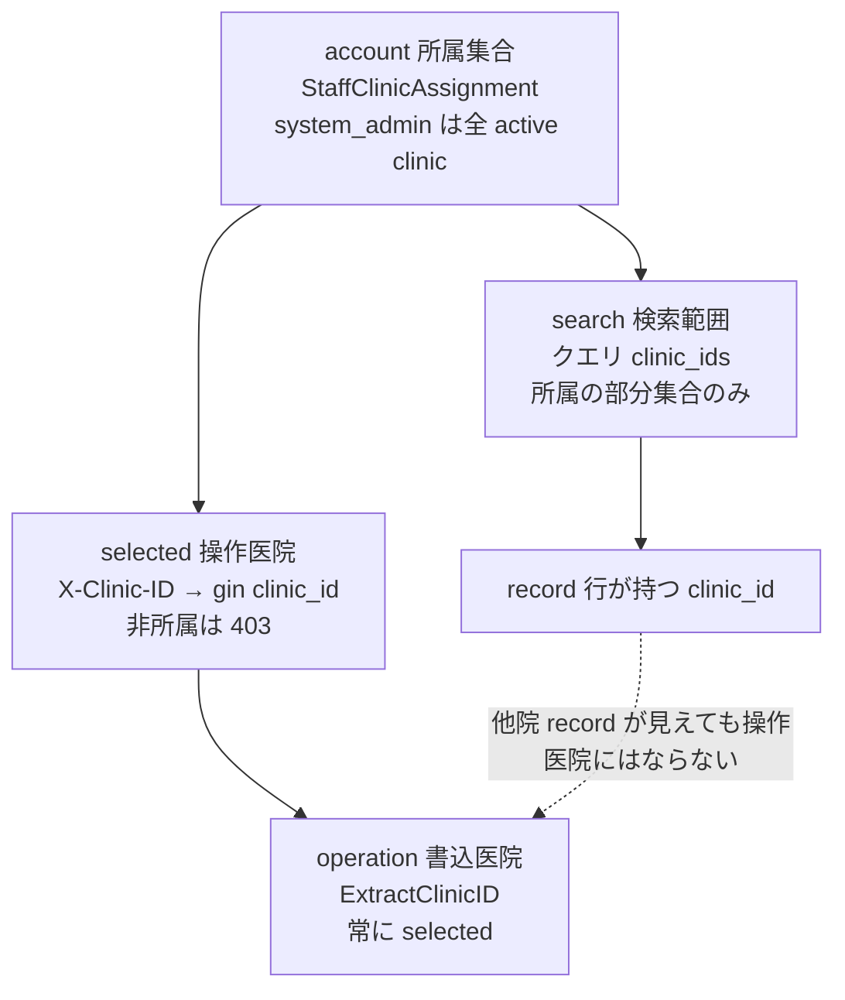

# SLACK-CROSS-CLINIC: 所属・選択医院・検索・記録・操作医院の対応表

状態: **コード照合 READY／PO 対象医院リスト UNKNOWN／境界変更なし**。出典は [todo-issue.md](../../../todo-issue.md) 見出し `### SLACK-CROSS-CLINIC`（L178–182、索引 L404）。保持する現場条件:

- 山梨の他院患者を検索して受付したい、という要望。**代表アカウントという返信は、単なる同院検索の不具合ではない**（出典 643–697、725–735、832–847）
- 安全な調査は開始可。裁定前の医院境界変更は停止
- `clinic_id` 検証の削除や全院無条件共有で解決しない

本ファイルは製品コードから import されない。キャンペーン unit `SLACK-CROSS-CLINIC`（`remaining-ops-20260920` revision 1）の owned path および人間が読む対応表である。照合 revision `873685b0bea3692c2f8100b19ded660c8357f2b0`（`feat/rem-slack-cross-clinic-20260920`）。本票は調査のみ。製品の clinic isolation を外す変更は含まない。

## 実践ゲート（実装しない理由）

[product-philosophy.md](../../product-philosophy.md) の 5 ステップをこの要望に当てると、①要件を疑う段階で止まる。

1. **要件を疑う:** 「他院患者を検索して受付」は画面要望であり、対象医院・閲覧/受付/編集/会計の権限・新規診療の帰属が未裁定。責任者個人名と許可/拒否ケースが無い。
2. **削除:** 同院検索バグとして扱うと STAFF-SELECT と混線する。代表アカウント条件を消さない。
3. **簡素化:** 既存 `#86` は **所属の部分集合の一覧表示**であり、他院レコードへの受付 write ではない。
4. **サイクル短縮 / 自動化:** 境界未裁定のまま検索範囲を広げる自動化は禁止。

裁定前に isolation を外す最適化は①違反。本票は対応表まで。

## 医院事実（コード外・UNKNOWN）

| 項目 | 文書で分かること | 医院事実 |
| --- | --- | --- |
| 対象医院の明示リスト（八王子を含むか） | PO 停止条件に「八王子を含むかも明記」とある | **UNKNOWN**。本票で医院名簿を作らない |
| 閲覧 / 受付 / 編集 / 会計の権限割当 | コードは resource×action を医院ごとに検証する | **UNKNOWN**。PO 裁定なし |
| 新規診療・予約の帰属医院 | write は選択中 `clinic_id` に固定（下記対応表） | 他院患者をどの医院の予約/カルテにするかは **UNKNOWN** |
| 「代表アカウント」の実体 | Slack 追加条件。コード上の `is_system_admin` と同一とは限らない | **UNKNOWN**。system_admin 全 active clinic 権限と同一視しない |
| 許可・拒否ケースと監査方法 | 切替監査は `prev_clinic_id` cookie 差分の best-effort | 業務監査の受理方法は **UNKNOWN** |

## 混ぜてはいけない読み替え

| 禁止 | 理由 |
| --- | --- |
| 同院検索の不具合として直す | 代表アカウント条件がある。STAFF-SELECT（担当者選択 UI）と分離 |
| `clinic_ids` クエリを外して全件返す | isolation 削除。`ResolveListClinicIDs` は所属外 1 件でも 403 |
| 検索できたレコード医院へ自動で受付 write | 一覧 scope と操作医院は別。write は選択中 `clinic_id` |
| system_admin を代表アカウントと断定する | コード事実と Slack 用語の同一視は PO 事項 |
| 飼主/ペットの `clinic_id` を付け替えて他院受付を成立させる | テナント行の付け替えは共有設計ではない |

## 対応表（account / selected / search / record / operation）

列の定義:

- **account:** ログイン職員の所属集合（request ごとに再検証）
- **selected:** 操作対象の単一医院（`X-Clinic-ID` → gin `clinic_id`）
- **search:** 一覧の読み取り範囲（クエリ `clinic_ids`、未指定は selected のみ）
- **record:** 永続行が持つ `clinic_id`（飼主・ペット・予約・カルテ・会計）
- **operation:** 作成・更新・削除が書き込む医院

| 層 | account（所属） | selected（選択医院） | search（検索範囲） | record（記録の医院） | operation（操作医院） |
| --- | --- | --- | --- | --- | --- |
| 認証 middleware | `CurrentAccess.ClinicIDs` を gin `clinic_ids` に載せる。一般職員は active な `StaffClinicAssignment`。system_admin は全 active clinic | `resolveClinicID`: ヘッダ無しなら claims/main の所属内 ID。`X-Clinic-ID` は所属集合の元のみ採用。非所属は 403 `not assigned to this clinic` | この層では検索しない | なし | なし（コンテキスト確立のみ） |
| 飼主・ペット一覧 | 同上 | axios 既定ヘッダの選択医院 | URL `?clinics=` → API `clinic_ids`。未指定は現在医院のみ。サーバ `ResolveListClinicIDsForPermission(..., owners, view)` | 各 pet 行の `clinic_id` を FE `clinicId` に写す | 一覧は read。Create/Update pet は `ExtractClinicID`（selected） |
| カルテ一覧 hook | 同上 | 同上 | `filters.clinicIds` を `clinic_ids` に結合。未指定・現在医院のみなら FE はパラメータを送らず、サーバ既定は selected 1 件 | カルテ行の医院 | 一覧は read。Create/Update/Delete は `ExtractClinicID` |
| 予約/受付 | 同上。担当医は `checkDoctorClinicAssignment` で **操作医院**所属を要求 | Create は `ExtractClinicID` | List は `reservations:view` 付き list scope | 予約行の `clinic_id` | 新規受付・更新・削除・カルテ自動作成はすべて selected。他院 record を検索できても、その record 医院へ自動 write しない |
| 会計一覧 | 同上 | 同上 | `accounting:view` 付き list scope | 会計行の医院 | 締め後編集など write は selected + 医院 grant。本票は会計権限の PO 裁定をしない |

### 5 列を一文で

職員が所属する医院の **部分集合**だけを検索できる。画面の操作（受付・カルテ作成・会計 write）は **今選択している 1 医院**に固定される。検索で見えた他院レコードの `clinic_id` は、選択医院と一致しない限り操作医院にならない。

5 層の関係の概形:



## コード根拠（引用）

### 1. アカウント所属（account）

`backend/internal/middleware/auth.go` は request ごとに current access を載せ、所属集合と選択医院を分離する。

```132:149:backend/internal/middleware/auth.go
		// クリニック切替: X-Clinic-ID ヘッダーが送信された場合、所属チェック後に上書き（BUG-128）
		clinicID, ok := resolveClinicID(
			c,
			requestClaims,
			currentAccess.MainClinicID,
			isProduction,
			auditSvc,
		)
		if !ok {
			return
		}
		c.Set("user_id", requestClaims.UserID)
		c.Set("is_system_admin", requestClaims.IsSystemAdmin)
		c.Set("clinic_id", clinicID)
		c.Set(
			"clinic_ids",
			append([]uint64(nil), requestClaims.ClinicIDs...),
		)
```

非所属ヘッダは 403。検証を削除する経路は無い。

```358:370:backend/internal/middleware/auth.go
	headerID, err := strconv.ParseUint(headerClinicID, 10, 64)
	if err != nil || headerID == 0 {
		respondError(c, http.StatusBadRequest, "invalid clinic id")
		return "", false
	}
	if !slices.Contains(claims.ClinicIDs, headerID) {
		respondErrorWithCode(
			c,
			http.StatusForbidden,
			"not assigned to this clinic",
			apperrors.CodeClinicSelectionUnavailable,
		)
		return "", false
	}
```

所属の中身: 一般職員は active assignment、system_admin は active clinic 一覧（`backend/internal/auth/http_response.go` L157–176）。Slack の「代表アカウント」をこの分岐へ写さない。

### 2. 選択医院（selected）

フロントは localStorage の選択 ID を `X-Clinic-ID` に載せる。呼び出し元が既に付けたヘッダは上書きしない。

```33:43:frontend/src/lib/axios.ts
  // クリニック切替: localStorage の選択クリニック ID をヘッダーで送信
  // バックエンドの auth ミドルウェアが X-Clinic-ID を優先して clinic_id コンテキストを上書きする
  // PR #186 review (P2-11/12/15): 拠点横断で取得したレコード（billing/medical record 等）の
  // 子リソースを操作する場合、呼び出し元が個別に X-Clinic-ID を指定できる必要がある。
  // 呼び出し元が既にヘッダーを設定している場合はそれを優先し、グローバル選択値で上書きしない。
  if (config.headers["X-Clinic-ID"] === undefined) {
    const clinicId = getStoredClinicId();
    if (clinicId !== null) {
      config.headers["X-Clinic-ID"] = clinicId;
    }
  }
```

write API は gin `clinic_id` を `ExtractClinicID` で取る（`backend/internal/httpapi/context.go` L104–108）。

### 3. 検索範囲（search）— 飼主 loader

```136:165:frontend/src/features/owners/loaders.ts
/**
 * 飼主・ペット一覧ローダー — #266: GET /v1/pets をペット行粒度でサーバサイドページネーション取得する
 * （owners-pets-list-plan.md の PO 決定: owners API+EXISTS 応急案ではなく pets API 拡張を正本とする）。
 * URL の page/search/species/include_deceased をそのまま backend に転送する
 * （species は animal_species_id 数値、include_deceased 未指定 = 生存のみが既定）。
 * #86: URL の ?clinics=1,2 を API の clinic_ids に引き渡し拠点横断取得する
 * （所属検証はサーバ側 resolveListClinicIDs が行う。未指定は現在の医院のみ）。
 */
export const ownersLoader = async ({
  request,
}: {
  request: Request;
}): Promise<OwnersLoaderData> => {
  try {
    const searchParams = new URL(request.url).searchParams;
    const clinics = searchParams.get("clinics") ?? undefined;
    // ...
    const { data: result } = await axios.get<PetsResponse>("/v1/pets", {
      params: {
        ...(clinics ? { clinic_ids: clinics } : {}),
```

URL トグルは所属医院 UI 上の選択であり、サーバ再検証が正本。

```117:125:frontend/src/features/owners/routes/OwnersList.tsx
  // #86: 拠点横断表示 — URL の ?clinics=1,2 が表示拠点。未指定は現在の医院のみ（従来挙動）。
  // 選択変更で loader が再実行され、サーバ側 (resolveListClinicIDs) で所属検証される。
  const {
    assignedClinics,
    selectedClinicIds,
    isMultiClinic,
    clinicNameById,
    currentClinicId,
    handleToggleClinic,
  } = useClinicScope({ resetParamsOnToggle: CLINIC_TOGGLE_RESET_PARAMS });
```

`useClinicScope` は `user.clinics`（所属）と `?clinics=`（検索選択）と `currentClinicId`（操作医院）を分ける（`frontend/src/hooks/use-clinic-scope.ts` L21–79）。

サーバ list scope:

```167:193:backend/internal/httpapi/context.go
// ResolveListClinicIDs は一覧系 API の拠点横断スコープ (#86) を解決する。
// クエリパラメータ clinic_ids（カンマ区切り）が:
//   - 無い場合: JWT/X-Clinic-ID 由来の現在の医院のみ（従来挙動・後方互換）
//   - ある場合: 所属医院 (clinic_ids context) の部分集合であることを検証して採用。
//     1件でも現在のactive clinic権限外なら403。system_adminのcontextには全active clinicが入る。
func ResolveListClinicIDs(c *gin.Context) ([]uint64, bool) {
	clinicID, ok := ExtractClinicID(c)
	if !ok {
		return nil, false
	}
	raw := c.Query("clinic_ids")
	if raw == "" {
		return []uint64{clinicID}, true
	}
	requested, err := ParseClinicIDsParam(raw)
	if err != nil {
		RespondError(c, err)
		return nil, false
	}
	if !AuthorizeClinicIDs(c, requested) {
		return nil, false
	}
	return requested, true
}
```

権限の二次フィルタ: 所属を通したあと `owners:view` 等の grant が無い医院は落とす。明示の非所属 ID は 403 のまま（`backend/internal/httpapi/clinic_permission.go` L148–158）。ペット一覧は `owners:view`（`backend/internal/pet/pet_handler.go` L88–96）。

### 4. 検索範囲（search）— カルテ hook

```49:72:frontend/src/hooks/use-medical-records.ts
export async function getMedicalRecords(
  filters?: MedicalRecordFilters,
): Promise<MedicalRecordsResult> {
  const params: Record<string, string | number> = {
    page: filters?.page ?? DEFAULT_PAGE,
    limit: filters?.limit ?? DEFAULT_LIMIT,
  };
  if (filters?.startDate) params.start_date = filters.startDate;
  if (filters?.endDate) params.end_date = filters.endDate;
  if (filters?.petId) params.pet_id = filters.petId;
  if (filters?.ownerId) params.owner_id = filters.ownerId;
  if (filters?.clinicIds?.length) {
    params.clinic_ids = filters.clinicIds.join(",");
  }
  // ...
  const { data } = await axios.get<MedicalRecordsListResponse>("/v1/medical-records", {
    params,
  });
```

一覧画面は「現在医院だけ」のとき `clinic_ids` を送らない（サーバ既定 = selected）。複数または非現在医院のときだけ送る。

```130:138:frontend/src/features/medical-records/routes/MedicalRecords.tsx
  const clinicIdsForApi =
    selectedClinicIds.length === 0 ||
    (selectedClinicIds.length === 1 && selectedClinicIds[0] === currentClinicId)
      ? undefined
      : selectedClinicIds;
  const { records, total, isLoading, isError } = useMedicalRecordsList({
    searchTerm: deferredSearch,
    activeFilters,
    clinicIds: clinicIdsForApi,
```

サーバ List は `medical-records:view`（`backend/internal/medicalrecord/medical_record_handler.go` L25–32）。

### 5. 記録の医院（record）と操作医院（operation）

| write | 医院の取り方 | 記録の帰属 |
| --- | --- | --- |
| `CreatePet` | `ExtractClinicID` | 新規ペットは selected 医院 |
| `CreateMedicalRecord` / Update / Delete | `ExtractClinicID` | カルテは selected 医院。List の他院 ID を body で上書きしない |
| `CreateReservation`（院内受付） | `ExtractClinicID` + 担当医の同医院所属 | 予約は selected。confirmed 時のカルテ自動作成も同じ `clinicID` |
| 予約 List | `ResolveListClinicIDsForPermission(..., reservations, view)` | 読取のみ |

```143:182:backend/internal/reservation/reservation_handler.go
func (h *CRUDHandler) CreateReservation(c *gin.Context) {
	clinicID, ok := httpapi.ExtractClinicID(c)
	if !ok {
		return
	}
	// ...
	if svcInput.DoctorID != nil {
		if err := h.checkDoctorClinicAssignment(ctx, clinicID, *svcInput.DoctorID); err != nil {
			respondError(c, err)
			return
		}
	}
	reservation, err := h.svc.Create(ctx, svcInput)
	// ...
	if shouldAutoCreateMedicalRecordForReservation(reservation) && h.medicalRecord != nil {
		h.medicalRecord.AutoCreateFromReservation(ctx, clinicID, reservation)
	}
```

```99:123:backend/internal/medicalrecord/medical_record_handler.go
func (h *MedicalRecordHandler) CreateMedicalRecord(c *gin.Context) {
	clinicID, ok := httpapi.ExtractClinicID(c)
	if !ok {
		return
	}
	// ...
	record, err := h.service.Create(ctx, clinicID, &svcInput)
```

```192:204:backend/internal/pet/pet_handler.go
func (h *Handler) CreatePet(c *gin.Context) {
	clinicID, ok := httpapi.ExtractClinicID(c)
	if !ok {
		return
	}
	// ...
	pet, err := h.pets.Create(c.Request.Context(), clinicID, input)
```

会計 List も同じ list-scope パターン（`backend/internal/billing/accounting_handler.go` L35–41）。会計 write 権限の業務裁定は PO。コードは view grant のない医院を list から落とす。

## 現状が要望と食い違う点（実装しない）

現場要望は「山梨の他院患者を検索して **受付**したい」。現行 `#86` が満たすのは:

- 職員が **所属している**医院のペット/カルテ/予約を、URL で選んで **一覧表示**できる
- 所属外 ID を `clinic_ids` に混ぜると 403
- 受付・カルテ作成は **選択医院**にしか書けない

したがって、所属していない医院の患者検索も、所属他院の患者を選択医院の予約として受け付けることも、この対応表のままでは成立しない。成立させるには PO が次を決める必要がある（本票では決めない）:

1. 対象医院の明示リスト（八王子を含むか）
2. 医院ごとの閲覧 / 受付 / 編集 / 会計
3. 新規診療の帰属（検索で当たった record 医院か、操作医院か）
4. 許可ケースと拒否ケース、監査 sink

未裁定のまま isolation を外す案は対象外。

## 隔離が残っていることの確認

本票作成時に製品コードは変更していない。残っている検証:

- `AuthorizeClinicIDs` は requested ⊆ gin `clinic_ids`
- 非所属 `X-Clinic-ID` は 403
- list の未指定 `clinic_ids` は selected 1 件
- write は `ExtractClinicID`（selected）
- 予約担当医は操作医院の assignment 必須

## PO への質問（既存本文。再質問を増やさない）

[todo-issue.md](../../../todo-issue.md) L182 のとおり:

- 対象医院の明示リスト（八王子を含むかも明記）
- 閲覧 / 受付 / 編集 / 会計それぞれの権限
- 新規診療の帰属
- 許可・拒否双方のケースと監査方法

本票は病院リストを **UNKNOWN** のまま残す。

## 検証（docs-only）

- `git diff --check` / `git diff --name-only` / `git diff --cached --name-only` / `git ls-files --others --exclude-standard`
- 本パスと cited 3 ファイル（`loaders.ts` / `use-medical-records.ts` / `auth.go`）の `clinic_id` / `clinic_ids`
- `git ls-files --error-unmatch docs/work/remaining-campaign-20260920/SLACK-CROSS-CLINIC.md`
- Docker アプリテストは対象外
