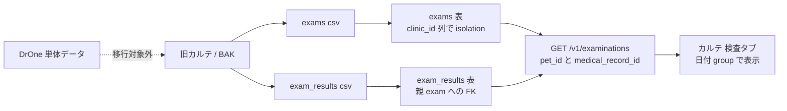

# SLACK-EXAM-HISTORY — legacy exam-history mapping

Campaign `remaining-ops-20260920` revision 1, unit `SLACK-EXAM-HISTORY`, claim `claim/SLACK-EXAM-HISTORY`.
Attempt `att-slack-exam-history-20260920-001`. Prompt SHA `892801857a136265bc8d792bafc776dc3972a4754545ac30b9b59f372de8dcfb`.
Worktree `/Users/minoru/Dev/Case/AnimalHospital/AnimalEkarte-rem-slack-exam-history` on `feat/rem-slack-exam-history-20260920` at HEAD `873685b0b`. Sheet date: 2026-09-21.

Docs-only. This unit does **not** query STG/PROD, inspect live CSV cells, invent row counts, treat DrOne standalone data as in-scope, or run `make csv-import*` / `make stg-uat-handoff`. **Actual counts: 未実行 / UNKNOWN.**

Binding: [todo-issue.md](../../../todo-issue.md) heading `### SLACK-EXAM-HISTORY` (L288–L292); [MedicalRecordExamination.tsx](../../../frontend/src/features/medical-records/components/MedicalRecordExamination.tsx); [get-record-examinations.ts](../../../frontend/src/features/medical-records/api/get-record-examinations.ts); [CLINIC_CSV_IMPORT.md](../../ops/deploy/CLINIC_CSV_IMPORT.md). Connects to HAC remainder ([todo-issue.md](../../../todo-issue.md) `#slack-hac-import`; sibling sheet [SLACK-HAC-IMPORT](SLACK-HAC-IMPORT.md) if present in another worktree).

This file is a campaign investigation sheet. Product modules do not import it. Callers are the campaign controller (`units.json` unit `SLACK-EXAM-HISTORY` `owned_paths`) and operators reading `docs/work/remaining-campaign-20260920/`. Human pointers: [todo-issue.md](../../../todo-issue.md) L288–L292 and [SLACK-INTAKE.md](../todo-campaign-20260919-ready17/SLACK-INTAKE.md) L53. Cited contracts stay unedited.

## 1. Why this sheet exists

[todo-issue.md](../../../todo-issue.md) L290–L292 (Slack 出典 506–529): **DrOne 単体データは移行対象外**（回答・謝辞済み）。**旧カルテ / BAK の検査履歴は対象**。後者の移行/表示は受入待ち。First work is to map target tables, old IDs, clinic/pet, exam items, date, and unit from the chart list + CSV contract — and to separate list **limit / date filters** from **import gaps**.

[SLACK-INTAKE.md](../todo-campaign-20260919-ready17/SLACK-INTAKE.md) L53: DrOne 除外は answered。旧カルテ検査は受入残。**除外再開は新たな裁定。本票で覆さない。**

This sheet is that map. It is **not** a receipt that imported N exams, and **not** UAT PASS.

## 2. Status vocabulary (do not mix)

| Status | Means | Does not mean |
|---|---|---|
| **in-scope (legacy chart/BAK)** | AnimalEkarte-shaped F6 tables `exams` + `exam_results` produced from 旧カルテ/BAK | That a formal bundle exists or that STG already has those rows |
| **excluded (DrOne)** | DrOne 単体データ is out of this cutover | A hidden import path, a second CSV set, or a count of DrOne rows |
| **code-aligned display** | Chart tab + GET `/v1/examinations` can show persisted `exams` / `exam_results` | That legacy rows were loaded |
| **HAC-blocked** | Display of **imported** history waits on HAC/F6 receipt | That send-report CSV is already applied |
| **UNKNOWN / 未実行** | Live counts, values, and clinic occupancy were not read | A guessed number |

**Rule:** code that can list examinations ≠ legacy history loaded. Do not invent counts.

## 3. Scope: target tables vs DrOne

### In scope

F6 consumer 21-table contract ([CLINIC_CSV_IMPORT.md](../../ops/deploy/CLINIC_CSV_IMPORT.md) L20–L46). Exam-history payload is two tables:

| # | target table | CSV | clinic 列 | isolation | consumer |
|---:|---|---|---|---|---|
| 18 | `exams` | `exams.csv` | yes | `clinic_id_column` | `formal_cutover_v1` |
| 19 | `exam_results` | `exam_results.csv` | no | `id_band_and_parent_fk` | `formal_cutover_v1` |

Parent FKs used when those rows are applied (not executed here): `exams.clinic_id` → clinics seed; `exams.medical_record_id` → `medical_records`; `exams.pet_id` → `pets`; `exams.exam_type_id` → seed `{{FALLBACK_EXAM_TYPE_ID}}` (`exam_types.name='検査'`, CLINIC_CSV_IMPORT.md L98 / cutover placeholders); `exam_results.exam_id` → `exams`. Executable specs: `csvimport.CutoverTableSpecs()` in [cutover_contract.go](../../../backend/internal/csvimport/cutover_contract.go) L221–L222; FK graph [cutover_reference_graph.go](../../../backend/internal/csvimport/cutover_reference_graph.go) L56–L57.

Required parents for a chart-visible history row: same-clinic `pets` + optional `medical_records`. Without a verified 21-table bundle those parents are also **UNKNOWN**.

### Out of scope (DrOne)

| Source | This sheet |
|---|---|
| DrOne 単体データ | **excluded.** Do not map DrOne tables, invent DrOne row counts, or reopen the exclusion. Range change needs a new PO ruling ([todo-issue.md](../../../todo-issue.md) L292; SLACK-INTAKE L53, L196). |
| Live DrOne / `mkan.mdb` / `source_type=drwan` | Not an F6 exam-history input. Lab-device sheet treats Drワン / MDB as excluded; this unit does not revive it. |
| Device receive (`job_id` lab import) | Separate from BAK CSV. Chart can show unattached device exams (`medical_record_id` NULL) after live receive — that is not legacy BAK mapping. |

**DrOne row counts: not in scope; not estimated.**

## 4. Chart list (display contract)

Entry: chart 検査タブ [MedicalRecordExamination.tsx](../../../frontend/src/features/medical-records/components/MedicalRecordExamination.tsx) L40–L60.

| Surface | Fact | Citation |
|---|---|---|
| Fetch | `useGetRecordExaminations(petId, medicalRecordId)` unless `isNewRecord` | MedicalRecordExamination.tsx L41–L48 |
| API | `GET /v1/examinations` with `limit`, `include_items=true`, optional `pet_id` and `medical_record_id` | [get-record-examinations.ts](../../../frontend/src/features/medical-records/api/get-record-examinations.ts) L46–L64 |
| Both IDs | BE returns that chart’s exams **plus** the same pet’s 未取り込み exams (`medical_record_id` NULL). Record-only would drop device-attach rows | get-record-examinations.ts L54–L55; [examination_repository.go](../../../backend/internal/medicalrecord/examination_repository.go) L54 |
| Limit | `HISTORY_FETCH_LIMIT` = **100**. Truncation banner: `直近{HISTORY_FETCH_LIMIT}件を表示しています` when `total > rows.length` | [fetch-limits.ts](../../../frontend/src/config/fetch-limits.ts) L3; MedicalRecordExamination.tsx L50, L84–L87 |
| Client search | Kana-normalized `item.name` includes `deferredSearch` | MedicalRecordExamination.tsx L52–L57 |
| Date pickers | `dateStart` / `dateEnd` are local state passed to [ExaminationFilter.tsx](../../../frontend/src/features/medical-records/components/ExaminationFilter.tsx) L65–L79. They are **not** applied in `examGroups` and **not** sent as `start_date` / `end_date` | MedicalRecordExamination.tsx L35–L36, L52–L57, L71–L78 vs BE [examination_request.go](../../../backend/internal/medicalrecord/examination_request.go) L28–L29 |
| Group header | `date` (ISO slice to `"YYYY-MM-DD HH:mm"`), `machine` badge, name `exam_type?.name || machine || "検査"` | get-record-examinations.ts L34–L43; [ExaminationGroup.tsx](../../../frontend/src/features/medical-records/components/ExaminationGroup.tsx) L52–L57 |
| Item columns | 項目名 / 結果値 / 単位 / 基準値 / HIGH・LOW | ExaminationGroup.tsx L84–L124 |
| Result cell | `inspectionValue || result || "-"` | ExaminationGroup.tsx L107 |
| Unit cell | `unit || "-"` | ExaminationGroup.tsx L110 |
| Reference cell | `referenceValue || normalValue || "-"` | ExaminationGroup.tsx L113 |

**Do not treat the unused date pickers as a CSV date filter.** List cap is 100 groups, not “all history”. Missing imported rows vs truncated list must stay distinct.

## 5. CSV columns → chart fields

Executable headers: [cutover_contract.go](../../../backend/internal/csvimport/cutover_contract.go) L221–L222. PHI cell values are not copied here ([CLINIC_CSV_IMPORT.md](../../ops/deploy/CLINIC_CSV_IMPORT.md) L88).

### `exams.csv` → `exams` / `ExamGroup`

| CSV column | Isolation / seed | Chart / API | Gap |
|---|---|---|---|
| `id` | ID band | `ExamGroup.id` | Old ID preserved only inside the approved 10M band after apply. Live occupancy **UNKNOWN** |
| `clinic_id` | `{{CLINIC_ID}}` | clinic scope on `ListExaminations` | Not shown as a column |
| `medical_record_id` | parent `medical_records` | query + `ExamGroup.medicalRecordId` | NULL rows are 未取り込み (device path). Legacy BAK rows should have a parent if the producer emitted one. Producer output **UNKNOWN** |
| `pet_id` | parent `pets` | query `pet_id` | Required for chart tab (`enabled: Boolean(medicalRecordId || petId)`) |
| `date` | | `ExamGroup.date` via `exam.date.slice(0, 16).replace("T", " ")` | Empty date displays `"-"` |
| `exam_type_id` | `{{FALLBACK_EXAM_TYPE_ID}}` (`name='検査'`) | `ExamGroup.name` prefers `exam_type.name` | Cutover does **not** restore per-item exam-type masters. Chart title for imported rows is expected to be **検査** unless later rewritten |
| `result_summary` | PHI-capable | model field; **not** the group header | Header shows `machine`, not `result_summary` |

**Not in F6 `exams.csv`:** `machine`, `job_id`, `status`, `doctor_id`, `current_revision_version`. Chart still renders `machine` (empty badge is valid). Price comes from `exam_type.price` (seed 検査), not the CSV.

### `exam_results.csv` → items

| CSV column | Chart / API | Gap |
|---|---|---|
| `id` | item `id` (stringified) | Band occupancy **UNKNOWN** |
| `exam_id` | parent exam | Orphan results fail FK preflight; not counted here |
| `name` | 項目名; client search target | |
| `inspection_value` | 結果値 (preferred over `result`) | |
| `normal_value` | 基準値 **fallback** after `referenceValue` | |
| `sort_order` | `sortOrder` | |

**Not in F6 `exam_results.csv`:** `unit`, `reference_value`, `result`, `exam_type_field_id`, `ref_min` / `ref_max`, qualitative bounds, `status` / HIGH・LOW. After cutover those columns stay DB defaults (`unit` `''` → chart `"-"`; status default `normal` → no HIGH/LOW badge unless a later path fills ranges).

This is a **schema map**, not a populated value map. Per-clinic item names, units, and result strings: **UNKNOWN**. Do not invent.

BAK からカルテ表示までの経路の概形:

## 6. List limit vs import gap vs HAC

| Symptom | Likely class | Do not collapse into |
|---|---|---|
| Chart shows 100 groups + truncation banner | List **limit** (`HISTORY_FETCH_LIMIT`) | Import failure |
| Date pickers change nothing | **Unwired UI** (local state only) | Missing CSV dates |
| Search finds no item name | Client filter on loaded page only | Proof that BAK lacked the analyte |
| Chart empty after login | No `exams` in the clinic band **or** no pet/record query | DrOne exclusion |
| Chart empty because apply never ran | **Import / HAC gap** | Display bug |

HAC remainder ([todo-issue.md](../../../todo-issue.md) L276–L280): 9月11日 BAK→CSV **送付報告** exists as a report; **現在の完全性・受領・投入結果は UNKNOWN**. Formal apply needs a hospital/run-fixed 21-table bundle (including `exams.csv` / `exam_results.csv`) plus separate-channel manifest SHA ([CLINIC_CSV_IMPORT.md](../../ops/deploy/CLINIC_CSV_IMPORT.md) L81–L88). This session did **not** inspect a bundle.

Until HAC receipt exists: imported exam-history **counts stay UNKNOWN / 未実行**. Chart code can still show **synthetic / live** exams; that is not legacy BAK evidence.

## 7. Values and counts (do not invent)

| Quantity | This session |
|---|---|
| DrOne standalone rows | **out of scope** — not counted |
| `exams.csv` / `exam_results.csv` row counts | **UNKNOWN** / **未実行** (no STG, no CSV open) |
| Per-CSV SHA-256 | **UNKNOWN** (HAC receipt) |
| Clinic band occupancy for `exams` / `exam_results` | **UNKNOWN** |
| Displayed chart rows vs CSV rows | **未実行** |
| Units / inspection values / dates on real patients | **UNKNOWN** — PHI cells must not be copied into this sheet |

## 8. Stop conditions

- Do not treat DrOne standalone data as in-scope or invent DrOne counts.
- Do not reopen the DrOne exclusion without a new PO ruling.
- Do not query STG/PROD or log CSV cell values.
- Do not claim history loaded from a Slack send report.
- Approval original / formal bundle missing → **実データ検証は停止** ([todo-issue.md](../../../todo-issue.md) L292).
- List truncation and unwired date pickers are display-contract facts, not import PASS/FAIL.

## 9. Follow-ups (out of this unit)

1. HAC/F6: receive a current formal bundle and non-PHI aggregates for tables 18–19; then compare chart list vs `total` without pasting PHI.
2. PO only if DrOne exclusion must change.
3. Optional later unit: wire chart `dateStart`/`dateEnd` to `start_date`/`end_date`, or document the pickers as non-functional. Not authorized here.
