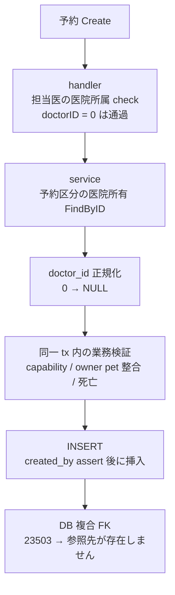

# SLACK-RESERVATION-REFERENCE: 予約「参照先が存在しません」の現行参照チェック対応表

状態: **コード照合 READY／現行 STG 配信 identity UNKNOWN／再現 未実行**。出典は [todo-issue.md](../../../todo-issue.md) 見出し `### SLACK-RESERVATION-REFERENCE`（L294–298、索引 L402）。保持する現場条件:

- スタッフ／シフト作成後も予約保存が **「参照先が存在しません」** で失敗した、という報告
- 9月13日に対応報告あり。**報告時の画面・現行配信版の同一性は未確認**
- 再現しなければ原因を捏造して再実装しない。選択 UI 自体の障害は [SLACK-STAFF-SELECT](../todo-campaign-20260919-ready17/SLACK-STAFF-SELECT.md)

本ファイルは製品コードから import されない。キャンペーン unit `SLACK-RESERVATION-REFERENCE`（`remaining-ops-20260920` revision 1、attempt `att-slack-reservation-reference-20260920-001`）の owned path および人間が読む対応表である。照合 revision `873685b0bea3692c2f8100b19ded660c8357f2b0`（`feat/rem-slack-reservation-reference-20260920`）。本票は調査のみ。予約 API への write、STG/PROD 操作、migration apply は含まない。

Callers: campaign controller `units.json` `owned_paths`（`SLACK-RESERVATION-REFERENCE`）と operators reading `docs/work/remaining-campaign-20260920/`（sibling `SLACK-CROSS-CLINIC.md` と同じ）。製品モジュールからの呼び出し行は無い。この worktree に先行票は無かった（`docs/work/remaining-campaign-20260920/` は本票で新設）。

## 実践ゲート（実装しない理由）

[product-philosophy.md](../../product-philosophy.md) の 5 ステップをこの報告に当てると、①要件を疑う／再現確認の段階で止まる。

1. **要件を疑う:** 要件は「同一医院の正当な staff／owner／pet／reservation_type を参照して予約を保存できること」。画面に別エラー文を足すことや、9/13 報告を現行 PASS と読むことではない。責任者個人名・現行配信 identity・失敗 request は未入手。
2. **削除:** 担当者 combobox 障害（STAFF-SELECT）と医院境界変更（CROSS-CLINIC）と混ぜない。出勤 0 件（SHIFT）も別票。
3. **簡素化:** 現行 Create は handler 所属チェック → type 所有権 → `doctor_id` 0 正規化 → capability / owner-pet → `created_by` actor lock → DB 複合 FK、の順。新しい参照層を足さない。
4. **サイクル短縮 / 自動化:** 現行 STG で未再現のまま再実装・自動修正しない。

確認ダイアログは安全性の根拠にしない。参照の成立はサーバ側の clinic-scoped 検証と FK が正本。

## 医院事実（コード外・UNKNOWN）

| 項目 | コードで分かること | 医院事実 |
| --- | --- | --- |
| 現行 STG / 配信コンテナ identity | なし。本セッションは共有環境へ未接続 | **UNKNOWN**。9/13 の `916159093` を現行としない |
| 報告時 build と HEAD `873685b0b` の同一性 | ローカル HEAD は ready-17 コミット | **UNKNOWN** |
| 失敗した医院・ログイン職員の主所属／兼務 | コードは選択中 `clinic_id` と assignment を検証する | **UNKNOWN**。患者名を本票に複製しない |
| 失敗 request の `doctor_id` / `created_by` / `reservation_type_id` | 0・NULL・正 ID で経路が分岐する | **UNKNOWN**。Network 採取なし |
| シフト作成直後の staff 行が操作医院の assignment / `capable_courses` を持っていたか | capability 欠落は専用 invalid-input 文 | **UNKNOWN** |
| 現行 STG で同じ操作が 201 か 400 か | 本セッションは予約 API を叩いていない | **UNKNOWN**。未再現 |

## 混ぜてはいけない読み替え

| 禁止 | 理由 |
| --- | --- |
| 9/13 の STG 成功を現行 PASS にする | todo-issue が「報告時の画面・現行配信版の同一性は未確認」。identity UNKNOWN |
| 原因を 1 つの FK に断定して再実装する | 同一トーストは PostgreSQL `23503` の総称。doctor / created_by / owner / pet / type のいずれでも出る |
| 担当者 combobox が空／タップ不能を本票で直す | STAFF-SELECT。本票は保存時の参照検証 |
| 他院患者検索・所属外 write を解く | CROSS-CLINIC。本票は選択医院内の参照 |
| 「出勤医師がいない」を参照エラーと同一視する | SHIFT / 空き枠。文言が違う |
| `clinic_id` 検証や capability を外して保存を通す | クロスクリニック FK と無資格担当を隠す |

## 現行 Create 経路（院内 HTTP）

照合ファイル: [reservation_handler.go](../../../backend/internal/reservation/reservation_handler.go)、[reservation_service.go](../../../backend/internal/reservation/reservation_service.go)。

1. **操作医院・登録者:** `ExtractClinicID` / `ExtractStaffID`（handler Create L144–150）。`created_by` は認証スタッフであり JSON ではない（`reservation_created_by.go` L15–18）。
2. **担当医の医院所属（handler、BUG-144）:** `DoctorID` が非 nil なら `checkDoctorClinicAssignment`（Create L166–171、Update L253–258）。`doctorID == 0` は **通過**（handler L33–35）。所属なしは invalid-input「指定されたスタッフはこのクリニックに所属していません」（L45）。
3. **予約区分の医院所有:** `typeRepo.FindByID(ctx, clinicID, ReservationTypeID)` を経路・status に関係なく実行（service Create L294–297）。失敗は wrap「failed to verify reservation type ownership」。
4. **Create の `doctor_id` 正規化:** `normalizeCreateDoctorID` は omit / nil / 0 を unset（NULL）にする。正の ID は落とさない（`reservation_service_validate.go` L230–237）。Create L299 と CreateBatch L392 で適用。
5. **同一 transaction 内の業務検証（Create L325–352）:**
   - `ValidateReservationStaffCapability`（capability）
   - `ValidateReservationOwnerPetLinksWithRepo`（owner / pet の医院整合）
   - `ValidateReservationPetNotDeceased`
   - 予約制約が必要な status/route のときだけ: 休診・祝日・booking lock・slot 競合・区分容量
6. **INSERT:** `repo.Create` が `assertReservationCreatedBy` のあと行挿入（`reservation_repository.go` L255–264）。失敗した `23503` は UI 上すべて「参照先が存在しません」。

Batch Create は同じ capability / type / created_by 経路。各 pet に owner-pet 検証を繰り返す（service L395–430）。予約 API は本セッションから呼び出していない。

検証順序の概形:



## 現行参照チェック一覧（FK とアプリ）

「参照先が存在しません」は **DB FK `23503` の総称**である。アプリが先に拒否する場合は別メッセージになる。

### A. アプリが先に拒否する（専用メッセージ。総称トーストではない）

| ID | 対象 | いつ | コード | 失敗時メッセージ |
| --- | --- | --- | --- | --- |
| A1 | 担当医 × 操作医院 assignment | Create/Update で `DoctorID != nil`（0 はスキップ） | `checkDoctorClinicAssignment` handler L31–45, L166–171, L253–258 | `指定されたスタッフはこのクリニックに所属していません` |
| A2 | 担当医 × 医院 × 予約区分 capability | Create tx 内。`doctorID == nil \|\| 0` はスキップ | `ValidateReservationStaffCapability` service L326; validator L40–62 | 区分非対応: `選択した担当者はこの予約区分に対応していません`。guard 欠落は 500 |
| A3 | 担当医の医院内存在 + assignment lock | A2 の `FindByID` | `reservation_staff_repository.go` L80–106。tx 中は staff と assignment を `FOR SHARE` | GORM not found → アプリ not-found / wrap。複合 doctor FK より前 |
| A4 | 予約区分 × 医院 | Create 常時 | service L294–297 `typeRepo.FindByID` | wrap `failed to verify reservation type ownership` |
| A5 | owner × 医院、pet × 医院、owner-pet 一致 | Create tx | service L329; `sharedkernel/owner_pet_link.go` L21–36 | owner/pet wrap または pet not-found |
| A6 | 死亡ペット | petID 非 nil | service L332–334 | `死亡したペットは予約できません` |
| A7 | 登録者 `created_by` | INSERT 直前、同一 tx | `assertReservationCreatedBy` `reservation_created_by.go` L19–73。inactive / 無 assignment かつ非 system_admin | `この医院の予約を登録する権限がありません`（Forbidden）。`staffID==0` は invalid-input `created_by must be greater than zero` |
| A8 | LINE 公開面の extra | LIFF のみ。院内 Create は使わない | `ValidateLineReservationStaffCapability` validator L25–29, L57–58 | `選択した担当者はLINE予約では指定できません` |

A2 の capability 正本は `staff_reservation_capabilities` 行（`SupportsReservationType` L471–487）。欠落は false であり「全員対応可」ではない。新規 staff 作成だけでは A2 は通らない。

### B. DB 複合 FK（ここが総称「参照先が存在しません」）

`backend/migrations/001_init.sql` L5730–5758。アプリ検証をすり抜けた INSERT/UPDATE だけが到達する。

| 制約 | 列 | 参照 | ON DELETE |
| --- | --- | --- | --- |
| `fk_appointments_owner_clinic` | `(clinic_id, owner_id)` | `owners (clinic_id, id)` | SET NULL (`owner_id`) |
| `fk_appointments_pet_clinic` | `(clinic_id, pet_id)` | `pets (clinic_id, id)` | SET NULL (`pet_id`) |
| `fk_appointments_reservation_type_clinic` | `(reservation_type_id, clinic_id)` | `reservation_types (id, clinic_id)` | RESTRICT |
| `fk_appointments_doctor_clinic` | `(doctor_id, clinic_id)` | `staffs (id, clinic_id)` | SET NULL (`doctor_id`) |
| `fk_appointments_line_customer_clinic` | `(line_customer_id, clinic_id)` | `line_customers (id, clinic_id)` | SET NULL (`line_customer_id`) |

`created_by` は 001 では `fk_appointments_created_by_clinic` `(created_by, clinic_id) → staffs(id, clinic_id)` だった。現行 migration [003_appointments_created_by_staff_fk.sql](../../../backend/migrations/003_appointments_created_by_staff_fk.sql) L6–12 はそれを **DROP** し、`fk_appointments_created_by` `(created_by) → staffs(id)` ON DELETE RESTRICT に置換する。**この worktree のコードと 003 ファイルがそう書いていること**と、**現行 STG に 003 が当たっていること**は別である。STG DDL は UNKNOWN。

マッピング:

- PostgreSQL `23503` → `httpapi/response_pg.go` L40–41 および `apperrors/errors.go` L374–375 が **制約名を出さず** `参照先が存在しません`
- ユーザーにはどの列が壊れたか見えない
- テストが期待する他院 FK 名は `reservation_created_by_fk_test.go` L289–292（owner / pet / type / doctor）

`doctor_id = 0` は `staffs.id=0` が無いため、正規化前なら `fk_appointments_doctor_clinic` で 23503 になり得る。現行 Create は `normalizeCreateDoctorID` で 0 を NULL にするので、**このコードパスではその失敗を踏まない**。現行配信がそのコードかは UNKNOWN。

## コード根拠（引用）

### Handler: 担当医の医院所属

```31:45:backend/internal/reservation/reservation_handler.go
func (h *CRUDHandler) checkDoctorClinicAssignment(ctx context.Context, clinicID, doctorID uint64) error {
	if doctorID == 0 {
		return nil
	}
	assignments, err := h.staffAssignments.FindAllByStaffID(ctx, doctorID)
	if err != nil {
		return apperrors.Wrap(err, "failed to verify staff assignment")
	}
	for i := range assignments {
		if assignments[i].ClinicID == clinicID {
			return nil
		}
	}
	return apperrors.WrapInvalidInput("指定されたスタッフはこのクリニックに所属していません")
}
```

Create は `DoctorID != nil` のときだけ呼ぶ（L166–171）。未選択で FE が `doctor_id` を省略すればこのチェックは走らない。

### Service Create: type 所有・正規化・capability・owner/pet

```294:334:backend/internal/reservation/reservation_service.go
	if s.typeRepo != nil {
		if _, err := s.typeRepo.FindByID(ctx, input.ClinicID, input.ReservationTypeID); err != nil {
			return nil, apperrors.Wrap(err, "failed to verify reservation type ownership")
		}
	}
	doctorID := normalizeCreateDoctorID(input.DoctorID)
	reservation := &model.Reservation{
		// ...
		DoctorID:          doctorID,
		CreatedBy:         input.CreatedBy,
	}
	// ...
		if err := ValidateReservationStaffCapability(ctx, s.reservationStaffRepo, reservation.ClinicID, reservation.DoctorID, reservation.ReservationTypeID); err != nil {
			return err
		}
		if err := ValidateReservationOwnerPetLinksWithRepo(ctx, s.repo, reservation.ClinicID, reservation.OwnerID, reservation.PetID); err != nil {
			return err
		}
		if err := ValidateReservationPetNotDeceased(ctx, s.repo, reservation.ClinicID, reservation.PetID); err != nil {
			return err
		}
```

### Capability（院内は is_active / reservation_visible を要求しない）

```40:62:backend/internal/reservation/reservation_staff_capability_validator.go
	if doctorID == nil || *doctorID == 0 {
		return nil
	}
	// ...
	staff, err := guard.FindByID(ctx, clinicID, *doctorID)
	// ...
	supports, err := guard.SupportsReservationType(ctx, clinicID, *doctorID, reservationTypeID)
	// ...
	if requireReservationVisible && (!staff.IsActive || !staff.ReservationVisible) {
		return apperrors.WrapInvalidInput("選択した担当者はLINE予約では指定できません")
	}
	if !supports {
		return apperrors.WrapInvalidInput("選択した担当者はこの予約区分に対応していません")
	}
```

`FindByID` は staff 行に加え **操作医院の assignment** を要求する（`reservation_staff_repository.go` L97–105）。主所属が他院でも、兼務 assignment があればここは通る。assignment が無ければ A3 で止まり、doctor 複合 FK まで進まない。

### created_by（登録者 ≠ 担当医）

```19:25:backend/internal/reservation/reservation_created_by.go
func assertReservationCreatedBy(ctx context.Context, db *gorm.DB, clinicID uint64, staffID *uint64) error {
	if staffID == nil {
		return nil
	}
	if *staffID == 0 {
		return apperrors.WrapInvalidInput("created_by must be greater than zero")
	}
```

続く処理（L32–69）: 同一 tx で staff `FOR SHARE`。inactive / 欠落は Forbidden。操作医院の assignment があれば許可。無ければ `is_system_admin` の active account を `FOR SHARE` して許可。兼務先での登録は **003 の単独 staff FK + この lock** がコード上の意図。001 の `(created_by, clinic_id) → staffs(id, clinic_id)` が残っている DB では、主所属と異なる操作医院への INSERT が 23503 になり得る。**現行 STG が 001 か 003 かは UNKNOWN。**

### 総称エラー

```39:41:backend/internal/httpapi/response_pg.go
	switch pgErr.Code {
	case "23503": // foreign_key_violation
		return "参照先が存在しません", true
```

### FE Create（参照。本 unit は FE を変更しない）

`frontend/src/features/reservations/api/transforms.ts` L12–24: 空 / `"0"` は `doctor_id` 非送信。正の十進のみ載せる。不正文字列は throw。現行 FE が配信されているかは UNKNOWN。

## 9月13日報告との関係（現行 PASS にしない）

[bug.md](../../../bug.md) `BUG-RES-DOCTOR-ID-ZERO`（L53–100）は次を **当時の記録**として残している。本票はそれを現行受入にしない。

| 当時の切り分け | 当時の主張 | 本セッション |
| --- | --- | --- |
| `doctor_id: 0` → `fk_appointments_doctor_clinic` 23503 | FE が `"0"` を送り、BE Create が 0 を NULL にしなかった | 現行コードは FE/BE とも 0 を unset。STG 再現 **未実行** |
| 担当者未選択でも兼務先で失敗 | `fk_appointments_created_by_clinic` が主所属を要求 | 003 ファイルと `assertReservationCreatedBy` がコードにある。STG DDL **UNKNOWN** |
| STG コンテナ `916159093` 切替後 201 | 2026-09-13 の受入記録 | **現行 identity と同一視しない** |
| 隔離 DB の 001→003 テスト | ローカル回帰であり STG 受入ではない（bug.md 自身も明記） | 本セッションは Docker テスト未実行 |

todo-issue L296–298 の完了条件は「対象 build の同じ操作で保存・再読込でき、無効/他院参照は拒否される receipt。再現しなければ対応報告後の確認済みとして閉じ、原因を捏造しない」。対象 build が UNKNOWN のため、**閉じない。再実装もしない。**

## 合成ケース（actual は未実行）

対象: 合成 clinic。実患者名は使わない。STG 列はすべて UNKNOWN / 未実行。

| ID | 操作（コード上の期待） | 期待メッセージ | 混同してはいけないこと |
| --- | --- | --- | --- |
| S1 | 担当者省略（`doctor_id` 非送信）。owner/pet/type は操作医院 | コード上は doctor FK を踏まない。created_by が操作医院で許可されれば INSERT | 省略成功を「現行 STG PASS」としない |
| S2 | `doctor_id: 0` | 現行 BE は NULL 正規化。現行 FE は非送信。旧 FE が 0 を送っても現行 BE なら doctor FK は踏まない | 旧 400 を現行コードの欠陥と断定しない |
| S3 | 正の他院-only staff を担当医に指定 | A1 または A3。総称 23503 より先 | capability 不足と所属不足を混ぜない |
| S4 | 所属はあるが `capable_courses` に当該 type が無い | A2「この予約区分に対応していません」 | これを「参照先が存在しません」と同一視しない |
| S5 | 新規 staff を作り、操作医院 assignment も capability も無い状態で担当医指定 | A1/A3 | 「スタッフを作れば予約できる」は誤り |
| S6 | 主所属が他院の兼務スタッフが操作医院で登録（担当医省略） | コード+003 なら A7 が assignment で許可し doctor FK は NULL。001 の created_by 複合 FK が残る DB なら 23503 があり得る | 原因を doctor_id に決めつけない |
| S7 | 他院 owner/pet を選択医院の予約に載せる | A5 または owner/pet 複合 FK | CROSS-CLINIC の検索要望で解かない |

S1–S7 の actual は **未実行**。失敗 request/応答の非機密採取が無い。

## 最小提案（実装は本 unit 外）

観測が揃うまでパッチしない。

| 観測（未取得） | 最小の次 | 禁止 |
| --- | --- | --- |
| 現行 STG identity が 9/13 成功コンテナと同一で、合成同医院ケースが 201 | 確認済みとして閉じる。再実装しない | 別原因を足す |
| 現行 STG が 400 総称で、payload に `doctor_id: 0` | 配信 FE/BE の 0 正規化ギャップを identity 付きで取る | 推測で FE を書き直す |
| 現行 STG が 400 総称で、`doctor_id` 省略かつ兼務登録者 | STG DDL で `fk_appointments_created_by` vs `_clinic` を読む（USER、本エージェントは DB 禁止） | 003 を「当たっている」と断定して再 migrate |
| 400 ではなく A2 文 | マスタの `capable_courses`。フィルタ削除は STAFF-SELECT でも禁止 | 全 staff 開放 |
| 候補 UI が空／タップ不能 | STAFF-SELECT へ渡す | 本票で FE combobox を触る |

## 停止条件

- 現行 STG / 配信 identity 未確認 → 受入 BLOCKED。コード対応表は本票で完了扱いにできる
- 再現なし → 原因を捏造して予約 API・migration・FE を変更しない
- 選択 UI 障害 → STAFF-SELECT。本票の範囲外
- 他院検索・受付 → CROSS-CLINIC。本票の範囲外
- 本票を製品 import しない。campaign ledger / `todo-issue.md` / `bug.md` は編集しない
- 予約 API write、共有 DB write、secrets、push/merge は禁止

## 検証（docs-only）

本セッションの実行対象は本票のみ。Docker アプリテストは Verification Strategy により未実施（SKIP）。照合は cited ファイルと `rg staff, capability, 参照`。
