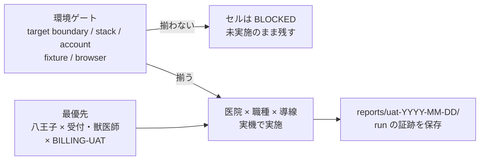

# SLACK-UAT-SCHEDULE: 医院×職種 UAT カバレッジマトリクス

> Current task state: Plane `EMR-200`. The matrices below preserve case/evidence history.

状態: **カバレッジ表 READY／実施枠 UNKNOWN／未実施セルのみ**。出典は [todo-issue.md](../../../todo-issue.md) 見出し `### SLACK-UAT-SCHEDULE`（L270–274、索引 L394）と [UAT 環境条件](../../ops/testing/UAT-ENV-SETUP.md)、[直近 UAT の残作業](../../../todo-verification.md#直近-uat-の残作業)。保持する現場条件:

- 医院・交代勤務者を網羅するテスト準備であり、机上チェックを医院受入に数えない
- 過去の候補日・会議調整から **新しい期限を作らない**。現在のテスト可能枠と結果保管先は運用担当が採取する
- 日程/受入者は医院側。最優先は [会計通し](../../../todo-issue.md#slack-billing-uat)
- ログイン/fixture が不足する実機実行は停止

本ファイルは製品コードから import されない。キャンペーン unit `SLACK-UAT-SCHEDULE`（`remaining-ops-20260920` revision 1）の owned path および人間が読むカバレッジ表である。照合 revision `873685b0bea3692c2f8100b19ded660c8357f2b0`（`feat/rem-slack-uat-schedule-20260920`）。本票はスケジュール発明をしない。人の割当・連絡の送信はしない。

## 実践ゲート（本票が実装・日程確定に進まない理由）

[product-philosophy.md](../../product-philosophy.md) の 5 ステップ:

1. **要件を疑う:** 「全員でテストする日程」は画面要望ではないが、責任者個人名・現行のテスト可能枠・対象 build が未採取。過去 Slack の曜日表記は履歴。
2. **削除:** 過去候補日を新期限に写す行を置かない。完了した unit 検証の列挙を受入完了にしない。
3. **簡素化:** 医院×受付/獣医師/看護×対象導線×配信 revision×実施/未実施だけを残す。交代勤務者の氏名名簿は ACCESS と同じく本票で作らない。
4. **サイクル短縮 / 自動化:** 未実施セルの自動リマインドやカレンダー投入は停止。停止手段と失敗通知が無い自動化は禁止。

## 医院事実（コード外・UNKNOWN）

| 項目 | 文書で分かること | 医院事実 |
| --- | --- | --- |
| 現在のテスト可能枠 | 運用担当が採取する（todo-issue L273） | **UNKNOWN**。本票で枠を置かない |
| 受入担当 / 交代勤務者 | 職種列は受付・獣医師・看護。交代網羅は出典 704–724 | **UNKNOWN**。氏名名簿を作らない |
| 対象配信 revision | 実行前に固定（todo-verification L13） | **UNKNOWN** |
| 結果保管先の現行 run | 規約は `reports/uat-YYYY-MM-DD/`（UAT-ENV-SETUP §5） | 本 worktree に `reports/` は無い。現行 run は **UNKNOWN** |
| 専用 UAT identity / fixture receipt | login seed は専用 account ではない（UAT-ENV-SETUP §3.2） | 医院受入用の許可 clinic・capability・cleanup は **UNKNOWN** |

## 混ぜてはいけない読み替え

| 禁止 | 理由 |
| --- | --- |
| 過去 Slack の候補日を「次の実施枠」に書く | 新しい期限の発明。L273 と todo-issue 冒頭の曜日表記ルールに反する |
| 2026-09-05 の local UAT-DOMAIN-STATUS PASS を医院×職種の実施にする | 合成 local スナップショット。医院受入ではない |
| login seed の demo 氏名を現場テスターにする | ACCESS は既知氏名から名簿を作らない。seed は専用 UAT identity ではない |
| 机上のコード照合・unit 28/10 tests をブラウザ受入にする | todo-verification は source/unit とブラウザ UAT を分ける |
| 会計通しを Smaregi 待ちに畳む | BILLING-UAT は独立。SMAREGI は納品後 DEFERRED |
| 本票で人をスケジュールする | 安全境界。枠採取は運用担当 |

## 列の定義

- **医院:** seedlogin catalog のラベル（実行可能な医院骨格）。現場の通称（八王子 / 城東 / 敷島 / 猫）との ID 対応は本票では固定しない。
- **職種:** todo-issue 指定の 受付 / 獣医師 / 看護。catalog occupation（VT / スタッフ 等）へ勝手に広げない。
- **導線:** 直近 UAT 残作業と、同一受入準備の会計/臨床通し。
- **profile:** UAT-ENV-SETUP の `local`（disposable DB）または `stg`（承認済み dedicated UAT tenant）。未選択は BLOCKED。
- **revision:** 対象 build。未採取は UNKNOWN。
- **実施:** 今回照合した医院×職種のブラウザ/実機 receipt。無いセルは **未実施**。過去未実施記録だけで「現在も未実施」と断定せず、追加証拠が無いものは実施 UNKNOWN のまま **未実施** と書く（新しい sweep 未実施）。
- **実施枠:** 常に **UNKNOWN**。日付列を置かない。

Catalog 医院ラベル（`backend/internal/seedlogin/catalog.go` `clinicBands`）:

| clinic_id | ラベル |
| ---: | --- |
| 1 | 八王子病院 |
| 2 | 城東センター病院 |
| 3 | ノア動物病院　敷島病院 |
| 4 | ノア動物病院　Hako bu neco |

## 対象導線（優先順）

最優先は会計通し。残りは [直近 UAT の残作業](../../../todo-verification.md#直近-uat-の残作業) と CLINICAL-UAT の医院×職種対応。NOTE-STAFF-STARTTIME-RDT はユーザー環境比較であり、医院×職種セルに入れない。

| 導線 ID | 残る確認 | 職種メモ | 実行へ進む条件（UAT-ENV-SETUP / todo-verification） |
| --- | --- | --- | --- |
| BILLING-UAT | 新カルテ単独の会計→精算書/領収書 PDF→物理プリンタ→締め。八王子は新規カルテ方針 | 受付（確定/支払/締め）と獣医師（会計タブ確認）を分ける。看護は会計通しの必須列ではない | 対象医院・build・権限・合成 fixture・後処理。実請求・締めは運用承認後。`window.print()` はプリンタ成功の証拠ではない |
| CLINICAL-UAT | カルテ入力・処置・検査・予約の一連。自動 E2E 対象と現場手順を区別 | 獣医師/看護が主。受付は予約側 | 同一患者の入力→保存→処置/検査→予約→再読込。承認 fixture。未達は一件一原因 |
| UAT-R2-TREATMENT-COMMIT | 実機 IME、Blur、2回 Enter 後の保存・再読込 | 獣医師/看護（処置数量） | 対象 browser/build、物理 IME 端末、変更可能 fixture、後処理。local 28 tests は受入ではない |
| UAT-R2-MASTER-LIST-HEIGHT | viewport・ズーム・検索/閉じる・キーボード選択・フォーカス復帰 | 獣医師/看護（処置検索） | 1366×625 から開始。Windows 8/Chrome 実機は別 run。local 10 tests は受入ではない |
| UAT-Q1-SEARCH-AND | STG で複数語 AND / 1語 / 0件 / 他院候補非表示 | 受付が主。他職種も検索するなら別セル | STG 配信版と医院別の合成検索 fixture。ブラウザ未確認 |
| UAT-Q4-INSURANCE-RATES | 新規 50/70、既存 90/100 の選択/保存/再読込金額 | 受付/獣医師（会計） | 承認済み検証会計・後処理。実請求は使わない。ブラウザ未確認 |
| UAT-Q2-HISTORY-NAV | 問診行→同一ペット詳細→戻る。未移行処置でも詳細を開ける | 獣医師/看護 | 対象 build と合成履歴参照。ブラウザ未確認 |
| NOTE2-SWEEP-COVERAGE (`EMR-200`) | 未確認の詳細・入院・検査・カルテ/健診操作 | 職種は route ごとに UNKNOWN | 有効 cage 等の fixture、対象 schema。82 ページ到達を全 CRUD 完了にしない |

ACCESS（ログイン）は全セルの前提であり、9月9日の一部ログイン成功を全員確認済みにしない。本マトリクスの実施列には入れない。

## カバレッジマトリクス

全セル **未実施**。revision = UNKNOWN。実施枠 = UNKNOWN。profile は医院受入では `stg` を想定するが、専用 tenant receipt が無いため実行は BLOCKED。local は合成準備のみで医院受入に数えない。

結果保管先の規約: `reports/uat-YYYY-MM-DD/`（日付は run 作成日であり、本票が決めた実施日ではない）。

### 八王子病院（clinic_id 1）

| 導線 | 受付 | 獣医師 | 看護 |
| --- | --- | --- | --- |
| BILLING-UAT（最優先・新規カルテ方針） | 未実施 | 未実施 | 未実施（必須職種ではない） |
| CLINICAL-UAT | 未実施 | 未実施 | 未実施 |
| UAT-R2-TREATMENT-COMMIT | — | 未実施 | 未実施 |
| UAT-R2-MASTER-LIST-HEIGHT | — | 未実施 | 未実施 |
| UAT-Q1-SEARCH-AND | 未実施 | 未実施 | 未実施 |
| UAT-Q4-INSURANCE-RATES | 未実施 | 未実施 | — |
| UAT-Q2-HISTORY-NAV | — | 未実施 | 未実施 |
| NOTE2-SWEEP-COVERAGE (`EMR-200`) | 未実施 | 未実施 | 未実施 |

### 城東センター病院（clinic_id 2）

| 導線 | 受付 | 獣医師 | 看護 |
| --- | --- | --- | --- |
| BILLING-UAT | 未実施 | 未実施 | 未実施（必須職種ではない） |
| CLINICAL-UAT | 未実施 | 未実施 | 未実施 |
| UAT-R2-TREATMENT-COMMIT | — | 未実施 | 未実施 |
| UAT-R2-MASTER-LIST-HEIGHT | — | 未実施 | 未実施 |
| UAT-Q1-SEARCH-AND | 未実施 | 未実施 | 未実施 |
| UAT-Q4-INSURANCE-RATES | 未実施 | 未実施 | — |
| UAT-Q2-HISTORY-NAV | — | 未実施 | 未実施 |
| NOTE2-SWEEP-COVERAGE (`EMR-200`) | 未実施 | 未実施 | 未実施 |

### ノア動物病院　敷島病院（clinic_id 3）

交代勤務者の網羅は出典 704–724 の残件。対象者リストは UNKNOWN。セルは未実施のまま。

| 導線 | 受付 | 獣医師 | 看護 |
| --- | --- | --- | --- |
| BILLING-UAT | 未実施 | 未実施 | 未実施（必須職種ではない） |
| CLINICAL-UAT | 未実施 | 未実施 | 未実施 |
| UAT-R2-TREATMENT-COMMIT | — | 未実施 | 未実施 |
| UAT-R2-MASTER-LIST-HEIGHT | — | 未実施 | 未実施 |
| UAT-Q1-SEARCH-AND | 未実施 | 未実施 | 未実施 |
| UAT-Q4-INSURANCE-RATES | 未実施 | 未実施 | — |
| UAT-Q2-HISTORY-NAV | — | 未実施 | 未実施 |
| NOTE2-SWEEP-COVERAGE (`EMR-200`) | 未実施 | 未実施 | 未実施 |

### ノア動物病院　Hako bu neco（clinic_id 4）

| 導線 | 受付 | 獣医師 | 看護 |
| --- | --- | --- | --- |
| BILLING-UAT | 未実施 | 未実施 | 未実施（必須職種ではない） |
| CLINICAL-UAT | 未実施 | 未実施 | 未実施 |
| UAT-R2-TREATMENT-COMMIT | — | 未実施 | 未実施 |
| UAT-R2-MASTER-LIST-HEIGHT | — | 未実施 | 未実施 |
| UAT-Q1-SEARCH-AND | 未実施 | 未実施 | 未実施 |
| UAT-Q4-INSURANCE-RATES | 未実施 | 未実施 | — |
| UAT-Q2-HISTORY-NAV | — | 未実施 | 未実施 |
| NOTE2-SWEEP-COVERAGE (`EMR-200`) | 未実施 | 未実施 | 未実施 |

`—` は当該職種の主対象外（導線メモに従う）。空セルで実施済みと読まない。

## 医院マトリクスに入れない直近残（参照のみ）

| ID | 理由 |
| --- | --- |
| [NOTE-STAFF-STARTTIME-RDT](../../../todo-verification.md#直近-uat-の残作業) | ユーザー環境 vs 拡張なし比較。医院×職種の現場受入ではない |

既存検証キュー（S09 fixture、V04 retest、clinical E2E、STG data、P4/P8/E1/E2）は [todo-verification.md](../../../todo-verification.md) の別節。本票の医院×職種セルへ畳まない。

## 環境ゲート（実機セルを開始する前）

UAT-ENV-SETUP の選択組（`profile` × `browser`）が揃わないセルは **BLOCKED** であり 未実施のまま残す。

| ゲート | 合格条件 | 本票の現状 |
| --- | --- | --- |
| target boundary | local disposable DB **または** 承認済み専用 UAT tenant。clinic ID と fixture owner を report に記録 | 医院受入 tenant receipt **UNKNOWN** |
| stack | FE `:3003`、BE `:8080/health`、DB/container health | 本 unit では起動していない |
| account | 明示 provisioning 済み UAT identity。catalog 執行/一般の upsert を恒久 provisioning としない | 医院ロール別の専用 identity **UNKNOWN** |
| fixture / mutation / teardown | approved manifest と deterministic teardown | **UNKNOWN** |
| browser | 選択した `cdp` または `playwright` が実際に利用可能 | 本 unit ではブラウザ UAT 未実行 |
| `check-uat-env.sh` | advisory のみ。正式 readiness gate ではない | 使っても ready としない |

ゲートから証跡までの概形:

## 履歴日付（現行ウィンドウではない）

次は照合した履歴であり、実施枠・締切・次会にしない。

| 日付（履歴） | 何の記録か | 本票での扱い |
| --- | --- | --- |
| 2026-09-05 | local UAT-DOMAIN-STATUS スナップショット | 医院×職種 未実施のまま |
| 2026-09-06 | UAT-ENV-SETUP 更新日 | 環境規約。日程ではない |
| 2026-09-09 | ACCESS の一部ログイン成功報告 | 全員確認済みではない |
| 2026-09-13 | V04 / 一部 CRUD 証拠、検索 PR 配備記録の前日系 | ブラウザ医院受入ではない |
| 2026-09-16 | 会計通し最優先の方針、出典 1000–1063 | 優先順位のみ。実施日ではない |
| 2026-09-19 | todo-verification 最終照合、依頼者 UI 回答 | ケース具体化。実施枠ではない |

## 次の採取（運用担当。本票は日付を書かない）

1. 医院ごとの現行テスト可能枠（開始/終了は採取結果。本ファイルへ推測記入しない）
2. 対象配信 revision と profile=`stg` dedicated tenant の receipt
3. 職種別の許可 identity（氏名は権限者参照。本票へ転記しない）
4. 失敗/未実施理由と再確認者の権限付き参照
5. run を `reports/uat-YYYY-MM-DD/` に残す（credential / 患者情報なし）

ログインまたは fixture が欠けたセルは実機実行を停止する。最優先で埋めるのは **八王子病院 × 受付/獣医師 × BILLING-UAT**。
