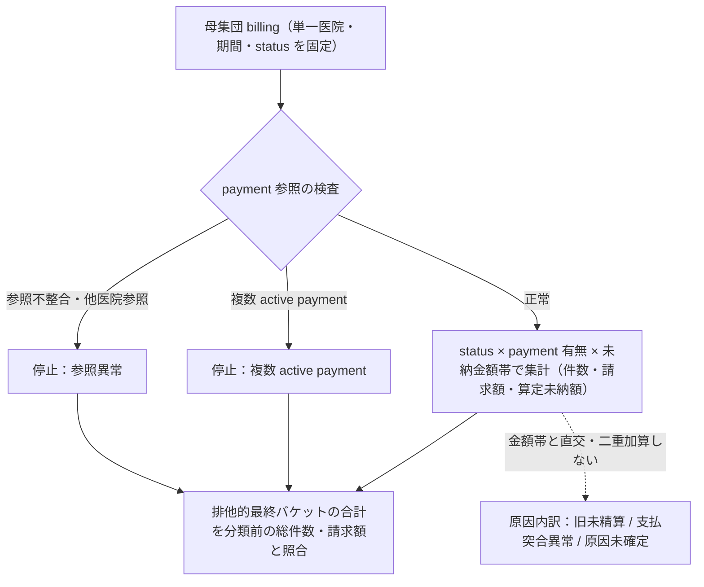

# UAT-Q4-UNPAID-TRIAGE: 未納の請求単位調査案

状態: **机上設計のみ**。STG の読取・実集計・原因確定・訂正・医院 UAT は未実施。

## 根拠と調査境界

- [課題](../../../todo-issue.md#uat-q4-unpaid-triage) は status・支払有無・金額帯の匿名集計を先行させ、旧未精算と支払未紐付けを分類し、分類前後の総件数・金額を照合するよう求める（元 main の `todo-issue.md:111-114`）。
- [運用条件](../../../todo-operations.md#uat-data-operations) は対象医院、期間、payment 結合条件、読取担当、保存先の確定と承認を先行させる（元 main の `todo-operations.md:37-49,93-97`）。[医院フィードバック](../stg-uat-clinic-feedback-q1-q4.md#uat-q4-unpaid-triage-未納の切り分け消さない) はデモ臨床シードの退役を記すが、残る waiting の原因を旧未精算または突合失敗の可能性にとどめる（同文書 `:213-220`）。この設計だけで「デモではない」と実データから証明しない。
- 現行の [未納額式](../../../backend/internal/billing/unpaid_amount.go) は、active payment がない waiting を `billings.total_amount`、payment がある waiting/completed を `max(0, payment.total_amount - insurance_amount - discount_amount - billing_amount)`、payment がない completed を `0` とする（`:15-31`）。[未納 API](../../../backend/internal/billing/accounting_handler.go) は選択医院の閲覧権限を要求し、`group_by=billing|owner` を受ける（`:330-371`）。現行 [repository](../../../backend/internal/billing/accounting_repository_unpaid.go) は医院と `scheduled_date` の範囲で絞り、未納額が正の行だけを一覧に含める（`:87-124`）。よって 0 円例を含む本調査の母集団を API の表示行だけから作らない。

## 承認後の匿名集計仕様

1. 読取担当が、承認された**単一医院**と `scheduled_date` の開始日・終了日（両端を含む）を固定する。対象 status は `waiting` と `completed`。その医院に属する非削除 billing を母集団とし、別医院の billing/payment、削除済み行、対象外 status を混ぜない。実行前に読取権限と保存先を確認する。請求本文、飼主名、個体名、連絡先など PHI は出力しない。
2. 出力の単位は **billing 1 件につき 1 行**。集計中の billing key は医院内でのみ照合し、共有表には識別子を載せない。各 billing に結び付く非削除 payment の件数と参照整合性を先に判定する。旧記録上の支払参照が欠ける・別医院を指す、または複数の active payment が同じ billing に結び付く場合は、請求ごと `参照異常` / `複数 active payment` の停止バケットへ入れる。現行 DB には `payments.billing_id` の一意制約があるため、複数件は通常経路では想定しない例外である。payment の重複 JOIN 行を件数にも金額にも足さず、未納額の計算も保留する。billing を持たない孤児 payment は請求母集団の外で件数のみ別記し、金額へ混ぜない。
3. 正常な billing だけ、`status × payment 有無 × 未納金額帯` で件数、請求額合計、算定未納額合計を出す。金額帯は算定未納額の `0 円`、`1–9,999 円`、`10,000 円以上` とし、異常は帯へ入れない。waiting/payment 無は請求全額、waiting・completed/payment 有は上記の非負残額、completed/payment 無は 0 円。負の**計算前差額**は 0 円帯へ入れ、符号は調査用の匿名件数として別記できる。これは返金・過払い原因の確定ではない。
4. 原因候補は金額帯と別軸で扱う。waiting/payment 無でも旧未精算と突合漏れの両方があり得る。旧台帳の請求・精算状態と同一請求の支払参照を、承認された範囲で個別照合したものだけ `旧未精算を裏付け` / `支払突合異常を裏付け` に分類する。裏付けがなければ `原因未確定` とし、追加で必要な旧記録・参照キー・照合担当を記録する。集計値だけで訂正要否を確定しない。

billing ごとの分類と停止バケットの流れ:

## 合成期待表（円、実データではない）

`P合計/保険/割引/実支払` は payment の `total_amount/insurance_amount/discount_amount/billing_amount`。`差額` はクランプ前、`未納` は現行式の結果。例の billing key は合成ラベルであり共有用の実識別子ではない。

| 合成 billing | status | active payment | 請求額 | P合計/保険/割引/実支払 | 差額 | 未納 | 分類 |
|---|---|---:|---:|---|---:|---:|---|
| B1 | waiting | 0 | 10,000 | — | — | 10,000 | 正常・10,000 円以上 |
| B2 | waiting | 1 | 10,000 | 10,000/1,000/500/7,000 | 1,500 | 1,500 | 正常・1–9,999 円 |
| B3 | completed | 1 | 10,000 | 10,000/0/0/10,000 | 0 | 0 | 正常・0 円 |
| B4 | completed | 1 | 10,000 | 10,000/0/0/12,000 | -2,000 | 0 | 正常・0 円、負差額を別記 |
| B5 | completed | 0 | 5,000 | — | — | 0 | 正常・0 円 |
| B6 | waiting | 2 | 8,000 | 複数のため採用しない | — | 保留 | 複数 active payment・停止 |
| B7 | waiting | 旧記録の参照不整合 | 6,000 | 参照不整合のため採用しない | — | 保留 | 参照異常・停止 |

合成表の正常 5 件は請求額合計 45,000 円、算定未納額合計 11,500 円（10,000 + 1,500 + 0 + 0 + 0）。停止 2 件の請求額は 14,000 円、未納額は**未算定**。全 7 billing の請求額合計は 59,000 円であり、payment JOIN 後の行数を全件数に使わない。

## 照合と停止条件

- 分類前に、医院・期間・status を固定した一意な billing の総件数 `N` と請求額合計 `T` を記録する。分類後は正常な金額帯、複数 payment、参照異常という**排他的な最終バケット**の件数合計が `N`、各バケットの請求額合計が `T` と一致することを確認する。旧未精算・支払突合異常・原因未確定は金額帯と直交する原因内訳として別表に置き、二重加算しない。合成例では `5 + 1 + 1 = 7` 件、`45,000 + 8,000 + 6,000 = 59,000` 円。
- 算定未納額は正常 billing だけの合計を別の指標とし、停止バケットを 0 円として総和に混ぜない。合成例は 11,500 円 + 未算定 2 件。分類前後の**未納額**を照合できるのは異常を解消して請求ごとに一意の計算根拠を確定した後だけ。件数・請求額・算定可能件数・算定未納額をそれぞれ照合し、不一致なら原因説明や訂正案へ進まない。
- 複数 active payment、参照欠落・医院不一致、請求重複、前後合計の不一致、対象医院/期間/読取承認の未確定は停止条件。旧未精算との照合根拠が足りない場合は `原因未確定` を維持し、限定訂正は別の承認単位に渡す。一括 `completed` 化、請求削除、未納タブ隠蔽は行わない。

## 未解決の入力と完了境界

| 入力・結果 | 現在値 | 必要な次の証拠 |
|---|---|---|
| 対象医院・期間・読取担当・保存先 | UNKNOWN | 医院側と運用担当が単一医院、時刻窓、担当、保存先を確定 |
| STG 読取権限・実施承認 | UNKNOWN | 対象環境・範囲を含む運用承認 |
| 旧未精算との個別照合条件・旧記録 | UNKNOWN | 旧請求/精算と payment 参照の対応根拠 |
| 実件数・実金額・payment 異常・原因・訂正要否 | UNKNOWN | 承認後の匿名集計、請求単位の例外照合、前後突合 |
| 限定訂正の担当・承認 | UNKNOWN | 原因確定後に別単位で決定 |

この文書の完了は**調査設計の完了**に限る。STG 集計、実原因の説明、請求訂正、画面修正、医院 UAT 完了を示さない。
