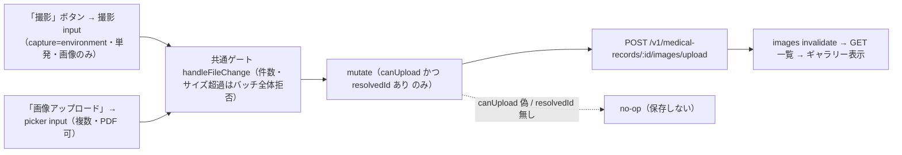

# SLACK-CAMERA: 撮影→カルテは既存 upload 経路（独自カメラ UI は picker 欠落時のみ）

> Task migrated to Plane `EMR-183`. This file remains supporting acceptance/evidence material; use Plane for current status.

状態: **file input vs capture と既存 upload のトレースを現行コードで再検証済み（HEAD `923bb99ba`、2026-09-23）／撮影専用 input（`capture="environment"`）は `873685b0b`（2026-09-20）で実装済み — 本票の最小案 option 1／対象端末での実機受入は未実行**。出典は [todo-issue.md](../../../todo-issue.md) 見出し `### SLACK-CAMERA`（L160–164、索引 L431）。保持する現場条件:

- 「撮影してそのままカルテへ追加したい」（出典 995–999。現行 `todo-issue.md` は要約のみ。原文行は本票では再掲しない）
- **既存の診療画像 upload を一度だけ使う。** 独自カメラアプリ / `getUserMedia` は、現行 picker に撮影選択が無いと実機で証明されるまで作らない
- 対象端末で撮影→確認/取消→正しいカルテへ保存→再読込、向き・許可拒否・容量/形式・通信失敗を説明できること
- PO が必要端末/用途/保存権限を確定し、医院境界・死亡/確定制約を保持する
- カメラ権限や安全な fixture なしの実機試験は停止。**実患者写真を試験へ流用しない**

本票は [ImageGalleryFilter](../../../frontend/src/features/medical-records/components/ImageGalleryFilter.tsx) の file input 2 系統（picker＝`capture` なし・`multiple`・PDF 可／撮影＝`capture="environment"`・単発・画像のみ）と [MedicalRecordImage](../../../frontend/src/features/medical-records/components/MedicalRecordImage.tsx) の既存 upload をトレースする。製品コード・テストは変更しない。

呼び出し行: **無い。** 本ファイルは製品コードから import されない。キャンペーン unit `SLACK-CAMERA` の owned path および人間が読む調査票である（sibling `SLACK-MICROCHIP.md` L13 と同じ）。既存 `docs/work/todo-campaign-20260918/` に本 unit の票は無く、`todo-issue.md` L160–164 は出典要約であり本票の代替ではない。ledger `owned_paths` が本パス単体のため、他シートへの追記では unit 完了にならない。

## 医院事実（コード外・UNKNOWN）

数値・院内ルール・端末挙動をコードから捏造しない。未採取なら該当セルは **再現 BLOCKED**。

| 項目 | コードで分かること | 医院事実 |
| --- | --- | --- |
| 報告医院・端末・ブラウザ | なし | **UNKNOWN** |
| 対象 iPad / スマートフォン / PC | file input は 2 つ: picker（`accept`+`multiple`・capture なし）と撮影用（`accept`+`capture="environment"`・単発）。後述 | **UNKNOWN**。対象機種・OS・ブラウザは PO 確定前 |
| 「撮影」ボタンが対象端末でカメラを直接開くか | 撮影 input の `capture="environment"` はヒントであり UA が無視し得る。picker 側（「画像アップロード」）に撮影項目が出るかも UA 依存 | **UNKNOWN**。実機確認前に「開く」とも「開かない」ともしない |
| PC 内蔵カメラが必要か | 独自カメラ UI は無い。PC では通常ファイル選択 | **UNKNOWN**。PC カメラ必須とは推定しない（todo-issue L163） |
| 撮影後の確認/取消 UI | 選択後は即 `mutate(files)`。アプリ内 preview/取消は無い。picker のキャンセルは `onChange` が走らない | **UNKNOWN**。ネイティブ取消で足りるかは PO |
| 保存権限の対象職種 | FE `usePermission("medical-records").canCreate`。BE upload は `create` | **UNKNOWN**。誰が撮影保存してよいかは PO |
| 向き（縦横・EXIF） | 経路に EXIF 回転・正規化は無い。表示は `object-cover` | **UNKNOWN**。現場で横向きが問題かは採取前 |
| HEIC / ライブ写真 | allowlist は jpeg/png/gif/pdf のみ。`image/heic` なし | **UNKNOWN**。院内 iOS の既定撮影形式は採取前 |
| カメラ権限ダイアログ | `getUserMedia` なし。権限は OS file picker / カメラ拡張に任せる | **UNKNOWN**。拒否時の現場手順は採取前 |
| 実機 `innerWidth` / カメラ UX | ローカル基準は [CHART-FIT票](../todo-campaign-20260918/UAT-R2-CHART-FIT.md) と同じ 1366×625 CSS px | **UNKNOWN**。撮影端末の viewport は採取前 |
| フロント/API revision | 本票作成時 `aac697645`。撮影 input は `873685b0b` で追加。再検証 HEAD `923bb99ba` | 再現セッションの SHA は **UNKNOWN** |

## 実践ゲート（product-philosophy 5 ステップ）

実装しない。本票の判断順だけ固定する。[docs/product-philosophy.md](../../product-philosophy.md) の逆行禁止。

1. **要件を疑う:** 「撮影ボタンが欲しい」は要件ではない。業務目的は「その場の写真を**今開いているカルテ**へ残す」こと。責任者の個人名は todo-issue に無い → **UNKNOWN**。名前のない要件で独自カメラを作らない。
2. **削除:** 第二 persist、独自カメラアプリ、PC 専用撮影画面、カルテ JSON への画像コピー、試験用の実患者写真は削除対象。既存 upload と二重の保存経路を作らない。
3. **簡素化:** 現行は「画像アップロード」→ hidden file input → 既存 POST。足りないのが `capture` ヒントだけなら属性追加が上限。picker に撮影が出るなら **何も足さない**。
4. **サイクル短縮:** 選択後は既に即 upload。確認ダイアログを安全性の根拠にしない。確定済み・死亡・医院境界はサーバーで fail-closed。
5. **自動化:** 撮影の自動連続保存・権限なし実機試験はしない。手動で同じ use case が完結してから。

追加だけで削除（工程・画面・入力・二重管理）がゼロなら再検討。カスタムカメラ UI は ② を飛ばした最適化になる。

## 混ぜてはいけないケース

「撮影してカルテへ」は次のどれでも同じ言葉になる。picker / 独自カメラ / 別ストアを混ぜない。

| ID | 何か | いまのコード | 混ぜてはいけない読み替え |
| --- | --- | --- | --- |
| P — 既存 file picker | [ImageGalleryFilter](../../../frontend/src/features/medical-records/components/ImageGalleryFilter.tsx) L110–117。`type="file"` `accept="image/jpeg,image/png,image/gif,application/pdf"` `multiple`。picker 側に `capture` は無い（撮影は別 input） | picker は従来どおりファイル選択を開く。OS picker の撮影項目は **UNKNOWN** |
| U — 既存 upload | [MedicalRecordImage](../../../frontend/src/features/medical-records/components/MedicalRecordImage.tsx) L58–67 → [uploadMedicalRecordImages](../../../frontend/src/features/medical-records/api/medical-record-images.ts) L71–78（1 ファイルは L24–37 `uploadImage`）`POST /v1/medical-records/:id/images/upload` | 別エンドポイントや JSON create（同 handler の POST `/images`）を撮影導線に足さない |
| C — 独自カメラ UI | `capture=` は撮影専用 input の 1 件（L122 `capture="environment"`）。`getUserMedia` / MediaStream / 全画面カメラは依然なし | ヒント属性を「独自カメラ UI」と呼ばない。自前カメラの追加は依然 ② 違反 |
| S2 — 第二ストア | 画像は `medical_record_images` + object storage key。親は `medical_records` | localStorage・カルテ本文埋め込み・LINE 共有ファイル（GIF 不可）と同一視しない |
| H — HEIC/カメラ既定 | allowlist に HEIC/WebP なし（後述） | iPhone 既定形式を jpeg と推定して受入を「通る」と書かない |
| O — 向き | 表示 [ImageGalleryGroup](../../../frontend/src/features/medical-records/components/ImageGalleryGroup.tsx) L85 `object-cover`。EXIF 処理なし | ブラウザが勝手に正立すると決めない |
| D — 死亡/確定 | FE は死亡でボタン非表示。BE Create は確定済み Conflict・死亡 fail-closed | UI を消しただけでサーバー制約が不要、とはしない |
| T — 新規未保存カルテ | `isNewRecord` のとき `resolvedId` なし。`handleFilesSelected` は no-op | 未保存カルテへ撮影できると推定しない |
| F — 実患者写真 | 本票・テストは実写真を使わない | 院内カルテ画像を fixture にコピーしない |

## 現行経路（保存は診療画像 1 系統）

撮影専用 API は無い。file 選択の先は既存 upload と同じ。

1. **タブ:** [MedicalRecordServiceTabs](../../../frontend/src/features/medical-records/components/MedicalRecordServiceTabs.tsx) L50–56 `tab="画像"` が `MedicalRecordImage` をマウント。`recordClinicId` と `isPetDeceased={selectedPet.status === "死亡"}` を渡す。
2. **権限 UI:** [MedicalRecordImage.tsx](../../../frontend/src/features/medical-records/components/MedicalRecordImage.tsx) L30 `usePermission("medical-records")`。L58 `canUpload = canCreate && !isPetDeceased`。L38–45 新規は `resolvedId` なし（list/upload 無効）。
3. **picker:** [ImageGalleryFilter.tsx](../../../frontend/src/features/medical-records/components/ImageGalleryFilter.tsx) L68–74 各ボタンが対応する hidden input を `click()`。picker input は L110–117（`capture` なし・`multiple`・PDF 可）、撮影 input は L118–125（`capture="environment"`・単発・jpeg/png/gif のみ）。ボタンは「撮影」（L126–136）と「画像アップロード」（L137–146）。`canUpload=false` なら input/ボタンごと出さない（L108–148）。
4. **選択ゲート（SEC-CS-F08）:** 同ファイル L76–104。件数 >10、合計 >50MiB、1 件 >10MiB は toast して **バッチ全体拒否**（部分 upload しない）。通った `File[]` だけ `onFilesSelected`。両 input が同じ `handleFileChange` を共有するため撮影側にも同じゲートが効く。
5. **即 upload:** MedicalRecordImage L61–67。`canUpload` かつ `resolvedId` があるときだけ `useCreateMedicalRecordImages.mutate(files)`。アプリ内の確認/取消ステップは無い。
6. **HTTP:** [medical-record-images.ts](../../../frontend/src/features/medical-records/api/medical-record-images.ts) L24–37。`FormData.append("file", file)`。`POST /v1/medical-records/${id}/images/upload`。`X-Clinic-ID` はレコード自身の `clinicId`（P2-15）。並列は `MEDICAL_RECORD_IMAGE_UPLOAD_CONCURRENCY = 3`（L21–22, L71–78）。成功で `queryKeys.medicalRecords.images` を invalidate（L85–88）。失敗は `handleApiError(error, "画像アップロード")`（L90–92）。
7. **再読込:** [get-medical-record-images.ts](../../../frontend/src/features/medical-records/api/get-medical-record-images.ts) L63–81 `GET /v1/medical-records/:id/images`。日付グループ化。署名 URL は BE 応答の `image_url`。
8. **表示:** ImageGalleryGroup L55–86。PDF はアイコン。画像は ``。クリックで `window.open(src)`。向き補正なし。
9. **BE route:** [routes_records.go](../../../backend/internal/medicalrecord/routes_records.go) L43–46。list=`view`、JSON create と **upload=`create`**、delete=`delete`。
10. **BE handler:** [medical_record_image_handler.go](../../../backend/internal/medicalrecord/medical_record_image_handler.go) L178–274。`ExtractClinicID` / `ParseIDParam` / `ExtractStaffID` / `verifyOwnership`。`ContentLength` と `MaxBytesReader` で 11MiB リクエスト上限。quota Acquire 後に `FormFile("file")`。validate → storage Upload → `service.Create`。Create 失敗時は object を best-effort Delete。
11. **MIME/size:** [medical_record_image_request.go](../../../backend/internal/medicalrecord/medical_record_image_request.go) L16–29, L133–159。1 ファイル 10MiB。jpeg/png/gif/pdf。GIF 許可は LINE 共有ファイルと同期しない（L21–23）。
12. **親制約:** [medical_record_image_service.go](../../../backend/internal/medicalrecord/medical_record_image_service.go) L128–146。親を `LockByIDForUpdate`。`Status == finalized` → Conflict「確定済みカルテに画像を追加できません」。死亡ペットは `validateLinkedPetNotDeceased` で fail-closed（SEC-CS-F14）。storage 作成は handler が先なので、死亡/確定拒否時は handler が object を cleanup（handler L265–269）。

## file input vs capture

| 観点 | 現行（`923bb99ba` 再検証） | 留意点 |
| --- | --- | --- |
| HTML | input 2 系統: picker L110–117（`accept="…,application/pdf"` `multiple`、capture なし）＋ 撮影 L118–125（`accept="image/jpeg,image/png,image/gif"` `capture="environment"`、単発）。`rg capture=` は frontend 1 件 | `capture` は **ヒント**。ブラウザが無視してよい。`user`/`environment` の値変更も強制力を持たない |
| 撮影選択 | 「撮影」ボタン（L126–136）が capture input を開く。一部モバイル UA はカメラを直接開く | iPad/Safari で実際にカメラが出るかは **UNKNOWN**（実機受入の対象） |
| ギャラリー複数枚 | picker 側に `multiple` あり。撮影 input には意図的に付けない | `capture` + `multiple` が衝突する UA があるため input を分離（`873685b0b`） |
| PDF | picker 側の `accept` に `application/pdf` を維持。撮影 input は画像のみ | PDF 添付導線は残っている |
| 独自カメラ | 無し（`getUserMedia` 不使用） | picker/capture で撮影不能と実機で出たときだけ再検討。権限・プレビュー・向きを全部自前で持つので ② 違反になりやすい |

**結論（本票・再検証）:** upload 経路は既存 1 系統のまま。最小案の `capture` ヒント（picker と分離した別 input 方式）は `873685b0b` で実装済み。カスタムカメラ UI は依然 **必須と推定しない**。残る受入は「対象端末で『撮影』がカメラを開き、既存 picker が従来どおり動くか」の実機採取のみ。

## 許可 / 形式 / 向き / 失敗ケース

実機結果はすべて **UNKNOWN**。コード上の期待だけ書く。実患者写真は使わない。

| ID | ケース | 現行の期待 | 検証 | 停止 |
| --- | --- | --- | --- | --- |
| CAM-PERM-UI | `medical-records:create` なし | 「撮影」「画像アップロード」両ボタンと両 input ごと非表示（canUpload）。BE は route `create` で 403 | ImageGalleryFilter.test の `canUpload={false}` 非表示テスト + MedicalRecordImage.test の死亡ケースあり | 権限モデルを撮影のために緩めない |
| CAM-PERM-OS | OS カメラ/写真へのアクセス拒否 | `getUserMedia` が無いのでアプリ内 `NotAllowedError` 経路は無い。picker がファイルを返さず `onChange` 不発のことが多い | **再現 BLOCKED**（端末 **UNKNOWN**） | 権限 fixture なしの実機試験は停止（todo-issue L164） |
| CAM-FMT-OK | jpeg/png/gif/pdf、各 ≤10MiB、合計 ≤50MiB、≤10 件 | FE ゲート通過 → POST multipart `file` → 201 → invalidate → 一覧に出る | FE SEC-CS-F08 テスト + BE request/handler テスト | 実患者写真を fixture にしない |
| CAM-FMT-HEIC | iOS 既定 HEIC/Live | `accept` 外。BE は HEIC 非許可（ext/MIME allowlist） | 形式は BE で拒否され得る。端末が jpeg に変換するかは **UNKNOWN** | HEIC を「通る」と書いて実装しない |
| CAM-FMT-BAD | bmp / text / 拡張子偽装 | FE は `accept` のみ（content-safety ではない）。BE validate が MIME/ext 拒否 | BE request_test / handler 400 | FE の accept をサーバー検証の代替にしない |
| CAM-SIZE | 1 件 >10MiB または合計 >50MiB または >10 件 | FE toast、upload しない。BE も 10MiB / MaxBytes 413 / quota 429 | ImageGalleryFilter.test + body_limit + quota tests | 上限を撮影のために上げない（本票の範囲外） |
| CAM-ORIENT | 縦持ち撮影が横表示 | EXIF 正規化なし。サムネは `object-cover` でトリムされ得る | **再現 BLOCKED** | 向き補正を本票で仕様化しない。採取後に PO |
| CAM-NET | 通信失敗 / 5xx / 署名失敗 | `handleApiError` toast「画像アップロード…」。5xx は汎用サーバーエラー。413/429 は status 専用分岐が無く、接続確認フォールバックになり得る（[handle-api-error.ts](../../../frontend/src/lib/handle-api-error.ts) L165–168） | BE uploader fail は 500 テストあり。FE toast の network テストは無い | 部分成功（3 並列の一部失敗）の UI 契約は未テスト → 実装時に明示 |
| CAM-DEAD | 死亡ペット | FE ボタンなし。BE Create fail-closed | MedicalRecordImage.test SEC-CS-F14 + service deceased | UI 回避だけに頼らない |
| CAM-FIN | 確定済みカルテ | FE は画像タブ自体を止めない（isFinalized を Image に渡していない）。BE Conflict | service lock + finalized | 確定後撮影を「上書き」で通さない |
| CAM-CLINIC | 他院カルテ ID | `verifyOwnership` + `X-Clinic-ID` はレコード clinic。repository は clinic isolation | BE ownership/isolation tests | clinic_id 検証削除で解決しない |
| CAM-NEW | 未保存カルテ | `resolvedId` なし → 選択しても mutate しない。ボタンは canUpload なら出る | コード L38–67。専用テストなし | 未保存への撮影を「できる」と案内しない |
| CAM-CANCEL | picker 取消 | `onChange` 不発。サーバー変更なし | ブラウザ依存 **UNKNOWN** | 取消用の確認ダイアログを安全性の根拠にしない |
| CAM-WRONG-CHART | 別ペット/別日のカルテを開いたまま撮影 | 開いている `medicalRecordId` に紐づく。患者切替は親画面 | 正しいカルテかはオペレーション。自動ガードなし | 「今開いているカルテ」以外へ送る推測実装をしない |

## 既存テスト / ギャップ

あるもの（現行 file-picker + capture input upload）:

- FE: [ImageGalleryFilter.test.tsx](../../../frontend/src/features/medical-records/components/ImageGalleryFilter.test.tsx) 件数/合計/単体サイズ/canUpload、撮影 input 分離（capture=environment・PDF なし・multiple なし、L108–119）。
- FE: [MedicalRecordImage.test.tsx](../../../frontend/src/features/medical-records/components/MedicalRecordImage.test.tsx) 検索・死亡（SEC-CS-F14）・見出し。
- FE: [medical-record-images.test.ts](../../../frontend/src/features/medical-records/api/medical-record-images.test.ts) 並列上限。
- BE: request MIME/size、handler 400/401/404/500、body 413、quota、service finalized/deceased、repository clinic isolation。

無いもの（SLACK-CAMERA 受入の残り）:

- `capture` ヒントの実機挙動 / カメラ権限拒否の現場手順
- 向き・EXIF
- FE の通信失敗 toast
- e2e の画像タブ upload（`frontend/e2e` に ImageGallery/MedicalRecordImage なし）
- 対象端末で「撮影」がカメラを開くかの実機採取

CI は path-filter の frontend/backend テストに上記ユニットが乗る。カメラ専用ジョブは無い。

## 最小案 — 実装済み記録（`873685b0b`、2026-09-20）

実機採取を待たずに最小案の別 input 方式が実装済み。着地点:

1. picker とは **別の** hidden input に `capture="environment"`（jpeg/png/gif・単発）を追加 — `multiple`・PDF との衝突を分離で回避
2. `onFilesSelected` 以降は **今の** `uploadMedicalRecordImages` だけを使う（同じ `handleFileChange` ゲート経由）
3. 死亡/確定/create 権限/clinic は不変（`canUpload` が両ボタンを一括で隠す）
4. HEIC・向きの変換パイプラインは未追加（PO が用途を決めるまで維持）

getUserMedia のカスタムカメラは未導入。対象端末で「撮影」ボタンがカメラを開かないと実機で証明されたときだけ再検討。

## 停止条件

- 対象端末・用途・保存権限が PO 未確定のまま製品コードを変えない
- カメラ権限や安全な fixture なしで実機試験しない
- 実患者写真をテスト・票・ログに載せない
- 医院境界・死亡ペット・確定済みカルテのサーバー検証を外さない
- PC カメラや独自カメラ UI を「無いと始まらない」と推定しない
- 本票以外のファイル（`todo-issue.md`、campaign ledger、製品コード）をこの unit で編集しない

## 次の人間作業（エージェントは実行しない）

1. PO が対象端末（iPad/スマホ/PC）と職種権限を書く
2. ダミー画像（実患者でない jpeg）だけで、対象端末の「撮影」ボタンがカメラを直接開くか、および既存「画像アップロード」picker が従来どおり動くかを採取する
3. 開く → 操作案内で閉じる。開かない（対象端末の証拠付き）→ `capture` 値の見直し（`user` 等）または追加手段を別 unit にする
4. 向き・HEIC・確認 UI が業務上必要なら、そのときだけ要件名と責任者を付ける
