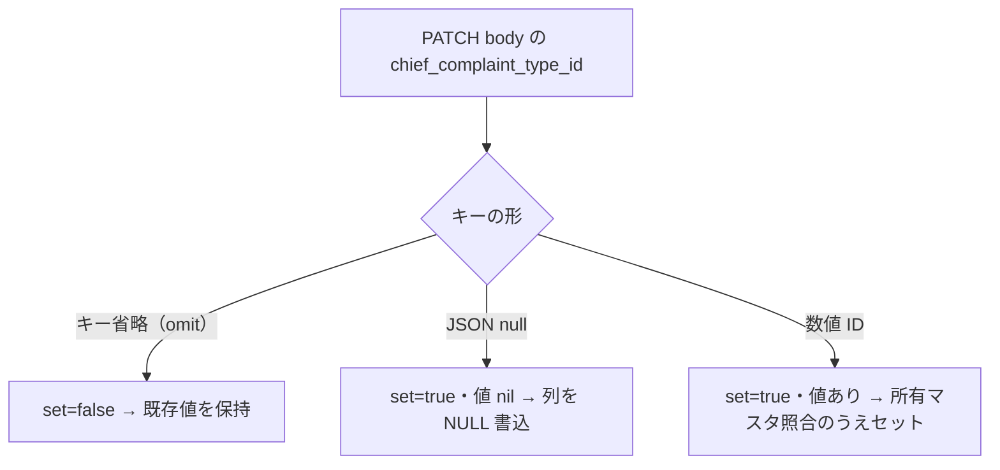

# SLACK-COMPLAINT: 主訴区分の新規未選択 vs 既存クリア

状態: **C0 clearable 実装済み／C3 hydrate 先行修正済み／N・C・reload 回帰 PASS／部分更新欠陥（C5）を最小修正済み／実 API・実 DB で保存・再読込を検証済み**。出典は [todo-issue.md](../../../todo-issue.md) 見出し `### SLACK-COMPLAINT`（L118–122、索引 L419）。保持する現場条件:

- 「主訴区分は空欄で入力」（出典 929–937。現行 `todo-issue.md` は要約のみ。原文行は本票では再掲しない）
- **空欄許可は依頼済み**。可否を PO へ再質問しない。新しい仕様待ちに戻さない
- 納品区分・受入者の確認は別途。本票は保存経路の事実トレース＋回帰証跡にする

本票は [InterviewChiefComplaint](../../../frontend/src/features/medical-records/components/InterviewChiefComplaint.tsx) → 問診 PATCH / 作成 request → inquiries 永続化 → GET 再読込 を、**新規の未選択（N）**と**既存選択の意図的解除（C）**に分離する。ready8 attempt `att-complaint-20260921-001` で N/C/reload/switch 回帰を追加し、再現した C3 hydrate のみ最小修正した。

本ファイルは製品コードから import されない。キャンペーン unit `SLACK-COMPLAINT` の owned path および人間が読む調査票である。製品モジュールからの呼び出し行は無い（sibling `SLACK-STAFF-SELECT.md` と同じ）。既存 `docs/work/todo-campaign-20260918/` にも本 unit の票は無い。ledger `owned_paths` が本パス単体のため、他シートへの追記では unit 完了にならない。

## 医院事実（コード外・UNKNOWN）

数値・院内ルールをコードから捏造しない。未採取なら該当セルは **再現 BLOCKED**。

| 項目 | コードで分かること | 医院事実 |
| --- | --- | --- |
| 報告医院・端末・ブラウザ | なし | **UNKNOWN** |
| 「空欄で入力」が新規カルテか、既存区分の解除か | UI は両方あり得る（後述）。報告一文では区別できない | **UNKNOWN**。採取前に片方へ決めない |
| 空欄時に残したい主訴本文の実例 | 定型テンプレ初期値はある（後述）。現場文面は別 | **UNKNOWN** |
| 既存区分を消す操作をしたか（クリア UI の有無はコードで分かる） | SearchableSelect は opt-in `clearable` で選択中のみ「選択をクリア」→ `onValueChange("")`。InterviewChiefComplaint が `clearable` を有効化 | 現場が過去にどう空欄にしたかは **UNKNOWN** |
| フロント/API revision | 本票作成時 worktree HEAD `aac697645`（`docs: TODOを回答済み要件から着手可能に整理`） | 再現セッションの SHA は **UNKNOWN**。採取時に固定する |

## 混ぜてはいけないケース

現場の「空欄で入力」は次のどれでも同じ言葉になる。空欄**許可の再質問**と、**保存経路の欠陥**と、**操作案内**を混ぜない。

### N — 新規未選択（一度も区分を選んでいない）

`chiefComplaintTypeId` の初期値は `null`（[use-medical-record-diagnosis-state.ts](../../../frontend/src/features/medical-records/hooks/use-medical-record-diagnosis-state.ts) L8）。空白許可は既にある。ここを仕様待ちに戻さない。

| ID | 条件（コード） | いまの経路 | 期待する分離 |
| --- | --- | --- | --- |
| N0 画面初期 | 問診タブ [InterviewChiefComplaint](../../../frontend/src/features/medical-records/components/InterviewChiefComplaint.tsx) L94–103。`value={chiefComplaintTypeId ? String(chiefComplaintTypeId) : ""}`。placeholder「選択してください」（読込中は「読み込み中...」）。required / 空禁止の validation はコンポーネント内に無い | 区分はプレースホルダ。主訴詳細は独立 textarea（L128–139） | 区分未選択でも主訴本文を書ける。空欄可否を再確認しない |
| N1 カルテ自動作成 | [use-medical-record-auto-create.ts](../../../frontend/src/features/medical-records/hooks/use-medical-record-auto-create.ts) L182–190 の POST は `pet_id` / `owner_id` / `visit_date` / `visit_type` / `appointment_id` / `status` / `recommendation_reason` のみ。`chief_complaint` も `chief_complaint_type_id` も送らない | [CreateMedicalRecordRequest](../../../frontend/src/features/medical-records/api/types.ts) L28–29 は `chief_complaint_type_id?: number`（`null` を型に含まない）。省略はフィールド欠落 | 新規作成時点では区分は **omit**。JSON `null` ではない |
| N2 作成時 subrecord | BE [createMedicalRecordRequest](../../../backend/internal/medicalrecord/medical_record_request.go) L136 は `ChiefComplaintTypeID *uint64`（`omitempty` なし）。[toSubRecordsInput](../../../backend/internal/medicalrecord/medical_record_request.go) L253–265 がそのまま渡す。[hasInquirySubRecordInput](../../../backend/internal/medicalrecord/medical_record_subrecords.go) L128–131 は type / complaint / notes のどれかが non-nil のときだけ inquiry upsert。N1 の POST は三つとも無い | 自動作成では inquiry 行を作らない（入力が無いため） | 未選択を「作成失敗」と読まない。inquiry 未作成と type NULL 行を混同しない |
| N3 問診タブ保存 | 既存 `recordId` の「問診」保存は [use-medical-record-save-action.ts](../../../frontend/src/features/medical-records/hooks/use-medical-record-save-action.ts) L236–246。`chief_complaint_type_id: snapshot.chiefComplaintTypeId` を **常に**渡す。未選択なら JS `null` | [UpdateInquiryRequest](../../../frontend/src/features/medical-records/api/inquiries.ts) L6–8 は `chief_complaint_type_id?: number \| null`。axios は `null` を JSON `null` にする（`undefined` だけ省略） | 新規未選択の **保存**は omit ではなく **JSON null**。N1 の作成 omit と混ぜない |
| N4 主訴本文 | 本文が `DEFAULT_CHIEF_COMPLAINT` と同一なら `chief_complaint` は `undefined`（省略）。違うときだけ文字列（save-action L237–240）。既定文は [use-medical-record-form-model.ts](../../../frontend/src/features/medical-records/hooks/use-medical-record-form-model.ts) L3–5 | 区分と本文は別フィールド。区分 null でも本文 PATCH は走る | 区分空欄で本文が消えるなら N ではなく保存ペイロード/再 hydrate を疑う。空欄禁止へ戻さない |
| N5 FK | [inquiry_service.Save](../../../backend/internal/medicalrecord/inquiry_service.go) L39–44 は `validateOwnedMasterFK(..., input.ChiefComplaintTypeID, ...)`。[validators.go](../../../backend/internal/medicalrecord/validators.go) L29–32 は sharedkernel へ委譲。nil ID は所有マスタ照合を要求しない（クロス医院 FK テストは **non-nil の他人 ID** を拒否する） | null は FK エラーにしない | 空欄保存の 4xx を「空欄は禁止」と読まない。実ステータス未採取なら N5 は BLOCKED |

### C — 既存選択の意図的解除

一度選んだ区分を空に戻す経路。空欄**許可**は既にある。C0 でクリア option を追加済み。PATCH/hydrate 残存は経路修正（C3 は先行 attempt）。「空欄にしてよいか」の仕様待ちではない。

| ID | 条件（コード） | いまの経路 | 期待する分離 |
| --- | --- | --- | --- |
| C0 クリア操作 | [SearchableSelect](../../../frontend/src/components/ui/searchable-select.tsx) に opt-in `clearable`。選択中かつ未 disabled のときリスト先頭に「選択をクリア」を出し、選択で `handleSelect("")` → `onValueChange("")`。InterviewChiefComplaint が `clearable` を渡す | 主訴区分で意図的クリア可能。フィルタ用途の他 SearchableSelect は既定 `clearable=false` のまま | **最小経路は empty affordance（クリア option）**。空欄許可の再質問はしない |
| C1 空文字→null の受け口 | InterviewChiefComplaint: `onValueChange={(value) => setChiefComplaintTypeId(value ? Number(value) : null)}`。props は `number \| null` | C0 の `""` がここに入り state は null | 受け口と C0 クリア UI が接続済み |
| C2 問診 PATCH | 保存は常に `chief_complaint_type_id: snapshot.chiefComplaintTypeId`（save-action L241）。state が null なら JSON `null` | C0 クリア後は null が送れる | C0→C1→C2 で JSON null 到達。残存は C3/persist |
| C3 hydrate | 先行 attempt で `use-apply-medical-record.ts` が server null も state へ書くよう修正済み。本 attempt では再編集しない | null hydrate でローカル選択を消す | 再読込残存を空欄禁止と読まない。本票は C0 実装に限定 |
| C4 確定済み | 問診フィールドは `!canEdit \|\| isFinalized` で disabled（InterviewChiefComplaint L43–44, L99）。PATCH も確定済みで拒否（inquiry_repository Conflict）。save-action は finalized を mutation 前に拒否 | 確定後クリアは対象外 | 確定カルテの空欄要望を draft 経路に混ぜない |

## omit 対 JSON null

層が違うと「送っていない」と「明示 null」が同じ Go 値になる。医院ポリシーではなくワイヤの事実。



| 層 | omit（キーなし） | JSON `null` | 数値 ID |
| --- | --- | --- | --- |
| 新規 POST（N1） | auto-create がキーを付けない。Create TS 型に `null` が無い | この経路では送っていない | この経路では送っていない |
| 問診 PATCH（N3/C2） | `undefined` だけ axios が落とす。save-action は type を常に `number \| null` で渡すので **省略しない** | 未選択なら `chief_complaint_type_id: null` | 選択中なら数値 |
| BE bind | [updateInquiryRequest](../../../backend/internal/medicalrecord/inquiry_request.go) L3–8 は `chief_complaint_type_id` に `nullableUint64RequestField`（clinical_plan の diagnosis_2_*_id と同型）を使う。**キー省略 → `set=false`、JSON null → `set=true,value=nil`、数値 → `set=true,value=&v`** で3値を区別する（EMR-87 修正後） | 明示 null は「送信済み・値なし」 | non-nil |
| サービスコメント | [UpsertInquiryInput](../../../backend/internal/medicalrecord/inquiry_service.go) L11–19 は `ChiefComplaintTypeID **uint64`: nil=未送信(保持) / &nil=NULL クリア / &&v=セット。Save は `optionalDoubleUint64` で nil 正規化して所有マスタ照合し、`InquiryUpsertFields` をそのまま repository へ渡す | &nil は「列を NULL にする」 | &&v |
| 永続化 | [SaveByMedicalRecordID](../../../backend/internal/medicalrecord/inquiry_repository.go) L84–109 は `map[string]any` に**送信されたフィールドのみ**載せる。`fields.ChiefComplaintTypeID != nil` なら `"chief_complaint_type_id": *fields.ChiefComplaintTypeID`（内側 nil → SQL NULL）。未送信キーは列に触れない | omit は列を保持、明示 null は NULL 書込 | ポインタ付き ID |
| 作成 subrecord | type が nil なら `ChiefComplaintTypeID` 外側 nil のまま渡し既存値を保持（[medical_record_subrecords.go](../../../backend/internal/medicalrecord/medical_record_subrecords.go) L33–42）。inquiry upsert 自体は N2 のとおり入力が無いとスキップ | nil は保持（既存行を消さない） | 入力ありなら &&v で upsert |
| GET 応答 | [InquirySummaryResponse](../../../backend/internal/medicalrecord/medical_record_response.go) L45 と [inquiryResponse](../../../backend/internal/medicalrecord/inquiry_response.go) L13 は `json:"chief_complaint_type_id,omitempty"`。nil は **キー省略**。JSON null は出さない | 応答に null は出ない | 数値 |
| FE 再読込 | [transformMedicalRecord](../../../frontend/src/lib/transforms/medical-record.ts) L52–53: `record.inquiry?.chief_complaint_type_id ?? null`。キー省略は JS `undefined` → `null` | 応答に現れない | 数値。BUG-013 テスト（[transforms.test.ts](../../../frontend/src/features/medical-records/api/transforms.test.ts) L144–149） |

要点:

1. **新規作成（N1）の未選択は omit。問診保存（N3）の未選択は JSON null。** 同じ「空」でも HTTP 形が違う。
2. ~~Go の PATCH bind は omit と null を区別しない~~ → **修正済み**: `nullableUint64RequestField` で omit（保持）/ null（クリア）/ 数値（セット）の3値を区別する。
3. ~~persist の NULL 化は UNKNOWN~~ → **実 DB で解消済み**: 修正前は `chief_complaint_type_id` のみならず未送信の `chief_complaint`/`notes` もゼロ値で上書きしていた（C5、下記）。`InquiryUpsertFields` の部分更新で、明示 null のみ NULL 書込・未送信は保持を実 PostgreSQL で確認した。
4. GET は nil を omit する。FE は omit を `null` に正規化する。C3 の hydrate は `null` を state に書き戻さない。

## C5 — 部分更新欠陥（本 attempt で実機再現・最小修正）

再現（本 worktree コードを disposable backend + disposable PostgreSQL で起動し curl で実行）:

```text
PATCH /api/v1/medical-records/1/inquiries {"chief_complaint":"朝から嘔吐している","notes":"元気あり","chief_complaint_type_id":null} → 200（保存 OK）
PATCH /api/v1/medical-records/1/inquiries {"chief_complaint_type_id":1}          → 200 だが chief_complaint/notes が "" に消える
```

原因: `inquiryService.Save` が非 nil 入力だけを詰めた**新規 `model.Inquiry`** を `SaveByMedicalRecordID` へ渡し、repository が 12 列すべてを `map[string]any` で無条件に上書きしていた。未送信フィールドはゼロ値（`""`/nil）で既存値を消していた。save-action は unchanged の本文/notes を `undefined`（省略）で送るため、**区分クリアのみの保存で主訴本文が失われる**実害があった（N4 の期待に反する）。

最小修正（clinical_plan の `**uint64` PATCH 契約と同型）:

- `updateInquiryRequest.ChiefComplaintTypeID` → `nullableUint64RequestField`（omit/null/値の3値区別）
- `UpsertInquiryInput.ChiefComplaintTypeID` → `**uint64`（nil=保持 / &nil=NULL クリア / &&v=セット）
- `SaveByMedicalRecordID` は `InquiryUpsertFields` を受け、送信フィールドのみを update map に載せる（未送信列は触らない。空パッチは Updates をスキップ）
- `medical_record_subrecords.go` も同じ patch 型へ移行（type 未送信時に既存区分を消さない）

clinic_id スコープ・確定済み拒否・FOR UPDATE 直列化・FirstOrCreate は不変更。

## 現行経路（UI → request → 保存 → 再読込）

1. **入口:** [MedicalRecordFormReadyPanels](../../../frontend/src/features/medical-records/routes/MedicalRecordFormReadyPanels.tsx) L251 → 問診タブ [MedicalRecordInterview](../../../frontend/src/features/medical-records/components/MedicalRecordInterview.tsx) L88 → InterviewChiefComplaint。区分は SearchableSelect。マスタは [useGetChiefComplaintTypes](../../../frontend/src/features/medical-records/api/get-chief-complaint-types.ts)。
2. **新規:** ペット選択後 auto-create が POST `/v1/medical-records`（N1）。navigate で detail。問診 state は診断 state の初期 `null` のまま（inquiry が無ければ transform も `?? null`）。
3. **問診保存:** タブ「問診」の formAction → PATCH `/v1/medical-records/:id/inquiries`（[inquiry_handler.go](../../../backend/internal/medicalrecord/inquiry_handler.go) L22–43）→ `updateInquiryRequest.toServiceInput` → `inquiryService.Save` → `SaveByMedicalRecordID`（親カルテ FOR UPDATE、draft のみ）。
4. **成功後:** `useUpdateInquiry` が `queryKeys.medicalRecords.detail(recordId)` を invalidate（inquiries.ts L17–19）。再 GET の embed は InquirySummary。transform → `useApplyMedicalRecord`。
5. **主訴本文:** 区分と独立。空欄区分でも本文を失わないことが受入（todo-issue L122）。本文が DEFAULT のままだと PATCH から `chief_complaint` キーが落ちる（省略）。type キーは落ちない。

## 再現プロトコル（実機前に固定する軸）

同一医院・同一権限・draft カルテで、N と C を別レコード（または C の前に一度区分を保存した同一レコード）で取る。空欄許可を質問しない。

| 手順 | 固定すること | PASS の見方 | やってはいけないこと |
| --- | --- | --- | --- |
| N 新規未選択 | 区分はプレースホルダのまま。主訴本文を DEFAULT から変更して保存 → 再読込 | 本文が残り、区分は空のまま。4xx にしない | 空欄禁止バリデーションを足す。PO に可否を聞く |
| C 既存解除 | 一度区分を選んで保存・再読込で ID が戻ることを確認してから、「選択をクリア」で空に戻して保存 | クリア後に JSON null が飛び、再読込で空のまま。再読込で残るなら C3/persist を疑う（C3 hydrate は先行 attempt で修正済み） | 空欄許可を再質問する。C3 を再実装する |
| omit vs null | 開発者ツールで N1 POST と N3 PATCH の JSON を保存 | N1 に type キー無し、N3 未選択は `null` | 片方だけ見て「常に omit」または「常に null」と書く |

対象環境不足は該当行 BLOCKED。根拠がない一括「必須化」や「全医院で空にできない」断定を先行実装しない。

## 回帰結果（att-complaint-20260921-001 + att-complaint-20260922-001）

| ケース | 期待 | 結果 | 証跡 |
| --- | --- | --- | --- |
| N unset new save | 問診 PATCH が `chief_complaint_type_id: null`、本文保持 | **PASS** | `use-medical-record-save-action.test.ts` |
| C intentional clear receive | `onValueChange("")` → setter `null`；保存も JSON null | **PASS** | `InterviewChiefComplaint.test.tsx` + save-action |
| C0 clear UI | SearchableSelect `clearable` + InterviewChiefComplaint 有効化。「選択をクリア」→ `""` | **PASS**（att-complaint-20260922-001） | 本票 C0；vitest 4/4 |
| C3 reload / chart switch | server/null へ hydrate で local type を消す | **FAIL→PASS**（先行 attempt） | apply-medical-record always-write null；本 attempt では再編集なし |
| N vs C vs reload 区別 | 新規未選択はクリア option 無し／意図的クリアは option あり／親 null 再描画は clear クリック無しで空 | **PASS** | `InterviewChiefComplaint.test.tsx` |
| 空欄許可再質問 | 再開しない | **PASS** | 本票・実装とも PO 質問なし |
| C5 部分更新欠陥（本 attempt で発見） | 区分のみの PATCH が未送信の `chief_complaint`/`notes` を消さない | **FAIL→PASS** | 修正前は実 API で `""` に消えることを再現。`InquiryUpsertFields` 部分更新化で解消 |
| BE persist: NULL 書込 | 明示 `null`（&nil）で `chief_complaint_type_id` が SQL NULL | **PASS** | `inquiry_repository_test.go` `…_ChiefComplaintTypeNullPersistence`（実 PostgreSQL、COALESCE 直読） |
| BE persist: 未送信は保持 | type 未送信の PATCH が既存区分を消さない | **PASS** | 同上 subtest「未送信は既存区分を保持」 |
| BE bind: omit vs null | JSON `null` → `&nil`、キー省略 → nil 外側（保持） | **PASS** | `inquiry_handler_test.go` TestUpdateInquiry 2 subtest 追加 |
| 実 API 保存・再読込 | disposable backend（本 worktree）+ disposable PostgreSQL で PATCH→GET | **PASS** | 下記コマンド群。N: null+本文→200・本文保持・列 NULL。C: 区分1→null で本文保持・列 NULL・GET 再読込でも空。type 未送信 PATCH は既存区分を保持 |

検証コマンド（compose frontend down → ephemeral, att-complaint-20260922-001）:

```bash
docker run --rm --network none --pull never \
  -v "$PWD/frontend:/app" -v ekarte-frontend-node-modules:/app/node_modules \
  -w /app node:24-alpine \
  node node_modules/vitest/vitest.mjs run --configLoader native \
  src/features/medical-records/components/InterviewChiefComplaint.test.tsx
# GREEN: Test Files 1 passed / Tests 4 passed
```

本 attempt の追加検証（disposable postgres `emr87-pg` + 本 worktree マウントの ephemeral コンテナ、compose スタック不使用）:

```bash
# backend scoped tests（パッケージ全体、TestMain が <DB>_test を構築）
docker run --rm --network emr87-test -v "$PWD/backend:/app" -v "$PWD/docs:/docs:ro" \
  -v ekarte-go-mod-cache:/go/pkg/mod -v ekarte-go-build-cache:/root/.cache/go-build \
  -w /app -e DB_HOST=emr87-pg -e DB_PORT=5432 -e DB_USER=ekarte_user \
  -e DB_PASSWORD=ekarte_password -e DB_NAME=ekarte_db --entrypoint go \
  animalekarte-backend:latest test ./internal/medicalrecord/ -count=1
# ok github.com/animal-ekarte/backend/internal/medicalrecord 57.6s

# 実 API（disposable backend `emr87-api`、air が本 worktree を watch）
PATCH /api/v1/medical-records/1/inquiries {"chief_complaint":"…","notes":"…","chief_complaint_type_id":1} → 200
PATCH /api/v1/medical-records/1/inquiries {"chief_complaint_type_id":null} → 200（本文/notes 保持・type omit）
GET  /api/v1/medical-records/1 → inquiry.chief_complaint="…"、chief_complaint_type_id キー無し
DB:  SELECT … chief_complaint_type_id IS NULL → t
PATCH /api/v1/medical-records/1/inquiries {"chief_complaint":"再診：少し改善"}（type キー無し）→ 区分 1 を保持
PATCH /api/v1/medical-records/2/inquiries {"chief_complaint":"下痢","chief_complaint_type_id":null} → 200・列 NULL
```

## 完了 / PO・停止

todo-issue L122 の完了条件を本票に落とす:

- 区分未設定で主訴本文を失わず保存できる（N）。失敗した画面/経路だけ最小修正 — **回帰 PASS**
- 既存区分の意図的解除も受入に含める（C）。**C0 は最小 clearable option を追加**。C3 hydrate は先行 attempt で修正済み（本 attempt では再編集なし）
- 納品区分・受入者確認は別途
- **空欄許可そのものを新しい仕様待ちに戻さない**

臨床的な「空欄にしてよいか」は依頼済みとして閉じる。医院ごとの必須運用ルールはコードに無く **UNKNOWN**。本票で作らない。保存・再読込は本 worktree の実 backend + 実 PostgreSQL（disposable）で検証済み。**残る未実施はブラウザ実機での UI 操作受入**（「選択をクリア」クリック→保存→リロード→カルテ切替の画面上確認）のみ。
