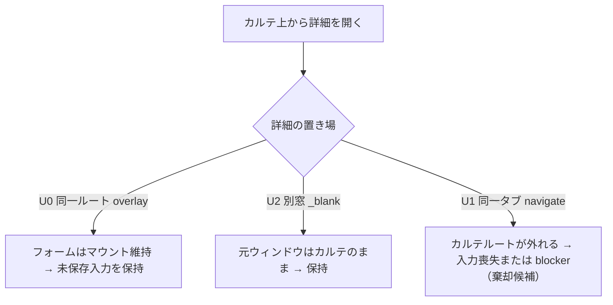

# SLACK-DETAILS: カルテヘッダーから飼主/ペット詳細へ（差替え検索を発火せず、未保存入力を失わない）

状態: **詳細閲覧導線の調査 READY／製品実装・実機受入 未実行**。出典は [todo-issue.md](../../../todo-issue.md) 見出し `### SLACK-DETAILS`（L136–140、索引 L424）。保持する現場条件:

- 飼主名 / ペット名（または隣）から**詳細を見たい**（出典 949–955。現行 `todo-issue.md` は要約のみ。原文行は本票では再掲しない）
- **飼主差替え検索を誤発火しない**。詳細閲覧と患者差替えは別操作
- 閉じる/戻るで**未保存のカルテ入力が保持**される
- 新しい重複画面や患者変更を前提にしない。既存画面の再利用範囲を先に調べる
- **閲覧だけか編集も必要か、表示項目と権限は PO 未確定（UNKNOWN）**。本票で採用しない

本票は [MedicalRecordFormReadyPanels](../../../frontend/src/features/medical-records/routes/MedicalRecordFormReadyPanels.tsx) の `onOwnerClick`、[PatientContextHeader](../../../frontend/src/components/shared/PatientContextHeader/PatientContextHeader.tsx)、[OwnerForm](../../../frontend/src/features/owners/routes/OwnerForm.tsx)、[PetEditModal](../../../frontend/src/features/owners/components/PetEditModal.tsx) をトレースする。製品コード・テストは変更しない。

呼び出し行: **無い。** 本ファイルは製品コードから import されない。キャンペーン unit `SLACK-DETAILS` の owned path および人間が読む調査票である（sibling `SLACK-MICROCHIP.md` L13 と同じ）。既存 `docs/work/todo-campaign-20260918/` に本 unit の票は無く、`todo-issue.md` L136–140 は出典要約であり本票の代替ではない。ledger `owned_paths` が本パス単体のため、他シートへの追記では unit 完了にならない。

## 医院事実（コード外・UNKNOWN）

数値・院内ルールをコードから捏造しない。未採取なら該当セルは **再現 BLOCKED**。閲覧 vs 編集は本票で決めない。

| 項目 | コードで分かること | 医院事実 |
| --- | --- | --- |
| 報告医院・端末・ブラウザ | なし | **UNKNOWN** |
| 「詳細」が飼主マスタかペットマスタか飼主レポートか | 3 surface が別（後述） | **UNKNOWN**。PO が対象を確定するまで片方へ実装しない |
| 飼主名クリック vs ペット名クリック | 飼主は条件付きボタン、ペット名は常に span | **UNKNOWN**。現場がどちらを指すかは未採取 |
| 閲覧だけか編集も必要か | OwnerForm / PetEditModal は編集 UI が本体。`owners` 権限で fieldset 無効化 | **UNKNOWN**（todo-issue L140）。本票は両方の再利用を比較するだけ |
| 表示項目（住所・電話・同居ペット・保険・危険度など） | 各既存画面のフィールドは後述 | **UNKNOWN**。項目リストを本票で採用しない |
| 権限（カルテ編集者に飼主編集を許すか） | カルテヘッダーは `medical-records`、OwnerForm/PetEditModal は `owners` | **UNKNOWN**。権限を合算・削除しない |
| 添付画面の内容 | todo-issue L138「添付画面の内容は未確認」 | **UNKNOWN**。Slack 画像を本票で復元しない |
| 1366×625 実機 CSS viewport | ローカル基準は [CHART-FIT票](../todo-campaign-20260918/UAT-R2-CHART-FIT.md) と同じ 1366×625 CSS px | **UNKNOWN**。実機 `innerWidth`/`innerHeight` は採取前 |
| フロント/API revision | 本票作成時 worktree HEAD `aac697645` | 再現セッションの SHA は **UNKNOWN** |

## 混ぜてはいけないケース

現場の「名前から詳細を見たい」は次のどれでも同じ言葉になる。閲覧と患者差替えを混ぜない。

| ID | 何か | いまのコード | 混ぜてはいけない読み替え |
| --- | --- | --- | --- |
| S — 飼主差替え検索 | ReadyPanels L218 が `onOwnerClick={ready.modals.handleOpenOwnerSearch}`。[use-medical-record-form-modals.ts](../../../frontend/src/features/medical-records/hooks/use-medical-record-form-modals.ts) L26–28 は `setIsOwnerSearchOpen(true)`。モーダルタイトルは「飼主検索」（[OwnerSearchModal.tsx](../../../frontend/src/components/shared/OwnerSearchModal/OwnerSearchModal.tsx) L158） | 「名前クリック = 詳細」と読まない。現行は検索 |
| R — カルテの飼主 ID 差替え | [MedicalRecordFormModals.tsx](../../../frontend/src/features/medical-records/components/MedicalRecordFormModals.tsx) L94–99 の `onSelect={onSelectOwner}` → ReadyPanels L390 `form.requestOwnerChange`。[use-medical-record-owner-change.ts](../../../frontend/src/features/medical-records/hooks/use-medical-record-owner-change.ts) L66–78 が `owner_id` を PATCH | 詳細を開く操作と患者（飼主）差替えを同一視しない |
| H — ヘッダー表示 | [MedicalRecordStickyHeader.tsx](../../../frontend/src/features/medical-records/components/MedicalRecordStickyHeader.tsx) L194–208 → PatientContextHeader。飼主ボタン + ペット名 span | 表示されている = 詳細画面、と読まない |
| P — ペット名 | PatientContextHeader L132–137 は `span`。`onPetClick` は props に無い（`rg onPetClick` 0 件） | ペット名クリックで詳細が開く現状はない |
| C — 同居チップ | StickyHeader L57–59 は `medicalRecords?pet_id=` の **新規カルテ入口** Link | 同居クリックを「今のカルテのペット詳細」と混ぜない（SLACK-MICROCHIP の C と同じ） |
| O — 飼主マスタ画面 | `/owners/:id` の [OwnerForm](../../../frontend/src/features/owners/routes/OwnerForm.tsx)。PageLayout タイトルは常に「飼主・ペット　編集」（L261） | カルテ sticky から navigate 済み、と読まない |
| E — ペット編集モーダル | [PetEditModal](../../../frontend/src/features/owners/components/PetEditModal.tsx)。OwnerForm L325–334 と [OwnersList.tsx](../../../frontend/src/features/owners/routes/OwnersList.tsx) L407–416 のみ本番マウント | カルテヘッダーから開く現状はない |
| T — ペットの飼主変更 | PetEditModal L183–192「飼主変更」→ ネスト OwnerSearchModal。OwnerForm は [use-owner-pet-change-confirm.ts](../../../frontend/src/features/owners/hooks/use-owner-pet-change-confirm.ts) で **ペット行の owner 付け替え** | カルテ `owner_id` PATCH（R）とペットマスタの飼主変更を同一視しない |
| RP — 飼主レポート | StickyHeader L175–188。`openOwnerReport` が `_blank`（[owner-report-window.ts](../../../frontend/src/lib/owner-report-window.ts) L8–10） | レポート別窓を飼主/ペットマスタ詳細と同一視しない |
| N — 新規カルテ / 確定済 / 閲覧専用 | StickyHeader L208: `onOwnerClick={!isNewRecord && canEdit && !isFinalized ? onOwnerClick : undefined}`。未配線時は飼主も span（PatientContextHeader L127–130） | 「名前が押せない」を「詳細が無い」だけと読まない。差替え導線も閉じている |

## 現行経路（飼主クリック = 検索 → カルテ飼主差替え）

1. **配線:** ReadyPanels L204–218 が StickyHeader に `onOwnerClick={ready.modals.handleOpenOwnerSearch}` を渡す。
2. **ゲート:** StickyHeader L208。既存カルテかつ `medical-records` の `canEdit` かつ未確定のときだけ PatientContextHeader へ関数を渡す。
3. **UI:** PatientContextHeader L117–126。`onOwnerClick` があると飼主名は `button`（テスト: [PatientContextHeader.test.tsx](../../../frontend/src/components/shared/PatientContextHeader/PatientContextHeader.test.tsx) L169–175）。ペット名は常に `span`（L132–137）。
4. **開くもの:** `handleOpenOwnerSearch` は検索フラグだけ（modals hook L26–28）。中身は OwnerSearchModal（タイトル「飼主検索」、説明「飼主名、飼主No、電話番号で検索できます」）。
5. **選択後:** `requestOwnerChange`。値引率/会員区分が違うと ConfirmDialog「飼主変更の確認」（FormModals L103–112）。同じなら即 `updateOwner`。
6. **永続化:** `updateMutation.mutateAsync` に `owner_id` + `version`。成功 toast「飼主を {name} に変更しました」。これは **カルテ行の飼主 FK 差替え**であり、飼主マスタ詳細ではない。
7. **マウント条件:** FormModals L92 `!isNewRecord && recordId`。新規カルテではモーダル自体が無い。
8. **チャートはアンマウントしない。** 検索モーダルは同一ルート上の Dialog。未保存入力はモーダル開閉だけでは消えない。消えるのは選択確定後のカルテ再取得/飼主変更副作用と、別ルートへ離れたとき。

**結論（コード）:** 現行の飼主名クリックは **詳細閲覧ではなく飼主差替え検索**である。todo-issue L138 の指摘と一致する。

## 未保存カルテ入力の保持契約

| ID | 操作 | カルテフォーム | 未保存入力 |
| --- | --- | --- | --- |
| U0 同一ルートの Dialog | OwnerSearchModal / StaffSelectionModal / VitalsModal / 今後の overlay | マウント維持 | **保持。** SPA unmount しない |
| U1 SPA navigate `/owners/:id` | OwnerForm は [clinical-general-routes.tsx](../../../frontend/src/app/routes/clinical-general-routes.tsx) L67–74 の別ルート | カルテルートが外れる | **失われる。** ReadyPanels L190 `<NavigationBlocker when={ready.isDirty} />` が pathname 変更を止め、確認「ページを離れる」で破棄（[NavigationBlocker.tsx](../../../frontend/src/components/shared/NavigationBlocker/NavigationBlocker.tsx) L30–32, L85–87）。`useUnsavedChanges` の `beforeunload` はタブ閉じ用 |
| U2 `window.open` `_blank` | 飼主レポート（RP）と同じ契約 | 元ウィンドウはカルテのまま | **元ウィンドウは保持。** 別窓の OwnerForm は別セッション。カルテ dirty は移さない |
| U3 同居チップ Link | StickyHeader L57–59 | 一覧 `?pet_id=` へ遷移 | U1 と同じ blocker。今の記録の詳細ではない |
| U4 飼主差替え確定（R） | 同一ルートだが `owner_id` PATCH | マウント維持 | 入力文字列は残っても **患者コンテキストが変わる**。詳細要望の成功条件（差替え誤発火しない）に反する |

受入（todo-issue L140）: 閉じる/戻るでカルテ入力が保持され、患者差替えを誤発火させない。U1 を詳細導線にすると blocker 確認待ちか入力喪失になるため、**詳細は overlay（U0）か別窓（U2）に限定する。** 同一タブ navigate は棄却候補。

## 既存画面の再利用比較（重複画面を発明しない）

| 画面 | 何か | 権限 | 閲覧/編集 | カルテ未保存 | 患者差替え | 再利用判定 |
| --- | --- | --- | --- | --- | --- | --- |
| **OwnerForm** `/owners/:id` | 飼主情報 + ペット一覧 +（注入）会計/LINE。[OwnerFormPage.tsx](../../../frontend/src/app/pages/OwnerFormPage.tsx) が合成 | `owners`（ルート RequirePermission view、submit は L122 `isEdit ? canEdit : canCreate`） | タイトルは「編集」。`canEdit` が無いと fieldset `disabled`（L274）で閲覧相当。専用 read-only 画面は無い | U1 で喪失。U2 なら元カルテは保持 | 画面自体はカルテ `owner_id` を書かない。ペット行の「飼主変更」は T | **飼主マスタの正本。** カルテ上へ丸ごと埋め込むには PageLayout 依存が強い。別窓 U2、または OwnerInfoSection を Dialog に載せる抽出が再利用。新規「飼主詳細ページ」は不要 |
| **PetEditModal** | Dialog。タイトル「ペット情報編集」/「新規登録」（L174–176）。`useGetPet` で死亡理由を水和 | `owners` の `canEdit`（L58）。fieldset L196。Save は `canEdit` のときだけ（L244–248） | 編集 UI。閲覧は fieldset 無効化で代用し得る。PO が閲覧専用なら Save/飼主変更を出さない | U0。カルテにマウントすれば入力保持 | `onChangeOwner` を渡すと「飼主変更」+ OwnerSearchModal（L183–192, L253–261）。**カルテから開くなら `onChangeOwner` を渡さない**（OwnersList は未渡し L407–416） | **ペット詳細の正本。** カルテヘッダーから開く最短再利用。新モーダルを発明しない |
| **OwnerSearchModal** | 検索テーブル。選択で callback | 呼出元依存 | 詳細ではない | U0 | カルテでは R を起こす | **詳細導線に使わない。** 差替え専用として残す |
| **飼主レポート** | 臨床 briefing 別窓 | `medical-records` view（StickyHeader L101–102） | 閲覧 | U2 | しない | マスタ詳細の代替にしない。既存「レポート」ボタンは残す |
| **PatientContextHeader 属性行** | 体重・品種・保険チップ等 | 表示のみ | 要約 | 該当なし | しない | 「詳細」要求をヘッダー項目追加だけで満たしたことにしない |

OwnerForm のペット行は `onEditPet={handleEditPet}` → 同じ PetEditModal。カルテからペット詳細を出すなら **OwnerForm へ遷移せず PetEditModal をカルテに載せる**方が U0 を満たす。

## 配置オプション比較（実装しない）

| ID | 操作 | 詳細か検索か | 未保存 | 患者差替え | 重複画面 | 備考 |
| --- | --- | --- | --- | --- | --- | --- |
| **O0 現状** | 飼主名 → 飼主検索。ペット名は非クリック | 検索（S/R） | U0（開閉）だが選択で R | **する** | なし | 現場条件を満たさない |
| **O1 ヘッダーは overlay 詳細、差替えは別コントロール（推奨候補）** | 飼主名 → OwnerInfoSection を Dialog に載せるか OwnerForm 相当の overlay。ペット名 → PetEditModal（`onChangeOwner` 無し）。現行 OwnerSearchModal は「飼主変更」等の明示操作へ移す | 詳細 | U0 | **しない**（検索を名前から外す） | **なし。** 既存コンポーネント再利用 | 閲覧 vs 編集は PO。編集するなら `owners` 権限を独立確認。カルテ `owner_id` を書かない |
| **O2 別窓で `/owners/:id`** | レポートと同じ `window.open(..., "noopener,noreferrer")` | 詳細（OwnerForm 正本） | U2 | しない（別窓） | なし | カルテは保持。別窓側の編集とカルテ `selectedPet` の同期は 30 分 stale（SLACK-MICROCHIP RF0 と同型）。同一タブに戻る操作と混ぜない |
| **O3 同一タブ navigate** | `paths.owners.detail.getHref(ownerId)` | 詳細 | **U1 で喪失または blocker** | しない | なし | **棄却。** 未保存保持の受入に反する |
| **O4 名前クリックのまま検索を残し、隣に「詳細」リンク** | 検索誤発火は残る | 混在 | 詳細が O2/O3 依存 | 名前側は R のまま | なし | 現場の「名前から見たい」を満たしにくい。差替え誤発火が残る |
| **O5 新規詳細画面** | カルテ専用の Owner/Pet 閲覧ページ | 詳細 | 設計次第 | 設計次第 | **第二画面** | **禁止。** todo-issue L140「新しい重複画面を前提にせず」 |

**設計として先に残すのは O1。** O2 は OwnerForm をそのまま見せたい場合の代替（未保存は元窓で保持）。O0 は現状。O3–O5 は入力喪失・誤発火・重複画面。

O1 で PetEditModal をカルテに載せる最小条件（実装しない。比較用）:

1. StickyHeader / PatientContextHeader に飼主・ペットそれぞれの handler を分ける（ペットは今日 `onPetClick` が無い）
2. `onOwnerClick` を `handleOpenOwnerSearch` から外す
3. PetEditModal を MedicalRecordFormModals 相当にマウント。`onChangeOwner` を渡さない
4. 飼主は OwnerForm 丸ごとではなく、既存 OwnerInfoSection を Dialog に載せるか O2。PageLayout 付き OwnerForm をカルテ children に埋めない
5. 差替えがまだ必要なら「飼主変更」ボタンを contextControls へ明示移設（名前クリックから分離）

## ケース表（受入の読み替え防止）

| ID | 条件 | 期待（todo-issue L140） | 現行（コード） |
| --- | --- | --- | --- |
| D0 既存カルテ・編集可・未確定 | 飼主名クリック | 正しい飼主詳細。差替え検索ではない | OwnerSearchModal。選択で `owner_id` PATCH |
| D1 ペット名クリック | 正しいペット詳細 | ヒット領域が span。ハンドラ無し |
| D2 overlay を閉じる | カルテ入力が残る | 検索モーダル閉じは残る。navigate は残らない |
| D3 新規カルテ | 差替えも詳細も誤発火しない | `onOwnerClick` undefined。検索モーダル未マウント |
| D4 確定済 / `!canEdit` | 差替えしない | 飼主は span。詳細も出ない |
| D5 閲覧専用ユーザー（`owners` view, 非 edit） | PO 未決。編集 UI を出さないのが安全側 | OwnerForm/PetEditModal は fieldset disabled。カルテからは未到達 |
| D6 差替えが必要な業務 | 名前詳細とは別の明示操作 | 名前が差替えそのもの |
| D7 1366×625 | 詳細を開いても 9 タブと保存に戻れる | フルページ OwnerForm はカルテを覆い隠す（O3）。Dialog は CHART-FIT の残作業 |

## 完了 / PO・停止

todo-issue L140 を本票に落とす:

- 飼主/ペットそれぞれで正しい詳細に到達すること。現行の飼主クリックは **検索（S）であり詳細ではない**
- 閉じる/戻るでカルテ入力保持 → overlay（U0）または別窓（U2）。同一タブ navigate（O3）は停止
- 患者差替えを誤発火させない → 名前から OwnerSearchModal / `requestOwnerChange` を外す。差替えは明示コントロールへ
- **閲覧だけか編集も必要か、表示項目と権限は PO。** 本票は UNKNOWN のまま
- 新しい重複画面を作らない。OwnerForm と PetEditModal を再利用できる範囲は O1/O2
- 飼主レポート・同居チップ・ペットマスタの飼主変更・カルテ `owner_id` PATCH を「詳細」と呼ない
- 実機 viewport・添付画面・医院の対象ラベルは UNKNOWN のまま採取。本票で数値や画面内容を埋めない

本票は経路トレースと O1/O2 比較まで。製品コードは変更していない。後続実装は別 revision。閲覧 vs 編集の裁定前に Save/PATCH をヘッダーへ足さない。
