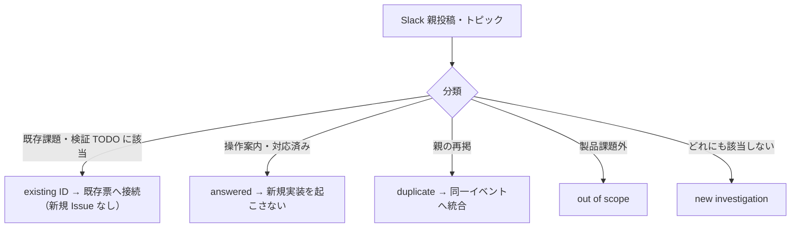

# SLACK-INTAKE: Slack トピックの分類照合（既存 ID へ、todo-issue.md は編集しない）

状態: **分類照合 READY／外部シート照合 UNKNOWN／製品実装なし**。出典は [todo-issue.md](../../../todo-issue.md) 見出し `### SLACK-INTAKE`（L166–170、索引 L434）と親 `1789550614.370909`（出典 1000–1063）。保持する現場条件:

- 受付/看護の窓口は **Q&A の 1内容1件分類**であり、新しい EMR 受付画面ではない
- 不具合＝納品前、要望＝納品後、質問＝操作案内。未確定は PO の限定質問。全要望を納品前不具合へ昇格しない
- 9月16日の細分化（同一親の複数要件）は **個別プランのまま**。本票へまとめない
- 確認済み重複行は「不要」との回答がある。黒塗り行の削除回答を **無制限削除の許可**にせず、外部で既に消去済みとも断定しない
- 外部 Q&A シートの現行状態は **UNKNOWN**（URL/tab/列/所有者は repo から検証できない）

本ファイルは製品コードから import されない。キャンペーン unit `SLACK-INTAKE` の owned path および人間が読む分類票である。ledger `owned_paths` が本パス単体のため、他シートや dirty `todo-issue.md` への追記では unit 完了にならない。照合日 2026-09-20。対象 `todo-issue.md` SHA-256 `395c2588da867276a0b0c503f6ebcae792b9afad070947ebaf4dcbf949f2cb0b`（dirty バイトは変更しない）。Slack 原文 Vault `50_Projects/顧客案件/ノア動物病院電子カルテ/会話ログ/Slack_電子カルテ開発_曽我/2026-08-20以降_不具合等Slack全文.md` SHA-256 `9d54ab0d7c4432dade86fcb75c82fef55cbe91243745fbe594dc4b543a286e03` は転記しない。

## 医院事実（コード外・UNKNOWN）

| 項目 | 文書で分かること | 医院事実 |
| --- | --- | --- |
| 外部 Q&A シート locator / tab / 列 | [backlog-spreadsheet.md](../../ops/backlog-spreadsheet.md) は正本を外部シートとし、repo へ URL を固定しない | **UNKNOWN**。承認済 locator なしでは照合停止 |
| 黒塗り/確認済み重複行の現行有無 | Slack 1000–1063 に「不要」回答。削除実施の証拠ではない | **UNKNOWN**。消去済みと断定しない |
| 受付/看護窓口の担当者と連絡手段 | CLINICAL-UAT / UAT-SCHEDULE が受入窓口を別 ID で持つ | **UNKNOWN**。本票で名簿を作らない |
| 助成金・表紙 PDF の受理 | 親 184–211 は対象外。受理確認ではない | **UNKNOWN** |

## 混ぜてはいけない読み替え

| 禁止 | 理由 |
| --- | --- |
| INTAKE を受付/看護の新画面・集約 UI として実装する | ①要件を疑う。窓口集約は分類運用。現場一連は [SLACK-CLINICAL-UAT](../../../todo-issue.md#slack-clinical-uat) |
| 45キーを本票1件へ畳む | 9/16 細分化は個別プラン。完了条件が明示 |
| repo 内に Q&A 複製ビューを置く | [backlog-spreadsheet.md](../../ops/backlog-spreadsheet.md) 禁止。旧 `q&a.html` は現行ではない |
| 黒塗り行を一括削除する | 無制限削除の許可ではない。対象行・範囲の承認まで停止 |
| 外部シート状態を本票の分類根拠にする | 外部状態は今回 UNKNOWN。Plane/Linear/Backlog 書込みも未実施 |
| 本文保存やローカル検証を、報告不具合の解消と扱う | [todo-issue.md](../../../todo-issue.md) L389 |

分類値は完了条件どおり次の5つのみ: **existing ID** / **new investigation** / **answered** / **duplicate** / **out of scope**。

- existing ID: 既存課題本文または検証 TODO の ID へ接続。新規 Issue を作らない
- new investigation: 45キー/50親のどちらにも載らない要件。今回は **0件**
- answered: 操作案内・謝辞済み、またはコード対応済みで新規実装を起こさない（医院受入完了ではない）
- duplicate: 親の再掲。同一イベントへ統合し、重複実装課題を作らない
- out of scope: 製品課題を追加しない（助成金受理の確認済みを意味しない）

## 45キー分類マトリクス

出典: [トピック別の処理先](../../../todo-issue.md#トピック別の処理先)（45キー = Slack個別30 + 既存8キー/9課題 + 実装済み受入5 + 回答済み操作2）。EXISTING-OTHER は2件。

| Topic key | 分類 | 既存 ID | エリア | 9/16 分離を保つか | 納品前/後/質問 | 限定 PO 質問 |
| --- | --- | --- | --- | --- | --- | --- |
| ACCESS | existing ID | [SLACK-ACCESS](../../../todo-issue.md#slack-access) | 3 | no | 運用準備（納品前 readiness） | なし（名簿は権限者参照。本票で作らない） |
| UAT-SCHEDULE | existing ID | [SLACK-UAT-SCHEDULE](../../../todo-issue.md#slack-uat-schedule) | 3 | no | 受入準備 | なし（過去候補日を新期限にしない） |
| HAC-IMPORT | existing ID | [SLACK-HAC-IMPORT](../../../todo-issue.md#slack-hac-import) | 3 | no | 既存運用接続 | なし（送付報告≠投入完了） |
| LAB | existing ID | [SLACK-LAB](../../../todo-issue.md#slack-lab) | 3 | 親976–981は個別維持 | 実機受入待ち。対応時期は未回答 | 機器仕様が揃うまで時期を推定しない |
| MANUAL-URINE | existing ID | [SLACK-MANUAL-URINE](../../../todo-issue.md#slack-manual-urine) | 1 | LAB から分離済み | 手入力経路の受入 | なし |
| OCR | existing ID | [SLACK-OCR](../../../todo-issue.md#slack-ocr) | 4 | no | **納品後 DEFERRED** | 再質問しない。当面は画像/PDF 閲覧 |
| EXAM-HISTORY | existing ID | [SLACK-EXAM-HISTORY](../../../todo-issue.md#slack-exam-history) | 3 | no | DrOne 除外は answered。旧カルテ検査は受入残 | 除外再開は新たな裁定。本票で覆さない |
| SMAREGI | existing ID | [SLACK-SMAREGI](../../../todo-issue.md#slack-smaregi) | 4 | 親1000–1063で延期を優先 | **納品後 DEFERRED** | 再質問しない。会計 UAT は独立 |
| SHIFT | answered | [操作案内の保持](../../../todo-issue.md#slack-answered) | 5 | no | 質問（操作案内・謝辞） | なし。予約成功の実証は RESERVATION-REFERENCE |
| RESERVATION-REFERENCE | existing ID | [SLACK-RESERVATION-REFERENCE](../../../todo-issue.md#slack-reservation-reference) | 3 | STAFF-SELECT / CROSS-CLINIC と分離 | 対応報告あり・再確認待ち | なし。選択 UI 障害は STAFF-SELECT |
| STAFF-SELECT | existing ID | [SLACK-STAFF-SELECT](../../../todo-issue.md#slack-staff-select) | 1 | 親643と725を統合し個別維持 | 不具合調査 | なし（全 staff 開放で回避しない） |
| CROSS-CLINIC | existing ID | [SLACK-CROSS-CLINIC](../../../todo-issue.md#slack-cross-clinic) | 2 | STAFF-SELECT と分離 | 権限要望。裁定前は境界変更停止 | 対象医院リストと閲覧/受付/編集/会計の権限（既存本文。再質問しない） |
| OWNER-HEIGHT | existing ID | [SLACK-OWNER-HEIGHT](../../../todo-issue.md#slack-owner-height) | 1 | no | 不具合調査 | なし。CHART-FIT 寸法と混ぜない |
| SEARCH-AND | answered | [UAT-Q1-SEARCH-AND](../../../todo-verification.md#uat-q1-search-and) | 5 | no | 実装済み・UAT 待ち | なし。医院受入 PASS ではない |
| HISTORY | answered | [UAT-Q2-HISTORY-NAV](../../../todo-verification.md#uat-q2-history-nav) | 5 | no | 導線コードあり・UAT 待ち | 未移行なら TREATMENTS-IMPORT。導線再実装しない |
| SPECIES | existing ID | [UAT-Q2-VACCINE-SPECIES](../../../todo-issue.md#uat-q2-vaccine-species) | 3 | no | 既存調査 | なし。集計設計の作り直し禁止 |
| GENDER | existing ID | [UAT-Q3-GENDER-MAP](../../../todo-issue.md#uat-q3-gender-map) | 3 | no | old_db 統合済み・bundle/実データ待ち | なし。再統合タスクは終了 |
| UNPAID | existing ID | [UAT-Q4-UNPAID-TRIAGE](../../../todo-issue.md#uat-q4-unpaid-triage) | 3 | INSURANCE と分離 | 原因未確定の既存調査 | なし。一括完了やタブ隠蔽へ進まない |
| INSURANCE | answered | [UAT-Q4-INSURANCE-RATES](../../../todo-verification.md#uat-q4-insurance-rates) | 5 | UNPAID と分離 | 新規50/70・旧90/100 の受入 | なし |
| MASTER | existing ID | [UAT-R2-MASTER-PATH](../../../todo-issue.md#uat-r2-master-path) | 1 | **保つ**（CONCURRENCY と分離。親961も同 ID） | 9/16 追加証拠を既存経路票へ統合 | なし（「全ページ検証」確定済） |
| CONCURRENCY | existing ID | [UAT-R2-EXCLUSIVE-LOCK](../../../todo-issue.md#uat-r2-exclusive-lock) | 1 | **保つ**（MASTER と分離） | 9/16 追加事故を既存競合票へ統合 | なし（上書きと二重確定の両方） |
| LATENCY | existing ID | [SLACK-LATENCY](../../../todo-issue.md#slack-latency) | 1 | **保つ**（ENTER / MASTER-HEIGHT と3分離） | 計測調査 | なし。Enter/IME と混ぜない |
| ENTER | answered | [UAT-R2-TREATMENT-COMMIT](../../../todo-verification.md#uat-r2-treatment-commit) | 5 | **保つ** | コード対応済み・実機 IME 待ち | なし |
| MASTER-HEIGHT | answered | [UAT-R2-MASTER-LIST-HEIGHT](../../../todo-verification.md#uat-r2-master-list-height) | 5 | **保つ** | コード対応済み・実画面受入待ち | なし。OWNER-HEIGHT と混ぜない |
| CHART-FIT | existing ID | [UAT-R2-CHART-FIT](../../../todo-issue.md#uat-r2-chart-fit) | 1 | no | 既存全9タブ計画 | なし（Win8/Chrome/1366×625 確定済） |
| RESERVATION-EDIT | answered | [操作案内の保持](../../../todo-issue.md#slack-answered) | 5 | no | 質問（案内・謝辞） | なし。後日の権限/保存問題だけ切り分け |
| COMPLAINT | existing ID | [SLACK-COMPLAINT](../../../todo-issue.md#slack-complaint) | 1 | **保つ**（BACKGROUND / VITALS と3分離） | 任意入力の再現 | 必須化するかは再現後。本票で昇格しない |
| BACKGROUND | existing ID | [SLACK-BACKGROUND](../../../todo-issue.md#slack-background) | 2 | **保つ** | 対象欄未特定 → PO | 対象欄/目的/マスタか自由文か（既存本文） |
| VITALS | existing ID | [SLACK-VITALS](../../../todo-issue.md#slack-vitals) | 1 | **保つ** | 表示位置は要望寄り。時刻保持は臨床 | 「時間不要」を保存時刻削除と読まない。臨床時刻は既存停止条件 |
| MICROCHIP | existing ID | [SLACK-MICROCHIP](../../../todo-issue.md#slack-microchip) | 1 | no | 既存値の表示設計 | なし。新規欄追加は目的再検討 |
| DANGER | existing ID | [SLACK-DANGER](../../../todo-issue.md#slack-danger) | 2 | no | 表示要望。既存「高」保持 | 赤/黄の意味と場所（既存本文） |
| DETAILS | existing ID | [SLACK-DETAILS](../../../todo-issue.md#slack-details) | 1 | **保つ**（STORY と分離） | 詳細導線の調査 | なし。STORY 欄追加と混ぜない |
| STORY | existing ID | [SLACK-STORY](../../../todo-issue.md#slack-story) | 2 | **保つ** | 記録欄要望 → PO | 既存備考で足りるか（既存本文）。削減工程ゼロなら再検討 |
| VACCINE-PRINT | existing ID | [SLACK-VACCINE-PRINT](../../../todo-issue.md#slack-vaccine-print) | 2 | no | 専用証明書の仕様確認 | 用途/記載/用紙（既存本文）。一般カルテ印刷と同一視しない |
| VACCINE-MULTI | existing ID | [SLACK-VACCINE-MULTI](../../../todo-issue.md#slack-vaccine-multi) | 1 | **保つ**（登録失敗と複数入力を票内分離） | 失敗=不具合、複数入力=要望。同一 ID のまま | 複数入力を納品前必須に昇格しない |
| DECEASED | existing ID | [SLACK-DECEASED](../../../todo-issue.md#slack-deceased) | 2 | no | 死亡後連絡は要望。死亡日訂正と分離 | 記録対象/権限（既存本文）。BACKFILL と統合しない |
| PLAN-MANUAL | existing ID | [SLACK-PLAN-MANUAL](../../../todo-issue.md#slack-plan-manual) | 1 | **保つ**（COPY と分離） | 画面差は質問。手入力は既存経路 | なし。MASTER 0円は MASTER-PATH |
| COPY | existing ID | [SLACK-COPY](../../../todo-issue.md#slack-copy) | 1 | **保つ** | 前回複写は要望寄り。安全設計は READY | 転記の業務目的が未記録なら実装前に責任者を残す |
| CAMERA | existing ID | [SLACK-CAMERA](../../../todo-issue.md#slack-camera) | 1 | no | 撮影保存は要望寄り。経路調査 READY | **限定:** 納品前の既存 upload 経路確認を続けるか、納品後要望へ移すか。実患者写真は試験禁止 |
| BILLING-UAT | existing ID | [SLACK-BILLING-UAT](../../../todo-issue.md#slack-billing-uat) | 3 | **保つ**（INTAKE / CLINICAL-UAT / SMAREGI と分離） | 9/16 最優先の実機受入 | なし。Smaregi 待ちにしない |
| CLINICAL-UAT | existing ID | [SLACK-CLINICAL-UAT](../../../todo-issue.md#slack-clinical-uat) | 3 | **保つ** | 各院の診療/看護一連 | なし。未達は一件一原因。本票へ集約しない |
| INTAKE | existing ID | 本票（[SLACK-INTAKE](../../../todo-issue.md#slack-intake)） | 1 | 窓口だけにまとめない | 分類照合そのもの | 下記「本票の限定 PO 質問」のみ |
| BACKLOG61 | existing ID | [SLACK-BACKLOG61](../../../todo-issue.md#slack-backlog61) | 3 | no | 原票・PDF UNKNOWN | 資料なしで帳票式を作らない |
| TREATMENTS-IMPORT | existing ID | [UAT-Q2-TREATMENTS-IMPORT](../../../todo-issue.md#uat-q2-treatments-import) | 1 | no | 「全部」確定済の既存契約 | なし（期間/種類で絞らない。全DB移行許可ではない） |
| EXISTING-OTHER | existing ID | [PO-PET-DECEASED-DATA-BACKFILL](../../../todo-issue.md#po-pet-deceased-data-backfill)、[TASK-444-ADDENDUM-CODEGEN](../../../todo-issue.md#task-444-addendum-codegen) | 3 と 4 | no | 死亡日限定訂正は資料待ち。追記型生成は別スコープ DEFERRED | なし。DECEASED 連絡記録と混ぜない |

**45キー集計:** existing ID 38（INTAKE 本票を含む。EXISTING-OTHER は1キーで既存2課題） / answered 7（SHIFT, RESERVATION-EDIT, SEARCH-AND, HISTORY, INSURANCE, ENTER, MASTER-HEIGHT） / new investigation 0 / duplicate 0（重複は親単位） / out of scope 0（対象外は親単位）。キー欠落なし。

Slack 個別プラン30はすべて existing ID のまま個別維持。8キー→既存9課題（MASTER, CONCURRENCY, CHART-FIT, TREATMENTS-IMPORT, GENDER, SPECIES, UNPAID, EXISTING-OTHER×2）。実装済み受入5は answered として既存 UAT ID を保持。回答済み操作2は answered。

## 9/16 細分化（個別プランを畳まない）

同一親から分割した要件。INTAKE へマージしない。新規調査 ID も作らない。

| 親 timestamp | 出典行 | 分離して残す ID | 畳んではいけない理由 |
| --- | --- | --- | --- |
| `1789453043.269699` | 848–882 | MASTER, CONCURRENCY | 価格経路と別端末競合は別票。照会明細混入も CONCURRENCY ケース |
| `1789459005.162369` | 883–896 | LATENCY, ENTER, MASTER-HEIGHT | 遅延計測 / 2回Enter / 一覧高さ |
| `1789539164.115569` | 929–937 | COMPLAINT, BACKGROUND, VITALS | 主訴任意 / 背景分の欄特定 / バイタル表示 |
| `1789539700.846829` | 949–955 | DETAILS, STORY | 詳細導線と出逢い記録欄 |
| `1789540169.467719` | 968–975 | VACCINE-MULTI（票内で失敗と複数入力） | 登録失敗と同日2–3件は別受入 |
| `1789541345.488879` | 987–994 | PLAN-MANUAL, COPY | 画面名の質問と前回複写 |
| `1789550614.370909` | 1000–1063 | BILLING-UAT, CLINICAL-UAT, INTAKE, SMAREGI | 最優先会計通し / 臨床一連 / 本分類 / 連携延期 |

親 961–967 のマスタなし/0円は **MASTER** へ追加証拠。PLAN-MANUAL や INTAKE へ移さない。

## 50親投稿の出典分類

出典: [全50親投稿・返信の出典対応表](../../../todo-issue.md#slack-source-map)。内訳 通常44 + 重複再掲2 + 対象外4 = 50。行範囲は返信を含む。添付中身は UNKNOWN。

| 出典行 | 親 timestamp | 分類 | 接続先 | メモ |
| --- | --- | --- | --- | --- |
| 32–41 | `1787984405.983319` | existing ID | ACCESS, UAT-SCHEDULE | |
| 42–57 | `1787988264.830289` | existing ID | UAT-SCHEDULE | 候補日は履歴 |
| 58–76 | `1787992807.018379` | existing ID | ACCESS, UAT-SCHEDULE | |
| 77–100 | `1788261491.711849` | existing ID | ACCESS, HAC-IMPORT | 伏字の秘密は入力に使わない |
| 101–126 | `1788406963.496419` | existing ID | SMAREGI, BILLING-UAT | 購入確認は保持。SMAREGI は後に延期更新 |
| 127–159 | `1788422744.682529` | existing ID | ACCESS, UAT-SCHEDULE, HAC-IMPORT | 旧DB共通≠医院分離解除 |
| 160–173 | `1788427309.960679` | existing ID | ACCESS, UAT-SCHEDULE | |
| 174–178 | `1788529344.397139` | out of scope | なし | 参加通知。製品課題なし |
| 179–183 | `1788662604.083949` | out of scope | なし | 参加通知 |
| 184–211 | `1788671384.944389` | out of scope | なし | 表紙 PDF・謝辞。助成金受理は未確認 |
| 212–294 | `1788686430.832129` | existing ID | LAB, MANUAL-URINE | 写真・コアグは未見のため機種未確定 |
| 295–301 | `1788764745.291709` | existing ID | HAC-IMPORT, UAT-SCHEDULE | |
| 302–402 | `1788832046.595209` | existing ID | ACCESS, HAC-IMPORT | CSV 送付≠取込完了 |
| 403–423 | `1788853449.630089` | existing ID | HAC-IMPORT | 「2日後」を新期限にしない |
| 424–460 | `1788866843.926759` | existing ID | OCR | 納品後延期 |
| 461–482 | `1788931012.789169` | duplicate | ACCESS, HAC-IMPORT（302–402） | 親再掲。新 ID 禁止 |
| 483–505 | `1788934802.744769` | existing ID | ACCESS, SMAREGI, UAT-SCHEDULE | 7月転送原文は未収録 |
| 506–529 | `1788940302.976299` | existing ID | EXAM-HISTORY | DrOne 除外回答済み |
| 530–559 | `1789109051.075399` | existing ID | SMAREGI | 延期に従う |
| 560–599 | `1789176984.729069` | answered | SHIFT | 操作回答・謝辞 |
| 600–642 | `1789189178.939309` | existing ID | SMAREGI, UAT-SCHEDULE | 会議調整は回答済み。新会議タスクなし |
| 643–697 | `1789191550.389859` | existing ID | RESERVATION-REFERENCE, STAFF-SELECT, CROSS-CLINIC | |
| 698–703 | `1789259845.886529` | existing ID | UAT-SCHEDULE | テスト日通知 |
| 704–724 | `1789276317.113699` | existing ID | UAT-SCHEDULE, CLINICAL-UAT | |
| 725–735 | `1789277858.989679` | duplicate | STAFF-SELECT, CROSS-CLINIC（643–697） | 親再掲 |
| 736–763 | `1789351591.207249` | existing ID | OWNER-HEIGHT | |
| 764–783 | `1789388624.382679` | answered | SEARCH-AND | 実装報告・謝辞。UAT は検証 TODO |
| 784–794 | `1789389491.915289` | answered | HISTORY | |
| 795–805 | `1789389696.355619` | existing ID | SPECIES | |
| 806–815 | `1789390572.658379` | existing ID | GENDER | |
| 816–831 | `1789391240.242759` | existing ID | UNPAID, INSURANCE | 当時の移行推測は原因確定にしない |
| 832–847 | `1789437234.502929` | existing ID | CROSS-CLINIC | 代表アカウント条件 |
| 848–882 | `1789453043.269699` | existing ID | MASTER, CONCURRENCY | 9/16 分離 |
| 883–896 | `1789459005.162369` | existing ID | LATENCY, ENTER, MASTER-HEIGHT | 9/16 3分離 |
| 897–906 | `1789459375.695359` | existing ID | CHART-FIT | |
| 907–923 | `1789463634.587649` | answered | RESERVATION-EDIT | 案内・謝辞 |
| 924–928 | `1789538822.397429` | out of scope | なし | 参加通知 |
| 929–937 | `1789539164.115569` | existing ID | COMPLAINT, BACKGROUND, VITALS | 9/16 3分離 |
| 938–943 | `1789539363.704399` | existing ID | MICROCHIP | |
| 944–948 | `1789539576.256969` | existing ID | DANGER | |
| 949–955 | `1789539700.846829` | existing ID | DETAILS, STORY | 9/16 分離 |
| 956–960 | `1789539775.666449` | existing ID | VACCINE-PRINT | |
| 961–967 | `1789540156.256659` | existing ID | MASTER | 手入力案内は MASTER-PATH / PLAN-MANUAL 参照。新 ID なし |
| 968–975 | `1789540169.467719` | existing ID | VACCINE-MULTI | 9/16 票内分離 |
| 976–981 | `1789540531.163329` | existing ID | LAB | |
| 982–986 | `1789540849.748249` | existing ID | DECEASED | 死亡日訂正と分離 |
| 987–994 | `1789541345.488879` | existing ID | PLAN-MANUAL, COPY | 9/16 分離 |
| 995–999 | `1789541513.692419` | existing ID | CAMERA | |
| 1000–1063 | `1789550614.370909` | existing ID | BILLING-UAT, CLINICAL-UAT, INTAKE, SMAREGI | 黒塗り削除回答≠実施証拠 |
| 1064–1070 | `1789633031.590089` | existing ID | BACKLOG61 | PDF 内容 UNKNOWN |

**50親集計:** existing ID 40 / answered 4（560–599 SHIFT, 764–783 SEARCH-AND, 784–794 HISTORY, 907–923 RESERVATION-EDIT） / duplicate 2 / out of scope 4 / new investigation 0。親50件すべて割当済み。

## 外部シート（UNKNOWN）と黒塗り行

正本: [docs/ops/backlog-spreadsheet.md](../../ops/backlog-spreadsheet.md)。

- データ正本は承認された外部スプレッドシート。直接 URL / tab ID は repo に固定しない
- repo 内複製ビュー禁止。本票は分類索引であり Q&A 本文の複製ではない
- 回答列だけが開発側。相手側ステータス/質問本文は変更しない
- 冒頭タグは `【対応済】` / `【未対応】` / `【未対応（対応予定）】` のみ（書く場合）
- 書き込み前: 承認済 locator で sheet/tab/列を人が確認 → 対象セルと文面を提示 → 外部書き込みの明示承認
- standing approval は sheet・セル範囲・内容種類・有効期限が必要。範囲外は再承認
- 外部状態は本票作成時に確認していない。操作ごとに検証

**黒塗り/確認済み重複:**

1. Slack 回答「確認済み重複行は不要」は、開発側が重複親を新課題化しない根拠になる
2. それは外部シート行の **無制限削除許可ではない**
3. 削除が実施済みとも断定しない（外部状態 UNKNOWN）
4. 照合・更新するなら対象 locator、対象行、更新範囲、rollback を確定するまで停止
5. 一括 UI 自動削除は使わない

外部照合・更新は本 unit の範囲外（External write）。今回は実施しない。

## 本票の限定 PO 質問

既知の確定票4件（MASTER-PATH 全ページ、EXCLUSIVE-LOCK 両方、CHART-FIT 寸法、TREATMENTS-IMPORT 全部）と、OCR/SMAREGI の納品後延期、DrOne 除外は再質問しない。CROSS-CLINIC / BACKGROUND / DANGER / STORY / VACCINE-PRINT / DECEASED の本文にある裁定項目は各 ID の PO 待ちとして残し、INTAKE で複製しない。

INTAKE から出す質問は次のみ（未確定の納品前/後）:

1. **CAMERA**（および希望すれば COPY / MICROCHIP / DETAILS の表示・複写要望）: 既存 upload/導線の調査を納品前に続けるか、納品後要望へ移すか。現状は個別 READY 調査のまま。全要望の一括昇格はしない
2. 外部シートを触る場合: 承認済 locator、対象行、更新範囲、黒塗り行の扱い（残す / 個別に回答列だけ更新 / 削除しない）

曖昧なまま実装しない。分類が未確定でも既存 ID は維持する。

## 設計思想ゲート（本票）

| ステップ | 本票での適用 |
| --- | --- |
| ① 要件を疑う | 「窓口集約」は分類運用。新画面要件ではない。責任者名は公開台帳へ転記しない |
| ② 削除 | 45キーを1窓口へ畳まない。Q&A 複製を置かない。黒塗りを消して件数を減らさない |
| ③ 簡素化 | 既存 ID へ接続。new investigation 0 |
| ④ サイクル | 本票は照合のみ。外部書き込みや実装に進まない |
| ⑤ 自動化 | シート自動操作・一括削除は禁止 |

臨床安全（医院境界、死亡ガード、確定会計）は各既存 ID の停止条件が優先。

## 完了条件への対応

| 完了条件 | 本票 |
| --- | --- |
| 各 topic が existing ID / new investigation / answered / duplicate / out of scope | 45キーと50親の表。new investigation 0 |
| 9/16 細分化は個別プラン | 分離表。INTAKE へ非マージ |
| 曖昧な納品前/後は限定 PO 質問 | CAMERA 等1問。確定済みは再質問しない |
| 外部照合は locator/行/範囲確定まで停止 | 外部 UNKNOWN。本 unit は書かない |
| 黒塗り不要回答≠無制限削除、消去済みと断定しない | 外部シート節 |
| todo-issue.md を編集しない | 本パスのみ |

次の一手（本 unit 外）: 各既存 ID の担当が個別票で調査する。外部シート更新は別承認。dirty `todo-issue.md` への分類結果の写戻しはコントローラ/ユーザー作業。
