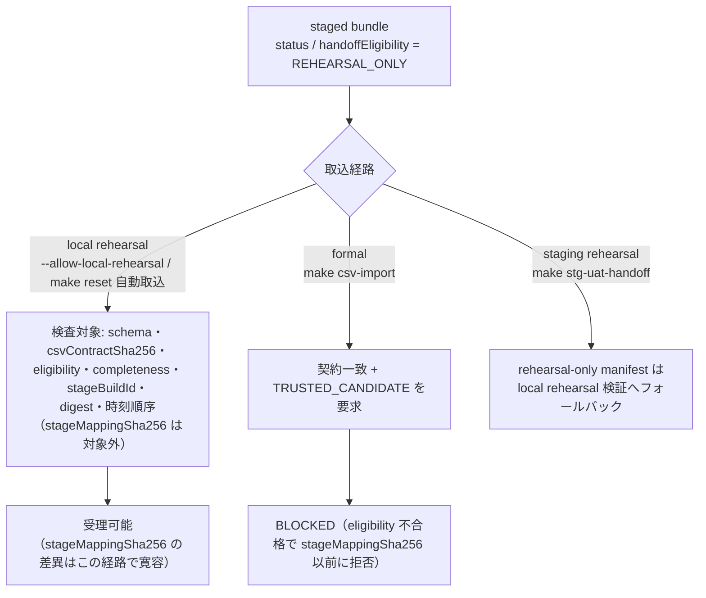

# BUG-LOCAL-HANDOFF-CSV-CONTRACT — 現行 producer/consumer 契約差分表

Campaign `todo-ledger-20260922` revision 1. Unit `BUG-LOCAL-HANDOFF-CSV-CONTRACT`. Attempt `att-csv-20260922-001`. Claim `claim/BUG-LOCAL-HANDOFF-CSV-CONTRACT`. Prompt SHA-256 `d43f6b9a65565193f04ef02f57ce9027e6ccbff2dbe02b07b1d72cd82c961f21`. Acceptance SHA-256 `4f9ce44a09f798b0a835dbbc64a557676497a614126b9270948f026b8b8e4240`.

Sheet date: 2026-09-22. Consumer worktree HEAD `5a5828a1dc0f11e03134a9d8d890025f11cc60e7`. 本票は**現行ソースの読取照合のみ**。CSV データ本体(個人情報の可能性)は複写せず、header 行・識別子・digest・件数の比較に留める。digest・eligibility・manifest の手修正は行っていない。`make old-db-handoff-check` / DB apply / 再生成依頼の送信は本 unit の範囲外。

## 0. Verdict サマリ

| 分類 | 件数 | 内訳 |
|---|---|---|
| MATCH(一致) | 14 | §2–§5 の個別行を参照 |
| DIFF(差異) | 4 | stageMappingSha256(jouto/shikishima/hakobuneco の 3 件、local rehearsal では寛容)、CLINIC_CSV_IMPORT.md の「payments header-only」記述と現行 staged bundle の非零件数 |
| UNKNOWN(未確認) | 4 | producer が 9/3 bundle を生成した code revision、`make old-db-handoff-check` の現行実行結果、DB 投入後の実件数、formal `TRUSTED_CANDIDATE` bundle の再生産時期 |

**結論**: 2026-09-13 に観測された失敗(`manifest CSV contract digest is invalid`)の直接原因は、consumer の `cutoverCSVContractSHA256` が当時 `befeeaea…` で、producer が emit する `9e02897b…` と不一致だったこと。**2026-09-22 の `d34e09df7` で consumer 側が `9e02897b…` へ bump され、4 clinic 全ての staged manifest と一致**した。同日の local apply report は 4 clinic とも `PASS` で、report の `manifestSha256` は現在 staged の manifest digest と一致する。**ローカル rehearsal 経路での当初 BLOCK は現行ソース上で解消済み**。formal F6 経路は依然 BLOCKED(全 bundle が `REHEARSAL_ONLY`)。

## 1. Revision 識別子

| 側 | 識別子 | 値 | 根拠 |
|---|---|---|---|
| consumer | AnimalEkarte HEAD | `5a5828a1dc0f11e03134a9d8d890025f11cc60e7` | `git rev-parse HEAD` |
| consumer | 契約定数 | schema=`animalekarte-cutover-v1` / `cutoverStageMappingSHA256=bf8c262e136d…9152b` / `cutoverCSVContractSHA256=9e02897b86c7…37c9` | `backend/internal/csvimport/cutover_contract.go` L16–18 |
| consumer | 直近の契約変更 | `d34e09df7`(2026-09-22)csvContract `befeeaea…`→`9e02897b…` / `a95835cb9`(2026-09-22)table 順変更 / `184f50668`(2026-09-08)account 分離 | `git log -S` + `git show d34e09df7` |
| producer | old_db 現行 HEAD | `b941a9c80dcde86086a5f6e0aa65988f257212e7`(2026-09-22 `docs: record cross-clinic staff account linking decision`;直前に `5f6ac5a` hachioji intake pipeline) | sibling `../old_db` で `git rev-parse HEAD` |
| producer | 現行契約の記録 | `csvContractSha256=9e02897b…`、table 順 pets→appointments→appointment_trimming_details→medical_records、`medical_records.appointment_id` 列(9/22 に jouto/shikishima/hakobuneco へ適用済み)、「local rehearsal は `stageMappingSha256` を必須ピンしない」 | `old_db/docs/migration/mapping-scripts.md`「CSV 契約と AE 配置(2026-09-22)」 |
| producer | hachioji stage build 証跡 | `tmp/producer-iso-generated/migration-stage-summary.json`:`stageBuildId=fe9f228b-bd3f-495a-aebc-ef3c4d8128b3`、run=`hachioji-intake-20260921-01`、`stageMappingSha256=bf8c262e…`、generatedAt=`2026-09-21T17:43:11.253Z` | staged hachioji manifest の `stageBuildId`・`sourceSummaryGeneratedAt.stage` と一致 |
| producer | 9/3 生成 bundle の code revision | **UNKNOWN**(manifest の generatedAt/outputDir のみ。生成時の old_db commit は repo 内証跡からは特定不可) | — |

## 2. Manifest provenance(run / 医院 / eligibility)— staged `_old_db_handoff/` 実測

| clinic | `clinicOrdinal` | `sourceRunId` | `generatedAt` | manifest SHA-256(staged実測) | `status` | `handoffEligibility` | `sourceCompletenessStatus` | `sourceIdentity.verified` |
|---|---|---|---|---|---|---|---|---|
| hachioji | 1 | `hachioji-intake-20260921-01` | 2026-09-22T04:09:34Z | `8de0db913db296f9…944fffd` | REHEARSAL_ONLY | REHEARSAL_ONLY | **PARTIAL**(`incompleteSourceTables=[TBL_KNJO_DATA]`、`knjoProvenanceRoute=reacquire`) | false |
| jouto | 2 | `jouto-intake-20260822-01` | 2026-09-03T12:06:46Z | `668198b5563e0cc6…f8dcbd` | REHEARSAL_ONLY | REHEARSAL_ONLY | UNVERIFIED(`knjoProvenanceRoute=complete_base`、`knjoArchiveSha256=null`) | false |
| shikishima | 3 | `jouto-intake-20260822-01` | 2026-09-03T13:21:57Z | `0e731ae392e1e56e…163414` | REHEARSAL_ONLY | REHEARSAL_ONLY | UNVERIFIED(同上) | false |
| hakobuneco | 4 | `jouto-intake-20260822-01` | 2026-09-03T15:53:28Z | `74ae1f905f9ae222…e15ad4` | REHEARSAL_ONLY | REHEARSAL_ONLY | UNVERIFIED(同上) | false |

- `clinicCode`/`clinicOrdinal` は CLINIC_CSV_IMPORT.md の受理集合(hachioji=1、jouto=2、shikishima=3、hakobuneco=4)と一致。**MATCH**
- `clinicBandBase`/`EndExclusive`/`stageIdOffset`/`idBand` は全 4 院で ordinal 公式 `((ordinal-1)*10M, ordinal*10M, +1M offset, ownerFloor +0.3M, appFloor 1e9)` と一致(実測値: hachioji 0–10M、jouto 10M–20M、shikishima 20M–30M、hakobuneco 30M–40M)。**MATCH**
- `outputDir` 束縛: hachioji は `…/hachioji-intake-20260921-01-revisions/paygraph-20260922-01`(reviewed rebuild の `-revisions/` 形、`cutover_contract_validate.go` L163–166 が受理)。他 3 院は `…-rehearsal-hosNN-…-local-ae*` の `-rehearsal-` 接尾辞形で、local/staging rehearsal mode でのみ受理(L171–174)。**MATCH(rehearsal 経路限定)**
- eligibility: 全 4 院 `REHEARSAL_ONLY`。`make reset` 自動取込(`scripts/import-old-db-handoffs-on-reset.sh` L199 `--allow-local-rehearsal`)の受理域内。formal `make csv-import` は `TRUSTED_CANDIDATE` 必須(L243)のため全 4 院 **BLOCKED**。
- `sourceSummaryGeneratedAt` は全 4 院で raw≤intermediate≤stage≤generatedAt の順序を満たす(実測)。**MATCH**
- stage build UUID 形式・3 層 summary digest・evidence digest(baseLoad、+hachioji は knjoRecovery)は全 4 院で形式適合。**MATCH**

## 3. Contract digest 比較(consumer 定数 ↔ staged manifest)

| 項目 | consumer 現行値 | hachioji | jouto | shikishima | hakobuneco | 判定 |
|---|---|---|---|---|---|---|
| `manifestSchemaVersion` | `animalekarte-cutover-v1` | 同左 | 同左 | 同左 | 同左 | MATCH(全 4 院) |
| `csvContractSha256` | `9e02897b86c742f94162ddfd4171067b3036a3ac4f055c6d3fd4a614e0fb37c9` | 一致 | 一致 | 一致 | 一致 | MATCH(全 4 院、post-`d34e09df7`) |
| `stageMappingSha256` | `bf8c262e136d4d5e74751508286710035b27bd1e7ed927ce4f47320dd4e9152b` | **一致** | `2f65b0de4e95fbe0…a284` | `1cff15b1bf2e4888…66a45` | `1cff15b1bf2e4888…66a45` | hachioji MATCH / 他 3 院 **DIFF**(下記の経路別影響を参照) |
| `format` | `csv-with-header` | 同左 | 同左 | 同左 | 同左 | MATCH |
| `importablePredicate` | `mapping_status IN ('confirmed','inferred'), plus …`(cutover_contract.go L9) | 一致 | 一致 | 一致 | 一致 | MATCH |
| `placeholderColumns` | `CutoverPlaceholderColumns()` 23 エントリ | 一致 | 一致 | 一致 | 一致 | MATCH |

**`stageMappingSha256` DIFF の経路別影響**(cutover_contract_validate.go):
- local rehearsal(`--allow-local-rehearsal`、`make reset` 自動取込): L314–344 が検査するのは schema・csvContractSha256・eligibility・completeness・stageBuildId・3 層 digest・時刻順序のみ。**stageMappingSha256 は検査しない**(L318–319 のコメント: old_db SQL が凍結 consumer digest より先行する間は rehearsal で差異を許容)。→ 3 院ともこの経路では digest 面で受理可能。
- formal(`make csv-import` 既定): L238–243 が 3 者全ての一致 + `TRUSTED_CANDIDATE` を要求。eligibility で既に拒否されるため stageMappingSha256 の差異以前に BLOCKED。
- staging rehearsal(`make stg-uat-handoff`): rehearsal-only producer manifest は local rehearsal 検証にフォールバック(L231–234)。`bf8c262e` ピンは verified staging PASS bundle にのみ効く。

**当初失敗との関係**: bug.md L29–39 の実測(2026-09-13)は `manifest CSV contract digest is invalid`。これは `validateLocalRehearsalProducerProvenance` L320–321 の文言と一致し、当時の consumer 定数 `befeeaea5d191091c391e8a7e21deaa41bd10f985020818fd667d94fa5014320` ↔ manifest `9e02897b…` の不一致が直接原因。`d34e09df7` で consumer が `9e02897b…` へ bump され、現在は全 4 院で一致。

## 4. 21 CSV header 差分(consumer `CutoverTableSpecs()` ↔ staged CSV 先頭行)

全 4 院 × 全 21 表で header 行が consumer spec の `Columns` と完全一致(実測: `head -1` を CSV parse して spec 配列と比較、`appointment_id` 列を含む)。`tables[]` の順序も全 4 院で spec 順と一致。

| # | table | CSV file | 列数 | header vs spec | 配置先 |
|---:|---|---|---:|---|---|
| 1 | staffs | staffs.csv | 6 | MATCH(全 4 院) | `002_master/accounts/_old_db_handoff/<clinic>/`(集中 account dir) |
| 2 | procedures | procedures.csv | 13 | MATCH | `<clinic>/` |
| 3 | merchandise_items | merchandise_items.csv | 9 | MATCH | `<clinic>/` |
| 4 | owners | owners.csv | 20 | MATCH | `<clinic>/` |
| 5 | pets | pets.csv | 17 | MATCH | `<clinic>/` |
| 6 | appointments | appointments.csv | 11 | MATCH | `<clinic>/` |
| 7 | appointment_trimming_details | appointment_trimming_details.csv | 4 | MATCH | `<clinic>/` |
| 8 | medical_records | medical_records.csv | 11(`appointment_id` 含む) | MATCH | `<clinic>/` |
| 9 | inquiries | inquiries.csv | 9 | MATCH | `<clinic>/` |
| 10 | clinical_plans | clinical_plans.csv | 5 | MATCH | `<clinic>/` |
| 11 | vital_records | vital_records.csv | 12 | MATCH | `<clinic>/` |
| 12 | billings | billings.csv | 9 | MATCH | `<clinic>/` |
| 13 | billing_items | billing_items.csv | 10 | MATCH | `<clinic>/` |
| 14 | payments | payments.csv | 17 | MATCH | `<clinic>/` |
| 15 | payment_splits | payment_splits.csv | 10 | MATCH | `<clinic>/` |
| 16 | estimates | estimates.csv | 18 | MATCH | `<clinic>/` |
| 17 | estimate_items | estimate_items.csv | 17 | MATCH | `<clinic>/` |
| 18 | exams | exams.csv | 7 | MATCH | `<clinic>/` |
| 19 | exam_results | exam_results.csv | 6 | MATCH | `<clinic>/` |
| 20 | vaccines | vaccines.csv | 11 | MATCH | `<clinic>/` |
| 21 | vaccinations | vaccinations.csv | 14 | MATCH | `<clinic>/` |

## 5. Digest / 件数の bundle 内照合(staged 実測)

読取検証(本 unit は check コマンドを実行せず、manifest とファイルを直接照合):

| 検査 | hachioji | jouto | shikishima | hakobuneco | 判定 |
|---|---|---|---|---|---|
| 全 21 file の SHA-256 ↔ manifest `tables[].sha256` | 一致 | 一致 | 一致 | 一致 | MATCH(84 file 全て) |
| 全 21 file の CSV 論理行数 ↔ `tables[].rowCount` | 一致 | 一致 | 一致 | 一致 | MATCH(複数行 quoted field を考慮した parse 件数) |
| 配置 file 集合(20 CSV + manifest.json、余分/欠落なし) | OK | OK | OK | OK | MATCH |
| `staffs.csv` が集中 account dir に存在し digest 一致 | OK | OK | OK | OK | MATCH |
| git ignore(`_old_db_handoff/` + accounts 側) | `.gitignore` L25–26 が両者を cover(`git check-ignore -v` で確認) | — | — | — | MATCH |
| account dir/file の owner-only 権限(dir 0700 / file 0600、owner=実行者) | OK | OK | OK | OK | MATCH(`check-old-db-handoff.sh` L38–47 の要件を満たす) |

注記: `wc -l` ベースの物理行数は quoted 複数行 field で manifest `rowCount` を上回る(例: jouto `clinical_plans` 3,855,955 物理行 vs 671,912 論理行)。CSV parser での論理件数は全表一致。digest 不一致・header 不一致は 0 件。

## 6. Formal / rehearsal の分離

| 経路 | 状態 | 根拠 |
|---|---|---|
| local rehearsal(`make reset` 自動取込、`--allow-local-rehearsal`) | 現行 contract で受理可能な組合せ(全 4 院 schema/csvContract/eligibility/completeness/時系列が gate 適合) | `cutover_contract_validate.go` L314–344 + §3–§5 の実測 |
| 同上・実績 | **当日(2026-09-22)の apply report が 4 院とも `PASS`**:`hachioji-hachioji-intake-20260921-01-apply.json` / `hakobuneco-…-apply.json` / `jouto-…-apply.json` / `shikishima-…-apply.json`(sensitive-local/csv-import-reports/、JST 15:06–15:18)。各 report の `manifestSha256` は §2 の staged digest と一致 | report の status/runId/manifestSha256 を読取(非 PHI 欄のみ) |
| formal cutover F6(`make csv-import`、 rehearsal flag なし) | **BLOCKED(全 4 院)**:`status=REHEARSAL_ONLY`≠`PASS`、`handoffEligibility=REHEARSAL_ONLY`≠`TRUSTED_CANDIDATE`、`sourceIdentity.verified=false`、completeness=UNVERIFIED/PARTIAL | L124–128、L238–243、L346–365 |
| STG rehearsal(`make stg-uat-handoff`、城東/敷島/箱のみ) | 過去 report: 3 院とも `*-stg-uat-apply.json` PASS(2026-09-07)+ STALE/FAILED 履歴。hachioji は wrapper 対象外 | CLINIC_CSV_IMPORT.md L62、report 一覧。現行 DB 状態は本 unit で未照合 |

経路別ゲートの流れ:

## 7. Doc drift(文書記述 ↔ 現行 staged bundle)

| 項目 | 文書記述 | 現行実測 | 判定 |
|---|---|---|---|
| payments/payment_splits | CLINIC_CSV_IMPORT.md L7(2026-07-31 更新):「現行 KNJO source は未完全なため header-only」 | 4 院とも非零件数が manifest に記録され file digest/論理行数と一致(例: jouto payments 574,156 / splits 575,928)。producer 側は rehearsal では「completed かつ total_amount≠0 で支払 graph 無しの billing を CSV から除外」方式へ移行(mapping-scripts.md) | **DIFF**(文書が古い。現行 bundle の失敗断定には使わず、doc 更新 follow-up 候補) |
| `<clinic>-local` variant | OLD_DB_HANDOFF_LOCAL.md L22–26:同一 run の `-local` があれば `make reset` はそちらを優先 | 現行 staged に `-local` dir なし(4 院とも単一配置) | MATCH(不存在を確認) |

## 8. UNKNOWN(推測で埋めない項目)

| 項目 | 状態 | 必要な入力 |
|---|---|---|
| 9/3 生成 3 bundle の producer code revision | UNKNOWN | producer 側の生成記録 or run report |
| `make old-db-handoff-check` の現行実行結果 | UNKNOWN(本 unit では実行禁止。前提となる layout/gitignore/権限/manifest 束縛は §5 で個別に実測済み) | operator が `CLINIC_CODE`/`MIGRATION_RUN_ID` を指定して実行 |
| 投入後 DB の実件数・参照整合 | UNKNOWN(apply report の `PASS` は存在するが DB 再照合は範囲外) | 承認された read-only verify |
| formal `TRUSTED_CANDIDATE`/`PASS` bundle の再生産時期・完全 KNJO source | UNKNOWN | producer/operator の再生成・受領記録 |

## 9. 次工程への引継ぎ

1. **当初 BLOCK は現行ソースで解消済み**(consumer digest bump + 4 院 local apply PASS)。残存差異は `stageMappingSha256` の 3 院ぶんで、local rehearsal では設計上寛容、formal/staging verified では引き続き拒否要因。
2. formal F6 へ進むには producer へ **manifest と CSV の一体再生成**を依頼する(TRUSTED_CANDIDATE + PASS + verified source identity + 支払正件数)。digest/eligibility の手修正はしない。
3. 配置 check(`make old-db-handoff-check`)と承認済み verify は operator が実行。`MIGRATION_RUN_ID` は jouto/shikishima/hakobuneco について `jouto-intake-20260822-01` を渡す(manifest `sourceRunId` 束縛)。
4. CLINIC_CSV_IMPORT.md の「payments header-only」記述は現行 bundle と不整合。doc 更新は別単位で扱う。

---

### 照合に使用した現行ソース

- `todo-operations.md` §BUG-LOCAL-HANDOFF-CSV-CONTRACT(L115–119)、`bug.md` §plan-bug-local-handoff-csv-contract(L29–39、L365–376)
- `docs/ops/deploy/OLD_DB_HANDOFF_LOCAL.md`、`docs/ops/deploy/CLINIC_CSV_IMPORT.md`
- `backend/internal/csvimport/cutover_contract.go` / `cutover_contract_validate.go`
- `Makefile` `old-db-handoff-stage`/`old-db-handoff-check`/`csv-import-*`/`stg-uat-*` targets、`scripts/check-old-db-handoff.sh`、`scripts/import-old-db-handoffs-on-reset.sh`
- staged `backend/migrations/seeds/_old_db_handoff/{hachioji,hakobuneco,jouto,shikishima}/manifest.json` + 20 CSV(header 行のみ)と `002_master/accounts/_old_db_handoff/<clinic>/staffs.csv`(gitignored quarantine、読取のみ)
- `sensitive-local/csv-import-reports/*.json` の非 PHI 欄(status/clinicCode/runId/manifestSha256/startedAt)
- sibling `../old_db` @ `b941a9c`(HEAD・`docs/migration/mapping-scripts.md`・`tmp/producer-iso-generated/migration-stage-summary.json`、読取のみ)
