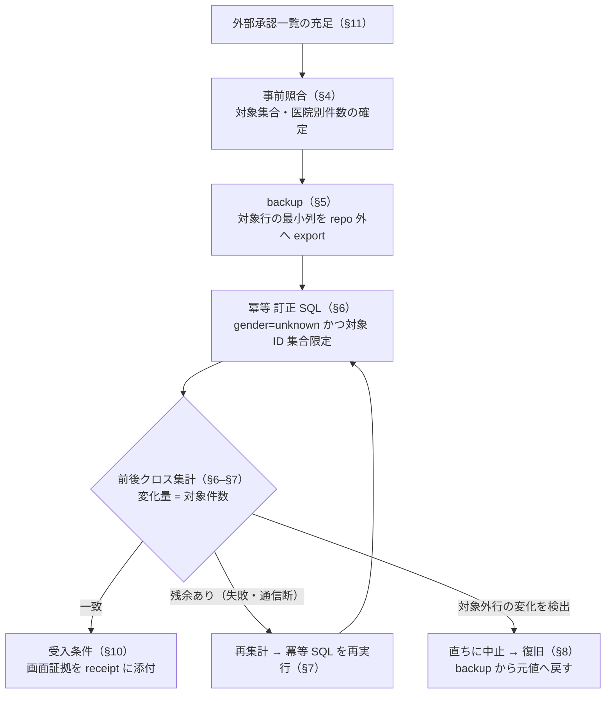

# UAT-Q3-GENDER-MAP — STG 限定訂正票ドラフト

- campaign: `todo-ledger-20260922` rev 1 / unit `PREP-GENDER-MAP` / attempt `att-gender-20260922-001`
- 作成日: 2026-09-22 / 状態: **DRAFT — 実行には別途 operator 承認が必要。本票の作成は STG/DB へのいかなる変更も承認しない**
- 前提資料: 対応表 `UAT-Q3-GENDER-MAP.md`（同ディレクトリ）、`todo-operations.md` §UAT-Q3-GENDER-MAP（着手プラン L91-93・実行票フォーマット L10-13）、`docs/work/stg-uat-clinic-feedback-q1-q4.md` §UAT-Q3-GENDER-MAP

---

## 1. 目的と範囲

STG 環境の `pets.gender` において、旧システムの性別区分コード 3/4（避妊去勢済み雄/雌）が移行時に `unknown` へ落ちた行を、承認済みデコードに基づき `male`/`female` へ**限定訂正**する。対象環境は **STG のみ**。本番適用・bundle 再生成・再取込・migrate 実行は本票の範囲外（別承認）。

## 2. デコード根拠

| 旧コード（`PetSeibt_Kbn` / stage `sex_kbn`） | 訂正後 `pets.gender` | 表示 |
|---|---|---|
| `1`, `01`, `3`, `03` | `male` | 雄 |
| `2`, `02`, `4`, `04` | `female` | 雌 |
| `5`, `0`, その他・未入力 | `unknown` | 不明（訂正対象外） |

- 根拠: 承認済みデコード `{1,3}=male, {2,4}=female, {5,0}=unknown`（`old_db/docs/migration/propose-review-decisions.md`、stg-uat 記録 L148）。修正済み CASE は old_db main `sql/migration/030_stage.sql` L443-444（統合 revision `5fbc3b2` / merge `a2cea37`）。
- **今回の訂正対象は旧コード 3/03 → male、4/04 → female に落とし損ねた行のみ**。コード 1/2 は従来どおり正しく変換済み、5/0/不明は unknown のまま維持する。
- `neutered_date`（去勢・避妊手術日）は `PetOpe_Date` 由来の別経路で既に入る。**コード 3/4 から手術日を捏造しない**。性別と手術日は別々に照合する（todo-operations.md L43・L93）。

## 3. 対象集合

- 対象: STG の `pets` 行のうち、旧コード 3/4 由来で `gender='unknown'` となっている行。
- 特定方法（案・実行票で確定）: stage 側の `sex_kbn IN ('3','03','4','04')` と `pets` の ID 対応（clinic 別 `idBand`／`stageIdOffset` で医院を分離）で対象 ID 集合を作る。実データ行の実値は本票・証跡へ複写せず、**対象は医院別の識別子集合と件数で記述**する。
- 対象医院: STG に投入済み bundle の範囲に限定。`sensitive-local/csv-import-reports/` の receipt では jouto・shikishima・hakobuneco が runId `jouto-intake-20260822-01`（修正前 bundle）で STG rehearsal PASS（9/4-9/7）したが、3 院とも `STALE-AFTER-RESET-20260907` で **reset 後の現行 STG DB 状態は UNKNOWN**。hachioji は修正込み bundle の local apply PASS（9/22）のみで STG 投入 receipt なし。**対象医院と件数は現行 STG DB の照合 receipt 取得後に確定する**。全 4 院 bundle は `REHEARSAL_ONLY` であり、formal 投入と rehearsal 投入を混同しない。
- 除外: `neutered_date`・他列の変更、コード 5/0/未入力行、AE 側 enum・画面仕様の変更（enum は `male|female|unknown` のまま増やさない）。

訂正実行の流れ（§4–§10）:

## 4. 事前照合（実行前ゲート）

1. 対応表 `UAT-Q3-GENDER-MAP.md` を receipt として、訂正に使う stage/bundle が修正込み revision と一致することを確認する。hachioji は一致済み、jouto・shikishima・hakobuneco は修正前世代（差異）のため、**STG に入っているのが修正前 bundle の場合は対象集合に含め、修正込み bundle の再生成・再投入が先なら訂正不要**と判定を分ける。
2. 対象件数の集計（PHI なし: `gender × (neutered_date IS NOT NULL)` クロス集計、医院別）を取得し実行票に記録。
3. 実行票の必須欄（`ID / 対象環境・医院 / revision・manifest 等の入力識別 / 読取・変更する範囲 / 前段証拠 / 操作者・承認者 / 実行枠 / 中止条件 / 復旧 / 証拠保存先`）を全て記入。秘密・実 roster・患者情報は repo 外の承認済み保管先。

## 5. backup（訂正前・必須）

- 対象行の最小列（例: `pets.id`, `clinic_id`, `gender`, `updated_at`）を訂正直前に export し、repo 外の承認済み保管先へ保存。件数とファイル hash を receipt に記録する。
- 利用可能なら PlanetScale の branch/snapshot 等の環境側 backup も併記。backup 未取得での訂正実行は中止条件。

## 6. 監査

- 実行者と承認者を分離し、実行票に双方を記録。実行日時・対象環境・使用した SQL/ツールの識別・入力 receipt（対応表・manifest hash・件数）を残す。
- 訂正 SQL は**冪等**にする（`WHERE gender='unknown'` かつ対象 ID 集合/旧コード条件を限定）。WHERE 句の対象条件を実行票に転記し、実行文と照合する。
- 前後で医院別の `gender` 件数クロス集計を取得し、変化量が対象集合の件数と一致することを確認（aggregate のみ）。
- 成果物 receipt: producer revision（`5fbc3b2`/`a2cea37`）、対象 manifest/stageBuildId、承認参照、前後集計、画面確認結果 — 全て非機密。

## 7. 失敗・通信断時の照合

- 訂正途中の失敗・通信断では**途中状態を完了とみなさない**。再集計で残余対象（まだ `unknown` の対象行）を確認し、冪等 SQL を再実行して収束させる。
- バッチ実行する場合は医院/バッチ単位で前後件数を記録し、どの単位まで適用済みかを receipt で追跡する。部分適用の検出は「対象件数 − 訂正済み件数 = 残余」の一致で行う。
- 想定外の行が更新された形跡（対象外の gender 変化）を検出した場合は直ちに中止し §8 の復旧へ。

## 8. 復旧

- §5 の backup から対象行の `gender` を元値へ戻す手順を実行票に明記（対象 ID 集合と元値の対応表は repo 外保管）。
- 復旧の検証: 復元件数 = 訂正件数、かつ復旧後のクロス集計が訂正前集計と一致することを確認する。
- **復旧手順は STG で rehearsal（対象外の合成/検証行または限定小集合）で先に確認してから本訂正に進む**。未検証の復旧手順を持って実行しない。

## 9. 境界の明記（証拠の混同禁止）

- 候補検証の成功（SQLite in-memory CASE 10/10、38 mapping tests・80% gate PASS）は**ローカル候補の検証**であり、PostgreSQL・export・STG での動作証拠ではない。PostgreSQL 上での CASE 動作は STG 適用前に別途検証する。
- STG への適用・実データ訂正・bundle 再生成・再取込（`make stg-uat-*` 系）・migrate 実行は**全て本票の範囲外で、運用の明示承認が必要**。エージェントは migrate/STG 書き込みを自動実行しない（stg-uat 記録 L152、todo-operations.md）。
- 手術日（`neutered_date`/`PetOpe_Date`）を本訂正に混ぜない。推測日付を入れない。
- 本票はドラフト。未照合項目（STG 投入 receipt、対象件数、backup 取得）は UNKNOWN のまま残し、判明後に実行票へ転記する。

## 10. 受入条件（訂正後）

1. 対象集合の行が `male`/`female` へ訂正され、コード 5/0/不明の行は `unknown` のまま。
2. 飼主詳細のペット編集画面で、去勢日のある対象個体が雄/雌で表示される（不明に落ちない）— 画面証拠を receipt に添付。
3. 前後クロス集計の差分が対象集合と一致し、`neutered_date` に変化がない。

## 11. STG 適用へ進むために必要な外部承認（一覧）

| # | 承認/入力 | 担当 |
|---|---|---|
| 1 | 現行 STG DB 状態の receipt 照合（9/7 PASS は STALE-AFTER-RESET 済み）と対象医院・件数の確定 | 運用/producer |
| 2 | jouto・shikishima・hakobuneco の修正込み bundle 再生成の要否判断（訂正と再生成の順序） | producer / PO |
| 3 | 対象集合の件数・識別条件の承認 | USER/運用 |
| 4 | backup 取得と保管先の承認 | 運用 |
| 5 | STG 書き込み（訂正 SQL 実行）の運用承認・実行枠 | 運用（`make stg-uat-*` 系の承認経路） |
| 6 | PostgreSQL での CASE 動作検証の実施と receipt | producer/運用 |
| 7 | 訂正後の画面受入（飼主詳細のペット編集）実施担当 | QA/医院 |

各承認が揃うまで本票は BLOCKED を維持し、実行条件を満たさない段階で「着手済み」にまとめない。
