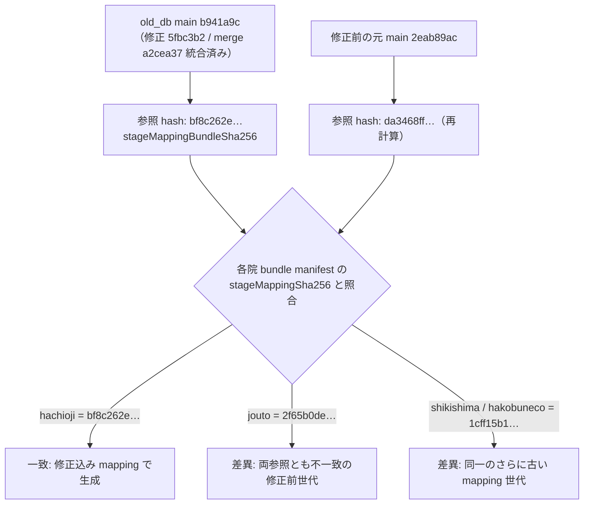

# UAT-Q3-GENDER-MAP — 統合済み revision ↔ 現行 bundle / 検証 receipt 対応表

- campaign: `todo-ledger-20260922` rev 1 / unit `PREP-GENDER-MAP` / attempt `att-gender-20260922-001`
- 作成日: 2026-09-22 / 作成者: receiver `recv-gender-20260922-001`（read-only 照合のみ。STG・DB・old_db・製品コードへの変更なし）
- 目的: old_db に統合済みの性別コード修正 revision と、現行 4 院 bundle manifest・検証 receipt の対応を一意に特定し、一致 / 差異 / UNKNOWN を明示する。後続の STG 限定訂正票は `UAT-Q3-GENDER-MAP-CORRECTION-DRAFT.md`。
- 正本: `todo-issue.md` §UAT-Q3-GENDER-MAP、`todo-operations.md` §UAT-Q3-GENDER-MAP、`docs/work/stg-uat-clinic-feedback-q1-q4.md` §UAT-Q3-GENDER-MAP

---

## 1. 統合済み revision の特定（../old_db、読取専用）

old_db `main` HEAD: `b941a9c80dcde86086a5f6e0aa65988f257212e7`（worktree クリーン）。

| 項目 | 値 | 検証 |
|---|---|---|
| 修正コミット | `5fbc3b2a7bd15197664af42eb4048e44a10046a2`（2026-09-19 15:43:40 +0900 `fix: preserve gender for neutered legacy pet codes`） | `git merge-base --is-ancestor 5fbc3b2 main` → 祖先（統合済み） |
| 統合 merge | `a2cea37622fbb05b3bc8b987849611825472a3aa`（2026-09-19 15:43:51 +0900 `merge: integrate reviewed Q3 pet gender mapping`） | `git merge-base --is-ancestor a2cea37 main` → 祖先 |
| 変更対象 4 パス | `sql/migration/030_stage.sql` / `scripts/lib/mapping-conversion-families.mjs` / `scripts/test-support/test-mapping-conversion-families.mjs` / `scripts/test-support/test-pet-gender-mapping.mjs` | `git show --stat 5fbc3b2` がちょうどこの 4 パス（79 insertions / 7 deletions） |
| 修正内容（現行 main 実読） | `030_stage.sql` L443-444: `CASE WHEN p.sex_kbn IN ('1','01','3','03') THEN 'male' WHEN p.sex_kbn IN ('2','02','4','04') THEN 'female' ELSE 'unknown' END`。classifier `mapping-conversion-families.mjs` L603-604 と oracle regex L311 が同一デコード | 承認デコード `{1,3}=male, {2,4}=female, {5,0}=unknown` と一致。`PetOpe_Date`・1900 年ガード不変（候補検証で確認済み） |
| 修正前の状態 | 元 main `2eab89ac`（2026-09-16）の CASE は `('1','01')→male`・`('2','02')→female`・else unknown のみ | `docs/work/stg-uat-clinic-feedback-q1-q4.md` L148 |

## 2. bundle 側の識別子：`stageMappingSha256` の意味

`manifest.json` の `stageMappingSha256` は old_db `scripts/lib/stage-csv-output.mjs` の `stageMappingBundleSha256()`（L193-198）が出力する値で、`STAGE_MAPPING_FILES`（L68-186。**`sql/migration/030_stage.sql` を含む**）全ファイルの内容 sha256 を束ねたハッシュ。性別 CASE を含むため、bundle の mapping 世代を識別できる。

照合用に今回計算した参照値（`git show` 由来の読み取りのみ、old_db 無変更）:

| 参照 | stageMapping bundle hash |
|---|---|
| old_db `main` 現行（修正込み、b941a9c） | `bf8c262e136d4d5e74751508286710035b27bd1e7ed927ce4f47320dd4e9152b` |
| old_db `2eab89ac`（修正前、再計算） | `da3468ff679f72696bee8d3e96a04dbfa116ae54f0a39bcc8e90f6bfbe9666b3` |

## 3. 対応表：統合済み revision ↔ 現行 4 院 bundle manifest / 検証 receipt

現行 bundle = `backend/migrations/seeds/_old_db_handoff/<clinic>/manifest.json`。全 4 院とも `status: REHEARSAL_ONLY`・`manifestSchemaVersion: animalekarte-cutover-v1`・`handoffEligibility: REHEARSAL_ONLY`（formal 投入可の bundle ではない）。

判定の構造:

| clinic | bundle generatedAt / sourceRunId / stageBuildId | stageMappingSha256 | revision との対応判定 | 根拠 |
|---|---|---|---|---|
| hachioji | 2026-09-22T04:09:34Z / `hachioji-intake-20260921-01` / `fe9f228b-bd3f-495a-aebc-ef3c4d8128b3` | `bf8c262e…9152b` | **一致（修正込み mapping で生成）** | manifest の hash が現行 main の計算値と完全一致。manifest は生成 commit を記録しないため「内容一致」の証拠であり commit 同一性の証明ではない |
| jouto | 2026-09-03T12:06:46Z / `jouto-intake-20260822-01` / `45bd363a-fe93-4171-83f1-17c14a48e35b` | `2f65b0de…a284` | **差異（修正前 mapping で生成）** | 生成日 2026-09-03 は修正候補作成（9/17）・統合（9/19）より前で、修正 CASE は当時存在しない。hash は修正後 `bf8c262e`・修正前再計算 `da3468ff` のいずれとも不一致 → さらに古い mapping 世代 |
| shikishima | 2026-09-03T13:21:57Z / `jouto-intake-20260822-01` / `19fc4932-2b2b-4c38-a8a6-0a4ec1f12cc5` | `1cff15b1…a45` | **差異（修正前 mapping で生成）** | 同上。hash は hakobuneco と同一（同一 mapping 世代）、jouto とは別世代 |
| hakobuneco | 2026-09-03T15:53:28Z / `jouto-intake-20260822-01` / `ebf4521d-3d60-41c7-88e9-7846808e1c3b` | `1cff15b1…a45` | **差異（修正前 mapping で生成）** | 同上 |

判定まとめ: **一致 1 院（hachioji）/ 差異 3 院（jouto・shikishima・hakobuneco）/ UNKNOWN 0**（bundle mapping 世代について）。

### 集計による傍証（証明ではない）

現行 bundle `pets.csv` の `gender` 列の件数（aggregate のみ、実データ行・個人情報は複写しない）:

| clinic | male | female | unknown |
|---|---|---|---|
| hachioji | 8,618 | 7,390 | 628 |
| jouto | 15,892 | 10,497 | 21,380 |
| shikishima | 2,654 | 1,655 | 2,598 |
| hakobuneco | 2,973 | 2,202 | 2,729 |

修正前 CASE では旧コード 3/4（避妊去勢済み雄/雌）が `unknown` に落ちる。9/3 生成の 3 院で unknown が多い（jouto は全件の 4 割超）一方、修正込みと一致する hachioji で unknown が少ないのはこの解釈と整合する。ただし bundle CSV は変換後値のみで旧コード列を持たないため、**原因の特定は集計だけでは完了しない**（UNKNOWN の他因: コード 5/0・未入力・他欠損）。

### manifest の異常所見（要 producer 照合、UNKNOWN のまま保持）

- jouto / shikishima / hakobuneco の 3 manifest が**同一 `sourceBackupSha256`（`75fe0638…`）・同一 `sourceRunId`（`jouto-intake-20260822-01`）** を記録している。医院別の由来識別が manifest 上は同一であり、命名上の共用か実ソースの共用かは本 repo 内では判定不能 → **UNKNOWN**。
- 全 4 院とも `sourceCompletenessStatus` が `PARTIAL`（hachioji）または `UNVERIFIED`（他 3 院）、`sourceProvenanceVerified: false`。`sourceIdentity.verified: false`。

## 4. 検証 receipt の対応

| receipt | 対象 | 内容 | 統合 revision との関係 | 判定 |
|---|---|---|---|---|
| `.planning/…/evidence/gender-001/receiver/` Completion Report + green-final.json + mapping-coverage-final.json | 隔離候補 `fix/codex-uat-q3-gender-map-20260917`（base `2eab89ac`） | 38 mapping tests PASS・80% gate PASS・SQLite in-memory CASE 10/10・scoped sensitive-scan PASS | 候補の 4 パス内容（candidate-state.json の sha256 群）が `5fbc3b2` として統合済み。祖先照合＋現行 main の L443-444 実読で同一修正を確認 | **一致**（候補検証 → main 統合の連鎖は確認済み） |
| 同上 diff-check.json / scope-preservation-final.json | 同上 | `git diff --check` exit 0、外国 WIP 保全 | — | 一致 |
| 各院 `manifest.json` 自体 | bundle | stageBuildId・stageMappingSha256・placeholderColumns・importablePredicate を記録 | §3 の表どおり | hachioji=一致 / 他 3 院=差異 |
| STG への bundle 投入 receipt | STG DB（`ap-northeast-2.pg.psdb.cloud`/`postgres`, lane `stg-uat-rehearsal`） | `sensitive-local/csv-import-reports/` に receipt あり: jouto PASS 2026-09-07（manifestSha256 `42b9e0c6…`）・shikishima PASS（`8b433f5b…`）・hakobuneco PASS（`614574e9…`）、いずれも runId `jouto-intake-20260822-01`。ただし 3 院とも `STALE-AFTER-RESET-20260907` 付きの同名 report が残り、jouto は FAILED_DATA/TABLE_ROLLED_BACK・STARTED-interrupted の履歴あり。投入 manifest sha256 は現行 staged manifest（`668198b5…`/`0e731ae3…`/`74ae1f90…`）と不一致 → 当時の bundle ファイルと現行 staged ファイルは byte 非同一。hachioji は stg-uat-apply receipt なし（代わりに local apply `hachioji-…-apply.json` PASS 2026-09-22、target `db`/`ekarte_db`、manifestSha256 `8de0db91…` = 現行 manifest と一致 → 修正込み bundle が local DB へ投入済み） | 投入された 3 院は修正前 run の bundle（9/4-9/7 投入は修正統合 9/19 より前）→ **差異**（訂正対象候補）。ただし reset 後の現行 STG DB 状態は **UNKNOWN** |
| PostgreSQL での CASE 動作検証 | export/PostgreSQL | 候補検証は SQLite のみ。PostgreSQL/export での CASE 実行 receipt なし | 修正 SQL の PostgreSQL 動作は未検証 | **UNKNOWN** |
| STG での `pets.gender` 訂正 receipt | STG DB | 訂正バッチ/SQL 再実行の記録なし | 訂正自体が未実施 | **UNKNOWN**（未実施） |
| AE 側表示確認（画面証拠） | frontend/STG | 飼主詳細のペット編集で雄/雌表示の確認 receipt なし | 受入条件の未達 | **UNKNOWN** |

## 5. formal / rehearsal の分離

- **rehearsal（本表の対象）**: 全 4 院 bundle は `REHEARSAL_ONLY`。本表の一致/差異判定は rehearsal bundle の mapping 世代に関するもので、本番・formal 投入の証拠ではない。
- **formal**: formal 用 bundle の再生成 receipt、STG 適用 receipt、本番反映 receipt はいずれも repo 内に存在しない → 全て **UNKNOWN**。SQLite CASE・38 mapping tests の成功を PostgreSQL/export/STG の証拠に流用しない。

## 6. 残件（外部承認待ち — 本 unit 範囲外）

1. producer 担当: jouto・shikishima・hakobuneco の現行 bundle は修正前 mapping 世代。修正込み revision での bundle 再生成 receipt が未作成 → `todo-operations.md` §UAT-Q3-GENDER-MAP 手順 1 へ。
2. 3 院 manifest の同一 `sourceBackupSha256`/`sourceRunId` の由来照合（producer）。
3. STG 投入 receipt は `sensitive-local/csv-import-reports/` に存在した（§4）が、3 院とも `STALE-AFTER-RESET-20260907` で reset 後の現行 STG DB 状態は未照合（UNKNOWN）。現行 DB に何が残るかの receipt 照合（運用）→ STG 訂正票の対象集合を確定（`UAT-Q3-GENDER-MAP-CORRECTION-DRAFT.md`）。また投入時 manifest（`42b9e0c6`/`8b433f5b`/`614574e9`）と現行 staged manifest の byte 差異の内訳は producer 照合。
4. PostgreSQL での CASE 動作検証・export 再確認・STG 訂正・画面受入は全て別承認の operator 作業。

## 7. 出典

- `todo-issue.md` §UAT-Q3-GENDER-MAP（統合済みの確定事実と残件、9/19 読取）
- `todo-operations.md` L17 readiness 表・L43 データ操作表・L91-93 着手プラン
- `docs/work/stg-uat-clinic-feedback-q1-q4.md` §UAT-Q3-GENDER-MAP（承認デコード・受入・やらないこと）
- `.planning/agent-fast-campaign/remaining-local-reconciliation-20260917/evidence/gender-001/receiver/`（候補検証証跡）
- `backend/migrations/seeds/_old_db_handoff/{hachioji,jouto,shikishima,hakobuneco}/manifest.json` + 各 `pets.csv` 集計
- `../old_db` main（`b941a9c`）: ancestor 照合・`030_stage.sql` L443-444・`stage-csv-output.mjs` L68-198・`mapping-conversion-families.mjs` L311/L603-604
