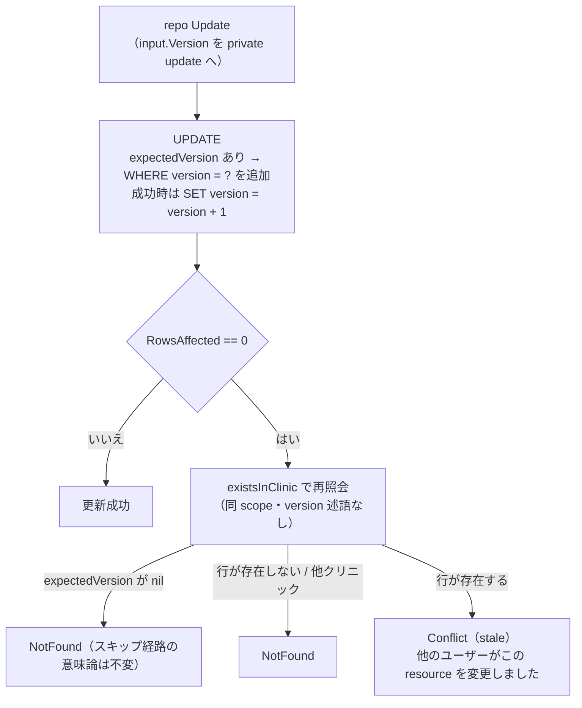

# UAT-R2-EXCLUSIVE-LOCK — 実施記録（att-lock-20260922-001）

- campaign: `todo-ledger-20260922` revision 1
- unit: `UAT-R2-EXCLUSIVE-LOCK`
- attempt: `att-lock-20260922-001`
- prompt_sha256: `a20621d8d4946d26ae6fa1a8018659a36502d78589596ddf6e7d9967375ffea1`
- 状態: **実装完了・scoped test GREEN（2026-09-22）**。migration はファイル追加のみ・適用はユーザー作業（`make migrate`）。

## 目的（設計票より）

カルテの上書きと同じ会計の二重確定を防ぐ。旧システムの画面占有ロックは採用しない。
正本: [`docs/work/todo-campaign-20260918/UAT-R2-EXCLUSIVE-LOCK.md`](../todo-campaign-20260918/UAT-R2-EXCLUSIVE-LOCK.md) §最小設計・最小テスト計画。

## 変更内容

### migration（作成のみ・未適用）

- `backend/migrations/005_child_records_version.sql`（新規）:
  `treatments` / `vital_records` / `prescriptions` / `vaccinations` に
  `version INTEGER NOT NULL DEFAULT 1` を追加。既存行は DEFAULT により適用時に自動で 1 へ
  バックフィルされる。`001_init.sql` 等の既存 migration は未変更。

### model（4 ファイル）

- `backend/internal/model/treatment.go` — `Treatment.Version int`（`gorm:"default:1" json:"version"`）
- `backend/internal/model/vital.go` — `VitalRecord.Version int`（同タグ）
- `backend/internal/model/prescription.go` — `Prescription.Version int`（同タグ）
- `backend/internal/model/vaccination_record.go` — `Vaccination.Version int`（同タグ）

`UpdateClinicalPlanInput.Version` / `medical_records.version` と同じ契約:
新規作成=1、更新成功時=+1。

### repository Update CAS（4 ファイル）

各 `Update` は `cmd.Version`（input 埋め込みの expectedVersion）を private `update()` へ渡す。
repo Update 公開シグネチャは不変（既存 mock / caller を壊さないため、設計票の
「Update input に expectedVersion」に従い input DTO に載せた）。

- `expectedVersion != nil` → `WHERE <table>.version = ?` を追加し UPDATE を原子的に照合。
- 成功時は `SET version = version + 1`（`gorm.Expr`）を常に書き戻す（スキップ経路でも
  clinical_plan の persistVersion と同じく +1 される）。
- `RowsAffected == 0` → `existsInClinic`（同 scope・version 述語なし）で再照会:
  - `expectedVersion == nil` → 従来どおり NotFound（スキップ経路の意味論は不変）。
  - 行が存在しない / 他クリニック → NotFound。
  - 行が存在する → stale として Conflict（`他のユーザーがこの<resource>を変更しました。
    再読み込みしてください`。resource: 治療 / バイタル / 処方 / ワクチン接種）。
- 親カルテの draft ガードは引き続き service 側の `lockDraftMedicalRecord` / `lockDraftParent`
  （親 FOR UPDATE + finalized Conflict）が担う — repository の WHERE 形状は変えていない。

対象ファイル:
- `backend/internal/medicalrecord/treatment_repository.go`
- `backend/internal/medicalrecord/vital_repository.go`
- `backend/internal/medicalrecord/prescription_repository.go`
- `backend/internal/medicalrecord/vaccination_repository.go`

CAS の判定流れ:



### service / input（4 ファイル）

- `UpdateTreatmentInput` / `UpdateVitalInput` / `UpdatePrescriptionInput` /
  `UpdateVaccinationInput` に `Version *int` を追加（nil = 照合スキップ・後方互換。
  0/負値はどの行にも一致しないため Conflict — clinical_plan 契約と同じ）。
- `vaccination_service.go` Update: tx 内で `medical_record_id != nil` のとき
  `lockDraftMedicalRecord` を適用（確定済みカルテ紐付け接種の編集を Conflict で拒否。
  `validateRelations` が親行を既に FOR UPDATE で取得済みのため同一 tx 内で即時解決）。
  治療/バイタル/処方と対称化した draft ガード。Create/Delete の挙動は変更していない。
- service 側のコード変更は上記のみ。repo の Conflict は `apperrors.Wrap`（`%w`）経由で
  service の返り値にそのまま伝播する（Conflict 正規化）。
- handler/FE の version 送付配線は unit 外（別 unit）。

### テスト（1 ファイル新規）

- `backend/internal/medicalrecord/child_records_optimistic_lock_test.go`:
  - `TestTreatmentRepository_Update_OptimisticLock` / `TestVitalRepository_Update_OptimisticLock` /
    `TestPrescriptionRepository_Update_OptimisticLock` / `TestVaccinationRepository_Update_OptimisticLock`
    （testdb・各3 subtest: 一致→version+1 / stale→Conflict+未反映 / nil→無条件更新）
  - `TestTreatmentService_Update_StaleExpectedVersionConflict` /
    `TestVitalService_Update_StaleExpectedVersionConflict` /
    `TestPrescriptionService_Update_StaleExpectedVersionConflict` /
    `TestVaccinationService_Update_StaleExpectedVersionConflict`
    （mock: input.Version が repo Update へそのまま渡ること + Conflict 伝播）
  - `TestVaccinationService_Update_FinalizedMedicalRecordRejected`（確定済み親 → Conflict、
    repo Update 未到達）

## testdb の version 列の供給経路（検証注記）

`internal/testdb` は `001_init.sql` / migration ファイルを適用しない GORM AutoMigrate の
スキーマ double（`testdb.go` 冒頭コメント参照）。今回追加した model の
`gorm:"default:1"` タグにより、共有スキーマ / `EnsureAutoMigrated` の AutoMigrate が
`version` 列をテスト DB へ供給する。実 DB の version 列は `005_child_records_version.sql`
をユーザーが `make migrate` で適用した後にのみ存在する。本 unit では migration を
適用していない。

## 検証（Docker backend 内・candidate mount `/app`）

```bash
# A1
ls backend/migrations/005_*.sql && rg -n "version" backend/migrations/005_*.sql
# → backend/migrations/005_child_records_version.sql + 4 件の ADD COLUMN version

# A2/A3
docker compose --env-file .env.local exec -T backend go test -race -v -p 1 ./internal/medicalrecord/ \
  -run "OptimisticLock|ExpectedVersion|ConcurrentUpdatesSerialize|FinalizedMedicalRecordRejected"
# → PASS (ok 2.329s)。RED（実装前）→ stale が成功してしまう FAIL を確認済み。
# 既存 TestClinicalPlanRepository_Update_OptimisticLock / TestVaccinationService_ConcurrentUpdatesSerialize も PASS。
```

## 残件（unit 外）

- FE/handler の version 送付配線（別 unit。読取レスポンスの `version` を保存要求へ必須で載せ、
  未確定なら fail-closed — use-medical-record-save-action.ts と同方針）。
- vaccination Delete への draft ガード拡張（設計票は Update/Delete 対称を示唆。本 unit の
  最小テスト計画は Update のみのため Update に実装。Delete 拡張は別 unit で検討）。
- migration 適用（ユーザー手動 `make migrate`）と 2 セッション実機検証。

---

## 追記: version 送付配線 unit（EMR-85 dispatch / 2026-09-23）

前 unit で留保していた request/response DTO・OpenAPI・FE 配線を実施。

### 変更内容

- request DTO 4 件（`updateTreatmentRequest` / `updateVitalRequest` /
  `updatePrescriptionRequest` / `updateVaccinationRequest`）に
  `Version *int`（json tag `version`）を追加し `toServiceInput` で
  `input.Version` へマップ。nil=照合スキップの後方互換は維持。
- response DTO 4 件に `version` を露出（model.Version をそのまま返却）。
- `backend/docs/api.yaml`: Vaccination/Vital/Treatment/Prescription 各レスポンスと
  Update*Request に version を追記（読取 version を次 PATCH へ同送、stale は 409）。
- FE: `Treatment`/`Vital`/`VaccinationRecord` に `version` 追加し transform で写像。
  更新境界（use-treatments-tab handleUpdate / MedicalRecordDiagnosisPlan・
  MedicalRecordBillCheck handleUpdateItem / VitalsTab handleEditSave /
  runVaccinationSave）は読取済み version を fail-closed で同送（未取得なら
  toast 拒否。権限チェックは version チェックより先に実行し authz を覆わない）。
- `src/hooks/use-create-vaccination.ts` の transform にも version を写像。

### 検証（実施済み）

- `docker compose run --rm --no-deps --entrypoint go backend test ./internal/medicalrecord/ -count=1` → ok 62.998s
- `docker compose run --rm --no-deps --entrypoint go backend test ./internal/apicontract/ -count=1` → ok 0.434s
- `docker compose run --rm --no-deps frontend npx vitest run src/features/vaccinations src/features/medical-records` → 80 files / 635 tests PASS
- `docker compose run --rm --no-deps frontend pnpm type-check` → PASS
- `docker compose run --rm --no-deps --entrypoint gofmt backend -l ./internal/medicalrecord/` → 差分なし

### 実 DB・HTTP 2 リクエスト検証（2026-09-23、共有 dev DB `ekarte_db`）

`005_child_records_version.sql` は共有 dev DB へ適用済み（entrypoint migration log で
applied=0 / skipped=6 を確認。本 unit での適用作業はなし）。worktree build の API
（:18085、`stg-staff-10000003@example.test` / clinic_id=1）で確認:

- 治療 `PATCH /medical-records/1000000002/treatments/2`: version=2 で 200（version→3）、
  同一 version=2 の再送で 409 `他のユーザーがこの治療を変更しました。再読み込みしてください`
- バイタル `PATCH /medical-records/1000000019/vitals/1000000012`: version=1 で 200（→2）、
  stale version=1 で 409 `他のユーザーがこのバイタルを変更しました。…`
- 処方 `PATCH /medical-records/1000000019/prescriptions/1`: version=1 で 200（→2）、
  stale version=1 で 409 `他のユーザーがこの処方を変更しました。…`
- ワクチン `PATCH /vaccinations/1000000010`: version=1 で 200（→2）、stale version=1 で
  409 `他のユーザーがこのワクチン接種を変更しました。…`、GET で勝者内容・version=2 を確認
- 後方互換: version 省略 PATCH は 200（無条件更新・version+1）を実 DB で確認
- 検証で作成した vital/処方/接種行は DELETE 済み（204）。既存 treatment#2 の content は
  UAT ラベルへ復元済み（version=3 で PATCH、200）。

### 残件（本 unit でも扱わない）

- Delete / 一括並べ替えへの version 拡張可否（別 unit で検討）。
- 会計側の実並行シナリオ（会計を開く→別端末で戻す→追加→確定）は billing 既存実装の
  スコープ。本 unit は子レコード更新の配線のみ。
