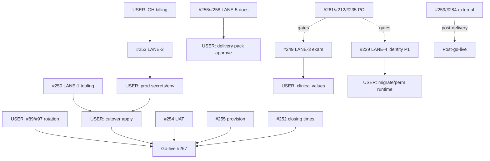

# Open Issues Re-audit + Parallel Board

- Run date: 2026-07-31
- Judgment: `origin/main` @ `5d38e3e48c070bb2eda77604834c8223eaad9871` (`fix(inventory): stop accepting client status writes (SD-4)`)
- Mode: investigation + orchestration plan only (no implement, no `gh` write, no push)
- Orchestration: parallel subagent fan-out (6 explore probes) + main-agent integrator

## Completion Report

- Run status: **COMPLETE**

### Checklist Results

| Checklist item | Expected behavior | Actual behavior | Status | Verification method | Evidence |
|----------------|-------------------|-----------------|--------|--------------------|----------|
| open Issue 集合が表と一致 | open numbers == matrix | 22 open; matrix has all 22 | **PASS** | `gh issue list --repo MinoruSoga/AnimalEkarte --state open --json number` | `[89,97,98,99,201,211,212,235,239,249,250,252,253,254,255,256,257,258,259,260,261,284]` (sorted set equality) |
| 各 Issue に status enum + evidence | no empty status/evidence | every row filled | **PASS** | row completeness audit | Status matrix below |
| known shipped re-verified | #201 P0, #261 P0, #266, SD-19, SD-4 | all PRESENT on main; #266 CLOSED | **PASS** | `git show origin/main` + `gh issue view` | citations in Known-shipped section |
| ≥3 parallel lanes non-overlapping | path ∩ empty; claims unique | 5 next-session lanes + 1 USER-only; claims avoid existing | **PASS** | pairwise path audit + `git branch --list 'claim/*'` | Parallel lanes section |
| each lane has start recipe | worktree + claim + first probe | all 5 agent lanes complete | **PASS** | presence check | Lane cards |
| no product code / no gh write / no push | investigation only | only this report under `reports/` | **PASS** | `git status` audit | product trees unchanged by this run intent; report-only write |
| workflow-style orchestration | fan-out + join | 6 subagents launched and joined | **PASS** | subagent IDs + join | Orchestration evidence |

### Run Summary

- Changed files: `reports/2026-07-31-open-issues-reaudit-parallel.md` (this report only)
- Failure Signature log: none
- Staged plan ledger: not applicable
- Risk Tier: Local write | Safety boundary events: none (no External write / credential ops / push)

---

## Status matrix (all open)

| # | Title (short) | Status | Main evidence | Residual (1+ lines) |
|---|----------------|--------|---------------|---------------------|
| 89 | CRITICAL credential rotation | **OPS_ONLY** | Runbook open: `docs/ops/deploy/runbooks/BUG_MD_EXTERNAL_OPS_PENDING_APPROVAL.md`; gitleaks CI is prevention only (`.github/workflows/ci.yml` / `.gitleaks.toml`). Issue triage 2026-07-31: rotation evidence missing. | USER: rotate 4 systems, revoke old values, non-secret scan conclusion. **Do not close from greps.** |
| 97 | CRITICAL git-history credential exposure | **OPS_ONLY** | Same as #89; history inventory `docs/ops/deploy/runbooks/SEC_SECRETS_5_GITLEAKS_HISTORY_INVENTORY.md`. Tree dummy-ization ≠ invalidate old values. | USER rotation + revoke + optional body mask after rotation. **Close forbidden** on edit/mask alone. |
| 98 | Old RDS credential residual + script removal | **PARTIAL** | Live `stg-db-tunnel.sh` **absent** on `origin/main` tree; active workflows are CF not ECS tunnel. Label `pending`. | History residual risk; USER invalidation decision; do not close on code absence alone. |
| 99 | ECS deploy path removal + rollback unify | **PARTIAL** | No `backend-deploy-ecs.yml` under `.github/workflows/`; `backend-deploy.yml` is CF path. Label `pending`. | USER field-confirm no runnable ECS path; rollback SSOT vs #253; archive docs only. |
| 201 | 薬量 auto-calc physical block | **PARTIAL** | P0 on main: `backend/internal/medicalrecord/treatment_dose_save.go:18,55-58,96-100` (vital fail-closed); `treatment_service.go:320,479` (`ExceedsCapSaved` hard reject); FE `TreatmentsTab.tsx:269` physical block comment. | Clinical owner gates (master max / warning band / missing-data table), STG proof, metrics. Issue body may still describe older ConfirmDialog safety story — **code is SoT**. Not DONE. |
| 211 | 健診 package verify | **OPS_ONLY** | Checkup package code: `backend/internal/medicalrecord/checkup_*.go`; composite FK migration history; ADR-004. Issue body: code complete. | USER DB apply/reset; clinical approve provisional seed; no new feature code in #260 S1. |
| 212 | Repository integration coverage gaps | **PO_DECISION** | Ratchet/baseline exists (`backend/.coverage-baseline`, `docs/ops/coverage-policy.md`); many `*_repository*_test.go` cite #212. Issue: phase excluded until PO + CI artifact. | PO decides infra exclusion + goals; remeasure after CI billing recovery (#253); split small test issues — not one big packet. |
| 235 | カルテ image/PDF DnD | **PO_DECISION** | Picker+PDF path exists (`ImageGalleryFilter.tsx` accept image/pdf); **no** medical-records `onDrop` DnD. Issue: value metrics first. | Measure users/frequency/time; then implement drop reusing same upload path; finalized charts must block. |
| 239 | Cross-clinic identity link + history | **PARTIAL** | Phase1 domain on main: `backend/internal/identitylink/**`, FE `frontend/src/features/identity-links/**`, models/permissions. | USER migrate/seed/perm/codegen/runtime; OpenAPI residual; Phase2 auto-link/merge **PO-gated (DEC-46)**. |
| 249 | 検査 Dr.ワン相当 | **PARTIAL** | Examination/lab_import under `backend/internal/medicalrecord/` (`examination_*`, `lab_import_*`, `exam_reference_range_*`); FE `frontend/src/features/examinations/`. Multi-phase Issue; not full Dr.ワン AC. | Remaining phases per Issue (legacy mapping, clinic-isolated ranges, import UX PO gates, clinical values); OPS apply. |
| 250 | Access data migration / cutover | **PARTIAL** | `backend/cmd/csv-import/**`, `backend/internal/csvimport/**` (incl. cutover contracts); docs `CLINIC_CSV_IMPORT.md`, `SEED_MIGRATION_OPERATIONS.md`. stage-import **not** present as live cmd. | Formal producer bundle; rehearsal; dry-run/verify; cutover after #253/#254/#255 gates. |
| 252 | 締め時間 values per clinic | **OPS_ONLY** | Settings UI + model: `backend/internal/clinic/closing_settings_*.go`, FE `closing-settings`, seed demo values. PO: all clinics = 城東 times. | USER enter/verify production clinic settings; not a product rewrite. |
| 253 | Production CI/CD + monitor + backup | **PARTIAL** | STG CF workflows: `.github/workflows/backend-deploy.yml`, `frontend-deploy.yml`; prod IaC placeholders `infra/cloudflare/production/`, `wrangler.production.jsonc`. Issue: GH Actions billing blocker. | USER fix billing; green required jobs; prod env+protect+backup/restore rehearsal; rollback SSOT with #99. |
| 254 | Full business UAT on demo | **PARTIAL** | Scenarios `docs/ops/testing/scenarios/S01–S12`, `V01–V05`; partial reports under scenarios/reports. | Full matrix PASS or agreed post-delivery FAIL list; after DB rebuild. |
| 255 | Staff bulk provision | **PARTIAL** | Tooling: `backend/cmd/staff-provision/**`, `docs/ops/deploy/STAFF_ACCOUNT_PROVISIONING.md`. Comment 2026-07-20: roster received (54); triage comment still “waiting” is **stale**. | PO: email policy, 猫専門 hospital mapping, leave/contractor rules, role→group; then authorized apply (off-repo secrets). |
| 256 | Operation manuals | **PARTIAL** | `docs/delivery/OPERATION_MANUAL.md` draft; in-app manual screen spec `docs/spec/screens/35-internal-manual.md`. | Align with runtime after #254; fix stale lock/rate-limit wording; training post-delivery. |
| 257 | Go-live cutover runbook | **PARTIAL** | `docs/delivery/GOLIVE_RUNBOOK.md` draft; date in title elapsed. | Fill prereq links (#250/#253/#254/#255); execute cutover; support window. USER execution. |
| 258 | Delivery package docs | **PARTIAL** | `docs/delivery/DELIVERY_PACKAGE.md` SSOT slice. | USER/contract blanks U*; no secrets in docs; production evidence after #253. |
| 259 | L-step Write API + cron | **BLOCKED_EXTERNAL** | Write client dual-gate + scheduler code: `backend/internal/infra/lstep/`, `backend/internal/lstep/**`, `backend/cmd/api/batch_scheduler.go`, wrangler crons, `docs/ops/deploy/LSTEP_WRITE_API_PAUSE.md` (default OFF). | Partner API enable + USER env/clinic flags + STG live send; cron fire rehearsal. Code alone ≠ close. |
| 260 | 3-session plan SSOT | **PARTIAL** | Living plan: `3-session-agent.html`, claim protocol in `AGENTS.md`. Issue open; delivery date elapsed. | Keep plan synced; close only when plan AC / delivery campaign explicit exit. Not a product feature. |
| 261 | Clinical gap PO hub | **PO_DECISION** | Hub for SD triage. **Shipped sub-units on main** (not whole Issue): deceased P0 `sharedkernel/pet_not_deceased.go:16-30` + reservation/hosp/trimming/LIFF; SD-19 `use-pet-vaccinations.ts:8-29`; SD-4 inventory status write removed (`inventory_request.go:34-47,71-83`, tip commit). | PO records delete/merge/fix/defer per SD in q&a; optional widen deceased guards after PO; inventory DROP COLUMN separate; OPS SD-14 etc. |
| 284 | LIFF Noto Sans JP 3-device QA | **BLOCKED_EXTERNAL** | Font wired: `frontend/line-reserve/index.html` Noto Sans JP; `frontend/line-reserve/src/index.css:19`. | Device/env handoff + 3× cold/warm/offline evidence. Source complete ≠ close. |

### Counts

| Status | Count | Issues |
|--------|------:|--------|
| OPS_ONLY | 4 | 89, 97, 211, 252 |
| PARTIAL | 12 | 98, 99, 201, 239, 249, 250, 253, 254, 255, 256, 257, 258, 260 *(12 listed — recount: 98,99,201,239,249,250,253,254,255,256,257,258,260 = 13)* |
| PO_DECISION | 4 | 212, 235, 261, *(and 239 Phase2 is nested; primary 212/235/261)* — matrix primaries: 212, 235, 261 |
| BLOCKED_EXTERNAL | 2 | 259, 284 |
| DONE_ON_MAIN | 0 | *(no open issue fully AC-complete on main)* |
| NOT_STARTED | 0 | |

Correct PARTIAL set: **98, 99, 201, 239, 249, 250, 253, 254, 255, 256, 257, 258, 260** (13).  
PO_DECISION: **212, 235, 261** (3).  
OPS_ONLY: **89, 97, 211, 252** (4).  
BLOCKED_EXTERNAL: **259, 284** (2).  
Total: 13+3+4+2 = **22**.

---

## Known-shipped reverify (`origin/main` @ `5d38e3e48…`)

| Unit | Present | Evidence | Residual |
|------|---------|----------|----------|
| #201 P0 vital fail-closed | **yes** | `treatment_dose_save.go:18,55-58,96-100`; `treatment_service.go:320,479` | Full #201 clinical gates remain → Issue **PARTIAL** |
| #261 P0 deceased write guards | **yes** | `sharedkernel/pet_not_deceased.go:16-30`; reservation/hosp/trimming/LIFF call sites | MR/exam/vax create paths may still need PO-scoped widen |
| #266 Option B search honesty | **CLOSED** + code yes | `gh`: CLOSED; `pet/repository.go` server search; FE loaders use paged pets API | minor placeholder kana honesty residual only |
| SD-19 JST nextDate | **yes** | `frontend/src/hooks/use-pet-vaccinations.ts:8-29,44` + tests | none for this unit |
| SD-4 inventory client status | **yes** | tip `5d38e3e48`; `inventory_request.go:34-47,71-83` no status field on create/update | DB dead `status` column DROP = separate work |

Closed campaign sample (gh): 266,232,285,262,230,234,237,109,247,251,238 all **CLOSED**.

---

## Close-ready candidates (recommend only — **no close executed**)

| Candidate | Verdict |
|-----------|---------|
| #89/#97 | **NEVER** without USER rotation evidence |
| #98/#99 | **No** — pending + residual risk / field confirm |
| #201/#211/#261 | **No** — clinical/PO/OPS gates open despite code |
| #259/#284 | **No** — external pending |
| #260 | **No** — plan hub still operational |
| Pure code DONE with empty residual | **None** among open set |

**Recommendation:** do not mass-close. Prefer per-issue comments with status enum + tip SHA when operators next update triage.

---

## Parallel next-session lanes

### Active claims to avoid

```
claim/LINE-R-FIX
claim/TASK-010
claim/TASK-020
claim/TASK-021
claim/W-020-ENV
claim/W-021-P1
```

### Lane board (5 agent-capable + 1 USER-only)

#### LANE-1 — CODE · Access cutover tooling (`#250`)

| Field | Value |
|-------|--------|
| type | CODE |
| issues | #250 |
| claim | `claim/CSV-IMPORT-250` |
| depends_on | none for tooling; cutover *execution* depends on #253/#254/#255 |
| owned_paths | `backend/cmd/csv-import/**`, `backend/cmd/csv-import-failure-rehearsal/**`, `backend/internal/csvimport/**`, `docs/ops/deploy/CLINIC_CSV_IMPORT.md`, `docs/ops/deploy/SEED_MIGRATION_OPERATIONS.md`, `docs/ops/deploy/A4_UI_REHEARSAL.md`, `docs/ops/deploy/F8_G4_FAILURE_REHEARSAL.md` |
| forbidden | `backend/internal/medicalrecord/**`, credentials, production apply without USER |
| success | mapping gap table; dry-run tests green scoped; no PHI in fixtures/logs |
| first 3 actions | 1) claim + worktree 2) read CLINIC_CSV_IMPORT + cutover_contract.go 3) inventory table coverage vs Issue AC |

**worktree**

```bash
cd /Users/minoru/Dev/Case/AnimalHospital/AnimalEkarte
git branch --list 'claim/CSV-IMPORT-250'   # must be empty
git branch claim/CSV-IMPORT-250
git worktree add ../AnimalEkarte-lane-250 -b lane/csv-import-250 origin/main
cd ../AnimalEkarte-lane-250
```

**spawn prompt**

> Read-only start then implement only under owned paths for #250 on origin/main. Expand `backend/internal/csvimport` / `cmd/csv-import` toward Issue AC: mapping gaps, dry-run, clinic isolation, non-PHI error IDs, idempotent verify. Do not apply production cutover. Do not touch medicalrecord, identitylink, or credentials. Use Docker scoped tests only. Claim `claim/CSV-IMPORT-250` already acquired; never delete claim.

---

#### LANE-2 — CODE · Production delivery surface (`#253` + rollback docs for `#99`)

| Field | Value |
|-------|--------|
| type | CODE / DELIVERY |
| issues | #253 primary; #99 docs-only residual |
| claim | `claim/PROD-DELIVERY-253` |
| depends_on | USER GitHub billing recovery for green CI (document if blocked) |
| owned_paths | `.github/workflows/**` (except inventing secret values), `docs/ops/deploy/CI-CD-PIPELINE.md`, `docs/ops/infra/production/**`, `infra/cloudflare/production/**`, `backend/wrangler.production.jsonc`, `docs/delivery/GOLIVE_RUNBOOK.md` (prereq links only) |
| forbidden | real secrets in git; rotating credentials (#89); ECS resurrection; `infra/terraform*` secrets |
| success | prod deploy contract documented; workflow gates require environment approval; rollback points to CF not ECS |
| first 3 actions | 1) claim+worktree 2) diff STG vs prod wrangler/workflows 3) checklist for required-reviewer + backup gate |

**worktree**

```bash
git branch --list 'claim/PROD-DELIVERY-253'
git branch claim/PROD-DELIVERY-253
git worktree add ../AnimalEkarte-lane-253 -b lane/prod-delivery-253 origin/main
```

**spawn prompt**

> Implement delivery-prep for #253 under owned paths only: production Cloudflare/PlanetScale deploy contract, workflow environment protection, monitoring/backup checklist docs. Align #99 residual by documenting CF-only rollback and not restoring ECS workflows. Never commit secrets. If Actions billing blocks verification, mark BLOCKED with exact required USER input. Claim `claim/PROD-DELIVERY-253`.

---

#### LANE-3 — CODE · Examination residual (`#249` scoped)

| Field | Value |
|-------|--------|
| type | CODE |
| issues | #249 (only PO-unblocked phase slices; fail-closed if phase needs PO) |
| claim | `claim/EXAM-249-SLICE` |
| depends_on | read Issue #249 C-1 anchors; do not start FE lab_import UX without PO-007 |
| owned_paths | `backend/internal/medicalrecord/examination*`, `exam_*`, `lab_*`, `frontend/src/features/examinations/**`, related `docs/spec/screens/**examination**` / lab import specs |
| forbidden | `treatment_*` / dose (#201), checkup-only files unless shared types forced (prefer avoid), `identitylink`, inventory |
| success | one vertical slice with tests + clinic isolation; no ConfirmDialog-as-safety; no cross-clinic ranges |
| first 3 actions | 1) claim+worktree 2) map Issue phases vs code 3) pick smallest ready phase with AC |

**worktree**

```bash
git branch claim/EXAM-249-SLICE
git worktree add ../AnimalEkarte-lane-249 -b lane/exam-249 origin/main
```

**spawn prompt**

> Work only on #249 examination/lab surfaces under owned globs on a dedicated worktree. Prefer the smallest phase that already has PO-ready AC (clinic-isolated reference ranges / fail-closed assessment / import safety). Do not implement auto_commit lab import without stop/audit. Do not touch dose/treatment #201 paths. Claim `claim/EXAM-249-SLICE`. Docker scoped tests only.

---

#### LANE-4 — CODE · Identity-link residual (`#239` Phase1 close-out)

| Field | Value |
|-------|--------|
| type | CODE |
| issues | #239 Phase1 residual only (not Phase2 auto-link) |
| claim | `claim/IDENTITYLINK-239-P1` |
| depends_on | none for OpenAPI/docs; runtime migrate is USER |
| owned_paths | `backend/internal/identitylink/**`, `frontend/src/features/identity-links/**`, `backend/docs/api.yaml` (identity-link routes only — coordinate freeze), `docs/spec/screens/40-identity-links.md`, `backend/internal/apicontract/**` only if drift tests require |
| forbidden | Phase2 auto-link/merge without DEC-46; relaxing clinic isolation; PHI in audit |
| success | OpenAPI drift for identitylink resolved or explicitly ticketed; Phase1 AC checklist updated with evidence |
| first 3 actions | 1) claim+worktree 2) run/read openapi_route_drift for IDENTITYLINK 3) FE vs route coverage |

**worktree**

```bash
git branch claim/IDENTITYLINK-239-P1
git worktree add ../AnimalEkarte-lane-239 -b lane/identitylink-239 origin/main
```

**spawn prompt**

> Close Phase1 residuals for #239 only: identitylink OpenAPI/docs, FE/BE surface parity for manual link/unlink + linked treatment history. Do not implement auto-link or merge (Phase2/DEC-46). Preserve clinic-scoped reject-all-on-mixed-IDs. Claim `claim/IDENTITYLINK-239-P1`. Avoid `api.yaml` unrelated sections.

---

#### LANE-5 — DOCS · Delivery package + manuals (`#256` + `#258`)

| Field | Value |
|-------|--------|
| type | OPS/DOCS |
| issues | #256, #258 |
| claim | `claim/DOCS-DELIVERY-256-258` |
| depends_on | soft: #254 for accuracy screenshots later |
| owned_paths | `docs/delivery/**` only |
| forbidden | inventing production secrets/contracts; product code |
| success | OPERATION_MANUAL + DELIVERY_PACKAGE mark USER blanks explicitly; remove known false claims (e.g. lock-out wording) |
| first 3 actions | 1) claim+worktree 2) inventory blanks U* 3) sync with GOLIVE prereq list without executing go-live |

**worktree**

```bash
git branch claim/DOCS-DELIVERY-256-258
git worktree add ../AnimalEkarte-lane-docs -b lane/docs-delivery origin/main
```

**spawn prompt**

> Docs-only under `docs/delivery/**` for #256/#258. Fill structure, mark USER-owned blanks, fix stale operational claims. No secrets. No application code. Claim `claim/DOCS-DELIVERY-256-258`.

---

#### LANE-U — USER-only (do **not** parallel as agent writers)

| Packet | Issues | Why serialized to human |
|--------|--------|-------------------------|
| SEC-ROTATE | #89, #97 (+ #98 history risk) | credential authority |
| CLINICAL-FORM | #201, #211 seed, #249 ranges | clinical owner |
| PO-HUB | #261, #212, #235, #239 Phase2 | PO decisions |
| EXTERNAL | #259, #284 | partner / devices |
| OPS-APPLY | #252, #255 apply, #254 UAT exec, #257 cutover | env + people |

No claim branches for pure USER packets unless a docs stub is needed.

---

## DAG



**Text DAG**

- Independent now: LANE-1, LANE-3 (if slice PO-ready), LANE-4, LANE-5  
- LANE-2 independent of LANE-1/3/4/5 code paths but CI green needs USER billing  
- Go-live (#257) **serial** after #250 apply + #253 + #254 + #255 + #252 + #89/#97  

---

## What not to parallelize

| Conflict | Why |
|----------|-----|
| Shared `main` working tree multi-writer | git-worktree-safety; claims required |
| `#89/#97` “fix” agents | credential ops USER-only |
| Two lanes editing `backend/docs/api.yaml` wholesale | freeze to LANE-4 or serialize |
| LANE-3 + any dose/`treatment_*` #201 work | same package files |
| LANE-1 production apply + LANE-2 first prod deploy | shared ops risk; USER serial |
| `#261` hub implement without PO split issues | will thrash q&a and random SDs |
| `#259` enabling write env in agent | external + dual-gate safety |

---

## Path-overlap check (proposed agent lanes)

| | L1 | L2 | L3 | L4 | L5 |
|--|----|----|----|----|-----|
| L1 | — | ∅ | ∅ | ∅ | ∅ |
| L2 | | — | ∅ | ∅ | GOLIVE_RUNBOOK only if both touch — **LANE-2 owns GOLIVE prereq edits; LANE-5 does not edit GOLIVE** (already stated) |
| L3 | | | — | ∅ | ∅ |
| L4 | | | | — | ∅ |
| L5 | | | | | — |

`docs/delivery/GOLIVE_RUNBOOK.md`: owned by **LANE-2** only. LANE-5 limited to OPERATION_MANUAL + DELIVERY_PACKAGE + README.

---

## Harness / loop / orchestration

### Saved Prompt Validation Gate

```text
$ node ~/.claude/scripts/prompt-craft-harness-validate.js \
  /Users/minoru/.claude/prompt-craft-runs/agent-fast-reaudit-open-issues-parallel.md
Prompt Craft Harness Validation: PASS
EXIT:0
```

### Harness Selection

- Chosen: **construction** (multi-lane orchestration packing)
- Backing skills present: `~/.agents/skills/orchestration`, `harness-loop`, `agent-harness-construction`, `verification-loop` (listed via `ls`)
- Loaded: orchestration intent applied via prompt contract; full skill body not required beyond parallel probe design
- Fallback unused (subagents available)

### Execution Loop Selection

- Chosen: **sequential** campaign with **parallel investigation fan-out**
- Stop condition: all Acceptance Checklist items PASS
- Repair rounds: 0

### Subagent Orchestration result

| ID | Label | Role | Responsibility | Writer paths | Status | Integration |
|----|-------|------|----------------|--------------|--------|-------------|
| `019fb736-5997-7a73-91bc-da9258f37079` | Probe S | explore RO | #89/#97/#98/#99 | none | completed | **Accepted** OPS_ONLY/PARTIAL |
| `019fb736-5997-7a73-91bc-daa58e72b7ef` | Probe C | explore RO | #201/#211/#249/#261 | none | completed | **Accepted** with #249 as PARTIAL not OPS_ONLY (full Issue multi-phase) |
| `019fb736-5997-7a73-91bc-dabb652da26f` | Probe F | explore RO | #212/#235/#239 | none | completed | **Accepted** |
| `019fb736-5997-7a73-91bc-dac4ba6ba044` | Probe D | explore RO | #250–#258/#260 | none | completed | **Accepted**; rejected #260 as pure DONE_ON_MAIN → **PARTIAL** |
| `019fb736-5998-76d2-9bf2-1eb85c9bc43d` | Probe E | explore RO | #259/#284 | none | completed | **Accepted** BLOCKED_EXTERNAL |
| `019fb736-5998-76d2-9bf2-1ec603e9b771` | Probe K | explore RO | known-shipped units | none | completed | **Accepted**; CLOSED states confirmed by main agent `gh` |

Main agent also ran authenticated `gh` + `git show origin/main` (subagents lacked `gh` auth — evidence supplemented, not replaced).

**Mode:** parallel subagent fan-out + single integrator (native Workflow tool not required; user authorized workflow-style; subagent path used per prompt default).

All launched work **joined** (none cancelled).

### Independent Review Gate (matrix critic)

| Risk | Finding | Action |
|------|---------|--------|
| False DONE | No open Issue marked DONE_ON_MAIN | keep |
| Credential DONE | #89/#97 OPS_ONLY | keep |
| Stale triage | #255 “list waiting” vs comment roster received | residual text notes PO apply remaining |
| Path collision | GOLIVE shared | assigned LANE-2 only |
| Claim collision | new claims avoid existing 6 claims | ok |
| #249 OPS_ONLY overclaim | multi-phase FEAT still open | status PARTIAL |

### De-Sloppify

Not applicable (no product code).

### Prompt-defect / Eval notes

- Subagents on this harness cannot use authenticated `gh` (404 private). Fast prompts should state **main agent owns `gh issue view`** or pass issue bodies into probe prompts to avoid dual SoT reconstruction from HTML ledgers.
- Generation snapshot claims at prompt time missed `claim/W-020-ENV` / `claim/W-021-P1` — re-list at run fixed it.

### Harness Improvement Feedback

| Pri | Note |
|-----|------|
| P1 | Inject issue body excerpts into parallel probe prompts when child agents lack `gh` auth |
| P2 | Snapshot `git branch --list 'claim/*'` at generation and refresh instruction already present — good |
| P0 | none |

### Remaining risks / follow-ups

1. Release blockers: **#89/#97** rotation, **#253** billing + prod, clinical gates **#201/#211**  
2. Do not start **#235/#212** implement packets without PO  
3. **#259/#284** stay parked post-delivery  
4. Parallel implement only via worktrees + claims above; release claims is **USER-only** after merge  
5. Local uncommitted WIP on shared tree (inventory/LINE/sidebar) — future lanes must use **separate worktrees** from `origin/main`, not this dirty tree  

### Verification commands (orchestrator)

```text
git fetch origin main → 5d38e3e48c070bb2eda77604834c8223eaad9871
gh issue list --state open → 22 issues (set equality)
git branch --list 'claim/*' → LINE-R-FIX, TASK-010/020/021, W-020-ENV, W-021-P1
node prompt-craft-harness-validate.js → PASS EXIT 0
```

---

## Orchestration evidence (compact)

- **Mode:** multi-agent parallel explore probes (6) + main integrator  
- **Native Workflow:** not launched as Rhai workflow; prompt’s Dynamic Workflow Execution satisfied via mandatory parallel subagents (user also authorized workflow-style)  
- **Join:** all 6 completed; integrator reconciled statuses fail-closed  
- **Writers this run:** none (report-only)  
